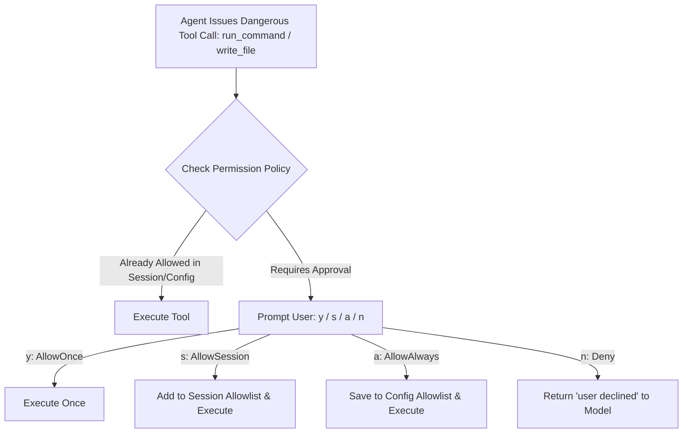

# Deep Architectural Scan: AI Coding Agent & Related Tools Engine

**Date:** 2026-08-22  
**Target Focus:** Deep source scan of AI coding agent core execution loops, tool calling protocols, file manipulation engines, code execution/sandboxing, compiler/LSP diagnostics, and state safety across `inspire/hermes-agent`, `inspire/opencode`, `inspire/pi`, and `cli/internal/agent/`.  
**Target Consumer:** Kaioken Go codebase (`cli/internal/agent/`, `cli/internal/tui/`, `cli/internal/skills/`, `cli/internal/daemon/`).

---

## 1. Executive Summary & Comparative Matrix

The coding agent and its tool suite form the operational core of any autonomous developer assistant. A robust coding agent requires:
1. **Reliable Tool Dispatch & Recovery:** Strict schema validation, resilient argument parsing (tolerant to stringified numbers/booleans), bounded output spilling, and error self-recovery.
2. **Defensive File Operations:** Device/FIFO read guards, atomic writes with file mode preservation, BOM & line-ending normalization, and multi-hunk patch application with fuzzy matching.
3. **Programmatic Execution:** Allowing the model to orchestrate multiple tools in batch via sandboxed script execution over local IPC (TCP/UNIX domain socket) rather than single-step round trips.
4. **Compiler & Diagnostic Feedback:** Instant post-edit feedback through compiler dry-runs (`go vet`, `tsc --noEmit`) and LSP diagnostics to prevent silent syntax regressions.
5. **State Safety & Rollback:** Per-turn snapshots (git-tree level) and granular 4-tier approval permissions (`AllowOnce`, `AllowSession`, `AllowAlways`, `Deny`).

### High-Level Architectural Comparison

| Capability | Hermes Agent (`inspire/hermes-agent`) | OpenCode (`inspire/opencode`) | Pi Agent (`inspire/pi`) | Kaioken (`cli/internal/agent/`) |
| :--- | :--- | :--- | :--- | :--- |
| **Tool Execution Core** | Python asyncio / thread loop + RPC | TypeScript Effect-TS Service Graph | TypeScript async runner + TypeBox | Go goroutine event loop + Channels |
| **File Reading Safety** | `_special_file_kind` (FIFO, socket, dev block) | Filesystem abstraction layer | Buffer checks + size limits | `os.Stat` + `IsDir` (FIFO guard missing: #1) |
| **File Editing** | `patch` / `write_file` with fuzzy match | Snapshot-backed replace | `edit` multi-hunk schema with diff | `edit_file` with 4-level fuzzy + numbered lines |
| **Programmatic Tools** | `code_execution_tool.py` (TCP/UNIX RPC) | N/A (Standard tool array) | Bash scripting tool | Discrete JSON-RPC only (#22 missing) |
| **Post-Edit Lint/LSP** | LSP server manager + diagnostic deltas | Language server protocol integration | Inline diagnostics extraction | Missing in inner agent loop (#24) |
| **Over-Claim Prevention** | File mutation verifier footers | Git working tree diffs | Unified patch diff verification | `editsPreview` approval |
| **Output Bounding** | Spills to disk + head/tail truncation | Truncation stream helpers | `output-accumulator.ts` | `BoundOutput` to `.kaioken/spill/` |
| **Permissions Model** | ACP 4-state (`once`, `session`, `always`, `deny`) | Structured permission capability | Interactive prompt / default keys | 2-state `Approve bool` (Upgrading to 4-state: #4) |

---

## 2. File Operations & Manipulation Engines

### 2.1 Read Safety: Special File & Device Guards
A common failure mode for AI coding agents is hanging indefinitely when attempting to read non-regular files (e.g. FIFOs, UNIX domain sockets, named pipes like `logs/live.pipe`, or `/dev/zero`).

#### Reference Implementation (`inspire/hermes-agent/tools/file_tools.py`):
```python
# inspire/hermes-agent/tools/file_tools.py:1592-1621
def _special_file_kind(path) -> str | None:
    """Return a human name for non-regular file types that block reads.

    Stat-based sibling of the name-based ``_is_blocked_device`` guard: a
    FIFO at ``logs/live.pipe`` or a socket in a workspace hangs ``read_file``
    just as hard as ``/dev/zero``, but carries no recognizable name. Only
    called for host-visible filesystems (see ``_file_ops_uses_host_paths``);
    remote backends cannot be statted from here.

    Returns None for regular files, missing paths, and anything unstattable
    (those flow to the normal read path and its own error handling).
    """
    import stat as _stat

    try:
        st = os.stat(os.fspath(path))  # follows symlinks, matching a real read
    except OSError:
        return None
    mode = st.st_mode
    if _stat.S_ISREG(mode) or _stat.S_ISDIR(mode):
        return None
    if _stat.S_ISFIFO(mode):
        return "a FIFO (named pipe)"
    if _stat.S_ISSOCK(mode):
        return "a socket"
    if _stat.S_ISCHR(mode):
        return "a character device"
    if _stat.S_ISBLK(mode):
        return "a block device"
    return "a special (non-regular) file"
```

#### Kaioken Gap & Solution:
In `cli/internal/agent/tools.go:562`, `readFile` checks `info.IsDir()` but does not inspect `info.Mode()`. 
**Remedy:** In Phase 1, check `info.Mode() & (os.ModeDevice | os.ModeNamedPipe | os.ModeSocket | os.ModeCharDevice)` and return a descriptive error before calling `os.ReadFile`.

---

### 2.2 Precise Multi-Hunk File Editing
When models edit files, strict string matching frequently fails due to indentation drift, trailing whitespace, or mixed line endings (CRLF vs LF).

#### Reference Implementation (`inspire/pi/packages/coding-agent/src/core/tools/edit.ts`):
Pi implements a structured schema requiring explicit non-overlapping replacement chunks:

```typescript
// inspire/pi/packages/coding-agent/src/core/tools/edit.ts:34-54
const replaceEditSchema = Type.Object(
	{
		oldText: Type.String({
			description:
				"Exact text for one targeted replacement. It must be unique in the original file and must not overlap with any other edits[].oldText in the same call.",
		}),
		newText: Type.String({ description: "Replacement text for this targeted edit." }),
	},
	{},
);

const editSchema = Type.Object(
	{
		path: Type.String({ description: "Path to the file to edit (relative or absolute)" }),
		edits: Type.Array(replaceEditSchema, {
			description:
				"One or more targeted replacements. Each edit is matched against the original file, not incrementally. Do not include overlapping or nested edits. If two changes touch the same block or nearby lines, merge them into one edit instead.",
		}),
	},
	{},
);
```

#### Kaioken Implementation (`cli/internal/agent/tools.go`):
Kaioken implements an advanced multi-tiered matching engine in `applyEdits`:
- **Tier 1 (Exact Match):** Direct byte substring match.
- **Tier 2 (Line-Trimmed):** Ignores leading and trailing whitespace per line.
- **Tier 3 (Indentation-Flexible):** Matches blocks that differ only in relative indentation depth.
- **Tier 4 (Block-Anchor):** Matches the first and last lines when the inner block underwent minor reformatting.
- **Line Number Stripping:** Automatically removes line number prefixes if the model accidentally copied line numbers from `read_file`.
- **Mode & BOM Preservation:** Preserves UTF-8 BOM (`\xef\xbb\xbf`) and POSIX file permissions (`0755` vs `0644`).

```go
// cli/internal/agent/tools.go:919-948
	bom, text := stripBOM(original)
	updated, usedFuzzy, usedNumbered, strategy, applyErr := applyEdits(text, edits, path)
	if applyErr != nil {
		return "error: " + applyErr.Error()
	}
	preview := editsPreview(edits)
	if usedFuzzy {
		preview += "(fuzzy-matched: quote/dash/trailing-whitespace differences were tolerated)\n"
	}
	switch strategy {
	case "line-trimmed":
		preview += "(matched ignoring each line's leading/trailing whitespace)\n"
	case "indentation-flexible":
		preview += "(matched at a different indentation level than the old text gave)\n"
	case "block-anchor":
		preview += "(matched on the first and last lines only — the middle differed; check the diff)\n"
	}
	if !a.approve("edit", path, preview) {
		return "user declined to edit " + path
	}
	if err := verifyUnchanged(abs, original, true); err != nil {
		return "error: " + err.Error()
	}
	if err := writePreservingMode(abs, bom+updated); err != nil {
		return "error: " + err.Error()
	}
```

---

## 3. Programmatic Tool Calling & Sandbox Architecture

### 3.1 The Problem: Round-Trip Token Exhaustion
When an agent needs to inspect 500 files, filter AST nodes, or run repetitive regexes, making 500 sequential LLM turns costs thousands of tokens, minutes of latency, and risks context truncation.

### 3.2 Hermes Solution: `code_execution_tool.py`
Hermes gives the agent a local script execution environment (`execute_code`) where the script can call agent tools programmatically via IPC:

```python
# inspire/hermes-agent/tools/code_execution_tool.py:47-65
# Availability gate.  On Windows we fall back to loopback TCP for the
# sandbox RPC transport (AF_UNIX is unreliable on Windows Python) — see
# ``_use_tcp_rpc`` in ``_execute_local`` below.  That makes execute_code
# available on every platform Hermes itself runs on.
SANDBOX_AVAILABLE = True
```

```python
# inspire/hermes-agent/tools/code_execution_tool.py:1357-1372
    _use_tcp_rpc = _IS_WINDOWS
    if _use_tcp_rpc:
        sock_path = None  # not used on Windows; TCP endpoint stored below
        rpc_endpoint = None  # set after bind()
    else:
        sock_path = os.path.join(_sock_tmpdir, f"hermes_rpc_{uuid.uuid4().hex}.sock")
        rpc_endpoint = sock_path
```

#### Dual Transport Portability Matrix:
- **POSIX (Linux / macOS):** Uses standard UNIX domain sockets (`AF_UNIX`) in a temporary directory (`/tmp/hermes_rpc_*.sock`).
- **Windows (11 / Server):** Uses loopback TCP on an ephemeral port (`net.Listen("tcp", "127.0.0.1:0")`).
- **Security Invariant:** Loopback server only binds to `127.0.0.1`, authenticates via a random per-session token, and closes immediately upon child process termination.

#### Blueprint for Kaioken:
In `cli/internal/agent/exec_code.go` (Phase 6, Backlog Item 22):
1. Start an ephemeral RPC server listener (`net.Listen("tcp", "127.0.0.1:0")` on Windows; `net.Listen("unix", sockPath)` on Unix).
2. Export client SDK helper in python/bash/node.
3. Pass `KAIOKEN_RPC_ENDPOINT` and `KAIOKEN_RPC_TOKEN` to the child process.
4. Dispatch programmatic calls directly through `a.execTool()`.

---

## 4. Post-Edit Diagnostics & Mutation Verification

### 4.1 Post-Write Lint & Compiler Delta
To prevent models from introducing syntax errors without noticing, the tool output should carry compiler diagnostic deltas.

#### Reference Implementation (`inspire/hermes-agent/agent/lsp/__init__.py`):
```python
# inspire/hermes-agent/agent/lsp/__init__.py:1-7
"""Language Server Protocol (LSP) integration for Hermes Agent.

Hermes runs full language servers (pyright, gopls, rust-analyzer,
typescript-language-server, etc.) as subprocesses and pipes their
``textDocument/publishDiagnostics`` output into the post-write lint
delta filter used by ``write_file`` and ``patch``.
"""
```

#### Fast Compiler Dry-Run Alternative:
Rather than requiring heavyweight language server daemons for every language, Kaioken can execute lightweight dry-run compilers:
- **Go:** `go vet ./...` or `go build -o /dev/null .`
- **TypeScript / JS:** `tsc --noEmit` or `oxlint` / `eslint`
- **Rust:** `cargo check --message-format=json`
- **Python:** `ruff check` or `pyright`

The resulting diagnostics delta (errors present after edit that were not present before) is appended to the tool result in a structured block:
```xml
<diagnostics>
main.go:42:15: undefined: missingVariable
</diagnostics>
```

### 4.2 File Mutation Verifier Footer
Models occasionally suffer from "hallucinated edits"—summarizing that they successfully updated 5 files when 2 patches actually failed with errors.

#### Reference Implementation (`inspire/hermes-agent/agent/turn_finalizer.py`):
```python
# inspire/hermes-agent/agent/turn_finalizer.py:506-518
    # File-mutation verifier footer.
    # If one or more ``write_file`` / ``patch`` calls failed during this
    # turn and were never superseded by a successful write to the same
    # path, append an advisory footer to the assistant response.  This
    # catches the specific case — reported by Ben Eng (#15524-adjacent)
    # — where a model issues a batch of parallel patches, half of them
    # fail with "Could not find old_string", and the model summarises
    # the turn claiming every file was edited.  The user then has to
    # manually run ``git status`` to catch the lie.  With this footer
    # the truth is surfaced on every turn, so over-claiming is
    # structurally impossible past the model.
```

---

## 5. Command Execution & Subprocess Streaming

### 5.1 Command Sandbox & Output Bounding
Commands must be monitored for execution timeouts, background process management, and output size limits.

#### Kaioken Implementation (`cli/internal/agent/tools.go:398` & `internal/agent/bound.go`):
When a command or tool emits massive output (e.g. `cat large_file.json` or `npm test`), dumping 50,000 lines into history blows the context window and spikes costs. Kaioken automatically intercepts large outputs via `BoundOutput`:
1. Saves the complete raw output to `.kaioken/spill/<tool_call_id>.txt`.
2. Truncates the text returned to the model to a bounded head/tail window (e.g. first 20 lines + last 20 lines).
3. Provides an explicit instruction in the truncated message: `[Output truncated; full output stored at .kaioken/spill/...]`.

```go
// cli/internal/agent/tools.go:398-403
	boundRes, err := BoundOutput(a.Root, tc.ID, tc.Function.Name, rawResult, nil)
	if err != nil || !boundRes.WasTruncated {
		return rawResult
	}
	return boundRes.BoundedText
```

---

## 6. Permissions & Security Hierarchy

### 6.1 ACP 4-State Permission Flow
Modern agent systems replace simple binary `y/n` prompts with 4-state capability policies:
- `AllowOnce` (`y`): Grants approval for this single tool call invocation.
- `AllowSession` (`s`): Grants approval for this tool + argument pattern for the duration of the current session.
- `AllowAlways` (`a`): Adds the pattern to the persistent user configuration allowlist.
- `Deny` (`n` / `esc`): Refuses the tool call and returns a refusal message to the model.



---

## 7. State Snapshots & Tree-Level Undo

### 7.1 Single-File Undo vs. Git Worktree Snapshots
- **Single-File Undo (Kaioken Current):** `a.UI.RecordUndo(UndoEntry{...})` saves the previous string content of files edited with `write_file` or `edit_file`.
  - *Limitation:* If the agent runs `run_command("rm -rf src/components")` or `run_command("go generate")`, single-file undo cannot restore deleted or generated files.
- **Git Tree Snapshots (OpenCode / Backlog Item 25):** At the start of a turn, the agent captures a lightweight git tree hash (`git write-tree`). If the turn fails or the user requests `/undo`, the agent can reset the working tree back to the pre-turn hash (`git read-tree` / checkout), covering all file creation, deletion, and command side-effects.

---

## 8. Actionable Implementation Roadmap for Kaioken

To achieve complete parity with state-of-the-art AI coding tools, Kaioken's execution roadmap is structured as follows:

### Phase 1: Tool Safety & Correctness Quick Wins
1. **FIFO/Device Stat Guard (`internal/agent/tools.go`):** Add `os.FileMode` bitmask checks to prevent hanging on pipes/character devices.
2. **Empty Response Live Bug Fix (`internal/agent/agent.go`):** Catch empty 200 responses and trigger synthetic turn nudges instead of silent success.
3. **Compaction User Turn Preservation (`internal/agent/compact.go`):** Exclude user turns from summarization to preserve constraints.

### Phase 2: TUI Ergonomics & Quick-Keys
1. **4-State Approval Migration (`internal/agent/tools.go`, `internal/tui/`):** Update `agent.UI.Approve` to return typed `ApprovalResult` (`AllowOnce`, `AllowSession`, `AllowAlways`, `Deny`).
2. **$EDITOR External Composition (`internal/tui/editor.go`):** Launch external editor with Windows fallback chain (`code --wait`, `notepad.exe`) and CRLF normalization.
3. **Input History Ring Buffer (`internal/tui/history.go`):** Implement Up/Down history recall with draft saving.

### Phase 3 & 4: Robustness & Skill Authoring
1. **Provider Transform Layer (`internal/llm/transform.go`):** Normalize schema unions and sanitize tool name regexes.
2. **Multi-File Skills & Threat Scanner (`internal/skills/`):** Implement multi-directory skill bundles and regex security linter.

### Phase 6: Deep Tool Capabilities
1. **Programmatic Tool Execution (`internal/agent/exec_code.go`):** Implement dual-transport loopback RPC server for script-based tool calls.
2. **Post-Edit Diagnostics Delta (`internal/agent/diagnostics.go`):** Append dry-run compiler errors to tool results.
3. **Git-Tree Snapshot Undo (`internal/gitx/snapshot.go`):** Add whole-tree checkpointing for multi-file and command reversibility.
