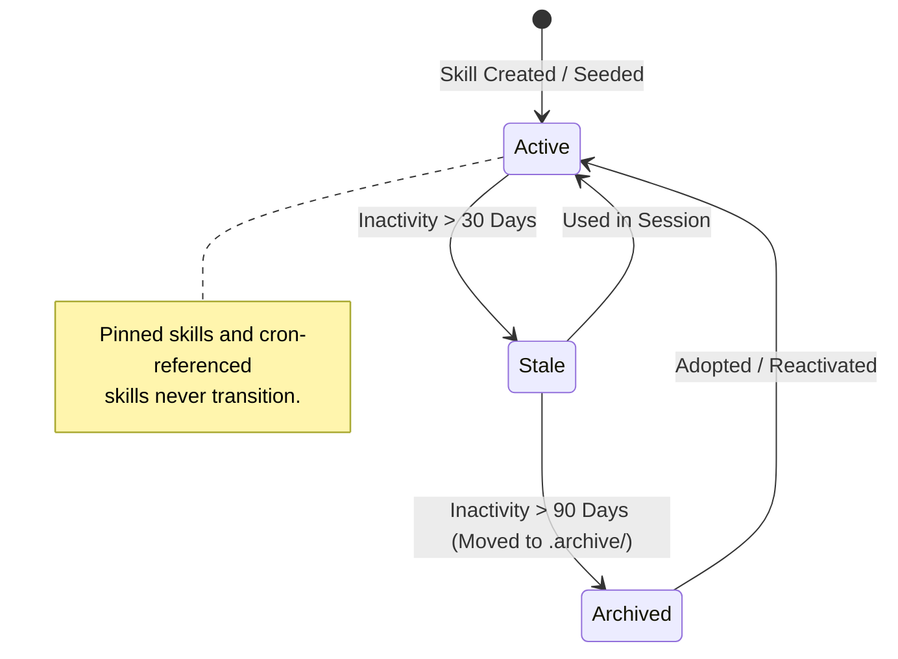

# Deep Architectural Scan: Self-Improvement & Learning Systems in Hermes Agent

**Date:** 2026-08-22  
**Target Focus:** Deep source scan of Nous Research's `hermes-agent` self-improvement loop, background reflection fork, curator lifecycle, memory hierarchy, threat guarding, and audit ledger.  
**Target Consumer:** Kaioken Go codebase (`cli/internal/memory`, `cli/internal/skills`, `cli/internal/agent`, `cli/internal/tui`).

---

## 1. Executive Summary & Architectural Overview

Hermes Agent implements an autonomous, self-improving procedural knowledge loop designed around four core design pillars:
1. **Zero Foreground Disruption:** Self-improvement never competes with the user's task for tokens, latency, or context window. It runs asynchronously in a detached daemon thread after user turns.
2. **Prompt-Cache Preservation:** By mirroring the parent agent's exact runtime configuration (system prompt, tools schema, reasoning parameters), the review fork hits warm provider prefix caches (Anthropic, OpenRouter), achieving ~26% cost reduction on review passes.
3. **Strict Isolation & Invariants:** Hard boundaries prevent "curator takeover" (prompt injection into the primary session history), rogue tool usage (thread-scoped whitelist), compression races, and unverified skill mutations (read-before-write requirement).
4. **Multi-Stage Lifecycle & Durable Telemetry:** Inactivity decay (active → stale → archived), content-addressed SHA-256 backup blobs, and an immutable JSONL audit ledger guarantee that all autonomous learning is auditable, safe, and completely reversible.

---

## 2. Trigger Mechanics & Review Scheduling

### 2.1 Dual-Cadence Triggers
Hermes Agent decouples declarative knowledge (user preferences/facts) from procedural knowledge (task execution workflows) by using separate trigger cadences:

- **Memory Nudge Cadence (`_turns_since_memory`):** Evaluated at turn start in `agent/turn_context.py`.
- **Skill Nudge Cadence (`_iters_since_skill`):** Evaluated at turn finalization based on tool execution volume in `agent/turn_finalizer.py`.

```python
# inspire/hermes-agent/agent/turn_context.py:712-720
    # Track memory nudge trigger (turn-based, checked here).
    should_review_memory = False
    if (agent._memory_nudge_interval > 0
            and "memory" in agent.valid_tool_names
            and agent._memory_store):
        agent._turns_since_memory += 1
        if agent._turns_since_memory >= agent._memory_nudge_interval:
            should_review_memory = True
            agent._turns_since_memory = 0
```

```python
# inspire/hermes-agent/agent/turn_finalizer.py:770-776
    # Check skill trigger NOW — based on how many tool iterations THIS turn used.
    _should_review_skills = False
    if (agent._skill_nudge_interval > 0
            and agent._iters_since_skill >= agent._skill_nudge_interval
            and "skill_manage" in agent.valid_tool_names):
        _should_review_skills = True
        agent._iters_since_skill = 0
```

### 2.2 Execution Gate & Suppression Rules
Review spawning is gated to prevent runaway background loops:
1. **Subagent Delegation Suppression:** Ephemeral worker subagents (`_delegate_depth > 0`) are prohibited from running background reviews to avoid replaying large transcripts at premium rates.
2. **Cron Suppression:** Background cron runs (`skip_background_review=True`) do not trigger reviews because there is no interactive human in the loop.
3. **Manual Override (`/refine`):** Explicit user invocations carry a `focus` argument, bypassing cadence intervals and disabled config gates.

```python
# inspire/hermes-agent/run_agent.py:1878-1887
        # A delegation subagent (``_delegate_depth > 0``) must not run the
        # automatic post-turn review. Subagents are ephemeral workers already
        # barred from writing shared MEMORY.md (``DELEGATE_BLOCKED_TOOLS``) and
        # are spawned with ``skip_memory=True``, so a review here has little to
        # persist — yet it inherits the subagent's (often premium) delegation
        # model and replays the whole conversation at premium rates, silently
        # inflating token cost (#85859). An explicit ``/refine`` (``focus`` set)
        # is a deliberate user request and still runs.
        if focus is None and getattr(self, "_delegate_depth", 0) > 0:
            return
```

---

## 3. Background Review Fork (`agent/background_review.py`)

### 3.1 Thread-Scoped I/O Isolation
A naive `redirect_stdout(devnull)` blinds `sys.stdout` process-wide, swallowing logs from web long-polls, gateway connections, or concurrent CLI spinners. Hermes uses a custom context manager (`thread_scoped_silence`) that silences standard descriptors only for the worker thread.

```python
# inspire/hermes-agent/agent/background_review.py:1089-1096
        # Silence stdout/stderr for THIS worker thread only.  A process-global
        # ``contextlib.redirect_stdout(devnull)`` here would also blank
        # ``sys.stdout``/``sys.stderr`` for every other thread — including a
        # gateway event-loop thread driving a Telegram long-poll — for the full
        # duration of the review (tens of seconds), swallowing their console
        # output (#55769 / #55925).  ``thread_scoped_silence`` routes only this
        # thread's writes to devnull and leaves all other threads on the real
        # streams.
        with thread_scoped_silence():
```

### 3.2 Prefix Cache Optimization & Parity
The review fork copies runtime settings from the parent session so that its API request hits the exact upstream cache:
- Inherits `_cached_system_prompt` verbatim.
- Inherits `tools[]` schema definition (even unwhitelisted tools are sent in schema so toolset hash matches Anthropic/OpenRouter requirements).
- Inherits `reasoning_config`, `prefill_messages`, and provider routing pins (`providers_allowed`, `provider_sort`).

```python
# inspire/hermes-agent/agent/background_review.py:1240-1255
            # Inherit the parent's cached system prompt verbatim so
            # the review fork's outbound HTTP request hits the same
            # Anthropic/OpenRouter prefix cache the parent warmed.
            # Without this, the fork rebuilds the system prompt from
            # scratch (fresh _hermes_now() timestamp, fresh
            # session_id, narrower toolset → different skills_prompt)
            # and the byte-exact prefix-cache key misses. See
            # issue #25322 and PR #17276 for the full analysis +
            # measured impact (~26% end-to-end cost reduction on
            # Sonnet 4.5).
```

### 3.3 Persistence & Compression Isolation (Preventing Curator Takeover)
To prevent the fork from corrupting the canonical database:
- `_persist_disabled = True` and `_session_db = None`: Hard stops all SQLite writes.
- `compression_enabled = False`: Prevents the review fork from triggering transcript summarization or creating orphaned branch children.
- `_end_session_on_close = False`: Ensures calling `close()` on the fork does not finalize the parent session.

```python
# inspire/hermes-agent/agent/background_review.py:1218-1231
            # PERSISTENCE ISOLATION (the curator-takeover root cause): the fork
            # shares the parent's session_id (set below, for prompt-cache
            # warmth), so without this it would write its harness turn ("Review
            # the conversation above and update the skill library…") + its own
            # response straight into the user's REAL session in state.db. On the
            # user's next live turn the agent re-reads that injected user message
            # as a standing instruction and "becomes" the curator, refusing the
            # actual task. _persist_disabled hard-stops every DB write/lazy-open
            # path (_flush_messages_to_session_db, _ensure_db_session,
            # _get_session_db_for_recall); the review writes only to the skill
            # and memory stores via its tools, which is all it needs.
            review_agent._persist_disabled = True
            review_agent._session_db = None
            review_agent._session_json_enabled = False
```

### 3.4 Bounded Cancellation Handshake (2.0s Deadline)
When a user submits a prompt while a background review is running, the foreground must not hang. Hermes executes an off-thread cancellation with a 2.0-second latch wait:

```python
# inspire/hermes-agent/agent/background_review.py:34
_BACKGROUND_REVIEW_CANCEL_TIMEOUT_SECONDS = 2.0

# inspire/hermes-agent/agent/background_review.py:175-184
    acknowledged = run.request_done.wait(
        timeout=_BACKGROUND_REVIEW_CANCEL_TIMEOUT_SECONDS
    )
    if not acknowledged:
        logger.warning(
            "Background review did not acknowledge cancellation within %.1fs; "
            "proceeding with foreground live turn",
            _BACKGROUND_REVIEW_CANCEL_TIMEOUT_SECONDS,
        )
```

---

## 4. Skill Library Topology & Authoring Rules

### 4.1 Multi-File Directory Layout
Skills in Hermes are self-contained directory structures rather than flat markdown files:

```text
~/.hermes/skills/<skill-name>/
├── SKILL.md                 # Primary definition + YAML frontmatter
├── references/              # Quoted API docs, error recipes, domain research
│   └── *.md
├── templates/               # Boilerplate configs and scaffold code
│   └── *.*
├── scripts/                 # Deterministic, re-runnable verification scripts
│   └── *.*
└── assets/                  # Diagrams, schemas, binary fixtures
```

### 4.2 Strict Authoring Invariants
The background review prompt enforces strict quality and scope rules:
1. **Class-Level Umbrellas:** Skills must govern a class of tasks (e.g. `docker-multi-arch-build`), never transient session artifacts (e.g. `fix-issue-402`).
2. **Preference Embedding:** User corrections regarding style, verbosity, or workflow are first-class procedural lessons and must be embedded in the relevant `SKILL.md` body.
3. **Negative Claim Prohibition:** The model is explicitly barred from capturing transient environment errors (`command not found`, missing API keys) or writing permanent refusals against its own tools (`browser does not work`).
4. **Read-Before-Write Requirement:** The `skill_manage` tool blocks patches to existing skills unless the background review agent has previously called `skill_view` on that file in the current review turn.

```python
# inspire/hermes-agent/tools/skill_manager_tool.py:60-68
def mark_background_review_skill_read(path: Path) -> None:
    """Record that the active background-review fork has read a skill file.

    The autonomous review fork is allowed to evolve skills, but it must not
    patch or rewrite content it has only inferred from the transcript.  The
    skill_view tool calls this after returning file content to the model; write
    paths below require the corresponding target path to be present when the
    current origin is ``background_review``.
    """
```

---

## 5. Curator & Skill Lifecycle Management (`agent/curator.py`)

### 5.1 Deterministic State Machine (No LLM Required)
The curator runs periodically (default interval: 7 days) when the system is idle (`min_idle_hours: 2`). It manages skill state transitions deterministically without invoking language models:



```python
# inspire/hermes-agent/agent/curator.py:70-78
DEFAULT_INTERVAL_HOURS = 24 * 7  # 7 days
DEFAULT_MIN_IDLE_HOURS = 2
DEFAULT_STALE_AFTER_DAYS = 30
DEFAULT_ARCHIVE_AFTER_DAYS = 90
DEFAULT_CONSOLIDATE = False
```

### 5.2 Cron Reference Immunity
Skills referenced by scheduled or paused cron jobs are immune to automatic stale/archive transitions:

```python
# inspire/hermes-agent/agent/curator.py:334-342
        # A skill referenced by any cron job (incl. paused/disabled) is in
        # use by definition — resuming or the next fire must find it. The
        # scheduler only bumps usage when a job actually fires, so jobs that
        # fire less often than archive_after_days, paused jobs, and far-future
        # one-shots would otherwise have their skills aged out from under
        # them. Treat referenced skills like pinned: never auto-transition.
        if name in cron_referenced:
            continue
```

### 5.3 LLM Consolidation Pass (Opt-in)
When `curator.consolidate: true` is enabled, an auxiliary LLM pass clusters overlapping narrow skills into unified umbrella skills, updates the primary `SKILL.md`, moves detailed sub-topics to `references/`, and archives the absorbed skills.

---

## 6. Safety, Threat Guard, and Immutable Audit Rollback

### 6.1 Security Threat Scanner (`tools/skills_guard.py`)
Every external skill downloaded from the registry—and agent-created skills when enabled—is scanned against regex patterns covering:
- **Exfiltration:** Shell commands interpolating secret env vars (`curl`, `wget`, `httpx`, `fetch`).
- **Credential Theft:** Base64 environment dumps, reading private keys or auth stores.
- **Prompt Injection:** Delimiter escaping, system prompt overrides.
- **Destructive Commands:** Unbounded disk writes, `rm -rf /`.

```python
# inspire/hermes-agent/tools/skills_guard.py:55-65
INSTALL_POLICY = {
    #                  safe      caution    dangerous
    "builtin":       ("allow",  "allow",   "allow"),
    "trusted":       ("allow",  "allow",   "block"),
    "community":     ("allow",  "block",   "block"),
    "agent-created": ("allow",  "allow",   "ask"),
}
```

### 6.2 Per-Mutation Audit Ledger (`tools/skill_ledger.py`)
All skill mutations append to `~/.hermes/skills/.curator_ledger.jsonl`.
- Records mutation timestamp, actor tag (`user`, `curator`, `agent`), action, and before/after file manifests.
- Operates strictly as telemetry (failures in ledger writing never abort the tool mutation).

### 6.3 Content-Addressed Blob Storage & Rollback
Before overwriting or deleting any skill file, the existing file content is hashed and saved to `~/.hermes/.curator_backups/blobs/<sha256>`.
- Enables atomic single-edit rollback: `hermes curator rollback <entry-id>`.
- Pre-rollback safety capture fails closed: if creating the recovery snapshot fails, rollback halts.

```python
# inspire/hermes-agent/tools/skill_ledger.py:1-6
"""Per-mutation skill audit ledger + single-edit rollback (tracker #79686 P3).

Every skill mutation — regardless of actor — appends one JSONL entry to
``~/.hermes/skills/.curator_ledger.jsonl`` describing who changed what, with
before/after file manifests whose contents are stored content-addressed
(sha256-deduped) under ``~/.hermes/.curator_backups/blobs/``.
"""
```

---

## 7. Comparative Analysis: Hermes vs. Kaioken

| Feature Component | Hermes Agent (Reference) | Kaioken (Current Status) | Target Architectural Strategy |
| :--- | :--- | :--- | :--- |
| **Trigger Timing** | Dual cadence: per-turn memory + per-tool-iter skill review | Session-end only (`SaveEnd`) or explicit `/learn` | Implement `memory.Signals()` cadence checks in `internal/agent` |
| **Review Execution** | Isolated background daemon thread with warm prefix cache | Synchronous model call in foreground runner | Spawn background review goroutine with context cancellation |
| **Persistence Isolation** | DB writes hard-disabled via `_persist_disabled` | N/A (runs at session teardown) | Pass read-only session snapshot; do not mutate active session DB |
| **Cancellation** | 2.0s bounded wait on `request_done` on user input | Full run cancellation via `Runs.Cancel` | Use Go `select` with `context.WithTimeout(ctx, 2*time.Second)` |
| **Skill Layout** | Multi-file directory (`references/`, `templates/`, `scripts/`) | Single file `SKILL.md` (`skills.Path()`) | Extend `internal/skills` to multi-file directory layout |
| **Read-Before-Write** | Enforced via contextvar read-mark tracking | Missing | Track `readSkills map[string]bool` in review execution context |
| **Safety Scanner** | Static regex threat guard (`skills_guard.py`) | Simple YAML unmarshal only | Implement pure-Go threat scanner in `internal/skills/guard.go` |
| **Audit Ledger & Undo** | JSONL ledger + SHA-256 content-addressed blob store | Single-file in-memory `UndoEntry` | Add `.ledger.jsonl` and `.blobs/` store in `internal/skills` |
| **Lifecycle Transitions** | Deterministic active → stale → archived state machine | `PruneStale` flags candidates for manual review | Implement automatic decay with `.archive/` directory movement |
| **Session Search** | SQLite FTS5 | Pure-Go BM25 (`internal/textrank`) | Retain pure Go BM25 to preserve `CGO_ENABLED=0` |

---

## 8. Implementation Blueprint for Kaioken

To incorporate Hermes's self-improvement capabilities without violating Kaioken's core constraints (`CGO_ENABLED=0`, cross-platform Windows 11/Linux/macOS, Bubble Tea architecture):

### Phase A: Skills Foundation & Safety (Phase 4 of Backlog)
1. **Multi-File Layout (`internal/skills`):** Update `skills.Skill` to support auxiliary subdirectories (`references/`, `templates/`, `scripts/`).
2. **Threat Scanner (`internal/skills/guard.go`):** Implement static analysis for exfiltration, injection, and destructive commands.
3. **Audit Ledger & Blob Store (`internal/skills/ledger.go`):** Implement JSONL mutation logging and SHA-256 blob deduplication for non-destructive rollbacks.
4. **Lifecycle Manager (`internal/skills/lifecycle.go`):** Add active/stale/archive state transitions and `.archive/` directory handling.

### Phase B: Asynchronous Background Review Fork (Phase 5 of Backlog)
1. **Review Fork Runner (`internal/agent/review.go`):** Implement a background goroutine executing on turn completion when `memory.Signals()` fires.
2. **Cache-Warm System Prompt:** Pass the identical system prompt and tool definitions to hit provider prefix caches.
3. **Persistence Fence:** Execute the review with a read-only view of history; writes route strictly through `skills.Save` and `memory.Save`.
4. **Live-Turn Cancellation:** Attach a 2-second timeout context to the background review when the user submits a new prompt.
5. **Read-Before-Write Gate:** Enforce that the review agent reads a skill before applying edits.

### Phase C: Curator & Consolidation (Phase 5 of Backlog)
1. **Consolidation CLI (`kaioken skills consolidate`):** Provide an explicit CLI command to cluster fragmented skills into umbrella skills.
2. **Learning Timeline UI (`internal/tui/learning.go`):** Render a terminal sparkline and timeline bar chart visualizing memory and skill mutations.
