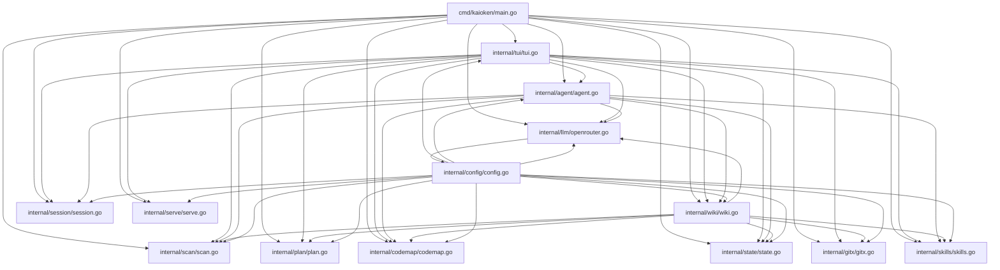

# Architecture Overview

Kaioken is a terminal-based AI coding assistant that combines an interactive chat agent with a knowledge engine. The chat agent allows users to converse with LLMs to perform coding tasks like editing files and running commands, with changes shown as diffs for approval. The knowledge engine scans repositories, generates structured documentation (knowledge cards and wiki), and incrementally updates it over time.

## Table of Contents
- [Architecture](#architecture)
- [Key Components](#key-components)
- [Data Flow](#data-flow)
- [Glossary](#glossary)
- [Referenced Files](#referenced-files)

## Architecture

Kaioken follows a layered architecture where high-level components depend on lower-level utilities, with configuration as a cross-cutting concern.

### Component Responsibilities

- **cmd/kaioken/main.go**: Entry point; defines CLI commands (`init`, `scan`, `plan`, `generate`, `wiki`, `update`, `models`, `status`, `skills`, `hook`, `serve`) and depends on all internal packages.
- **internal/tui/tui.go**: Terminal UI (Bubble Tea); handles user input, displays output, and orchestrates interactions with agent, LLM, session, skills, wiki, serve, codemap, scan, plan, state, and gitx.
- **internal/agent/agent.go**: Chat agent; processes user messages, invokes LLM with tools (`read_file`, `edit_file`, etc.), and manages approvals via UI; depends on llm, config, codemap, scan, session, skills, wiki, and state.
- **internal/wiki/wiki.go**: Knowledge engine; generates modules, knowledge cards, and wiki documentation; depends on scan, plan, llm, config, codemap, state, gitx, and skills.
- **internal/llm/openrouter.go**: LLM provider integration; handles streaming, tool use, token budgeting, and retries; depends on config.
- **internal/skills/skills.go**: Manages task guides (skills); depends on scan, llm, and config.
- **internal/scan/scan.go**: Inventorys repository files; depends on config.
- **internal/plan/plan.go**: Plans repository modules (`modules.yaml`); depends on scan, llm, and config.
- **internal/codemap/codemap.go**: Parses source code to build symbol indexes and skeletons; no internal dependencies.
- **internal/session/session.go**: Manages chat session persistence; depends on llm.
- **internal/state/state.go**: Tracks wiki build state for incremental updates; depends on scan.
- **internal/serve/serve.go**: Serves generated wiki via HTTP; depends on wiki.
- **internal/gitx/gitx.go**: Git integration (hooks, diffs, etc.); no internal dependencies.
- **internal/config/config.go**: Manages global and per-repo configuration; depends on environment and standard library.

## Key Components

### Command Line Interface (`cmd/kaioken/main.go`)

The CLI entry point defines all user-facing commands and orchestrates high-level operations by delegating to internal packages.

| Declaration | Line Range | Description |
|-------------|------------|-------------|
| `func main()` | Not in source block | Entry point; parses command-line arguments and dispatches to subcommand handlers. |
| `func initCmd()` | Not in source block | Handles `kaioken init` command to create default configuration. |
| `func scanCmd()` | Not in source block | Handles `kaioken scan` to inventory repository files. |
| `func planCmd()` | Not in source block | Handles `kaioken plan` to generate module plan. |
| `func generateCmd()` | Not in source block | Handles `kaioken generate` to create knowledge cards. |
| `func wikiCmd()` | Not in source block | Handles `kaioken wiki`/`/wiki` to run knowledge generation pipeline. |
| `func updateCmd()` | Not in source block | Handles `kaioken update`/`/update` for incremental wiki updates. |
| `func modelsCmd()` | Not in source block | Handles `kaioken models` to list available LLM models. |
| `func statusCmd()` | Not in source block | Handles `kaioken status` to check module freshness. |
| `func skillsCmd()` | Not in source block | Handles `kaioken skills` to build/task guides. |
| `func hookCmd()` | Not in source block | Handles `kaioken hook` to manage Git post-commit hooks. |
| `func serveCmd()` | Not in source block | Handles `kaioken serve`/`/serve` to start wiki browser. |

### Terminal User Interface (`internal/tui/tui.go`)

The TUI built with Bubble Tea manages the interactive chat interface, command palette, and live updates. It orchestrates interactions with all core components.

Exported declarations from source:

| Declaration | Line Range | Description |
|-------------|------------|-------------|
| `func Run(repo string) error` | L184-191 | Starts the TUI event loop for a repository. Resolves absolute path and runs Bubble Tea program. |
| `func New(repo string) Model` | L194-257 | Constructs initial TUI state: loads configuration, initializes UI components (textarea, spinner, list), sets up event channels, and resets conversation. |
| `func (m *Model) resetConversation()` | L259-265 | Clears conversation history to initial system prompt and creates new session object. |
| `func (m *Model) saveSession()` | L270-278 | Persists current conversation to session storage; reports save failures via status line. |
| `func (m Model) Init() tea.Cmd` | L280-282 | Returns initial commands: cursor blink and event listener setup. |
| `func (m Model) Update(msg tea.Msg) (tea.Model, tea.Cmd)` | L284-426 | Main state update handler: processes window resizes, key presses, async messages (logs, busy states, approvals, agent responses, etc.). |
| `func (m Model) onKey(msg tea.KeyMsg) (tea.Model, tea.Cmd)` | L428-567 | Handles keyboard input: manages mode switching (chat/picker), approval prompts, command palette navigation, and special key combinations (Ctrl+C, Ctrl+D, Esc). |
| `func (m *Model) stopCurrent()` | L571-588 | Cancels ongoing operations (chat turns, wiki generation, etc.) without quitting; preserves streamed content. |
| `func (m Model) View() string` | L590-601 | Renders UI: viewport content, command palette, and footer. |
| `func (m Model) footer() string` | L605-633 | Generates footer line: approval prompt, API key entry, or composer input with mode-indicating prompt style. |
| `func (m Model) statusLine() string` | L638-656 | Generates status line: left side (busy spinner/help hints) and right side (session info: serving status, model, token usage). |
| `func (m Model) sessionStatus() string` | L661-680 | Formats session info: serving URL, current model, and token usage. |
| `func shortModel(id string) string` | L690-700 | Truncates model ID for display: removes vendor prefix and ellipsizes middle while preserving tail (e.g., `:free` suffix). |
| `func humanTokens(n int) string` | L715-725 | Formats token count: `1.2M`, `3.4k`, or raw number for compact status line. |
| `func elapsed(d time.Duration) string` | L727-731 | Formats duration: `9s`, `1m04s`, or `1h02m`. |
| `func (m *Model) appendLine(s string)` | L727-731 | Appends line to scrollback, marks committed wrap as stale, and refreshes viewport. |
| `func (m *Model) refreshViewport()` | L733-753 | Updates viewport content from committed scrollback and live streaming text. |
| `func (m Model) inputHeight() int` | L759-771 | Computes composer height (1-8 rows) based on line count and `maxInputRows` constant. |
| `func (m *Model) syncLayout()` | L775-784 | Adjusts viewport height to accommodate composer rows and command palette. |
| `func (m *Model) flushLive(note string)` | L789-799 | Commits live streaming text to scrollback with optional note (used on operation cancellation). |
| `func (m *Model) showApproval(req agent.ApprovalRequest)` | L801-837 | Displays approval diff UI: header with action/target, stats, and colored gutter for visual grouping. |
| `func (m Model) onEnter() (tea.Model, tea.Cmd)` | L841-871 | Handles Enter key: processes API key entry or chat message submission. |
| `func (m Model) startChat(text string) (tea.Model, tea.Cmd)` | L875-916 | Initiates chat turn: appends user message, starts agent processing with context cancellation, and sets busy state. |
| `func (m Model) dispatch(raw string) (tea.Model, tea.Cmd)` | L920-1043 | Parses and executes slash-commands: routes to handlers for tutorial, help, session control, model/provider switching, knowledge pipeline, etc. |
| `func (m *Model) openModelPicker() (tea.Model, tea.Cmd)` | L1047-1061 | Opens interactive model selector: fetches models from LLM provider and displays in list picker. |
| `func (m *Model) setModel(id string)` | L1063-1070 | Updates configuration model, saves config, rebuilds LLM client, and confirms change. |
| `func (m *Model) setProvider(name string)` | L1072-1095 | Switches LLM provider: validates name, updates config, rebuilds client, and reports key status. |
| `func (m *Model) printStatusPanel()` | L1101-1106 | Reprints version/repo/model/provider/key block after configuration changes. |
| `func (m *Model) listProviders()` | L1109-1156 | Displays available LLM providers with connection status and key availability. |
| `func (m *Model) setKey(val string) (tea.Model, tea.Cmd)` | L1158-1174 | Sets API key for current provider: updates session/global config, rebuilds client, and prints status panel. |
| `func (m *Model) setRepo(path string)` | L1176-1194 | Changes working repository: resets conversation, loads new config, and updates UI. |
| `func (m *Model) notes(args []string, rest string)` | L1196-1224 | Manages steering notes: adds/clears notes in config or displays current notes. |
| `func (m *Model) doInit()` | L1226-1236 | Handles `/init` command: saves default config to `.kaioken/config.yaml`. |
| `func (m *Model) doUndo()` | L1242-1258 | Reverts last file write/edit via agent undo mechanism. |
| `func (m Model) startDiff() (tea.Model, tea.Cmd)` | L1262-1293 | Executes `git diff` and displays file changes with color-coded additions/deletions. |
| `func (m *Model) showCost()` | L1296-1305 | Displays LLM usage statistics: call count and token usage. |
| `func (m Model) startCompact() (tea.Model, tea.Cmd)` | L1307-1311 | Initiates conversation summarization to free context via LLM. |
| `func (m *Model) doCopy()` | L1315-1341 | Copies last assistant message to system clipboard. |
| `func (m Model) startSkills(args []string) (tea.Model, tea.Cmd)` | L1343-1363 | Starts skill generation process: scans repo, builds task guides with progress reporting. |
| `func (m *Model) listSkills()` | L1366-1383 | Lists available skill guides with source counts and descriptions. |
| `func (m *Model) suggestSkills()` | L1389-1440 | Suggests skill generation after wiki/card generation if none exist. |
| `func (m *Model) doHook(args []string)` | L1443-1458 | Installs/removes/reports Git post-commit hook for automatic wiki updates. |
| `func (m Model) startServe(args []string) (tea.Model, tea.Cmd)` | L1462-1473 | Starts/stops local wiki server on specified port (default 7777). |
| `func (m *Model) listSessions()` | L1479-1523 | Displays saved chat sessions with metadata (turns, model, timestamp). |
| `func (m Model) openSessionPicker() (tea.Model, tea.Cmd)` | L1530-1568 | Opens session picker to resume saved conversations. |
| `func (m *Model) resumeSession(id string)` | L1573-1575 | Loads and replays saved conversation by ID. |
| `func firstLine(s string)` | L1577-1578 | Returns first line of string with ellipsis if truncated (for session listing). |
| `func humanTime(t time.Time)` | L1579 | Formats timestamp as relative time (e.g., "just now", "2h ago"). |
| `func (m Model) startScan() (tea.Model, tea.Cmd)` | L1631-1664 | Starts repository scanning operation with progress reporting. |
| `func (m Model) startPlan() (tea.Model, tea.Cmd)` | L1666-1672 | Starts module planning operation with progress reporting. |
| `func (m Model) startWiki(args []string) (tea.Model, tea.Cmd)` | L1675-1689 | Starts wiki generation: validates config, estimates cost, requests approval for heavy runs, and executes pipeline. |
| `func (m Model) startWikiRetry() (tea.Model, tea.Cmd)` | L1710-1748 | Retries failed wiki sections from last run. |
| `func (m Model) startWikiUpdate(args []string) (tea.Model, tea.Cmd)` | L1752-1820 | Starts incremental wiki update: diffs against baseline, updates affected documents, and refreshes related skills. |
| `func (m Model) startGenerate(args []string) (tea.Model, tea.Cmd)` | L1823-1866 | Starts knowledge card generation: loads module plan, scans repo, and generates cards with progress reporting. |
| `func (m Model) startStatus() (tea.Model, tea.Cmd)` | L1871-1951 | Checks module freshness: compares current file hashes with stored state. |
| `func (m Model) startModels(filter string) (tea.Model, tea.Cmd)` | L1953-2008 | Lists LLM models matching optional filter. |
| `func (m *Model) setSessionKey(key string)` | L2010-2051 | Records API key in session for current provider only. |
| `func (m *Model) rebuildClient() string` | L2053-2081 | (Re)builds LLM client: resolves API key from session/global/environment, applies config limits, returns error if failed. |
| `func (m *Model) persistKey(key string)` | L2087-2092 | Saves API key to global config file (`~/.kaioken/config.yaml`). |
| `func (m *Model) persistDefaults()` | L2094-2114 | Saves current provider/model as user defaults in global config. |
| `func (m *Model) saveCfg()` | L2117-2127 | Saves current repo config to `.kaioken/config.yaml`. |
| `func (m Model) guardBusy() bool` | L2130-2139 | Returns true if TUI is currently processing a busy operation. |
| `func (m Model) busyNote() (tea.Model, tea.Cmd)` | L2141-2145 | Returns warning message and no-op command when busy. |
| `func (m Model) needKey() (tea.Model, tea.Cmd)` | L2147-2152 | Returns error message and no-op command when API key missing. |
| `func (m Model) configLines() []string` | L2154-2158 | Returns configuration summary lines for display: repo, model, provider, concurrency, token limits, notes count, auto-approve status. |
| `func (m *Model) setSessionKey(key string)` | L2160-2170 | Records API key in session-specific map for current provider. |
| `func (m *Model) persistKey(key string)` | L2174-2176 | Saves API key to global config. |
| `func (m *Model) persistDefaults()` | L2177-2178 | Saves provider/model as user defaults. |
| `func (m *Model) saveCfg()` | L2182-2186 | Saves repo config to disk. |
| `func

<!-- kaioken:files internal/tui/tui.go,internal/agent/agent.go,internal/wiki/wiki.go,README.md -->
