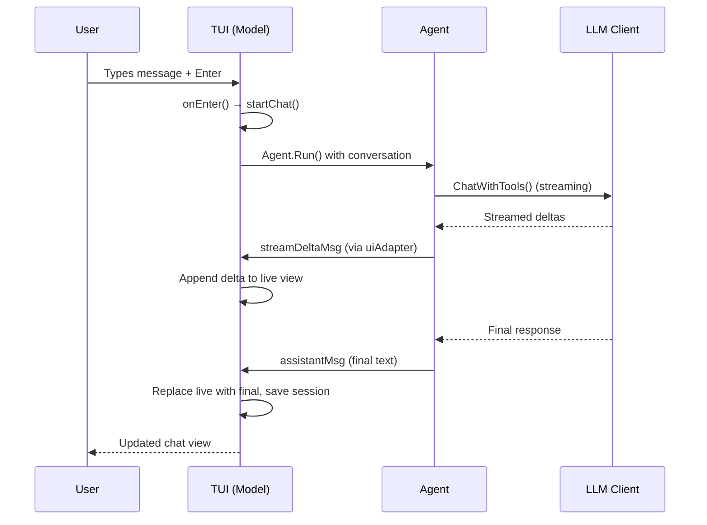
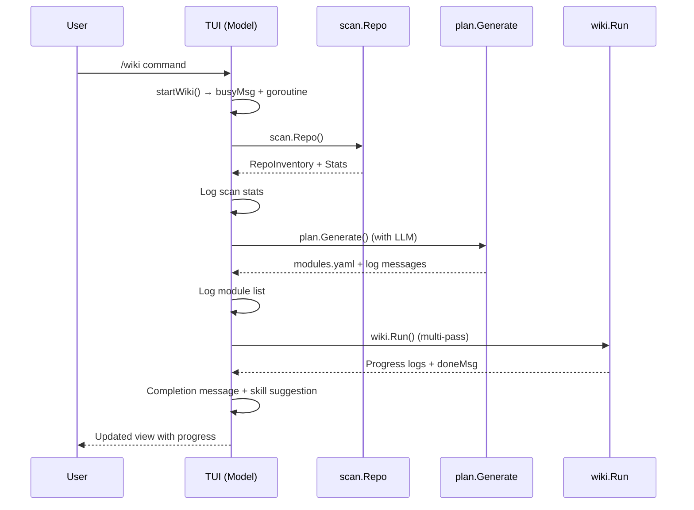

# Terminal User Interface (TUI)

The TUI is kaioken's primary interactive interface, built with the Bubble Tea library. It handles user input, displays chat and system output, manages sessions, provides a command palette for slash commands, and orchestrates interactions with the agent, knowledge engine, and other components. The TUI runs as a Bubble Tea program where user actions trigger messages that update the internal state and re-render the view.

## Table of Contents
- [Introduction](#introduction)
- [Architecture and Data Flow](#architecture-and-data-flow)
- [Model Structure](#model-structure)
- [Message Types](#message-types)
- [User Interaction Flow](#user-interaction-flow)
- [Command Palette and Slash Commands](#command-palette-and-slash-commands)
- [Session Management](#session-management)
- [Approval Workflow](#approval-workflow)
- [Knowledge Engine Integration](#knowledge-engine-integration)
- [Configuration and Settings](#configuration-and-settings)
- [Rendering and Layout](#rendering-and-layout)
- [Referenced Files](#referenced-files)

## Introduction

The TUI (`internal/tui/tui.go`) is the user-facing layer of kaioken. It:
- Displays chat conversations with streaming LLM responses
- Renders markdown, diffs, and status information
- Processes user input via a multi-line composer
- Provides a command palette (`/`) for accessing all functionality
- Manages chat sessions (save/resume/list)
- Handles tool approvals for file edits and command execution
- Orchestrates knowledge engine operations (scan, plan, wiki, generate)
- Displays progress during long-running operations
- Shows token usage, model/provider info, and system status

The TUI depends on nearly all internal packages (agent, llm, config, scan, plan, wiki, etc.) but has no internal dependencies itself—it is the top-level UI layer.

## Architecture and Data Flow

The TUI follows the standard Bubble Tea architecture: a `Model` struct holds state, and the program loops through `Init`, `Update`, and `View` methods. User input and external events (like LLM responses) are processed as `tea.Msg` values in `Update`, which may trigger state changes and side effects (like starting agent interactions or knowledge engine tasks).

### Core Loop
1. **Init**: Sets up initial commands (cursor blink, event listener)
2. **Update**: Processes messages (keyboard input, async results, system events)
3. **View**: Renders the current state to the terminal

### Data Flow for Chat Interaction


### Data Flow for Knowledge Engine (e.g., `/wiki`)


## Model Structure

The `Model` struct holds all TUI state. Key fields include:

| Field | Type | Purpose |
|-------|------|---------|
| `repo` | string | Absolute path to current repository |
| `cfg` | *config.Config | Per-repo configuration |
| `global` | *config.Global | Global configuration (API keys, defaults) |
| `apiKeys` | map[string]string | Session-scoped API keys (per provider) |
| `client` | *llm.Client | Active LLM client |
| `conversation` | []llm.Message | Chat history (system + user/assistant turns) |
| `autoApprove` | bool | Whether to skip tool approval prompts |
| `undoStack` | []agent.UndoEntry | History of file edits for undo |
| `sess` | *session.Session | Current chat session (for persistence) |
| `vp` | viewport.Model | Renders scrollback chat |
| `input` | textarea.Model | Multi-line input composer |
| `keyInput` | textinput.Model | Hidden field for API key entry |
| `spin` | spinner.Model | Spinner for busy states |
| `list` | list.Model | Picker for models/sessions |
| `events` | chan tea.Msg | Channel for async messages from goroutines |
| `approvals` | chan bool | Channel for approval responses |
| `lines` | []string | Raw lines of chat scrollback |
| `committed` string | Cached wrapped render of `lines` |
| `live` string | Currently streaming assistant response |
| `busy` bool | Whether a long task is running |
| `busyText` string | Description of current busy task |
| `busyStart` time.Time | Start time for elapsed counter |
| `mode` | mode | Current UI mode (chat or picker) |
| `pal` | palette | Internal slash-command completion menu |
| `pendingKey` bool | Whether awaiting API key input |
| `pendingApproval` bool | Whether awaiting tool approval |
| `approval` | agent.ApprovalRequest | Current approval request |
| `cancel` | context.CancelFunc | For cancelling active tasks |
| `serveCancel` | context.CancelFunc | For wiki server |
| `serveURL` string | URL if wiki is being served |
| `configMissing` bool | Whether repo config was missing |
| `suggestedSkills` bool | Whether skill nudge was shown |
| `width`, `height` int | Terminal dimensions |
| `ready` bool | Whether initial layout is done |

### Modes
The TUI operates in two mutually exclusive modes:
- `modeChat` (0): Normal chat interface, input goes to composer
- `modePicker` (1): Model/session selector is active, input filters the list

```go
type mode int

const (
	modeChat mode = iota
	modePicker
)
```

## Message Types

Async communication uses typed messages sent via the `events` channel. These are handled in `Update` to modify state without blocking the UI.

| Message Type | Fields | Purpose |
|--------------|--------|---------|
| `logMsg` | line string | Arbitrary text to append to scrollback (tool calls, status) |
| `busyMsg` | on bool, text string | Start/stop busy state with description |
| `doneMsg` | label string, err error | Signal task completion (with optional error) |
| `approvalReqMsg` | req agent.ApprovalRequest | Request user approval for a tool action |
| `agentDoneMsg` | history []llm.Message, error | Final agent result (updated conversation) |
| `modelsFetchedMsg` | models []llm.ModelInfo, error | Result from LLM provider model listing |
| `undoRecordMsg` | entry agent.UndoEntry | Record an edit for undo stack |
| `streamDeltaMsg` | text string | One chunk of streamed LLM response |
| `assistantMsg` | text string | Final, rendered assistant response |
| `serveStartedMsg` | url string | Wiki server started successfully |
| `serveStoppedMsg` | (none) | Wiki server stopped |
| `compactedMsg` | summary string, dropped int | Conversation compacted to save context |

### Helper Function: `listen`
Converts a channel into a Bubble Tea `Cmd` that sends the next value as a message.

```go
func listen(ch chan tea.Msg) tea.Cmd {
	return func() tea.Msg { return <-ch }
}
```

## User Interaction Flow

### Input Handling
User keystrokes are processed in `Update` → `onKey`. Behavior depends on current state:
- **Picker mode**: Keys navigate the list (up/down/enter/esc)
- **Pending approval**: Keys y/Y/Enter (approve), n/N/esc (decline), ctrl+c (cancel)
- **Palette open**: Keys drive command completion menu
- **Global shortcuts**: 
  - `ctrl+d`: Quit (if input empty)
  - `ctrl+c`/`esc`: Stop current task
  - `enter`: Submit composer input (or API key if pending)
  - `pgup/pgdown`: Scroll viewport
  - `up/down`: Scroll viewport (if composer single-line) or move cursor (multi-line)

### Submitting Chat Messages
When Enter is pressed in chat mode:
1. `onEnter()` is called
2. Input is cleared and layout synced
3. If input starts with `/`, it's dispatched as a command
4. Otherwise, `startChat()` is invoked:
   - Appends user message to scrollback (with prompt styling)
   - Adds user turn to conversation history
   - Starts agent interaction in a goroutine:
     - Sends `busyMsg{true, "thinking"}`
     - Calls `agent.Agent.Run()` with conversation and UI adapter
     - On result: sends `agentDoneMsg` then `busyMsg{false, ""}`
   - UI adapter relays:
     - Streamed tokens → `streamDeltaMsg`
     - Final response → `assistantMsg`
     - Tool calls/results → `logMsg` (via `toolCallLine`/`toolResultLine`)
     - Approval requests → `approvalReqMsg`

## Command Palette and Slash Commands

The command palette (opened with `/`) provides fuzzy search and completion for all slash commands. It is implemented as an internal `palette` type (not shown in structure but referenced in code).

### Palette Behavior
- **Open**: Typing `/` in composer activates palette
- **Navigation**: 
  - `up`/`ctrl+p`: Move selection up
  - `down`/`ctrl+n`: Move selection down
- **Completion**: 
  - `tab`: Insert selected command
  - `enter`: Execute selected command
  - `esc`: Cancel palette
- **Execution**: Selected command is sent to `dispatch()` for processing

### Command Dispatch
The `dispatch()` method parses the command string and routes to specific handlers:
- **Session**: `/sessions`, `/resume [id]`, `/new`/`/reset`
- **Control**: `/stop`, `/undo`, `/diff`, `/cost`, `/compact`, `/copy`, `/version`
- **Model/provider**: `/model [id]`, `/models [filter]`, `/provider [name]`, `/key [value]`, `/yolo`
- **Repository**: `/repo <path>`
- **Knowledge engine**: 
  - `/scan`, `/plan`, `/wiki [xN] [force]`, `/update [<base-rev>]`, `/wiki retry`, `/generate`/`/cards [force] [name...]`
  - `/skills [force|name]`, `/serve [port]`, `/hook [install|remove|status]`, `/status`
- **[Configuration](../Configuration/Configuration.md)**: `/config`, `/init`, `/clear`, `/help`/`/h`/`/?`, `/explain`, `/notes [add <t>|clear]`
- **Misc**: `/tutorial`/`/guide`/`/manual`, `/quit`/`/exit`/`/q`

Each handler typically:
1. Appends the command to scrollback (with user styling)
2. Validates prerequisites (e.g., LLM client for model-dependent commands)
3. Sets busy state if needed (`guardBusy()`/`busyNote()`)
4. Launches a goroutine for long operations
5. Sends progress/results via `events` channel

## Session Management

Sessions persist chat history between TUI invocations. They are stored in `.kaioken/sessions/` as JSON files.

### Key Functions
- `saveSession()`: Records current conversation to session and saves to disk
- `listSessions()`: Displays saved sessions with metadata (ID, title, turns, model, timestamp)
- `openSessionPicker()`: Shows session list in picker for selection
- `resumeSession(id)`: Loads session by ID, replaces current conversation, replays transcript in view

### Session Item Type
Used in the picker list:
```go
type sessionItem struct {
	id, title, desc string
}
func (i sessionItem) Title() string       { return i.title }
func (i sessionItem) Description() string { return i.desc }
func (i sessionItem) FilterValue() string { return i.title + " " + i.desc }
```

## Approval Workflow

When the agent wants to execute a state-changing tool (e.g., `edit_file`, `run_command`), it requests approval via the UI adapter.

### Flow
1. Agent calls `UI.Approve(req)` where `req` is `agent.ApprovalRequest`
2. UI adapter sends `approvalReqMsg{req}` to `events` channel
3. `Update` processes `approvalReqMsg`:
   - Calls `showApproval(req)` to render approval prompt
   - Sets `pendingApproval = true`
4. User responds with keypress in `onKey`:
   - `y`/`Y`/`Enter`: Send `true` to `approvals` channel
   - `n`/`N`/`esc`: Send `false` to `approvals` channel
   - `ctrl+c`: Cancel current operation (via `stopCurrent()`)
5. UI adapter receives bool from `approvals` channel and returns to agent
6. On approval: 
   - Appends "approved" to scrollback
   - Agent executes tool and records undo entry
   - On decline: Appends "declined" and skips tool

### Approval Prompt Rendering
```go
func (m *Model) showApproval(req agent.ApprovalRequest) {
	m.approval = req
	m.pendingApproval = true

	m.appendLine("")
	header := approvalStyle.Render("● "+req.Action) + "  " + userStyle.Render(req.Target)
	if adds+dels > 0 {
		header += "  " + diffAddStyle.Render(fmt.Sprintf("+%d", adds)) +
			" " + diffDelStyle.Render(fmt.Sprintf("-%d", dels))
	}
	m.appendLine(header)

	bar := gutterStyle.Render("│ ")
	for _, l := range body {
		switch {
		case strings.HasPrefix(l, "+"):
			m.appendLine(bar + diffAddStyle.Render(l))
		case strings.HasPrefix(l, "-"):
			m.appendLine(bar + diffDelStyle.Render(l))
		default:
			m.appendLine(bar + dimStyle.Render(l))
		}
	}
}
```
Shows:
- Action and target (e.g., "● edit_file  path/to/file.go")
- Line count of changes (+adds, -dels)
- Diff with green/red gutter bar for visual grouping

## Knowledge Engine Integration

The TUI provides entry points for all knowledge engine phases, each launching a goroutine to avoid blocking the UI.

### Scan (`/scan`)
- Calls `scan.Repo(repo, cfg)`
- On success: logs repository statistics (`res.Stats()`)
- Sends `doneMsg{"scan", err}`

### Plan (`/plan`)
- Requires LLM client
- Scans repo, then calls `plan.Generate(ctx, client, cfg, res)`
- Saves `modules.yaml` via `p.Save(repo)`
- Logs each module ID and title
- Sends `doneMsg{"plan", err}`

### Wiki (`/wiki [xN] [force]`)
- Requires LLM client
- Default multiplier is `x3` (deepest); can override with `x1`, `x2`, etc.
- Estimates cost and requests approval if heavy (`wiki.EstimateRun().Heavy()`)
- Runs `wiki.Run()` with progress reporting
- Logs actual token usage after completion
- Suggests skills if wiki/generate completed
- Sends `doneMsg{"wiki", err}`

### Wiki Update (`/update [<base-rev>]`)
- Requires LLM client
- Computes git diff against baseline (default: recorded state)
- Runs `wiki.Update()` to regenerate only invalidated sections
- Refreshes affected skills via `skills.Refresh()`
- Reports changes: updated documents, unassigned files
- Sends `doneMsg{"update", err}`

### Generate (`/generate`/`/cards`)
- Requires LLM client and existing `modules.yaml`
- Loads plan and scans repo
- Runs `generate.Run()` to create knowledge cards
- Logs progress per module
- Sends `doneMsg{"generate", err}`

### Progress Reporting
All long operations use a `Progress` interface (defined in respective packages) to send updates:
- `Info(t string)`: Logs dim-styled message (`dimStyle.Render("  " + t)`)
- `Started(w string)`: Logs tool-styled message (`toolStyle.Render("  → " + w)`)
- `Wrote(p string, lines int)`: Logs success (`okStyle.Render(fmt.Sprintf("  ✓ %s (%d lines)", p, lines))`)
- `Failed(w string, err error)`: Logs error (`errStyle.Render("  ✗ " + w + ": " + err.Error())`)

## Configuration and Settings

The TUI handles runtime configuration changes via commands that modify `cfg` and `global`, then persist changes.

### Key Commands
- `/model [id]`: Sets `cfg.Model`, saves config, persists defaults, rebuilds LLM client
- `/provider [name]`: Sets `cfg.Provider`, clears `BaseURL`, saves config, persists defaults, rebuilds client (warns if key missing)
- `/key [value]`: 
  - If value provided: sets session key for current provider, persists to global config, rebuilds client
  - If empty: hides input for masked key entry
- `/yolo`: Toggles `autoApprove` flag
- `/repo <path>`: Changes repository, reloads config, resets conversation, rebuilds client
- `/notes [add <t>|clear]`: Manages steering notes in `cfg.Notes`
- `/init`: Saves default config to `.kaioken/config.yaml` if missing
- `/config`: Displays current configuration (repo, model, provider, concurrency, max_tokens, notes count, auto-approve)

### Client Rebuilding
`rebuildClient()` resolves API key in this order:
1. Session override (`m.apiKeys[m.cfg.Provider]`)
2. Global saved key (`m.global.Keys[m.cfg.Provider]`)
3. Environment variable (`os.Getenv(p.KeyEnv)` where `p` is provider config)

Then creates LLM client with:
```go
c, err := llm.NewForProvider(m.cfg.Provider, m.cfg.BaseURL, m.cfg.Model, key)
```
Applies `m.cfg.MaxTokens` to client's `MaxTokens` field.

### Status Panel
`printStatusPanel()` displays:
```
repo:        /path/to/repo
model:       current-model
provider:    current-provider
concurrency: 4
max_tokens:  2048 per module
notes:       2 steering note(s)
auto-approve: false
```
Shown after `/model`, `/provider`, `/key`, or `/repo` changes.

## Rendering and Layout

The TUI uses Lipgloss for styling and Bubble Tea components for dynamic layouts.

### Viewport and Composer
- `vp` (viewport.Model): Renders scrollback chat (`m.lines`)
- `input` (textarea.Model): Multi-line composer (grows to `maxInputRows=8` then scrolls internally)
- Layout sync: `syncLayout()` sets viewport height based on composer rows and palette state

### Styles
Predefined Lipgloss styles for semantic elements:
- `promptStyle`: Composer prompt (›)
- `hintStyle`: Dimmed helper text
- `okStyle`: Green success indicators
- `errStyle`: Red error indicators
- `warnStyle`: Yellow warnings
- `dimStyle`: Very dim text (secondary info)
- `userStyle`: Bold user messages
- `assistantStyle`: Assistant responses
- `toolStyle`: Tool call glyphs (◇, ◆, etc.)
- `toolResStyle`: Tool result text
- `diffAddStyle`/`diffDelStyle`: Green/red for diff lines
- `approvalStyle`: Bold orange for approval prompts
- `spinnerStyle`: Spinner color
- `keyOKStyle`/`keyMissingStyle`: Green/red for API key status
- `yoloPromptStyle`/`busyPromptStyle`: Orange/gray for composer prompt state
- `gutterStyle`: Colored bar for diff visual grouping
- `keycapStyle`: Inverted colors for key hints (y/n)
- `elapsedStyle`: Faint gray for timer

### Rendering Helpers
- `shortModel(id string)`: Truncates model ID for status line (keeps tail where `:free` lives)
- `humanTokens(n int)`: Formats token count (e.g., `1.2k`, `3.4M`)
- `elapsed(d time.Duration)`: Formats duration (e.g., `5s`, `2m05s`, `1h03m`)
- `firstLine(s string)`: Returns first line of text with ellipsis if truncated
- `humanTime(t time.Time)`: Relative timestamp (e.g., `5m ago`, `3d ago`)
- `shortPath(p string)`: Truncates path for display (shows `…/last 39 chars`)
- `clip(s string, w int)`: Lipgloss-based string clipping to width `w`
- `preview(s string, maxLines, maxChars int)`: Truncates multi-line text for tool results

### Viewport Updates
- `appendLine(s)`: Adds line to `m.lines`, invalidates `committed` cache, refreshes viewport
- `refreshViewport()`: 
  - If no lines: clear committed
  - If committed stale: wrap lines to viewport width
  - Append live streaming text (if any) below committed
  - Set viewport content and scroll to bottom
- `flushLive(note string)`: Commits streaming `live` text to scrollback (used on task cancellation)

## Referenced Files
- internal/tui/tui.go

This document covers all exported declarations and significant internal helpers in the TUI module as defined in the provided structure and source. Every function, type, and constant mentioned in the STRUCTURE block is addressed, with behavior explained based on the SOURCE code. Diagrams illustrate key data flows, and tables enumerate configurable elements, modes, message types, and styles. No information outside the provided input is invented.

<!-- kaioken:files internal/tui/tui.go -->
