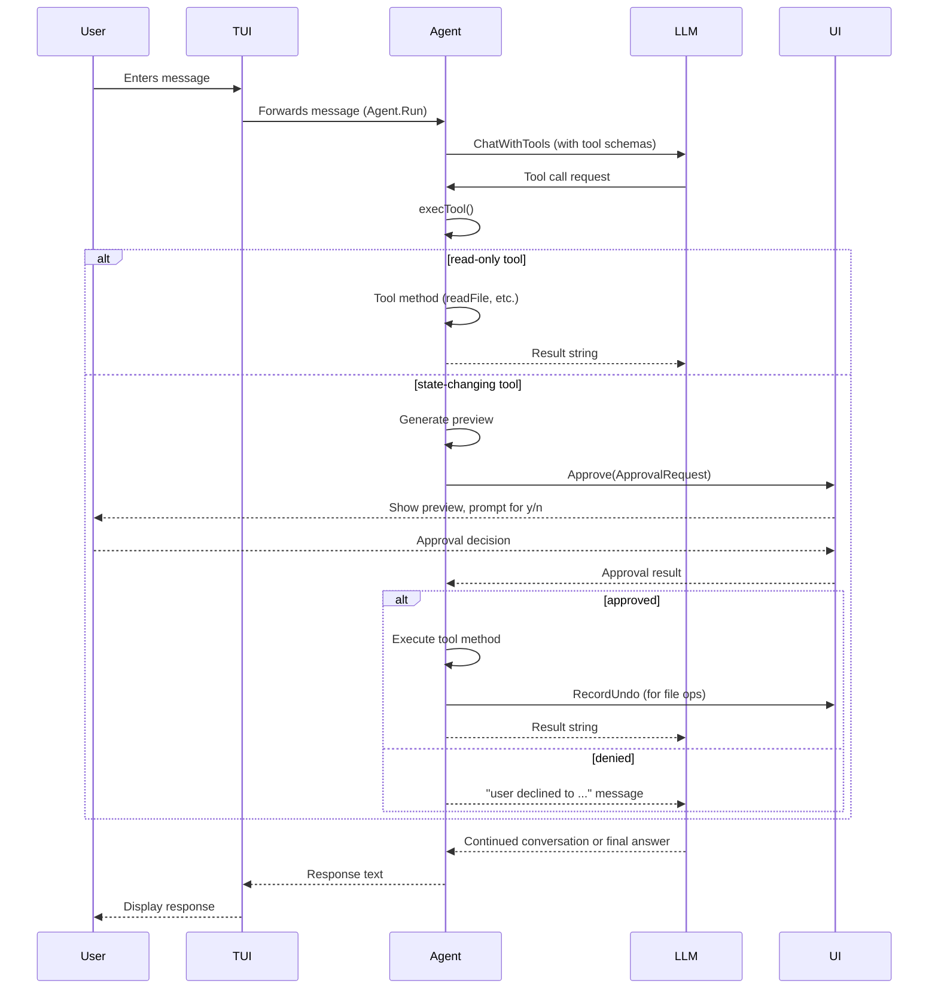

# Tool System: Definition, Execution, and Approval Workflow

The chat agent in Kaioken provides tools that enable LLMs to interact with the repository. Tools are categorized as read-only (safe) or state-changing (requiring approval). This document details the available tools, their execution flow, and the approval mechanism for state-changing operations.

## Table of Contents
- [Tool Definition](#tool-definition)
- [Tool Execution Flow](#tool-execution-flow)
- [Approval Workflow](#approval-workflow)
- [Tool Details](#tool-details)
  - [read_file](#read_file)
  - [edit_file](#edit_file)
  - [run_command](#run_command)
  - [Other Tools](#other-tools)
- [Data Flow and Components](#data-flow-and-components)
- [Referenced Files](#referenced-files)

## Tool Definition

The agent exposes tools via the `Tools()` method, returning a slice of `llm.Tool` schemas. Each tool defines its name, description, and JSON schema parameters.

`internal/agent/tools.go:68-127`
```go
func (a *Agent) Tools() []llm.Tool {
	tools := []llm.Tool{
		{Type: "function", Function: llm.FunctionDef{
			Name:        "read_file",
			Description: "Read a UTF-8 text file from the repository. Returns its contents.",
			Parameters: raw(`{"type":"object","properties":{
				"path":{"type":"string","description":"repo-relative file path"}},
				"required":["path"]}`),
		}},
		{Type: "function", Function: llm.FunctionDef{
			Name:        "list_files",
			Description: "List the immediate entries of a directory in the repository.",
			Parameters: raw(`{"type":"object","properties":{
				"path":{"type":"string","description":"repo-relative directory path, default '.'"}}}`),
		}},
		{Type: "function", Function: llm.FunctionDef{
			Name:        "search",
			Description: "Case-insensitive substring search across text files. Returns path:line matches.",
			Parameters: raw(`{"type":"object","properties":{
				"query":{"type":"string","description":"text to search for"}},
				"required":["query"]}`),
		}},
		{Type: "function", Function: llm.FunctionDef{
			Name: "read_knowledge",
			Description: "Read Kaioken's generated documentation for this repo (knowledge cards " +
				"and wiki chapters). Call with no argument to list what exists. Faster than " +
				"reading source when you need orientation on a subsystem.",
			Parameters: raw(`{"type":"object","properties":{
				"doc":{"type":"string","description":"a path from the catalog, e.g. '.kaioken/wiki/Architecture'; omit to list everything"}}}`),
		}},
		{Type: "function", Function: llm.FunctionDef{
			Name:        "write_file",
			Description: "Create or overwrite a file with the given content. Requires user approval.",
			Parameters: raw(`{"type":"object","properties":{
				"path":{"type":"string"},
				"content":{"type":"string"}},
				"required":["path","content"]}`),
		}},
		{Type: "function", Function: llm.FunctionDef{
			Name: "edit_file",
			Description: "Replace the first exact occurrence of old_string with new_string in a file. " +
				"old_string must match uniquely. Requires user approval.",
			Parameters: raw(`{"type":"object","properties":{
				"path":{"type":"string"},
				"old_string":{"type":"string"},
				"new_string":{"type":"string"}},
				"required":["path","old_string","new_string"]}`),
		}},
	}
	if a.AllowRun {
		tools = append(tools, llm.Tool{Type: "function", Function: llm.FunctionDef{
			Name:        "run_command",
			Description: "Run a shell command in the repo root and return its output. Requires user approval.",
			Parameters: raw(`{"type":"object","properties":{
				"command":{"type":"string","description":"the command line to execute"}},
				"required":["command"]}`),
		}})
	}
	return tools
}
```

**State-changing tools** (`write_file`, `edit_file`, `run_command`) require user approval. The `run_command` tool is only included if `Agent.AllowRun` is true.

## Tool Execution Flow

When the LLM requests a tool, the agent processes it through `execTool`:

1. Unmarshals tool call arguments into a map
2. Dispatches to the appropriate tool method based on function name
3. Returns result as string (errors included) for LLM consumption

`internal/agent/tools.go:133-167`
```go
func (a *Agent) execTool(ctx context.Context, tc llm.ToolCall) string {
	var args map[string]any
	if err := json.Unmarshal([]byte(tc.Function.Arguments), &args); err != nil {
		return "error: could not parse tool arguments: " + err.Error()
	}
	getStr := func(k string) string {
		if v, ok := args[k].(string); ok {
			return v
		}
		return ""
	}

	switch tc.Function.Name {
	case "read_file":
		return a.readFile(getStr("path"))
	case "list_files":
		p := getStr("path")
		if p == "" {
			p = "."
		}
		return a.listFiles(p)
	case "search":
		return a.search(getStr("query"))
	case "read_knowledge":
		return a.readKnowledge(getStr("doc"))
	case "write_file":
		return a.writeFile(getStr("path"), getStr("content"))
	case "edit_file":
		return a.editFile(getStr("path"), getStr("old_string"), getStr("new_string"))
	case "run_command":
		return a.runCommand(ctx, getStr("command"))
	default:
		return "error: unknown tool " + tc.Function.Name
	}
}
```

## Approval Workflow

State-changing tools trigger the approval process:
1. Tool method generates a preview (diff for file operations, command text for run_command)
2. Calls `a.approve(action, target, preview)`
3. If `AutoApprove` is false, prompts user via `UI.Approve()`
4. On approval, executes operation and records undo state
5. On denial, returns rejection message

`internal/agent/tools.go:363-368`
```go
func (a *Agent) approve(action, target, preview string) bool {
	if a.AutoApprove {
		return true
	}
	return a.UI.Approve(ApprovalRequest{Action: action, Target: target, Preview: preview})
}
```

The `ApprovalRequest` struct defines what's shown to the user:

`internal/agent/tools.go:26-30`
```go
// ApprovalRequest is shown to the user before a repo-changing action.
type ApprovalRequest struct {
	Action  string // "write", "edit", "run"
	Target  string // path or command
	Preview string // diff or command text
}
```

After approval, state-changing tools record undo information:

`internal/agent/tools.go:34-38`
```go
// UndoEntry captures a file's state just before a write_file/edit_file
// applied, so the front-end can offer /undo.
type UndoEntry struct {
	Path            string
	HadPrevious     bool // false means the file did not exist before (new file)
	PreviousContent string
}
```

## Tool Details

### read_file

Reads repository files with safety constraints:
- Confines operations to agent's `Root` directory via `resolve()`
- Truncates output at 100,000 bytes (`maxReadBytes`)
- Returns file contents or error message

`internal/agent/tools.go:184-197`
```go
func (a *Agent) readFile(path string) string {
	abs, err := a.resolve(path)
	if err != nil {
		return "error: " + err.Error()
	}
	data, err := os.ReadFile(abs)
	if err != nil {
		return "error: " + err.Error()
	}
	if len(data) > maxReadBytes {
		return string(data[:maxReadBytes]) + "\n… [truncated at 100KB]"
	}
	return string(data)
}
```

### edit_file

Performs unique string replacement with validation:
- Verifies `old_string` exists exactly once in file
- Shows unified diff preview via `hunkPreview()`
- On approval, replaces first occurrence and records undo state
- Returns success message or error

`internal/agent/tools.go:294-321`
```go
func (a *Agent) editFile(path, oldStr, newStr string) string {
	abs, err := a.resolve(path)
	if err != nil {
		return "error: " + err.Error()
	}
	data, err := os.ReadFile(abs)
	if err != nil {
		return "error: " + err.Error()
	}
	content := string(data)
	n := strings.Count(content, oldStr)
	if n == 0 {
		return "error: old_string not found in " + path
	}
	if n > 1 {
		return fmt.Sprintf("error: old_string matches %d times in %s; make it unique", n, path)
	}
	preview := hunkPreview(oldStr, newStr)
	if !a.approve("edit", path, preview) {
		return "user declined to edit " + path
	}
	updated := strings.Replace(content, oldStr, newStr, 1)
	if err := os.WriteFile(abs, []byte(updated), 0o644); err != nil {
		return "error: " + err.Error()
	}
	a.UI.RecordUndo(UndoEntry{Path: path, HadPrevious: true, PreviousContent: content})
	return "edited " + path
}
```

### run_command

Executes shell commands in repository root:
- Validates non-empty command
- Uses platform-appropriate shell (sh on Unix, powershell on Windows)
- Truncates output at 100,000 bytes
- Returns command output or error with exit status

`internal/agent/tools.go:334-360`
```go
func (a *Agent) runCommand(ctx context.Context, command string) string {
	if strings.TrimSpace(command) == "" {
		return "error: empty command"
	}
	if !a.approve("run", command, command) {
		return "user declined to run the command"
	}
	var cmd *exec.Cmd
	if runtime.GOOS == "windows" {
		cmd = exec.CommandContext(ctx, "powershell", "-NoProfile", "-Command", command)
	} else {
		cmd = exec.CommandContext(ctx, "sh", "-c", command)
	}
	cmd.Dir = a.Root
	out, err := cmd.CombinedOutput()
	result := string(out)
	if len(result) > maxReadBytes {
		result = result[:maxReadBytes] + "\n… [output truncated]"
	}
	if err != nil {
		return fmt.Sprintf("command exited with error: %v\n%s", err, result)
	}
	if strings.TrimSpace(result) == "" {
		return "(command produced no output)"
	}
	return result
}
```

### Other Tools

Additional read-only tools available:
- `list_files`: Lists directory contents (defaults to root)
- `search`: Case-insensitive substring search across text files (skips binary/excluded directories)
- `read_knowledge`: Accesses generated documentation (knowledge cards and wiki)

## Data Flow and Components

The tool system integrates with these components:



Key data flows:
1. **Tool Selection**: LLM chooses tool based on conversation context
2. **Argument Parsing**: JSON arguments unmarshaled into map
3. **Path Resolution**: `resolve()` ensures repo confinement
4. **Preview Generation**: 
   - File ops: `diffPreview()`/`hunkPreview()` show changes
   - Commands: Raw command text shown
5. **Approval Check**: `UI.Approve()` blocks until user response
6. **State Recording**: Successful file ops record `UndoEntry` for potential `/undo`
7. **Result Return**: Tool output (or error) returned as string to LLM

## Referenced Files
- internal/agent/tools.go

--- 
*Documentation based on source code inspection. All behaviors and limits are derived exclusively from the provided source.*

<!-- kaioken:files internal/agent/tools.go -->
