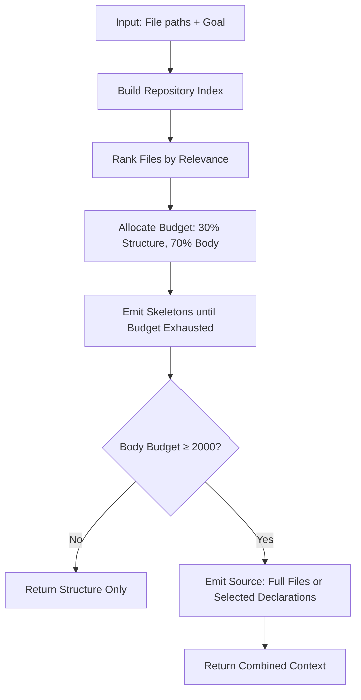
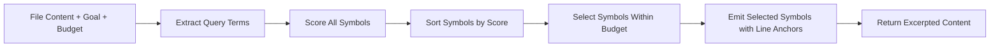

# Bundling Code for LLM Context

This chapter explains how kaioken selects and excerpts relevant code snippets for a given goal (e.g., a user query) within a token budget. The system uses the `codemap` package to build structural skeletons of files, ranks files by relevance to the goal, and allocates the token budget between emitting structural overviews and detailed source excerpts.

## Table of Contents
- [Overview](#overview)
- [Data Structures](#data-structures)
- [Building the Code Index](#building-the-code-index)
- [Ranking Files by Relevance](#ranking-files-by-relevance)
- [Bundling Strategy](#bundling-strategy)
- [Excerpting Symbols](#excerpting-symbols)
- [Referenced Files](#referenced-files)

## Overview

The bundling process occurs when the knowledge engine or chat agent needs to provide code context to an LLM. Given a set of file paths and a goal (e.g., a user query), the system:

1. Builds a structural skeleton for each file (showing declarations with line anchors)
2. Ranks files by relevance to the goal
3. Allocates budget: ~30% for structural skeletons, remainder for source details
4. Emits skeletons for as many files as budget allows
5. For remaining budget, emits either full file contents (for small files) or selected declarations (for large files) in relevance order

This ensures critical structural information is always visible while dedicating remaining tokens to the most relevant implementation details.

## Data Structures

The codemap package uses these core data structures:

### Symbol
Represents a single declaration in a source file.

```go
// Symbol is one declaration found in a file.
type Symbol struct {
	Name      string
	Kind      Kind
	Signature string // the declaration line, trimmed
	Line      int    // 1-indexed line of the declaration
	EndLine   int    // best-effort last line of the declaration body
	Exported  bool
	Receiver  string // for methods: the type it hangs off
	Doc       string // leading comment line, when present
}
```

### Kind
Classification of declarations.

| Constant | Value | Description |
|----------|-------|-------------|
| KindFunc | `"func"` | Function declaration |
| KindMethod | `"method"` | Method declaration |
| KindType | `"type"` | Type declaration |
| KindClass | `"class"` | Class declaration (OOP languages) |
| KindInterface | `"interface"` | Interface declaration |
| KindConst | `"const"` | Constant declaration |
| KindVar | `"var"` | Variable declaration |

### FileMap
Structural skeleton of one file.

```go
// FileMap is the skeleton of one file.
type FileMap struct {
	Path     string // repo-relative, slash-separated
	Lang     string // "go", "python", "javascript", …
	Package  string // package/module name where the language has one
	Imports  []string
	Symbols  []Symbol
	Lines    int
	Analyzed bool // false when the language is unsupported (data/config files)
}
```

### Index
Codemap for a whole repository.

```go
// Index is the codemap for a whole repository.
type Index struct {
	Root  string
	Files map[string]*FileMap // keyed by repo-relative slash path

	// symbols maps a symbol name to every file declaring it, for verification.
	symbols map[string][]string
}
```

### BundleOptions
Controls context assembly for bundling.

```go
// BundleOptions controls context assembly.
type BundleOptions struct {
	// Goal is what the document is about; it drives relevance ranking.
	Goal string
	// MaxTokens is the approximate total budget.
	MaxTokens int
	// SkeletonShare is the fraction of the budget reserved for skeletons.
	// Zero means the default.
	SkeletonShare float64
}
```

## Building the Code Index

Before bundling can occur, the system must build an index of the repository's structural skeletons. This happens in two phases:

### 1. File-Level Parsing (`Parse`)
The `Parse` function analyzes a single file's contents to extract declarations:

```go
// Parse builds a skeleton for one file's contents. Unsupported languages come
// back with Analyzed false rather than an error — a repo is full of JSON, YAML
// and markdown, and none of it should look like a failure.
func Parse(path, content string) *FileMap {
	fm := &FileMap{
		Path:  filepath.ToSlash(path),
		Lang:  Lang(path),
		Lines: strings.Count(content, "\n") + 1,
	}
	if fm.Lang == "" {
		return fm
	}
	fm.Analyzed = true
	switch fm.Lang {
	case "go":
		parseGo(fm, content)
	case "python":
		parsePython(fm, content)
	default:
		parseCLike(fm, content)
	}
	sort.SliceStable(fm.Symbols, func(i, j int) bool { return fm.Symbols[i].Line < fm.Symbols[j].Line })
	return fm
}
```

Language-specific parsers (`parseGo`, `parsePython`, `parseCLike`) populate the `Symbols` slice with `Symbol` structs containing:
- Declaration name and kind
- Trimmed signature line
- Line numbers (start and end)
- Export status (based on language conventions)
- Receiver (for methods)
- Leading comment (when present)

### 2. Repository-Level Indexing (`Build`)
The `Build` function processes all scanned files in parallel:

```go
// Build parses every scanned file into a skeleton, in parallel.
func Build(res *scan.Result) *Index {
	idx := &Index{
		Root:    res.Root,
		Files:   make(map[string]*FileMap, len(res.Files)),
		symbols: map[string][]string{},
	}
	var mu sync.Mutex
	g := new(errgroup.Group)
	g.SetLimit(8)

	for _, f := range res.Files {
		f := f
		if f.Size > maxParseBytes || Lang(f.Path) == "" {
			// Still record the file so path verification knows it exists.
			mu.Lock()
			idx.Files[f.Path] = &FileMap{Path: f.Path, Lang: Lang(f.Path), Lines: f.Lines}
			mu.Unlock()
			continue
		}
		g.Go(func() error {
			raw, err := os.ReadFile(filepath.Join(res.Root, filepath.FromSlash(f.Path)))
			if err != nil {
				return nil // an unreadable file is not fatal to the index
			}
			fm := Parse(f.Path, string(raw))
			mu.Lock()
			idx.Files[f.Path] = fm
			mu.Unlock()
			return nil
		})
	}
	_ = g.Wait()

	for path, fm := range idx.Files {
		for _, s := range fm.Symbols {
			idx.symbols[s.Name] = append(idx.symbols[s.Name], path)
		}
	}
	for name := range idx.symbols {
		sort.Strings(idx.symbols[name])
	}
	return idx
}
```

Key aspects:
- Files larger than `maxParseBytes` (2MB) or unsupported languages are recorded but not analyzed
- Parsing occurs in parallel with a worker limit of 8
- After parsing, builds a reverse index (`symbols`) mapping declaration names to files containing them
- Symbol lists per file are sorted for consistent output

## Ranking Files by Relevance

The `rank` function orders file paths by relevance to a goal string:

```go
// rank orders paths by relevance to goal, with manifests and entry points
// pulled forward — they orient everything else.
func (i *Index) rank(paths []string, goal string) []string {
	t := terms(goal)
	type scored struct {
		path  string
		score int
	}
	out := make([]scored, 0, len(paths))
	for _, p := range paths {
		fm := i.Files[p]
		s := -filePriority(p) * 10 // lower priority number = earlier
		s += scoreText(p, t) * 3   // a path match is a strong signal
		if fm != nil {
			for _, sym := range fm.Symbols {
				s += scoreText(sym.Name+" "+sym.Doc, t)
			}
			s += len(fm.Exported())
		}
		out = append(out, scored{p, s})
	}
	sort.SliceStable(out, func(a, b int) bool {
		if out[a].score != out[b].score {
			return out[a].score > out[b].score
		}
		return out[a].path < out[b].path
	})
	ranked := make([]string, len(out))
	for n, s := range out {
		ranked[n] = s.path
	}
	return ranked
}
```

### Ranking Components

1. **File Priority** (`filePriority`): Assigns base scores based on file characteristics:
   - Priority 0: Manifests (`package.json`, `go.mod`, `README.md`, etc.)
   - Priority 1: Entry points (`main.go`, `app.py`, `index.ts`, etc.)
   - Priority 2: Model/schema/entity files
   - Priority 3: Router/controller/handler/endpoint files
   - Priority 5: Default (most files)
   - Priority 9: Test files (lowest priority)

2. **Goal Term Matching**:
   - Path matches: weighted 3x
   - Symbol name and doc matches: weighted 1x
   - Exported symbol count: adds 1 per exported symbol

3. **Term Extraction** (`terms`):
   - Converts goal to lowercase
   - Splits on non-alphanumeric characters
   - Filters out stopwords (common words like "the", "and", "explain")
   - Keeps terms longer than 2 characters

4. **Scoring** (`scoreText`):
   - Counts how many query terms appear in the text (case-insensitive)

Files are sorted by:
1. Descending score (higher = more relevant)
2. Ascending path (for deterministic ordering)

## Bundling Strategy

The `Bundle` function assembles prompt context according to a two-part budget allocation:

```go
// Bundle assembles prompt context for a set of repo-relative paths.
func (i *Index) Bundle(paths []string, opt BundleOptions) string {
	if opt.MaxTokens <= 0 {
		opt.MaxTokens = 30000
	}
	share := opt.SkeletonShare
	if share <= 0 || share >= 1 {
		share = defaultSkeletonShare
	}
	total := opt.MaxTokens * charsPerToken
	skeletonBudget := int(float64(total) * share)

	ranked := i.rank(paths, opt.Goal)

	var b strings.Builder
	b.WriteString("===== STRUCTURE: every file in scope, with line anchors =====\n")
	b.WriteString("(Use these anchors when citing code, e.g. path/file.go:42-58.)\n\n")

	used, skipped := 0, 0
	for _, p := range ranked {
		fm, ok := i.Files[p]
		if !ok {
			continue
		}
		sk := fm.Skeleton()
		if used+len(sk) > skeletonBudget && used > 0 {
			skipped++
			continue
		}
		b.WriteString(sk)
		b.WriteString("\n")
		used += len(sk)
	}
	if skipped > 0 {
		fmt.Fprintf(&b, "[%d further files in scope, structure omitted for length]\n\n", skipped)
	}

	// ---- full source, most relevant first ----
	bodyBudget := total - used
	if bodyBudget < 2000 {
		return b.String()
	}
	b.WriteString("\n===== SOURCE =====\n\n")

	bodyUsed, partial, omitted := 0, 0, 0
	for _, p := range ranked {
		if bodyUsed >= bodyBudget {
			omitted++
			continue
		}
		abs := filepath.Join(i.Root, filepath.FromSlash(p))
		raw, err := os.ReadFile(abs)
		if err != nil {
			continue
		}
		content := string(raw)
		room := bodyBudget - bodyUsed

		if len(content) <= room {
			fmt.Fprintf(&b, "===== %s =====\n%s\n\n", p, content)
			bodyUsed += len(content)
			continue
		}

		// Too big for what is left: contribute whole declarations instead of a
		// byte slice, so every excerpt is syntactically complete.
		fm := i.Files[p]
		if fm == nil || !fm.Analyzed || len(fm.Symbols) == 0 {
			omitted++
			continue
		}
		excerpt := fm.excerptSymbols(content, opt.Goal, room)
		if excerpt == "" {
			omitted++
			continue
		}
		fmt.Fprintf(&b, "===== %s (selected declarations; full structure above) =====\n%s\n\n", p, excerpt)
		bodyUsed += len(excerpt)
		partial++
	}
	if partial > 0 {
		fmt.Fprintf(&b, "[%d file(s) contributed selected declarations rather than full text]\n", partial)
	}
	if omitted > 0 {
		fmt.Fprintf(&b, "[%d file(s) omitted from SOURCE; their structure is listed above]\n", omitted)
	}
	return b.String()
}
```

### Budget Allocation
- Total budget: `MaxTokens * charsPerToken` (4 characters per token)
- Structure budget: `total * SkeletonShare` (defaults to 30%)
- Body budget: remaining tokens after structure emission

### Emission Phases

1. **Structure Emission**:
   - Processes files in ranked order
   - Emits each file's skeleton (via `FileMap.Skeleton()`)
   - Stops when adding another skeleton would exceed budget
   - Reports number of skipped files

2. **Source Emission**:
   - Only proceeds if body budget ≥ 2000 characters
   - For each file in ranked order:
     - If full content fits: emit entire file
     - Else if file is analyzable: emit selected declarations via `excerptSymbols`
     - Else: omit file (but its structure was already emitted)
   - Reports counts of:
     - Files contributing selected declarations (`partial`)
     - Files omitted from source (`omitted`)

## Excerpting Symbols

When a file is too large for the remaining body budget, `excerptSymbols` selects the most relevant declarations:

```go
// excerptSymbols emits whole declarations from a file, most relevant to goal
// first, within a character budget. Each excerpt carries its line anchor.
func (f *FileMap) excerptSymbols(content, goal string, budget int) string {
	lines := strings.Split(content, "\n")
	terms := terms(goal)

	type scored struct {
		sym   Symbol
		score int
	}
	ranked := make([]scored, 0, len(f.Symbols))
	for _, s := range f.Symbols {
		sc := scoreText(s.Name+" "+s.Signature+" "+s.Doc, terms)
		if s.Exported {
			sc += 2 // the public surface is what documentation is about
		}
		ranked = append(ranked, scored{s, sc})
	}
	sort.SliceStable(ranked, func(a, b int) bool { return ranked[a].score > ranked[b].score })

	// Emit in file order for readability, but choose by score.
	chosen := map[int]bool{}
	used := 0
	for _, r := range ranked {
		start, end := r.sym.Span()
		if start < 1 || start > len(lines) {
			continue
		}
		if end > len(lines) {
			end = len(lines)
		}
		size := 0
		for i := start - 1; i < end; i++ {
			size += len(lines[i]) + 1
		}
		if used+size > budget {
			continue
		}
		chosen[r.sym.Line] = true
		used += size
	}
	if len(chosen) == 0 {
		return ""
	}

	var b strings.Builder
	for _, s := range f.Symbols {
		if !chosen[s.Line] {
			continue
		}
		start, end := s.Span()
		if start < 1 || start > len(lines) {
			continue
		}
		if end > len(lines) {
			end = len(lines)
		}
		fmt.Fprintf(&b, "--- %s:%d-%d ---\n", f.Path, start, end)
		b.WriteString(strings.Join(lines[start-1:end], "\n"))
		b.WriteString("\n\n")
	}
	return b.String()
}
```

### Process
1. **Score Symbols**:
   - For each symbol, score based on goal term matches in:
     - Symbol name
     - Signature line
     - Doc comment
   - Add 2 points for exported symbols (public surface is prioritized)

2. **Select Within Budget**:
   - Sort symbols by descending score
   - Select symbols in score order until adding another would exceed character budget
   - Track selected symbols by line number to avoid duplicates

3. **Emit with Line Anchors**:
   - For each selected symbol (in file order for readability):
     - Emit header: `--- <filepath>:<startLine>-<endLine> ---`
     - Emit the symbol's full source lines
     - Add blank line separation

This ensures:
- Every excerpt is syntactically complete (whole declarations)
- Most relevant declarations appear first
- Each excerpt includes precise line anchors for verification
- Export status boosts relevance (documentation focuses on public APIs)

## Mermaid Diagrams

### Bundling Workflow


### ExcerptSymbols Workflow


## Referenced Files
- internal/codemap/codemap.go
- internal/codemap/index.go
- internal/codemap/bundle.go

This chapter has covered the complete bundling mechanism used by kaioken to provide LLM-contextual code snippets, from structural indexing to relevance-based excerpting within token constraints. All exported declarations from the provided STRUCTURE block have been documented, with internal helpers explained where they contribute to the core functionality.

<!-- kaioken:files internal/codemap/bundle.go,internal/codemap/index.go,internal/codemap/codemap.go -->
