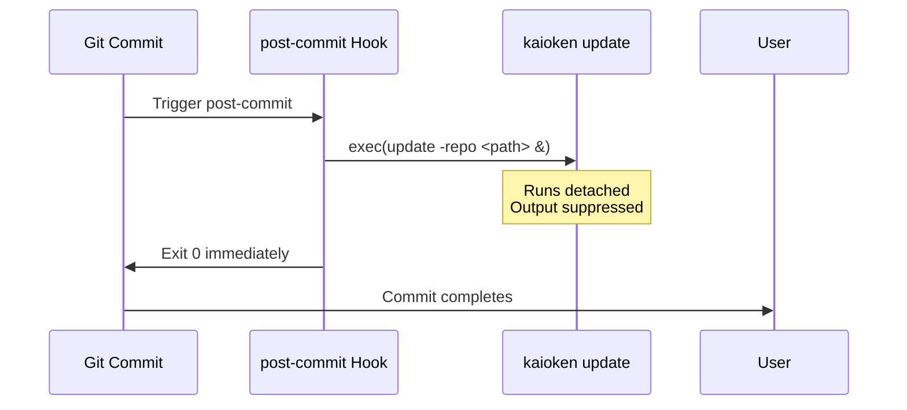

# Automatic Update Hooks

This chapter describes how kaioken installs, verifies, and removes post-commit Git hooks to automatically trigger wiki updates after commits. The hook system ensures the generated documentation stays current by running `kaioken update` in the background following each commit, without delaying the commit operation.

## Table of Contents
- [Overview](#overview)
- [Hook Installation](#hook-installation)
- [Hook Verification](#hook-verification)
- [Hook Removal](#hook-removal)
- [Internal Mechanics](#internal-mechanics)
- [Referenced Files](#referenced-files)

## Overview

Kaioken's automatic update system uses Git's post-commit hook mechanism. When installed, the hook executes a background process that runs `kaioken update -repo <repository-path>` after every commit. This keeps the generated wiki synchronized with repository changes.

The hook installer writes a clearly delimited block within the hook file to allow safe installation, updates, and removal without interfering with existing hook content. The block uses unique start and end markers (`# >>> kaioken >>>` and `# <<< kaioken <<<`) to identify kaioken's portion.

Git executes hooks via `/bin/sh` even on Windows, so paths are normalized to forward slashes and wrapped in single quotes to prevent shell interpretation issues.

## Hook Installation

The `InstallPostCommit` function installs or refreshes kaioken's post-commit hook. It performs the following steps:

1. Validates the repository path using an external `IsRepo` check (not shown in this file)
2. Determines the absolute path to the `.git/hooks/post-commit` file via `HookPath`
3. Creates the hooks directory if needed (permissions 0755)
4. Reads any existing hook content
5. Constructs kaioken's hook block using `hookBlock`
6. Merges the new block with existing content:
   - If no hook exists: creates a new file with shebang and kaioken block
   - If kaioken's block exists: replaces it in-place (preserving other content)
   - Otherwise: appends kaioken block after existing content
7. Writes the combined content back to the hook file (permissions 0755)

The hook block contains:
- Start marker (`# >>> kaioken >>>`)
- Explanatory comments
- The update command: `<kaioken-executable> update -repo <absolute-repo-path> >/dev/null 2>&1 &`
- End marker (`# <<< kaioken <<<`)

The command runs detached (`&`) with output suppressed to avoid delaying commits.

```
`git hook execution delays or output interference.

`internal/gitx/hook.go:56-63`
```go
func PostCommitInstalled(repo string) bool {
	path, err := HookPath(repo)
	if err != nil {
		return false
	}
	raw, err := os.ReadFile(path)
	return err == nil && strings.Contains(string(raw), hookStart)
}
```

`internal/gitx/hook.go:67-106`
```go
func InstallPostCommit(repo, exe string) (path string, err error) {
	if !IsRepo(repo) {
		return "", fmt.Errorf("%s is not a git repository", repo)
	}
	path, err = HookPath(repo)
	if err != nil {
		return "", err
	}
	if err := os.MkdirAll(filepath.Dir(path), 0o755); err != nil {
		return "", err
	}
	// Record an absolute repo path: git runs hooks from the repository root,
	// but a relative path recorded here would break for worktrees and for
	// anyone invoking the hook from elsewhere.
	if abs, aerr := filepath.Abs(repo); aerr == nil {
		repo = abs
	}

	existing := ""
	if raw, rerr := os.ReadFile(path); rerr == nil {
		existing = string(raw)
	}

	block := hookBlock(exe, repo)
	var out string
	switch {
	case existing == "":
		out = shebang + "\n\n" + block + "\n"
	case strings.Contains(existing, hookStart):
		// Refresh in place so the exe/repo path stays correct after a move.
		out = replaceBlock(existing, block)
	default:
		out = strings.TrimRight(existing, "\n") + "\n\n" + block + "\n"
	}
	// 0755: git only runs hooks that are executable.
	if err := os.WriteFile(path, []byte(out), 0o755); err != nil {
		return "", err
	}
	return path, nil
}
```

## Hook Verification

The `PostCommitInstalled` function checks whether kaioken's hook block exists in the post-commit hook file. It:
1. Resolves the hook path via `HookPath`
2. Reads the hook file contents
3. Returns `true` only if the file is readable and contains the `hookStart` marker

This function returns `false` for any error (including missing file) or when the marker is absent.

`internal/gitx/hook.go:56-63`
```go
func PostCommitInstalled(repo string) bool {
	path, err := HookPath(repo)
	if err != nil {
		return false
	}
	raw, err := os.ReadFile(path)
	return err == nil && strings.Contains(string(raw), hookStart)
}
```

## Hook Removal

The `RemovePostCommit` function removes kaioken's block from the post-commit hook while preserving other hook content. It:
1. Resolves the hook path via `HookPath`
2. Reads the hook file contents
3. Returns `(false, nil)` if the kaioken marker is absent
4. Otherwise:
   - Removes the kaioken block using `replaceBlock`
   - Trims whitespace from the result
   - If only the shebang (`#!/bin/sh`) or nothing remains: deletes the hook file
   - Otherwise: writes the trimmed content back to the hook file (permissions 0755)
5. Returns `(true, nil)` on success

This approach ensures non-kaioken hook content remains intact.

`internal/gitx/hook.go:110-133`
```go
func RemovePostCommit(repo string) (removed bool, err error) {
	path, err := HookPath(repo)
	if err != nil {
		return false, err
	}
	raw, err := os.ReadFile(path)
	if err != nil {
		if os.IsNotExist(err) {
			return false, nil
		}
		return false, err
	}
	body := string(raw)
	if !strings.Contains(body, hookStart) {
		return false, nil
	}
	stripped := strings.TrimSpace(replaceBlock(body, ""))

	// Nothing but the shebang left: the file was ours alone.
	if stripped == "" || stripped == shebang {
		return true, os.Remove(path)
	}
	return true, os.WriteFile(path, []byte(stripped+"\n"), 0o755)
}
```

## Internal Mechanics

Several helper functions support the hook lifecycle:

### Path Resolution
`HookPath` determines the absolute path to the post-commit hook by:
1. Running `git rev-parse --absolute-git-dir` to find the `.git` directory (handling worktrees correctly)
2. Appending `/hooks/post-commit` to that path

`internal/gitx/hook.go:24-30`
```go
func HookPath(repo string) (string, error) {
	out, err := run(context.Background(), repo, "rev-parse", "--absolute-git-dir")
	if err != nil {
		return "", err
	}
	return filepath.Join(strings.TrimSpace(out), "hooks", "post-commit"), nil
}
```

### Block Construction
`hookBlock` generates kaioken's hook script content:
- Start marker
- Explanatory comments about background execution and removal
- The update command with properly quoted executable and repository paths
- End marker

`internal/gitx/hook.go:36-44`
```go
func hookBlock(exe, repo string) string {
	return strings.Join([]string{
		hookStart,
		"# Refresh the generated wiki against this commit. Runs detached so it",
		"# never delays a commit; remove with `kaioken hook remove`.",
		fmt.Sprintf(`%s update -repo %s >/dev/null 2>&1 &`, shellQuote(exe), shellQuote(repo)),
		hookEnd,
	}, "\n")
}
```

### Path Quoting
`shellQuote` ensures paths are safe for `/bin/sh` by:
1. Converting path separators to forward slashes (`filepath.ToSlash`)
2. Wrapping the path in single quotes
3. Escaping any internal single quotes using the `'\''` technique (close quote, escaped quote, reopen quote)

This approach works because sh performs no escape processing inside single quotes.

`internal/gitx/hook.go:48-53`
```go
func shellQuote(p string) string {
	p = filepath.ToSlash(p)
	// The only character single quotes cannot contain is a single quote; the
	// usual idiom closes the string, emits an escaped quote, and reopens.
	return "'" + strings.ReplaceAll(p, "'", `'\''") + "'"
}
```

### Block Replacement
`replaceBlock` handles inserting, updating, or removing kaioken's delimited block:
1. Locates the start marker (`hookStart`)
2. If not found: returns original body unchanged
3. Locates the end marker (`hookEnd`) after the start
4. If end marker not found: treats as truncated block (removes everything from start marker onward)
5. Otherwise:
   - For empty replacement: returns content before start + content after end (with newline handling)
   - For non-empty replacement: returns content before start + replacement + content after end

This preserves surrounding hook content while managing kaioken's block.

`internal/gitx/hook.go:137-154`
```go
func replaceBlock(body, replacement string) string {
	start := strings.Index(body, hookStart)
	if start == -1 {
		return body
	}
	end := strings.Index(body[start:], hookEnd)
	if end == -1 {
		// Truncated block: drop everything from the marker on rather than
		// leaving a half-written script behind.
		return strings.TrimRight(body[:start], "\n") + "\n" + replacement
	}
	tail := body[start+end+len(hookEnd):]
	head := body[:start]
	if replacement == "" {
		return strings.TrimRight(head, "\n") + "\n" + strings.TrimLeft(tail, "\n")
	}
	return head + replacement + tail
}
```

## Mermaid Diagrams

### Hook Installation Flow
```mermaid
flowchart TD
    A[InstallPostCommit(repo, exe)] --> B{IsRepo(repo)?}
    B -->|No| C[Return error: not a git repo]
    B -->|Yes| D[HookPath(repo)]
    D --> E[Create hooks dir if needed]
    E --> F[Read existing hook content]
    F --> G{Existing content empty?}
    G -->|Yes| H[New file: shebang + block]
    G -->|No| I{Contains hookStart?}
    I -->|Yes| J[Replace existing block]
    I -->|No| K[Append block after existing]
    H --> L[Write file (0755)]
    J --> L
    K --> L
    L --> M[Return hook path]
```

### Hook Execution Flow


## Referenced Files
- internal/gitx/hook.go

This chapter covers all declarations in `internal/gitx/hook.go` as defined in the structure block. No other files are in scope for this documentation.

<!-- kaioken:files internal/gitx/hook.go -->
