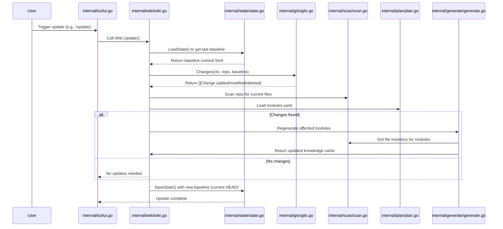

# Detecting Changes Since Last Build

This chapter describes the `Changes` function in the `gitx` package, which identifies added, deleted, and modified files since the last wiki build by comparing the current working tree against a baseline commit. It explains how this function enables incremental wiki updates in Kaioken.

## Table of Contents
- [The Change Struct](#the-change-struct)
- [The Changes Function](#the-changes-function)
- [Supporting Functions](#supporting-functions)
- [Other Gitx Functions](#other-gitx-functions)
- [How Changes is Used in Incremental Updates](#how-changes-is-used-in-incremental-updates)
- [Error Handling](#error-handling)
- [Referenced Files](#referenced-files)

## The Change Struct

The `Change` struct represents a single file change between a baseline and the current working tree. It captures both the status of the change and the file path.

`internal/gitx/gitx.go:17-20`
```go
type Change struct {
	Status string // A added, M modified, D deleted, R renamed, ? untracked
	Path   string // repo-relative, slash-separated
}
```

The `Status` field uses Git's `--name-status` codes:
- `A`: Added
- `M`: Modified
- `D`: Deleted
- `R`: Renamed (though `--no-renames` is used in `Changes`, so this may not appear)
- `?`: Untracked (added separately via `ls-files`)

The `Path` field stores the repository-relative path with forward slashes, normalized by `filepath.ToSlash`.

### Change Methods

Two methods provide behavioral insights:

`internal/gitx/gitx.go:22`
```go
func (c Change) String() string { return c.Status + " " + c.Path }
```
Returns a human-readable string like `"M src/main.go"`.

`internal/gitx/gitx.go:25`
```go
func (c Change) Deleted() bool { return c.Status == "D" }
```
Checks if the change represents a deletion (useful for filtering removed files).

## The Changes Function

`Changes` is the core function for detecting modifications since a baseline. It returns all differences between a given baseline commit and the current working tree, including staged, unstaged, and untracked files.

`internal/gitx/gitx.go:79-118`
```go
// Changes lists every path that differs between base and the CURRENT WORKING
// TREE — committed, staged, unstaged and untracked alike. That is deliberately
// wider than `base..HEAD`: documentation should describe the code on disk, not
// only what has been committed.
func Changes(ctx context.Context, repo, base string) ([]Change, error) {
	out, err := run(ctx, repo, "diff", "--name-status", "--no-renames", base)
	if err != nil {
		return nil, err
	}
	seen := map[string]bool{}
	var changes []Change
	for _, line := range strings.Split(out, "\n") {
		line = strings.TrimSpace(line)
		if line == "" {
			continue
		}
		parts := strings.Fields(line)
		if len(parts) < 2 {
			continue
		}
		p := filepath.ToSlash(parts[len(parts)-1])
		if seen[p] {
			continue
		}
		seen[p] = true
		changes = append(changes, Change{Status: string(parts[0][0]), Path: p})
	}

	// Untracked files never show up in `git diff`, but a brand-new source file
	// is exactly the kind of thing the wiki must learn about.
	untracked, err := run(ctx, repo, "ls-files", "--others", "--exclude-standard")
	if err != nil {
		return changes, nil // diff already succeeded; don't fail the whole run
	}
	for _, line := range strings.Split(untracked, "\n") {
		p := filepath.ToSlash(strings.TrimSpace(line))
		if p == "" || seen[p] {
			continue
		}
		seen[p] = true
		changes = append(changes, Change{Status: "?", Path: p})
	}
	return changes, nil
}
```

### How It Works

1. **Git Diff for Tracked Changes**:  
   Executes `git diff --name-status --no-renames <base>` to list changes in tracked files.  
   - `--name-status`: Outputs status code and path (e.g., `M\tsrc/main.go`)  
   - `--no-renames`: Prevents rename detection (simplifies to show delete/add pairs)  
   - The base can be any revision (commit SHA, tag, or expression like `HEAD~5`)

2. **Parsing Diff Output**:  
   Each non-empty line is split into fields. The first character of the status field (e.g., `M` from `M`) determines the change type. The last field is the path (handling paths with spaces). Paths are normalized to use forward slashes.

3. **Deduplication**:  
   A `seen` map prevents duplicate entries (though Git's output shouldn't produce duplicates for the same path).

4. **Adding Untracked Files**:  
   Executes `git ls-files --others --exclude-standard` to find untracked files not ignored by `.gitignore`. Each is added as a change with status `?`.

5. **Error Handling**:  
   - If the `git diff` command fails, the error is returned immediately.  
   - If `git ls-files` fails (e.g., due to a corrupt index), the function returns the changes from `diff` and ignores the error, as the diff results are still valuable.

### Change Status Table

| Status | Meaning          | Source Command       |
|--------|------------------|----------------------|
| A      | Added            | `git diff`           |
| M      | Modified         | `git diff`           |
| D      | Deleted          | `git diff`           |
| R      | Renamed          | `git diff` (with renames enabled, but disabled here) |
| ?      | Untracked        | `git ls-files`       |

Note: With `--no-renames`, renames appear as a delete (`D`) and add (`A`) pair.

## Supporting Functions

Several unexported and exported helpers support `Changes` and other `gitx` operations.

### Low-Level Git Execution

`internal/gitx/gitx.go:28-41`
```go
// run executes a git subcommand inside repo and returns trimmed stdout.
func run(ctx context.Context, repo string, args ...string) (string, error) {
	full := append([]string{"-C", repo}, args...)
	cmd := exec.CommandContext(ctx, "git", full...)
	var out, errb bytes.Buffer
	cmd.Stdout, cmd.Stderr = &out, &errb
	if err := cmd.Run(); err != nil {
		msg := strings.TrimSpace(errb.String())
		if msg == "" {
			msg = err.Error()
		}
		return "", fmt.Errorf("git %s: %s", strings.Join(args, " "), msg)
	}
	return strings.TrimRight(out.String(), "\r\n"), nil
}
```
- Runs `git` in the specified repository directory (`-C <repo>`)  
- Captures stdout and stderr separately  
- On error, returns a formatted error including the git command and stderr (or the error message if stderr is empty)  
- Strips trailing carriage returns and newlines from stdout  

### Repository Validation

`internal/gitx/gitx.go:44-47`
```go
// IsRepo reports whether repo sits inside a git work tree (and git is on PATH).
func IsRepo(repo string) bool {
	out, err := run(context.Background(), repo, "rev-parse", "--is-inside-work-tree")
	return err == nil && strings.TrimSpace(out) == "true"
}
```
- Checks if a directory is part of a Git work tree  
- Used by callers to validate before invoking other Git operations  

### Commit Reference Resolution

`internal/gitx/gitx.go:50-52`
```go
// Head returns the current commit SHA.
func Head(ctx context.Context, repo string) (string, error) {
	return run(ctx, repo, "rev-parse", "HEAD")
}
```
- Gets the SHA of the current HEAD commit  

`internal/gitx/gitx.go:55-60`
```go
// Short abbreviates a SHA for display.
func Short(sha string) string {
	if len(sha) > 8 {
		return sha[:8]
	}
	return sha
}
```
- Truncates a SHA to 8 characters for UI display  

`internal/gitx/gitx.go:64-66`
```go
// Resolve turns a revision expression (a SHA, "HEAD~5", a tag) into a commit
// SHA, and errors if it does not name a commit in this repo.
func Resolve(ctx context.Context, repo, rev string) (string, error) {
	return run(ctx, repo, "rev-parse", "--verify", rev+"^{commit}")
}
```
- Resolves symbolic revisions (like `HEAD~5` or a tag) to a commit SHA  
- The `^{commit}` suffix ensures it points to a commit object (not a tag object)  

`internal/gitx/gitx.go:70-73`
```go
// HasCommit reports whether rev still resolves here — a baseline recorded on a
// branch that was since rebased or from a different clone will not.
func HasCommit(ctx context.Context, repo, rev string) bool {
	_, err := Resolve(ctx, repo, rev)
	return err == nil
}
```
- Checks if a revision (e.g., a previously recorded baseline) is still reachable in the repository  
- Used to detect if the baseline was rewritten (e.g., by rebasing)  

## Other Gitx Functions

While not directly used for change detection, these functions support related Git operations in Kaioken.

### Generating Patches

`internal/gitx/gitx.go:122-136`
```go
// Patch returns the unified diff from base to the working tree, restricted to
// paths (all paths when empty) and truncated to maxBytes.
func Patch(ctx context.Context, repo, base string, paths []string, maxBytes int) (string, error) {
	args := []string{"diff", "--no-color", "--no-renames", "--unified=3", base}
	if len(paths) > 0 {
		args = append(args, "--")
		args = append(args, paths...)
	}
	out, err := run(ctx, repo, args...)
	if err != nil {
		return "", err
	}
	if maxBytes > 0 && len(out) > maxBytes {
		out = out[:maxBytes] + "\n… [diff truncated]"
	}
	return out, nil
}
```
- Produces a unified diff (like `git diff -u`) between `base` and working tree  
- Can limit to specific paths and truncate output to `maxBytes`  
- Used for showing file changes in the UI  

### Listing Commit Subjects

`internal/gitx/gitx.go:140-153`
```go
// Subjects lists commit subjects in base..HEAD, newest first, capped at limit.
// It returns nothing when the only changes are uncommitted.
func Subjects(ctx context.Context, repo, base string, limit int) ([]string, error) {
	out, err := run(ctx, repo, "log", "--no-decorate", "--pretty=format:%h %s",
		fmt.Sprintf("-n%d", limit), base+"..HEAD")
	if err != nil {
		return nil, err
	}
	var subjects []string
	for _, l := range strings.Split(out, "\n") {
		if l = strings.TrimSpace(l); l != "" {
			subjects = append(subjects, l)
		}
	}
	return subjects, nil
}
```
- Lists commit messages (subjects) between `base` and `HEAD`  
- Format: abbreviated SHA followed by subject line  
- Returns empty if no new commits (only uncommitted changes exist)  

## How Changes is Used in Incremental Updates

The `Changes` function is central to Kaioken's incremental wiki update flow. During an update operation (triggered by `kaioken update` or the `/update` TUI command):

1. The `state` package loads the last build state, which includes the baseline commit SHA recorded after the previous wiki generation.  
2. `gitx.Changes` is called with this baseline to compute all changes in the working tree since that commit.  
3. The wiki package analyzes these changes to determine which knowledge cards and sections require regeneration.  
4. Only invalidated documentation is rebuilt, preserving unchanged sections.

This flow avoids full repository rescans and leverages Git's efficiency to detect modifications.

### Sequence Diagram: Update Flow



## Error Handling

The `Changes` function handles errors as follows:

- **Git Command Failure**: If `git diff` fails (e.g., invalid baseline, not a Git repo), the function returns the error immediately. Callers (like `wiki.Update`) must handle this—typically by logging and aborting the update.  
- **Partial Failure**: If `git ls-files` fails after a successful `git diff`, the function returns the changes from `diff` and ignores the `ls-files` error. This ensures that tracked file changes are still reported even if untracked file detection fails (e.g., due to a corrupt index). The untracked files will be picked up in the next update.  
- **Context Cancellation**: The `run` function respects the provided `context.Context`, allowing callers to timeout or cancel long-running Git operations (though Git operations are typically fast).  

All errors from `run` wrap the underlying Git error with context about the failed command (e.g., `"git diff --name-status --no-renames abc123: exit status 128"`).

## Referenced Files

- internal/gitx/gitx.go

This chapter covered the `Changes` function, its supporting types and helpers, and its role in incremental wiki updates. All exported declarations from the `gitx` package are documented either directly or in functional categories.

<!-- kaioken:files internal/gitx/gitx.go -->
