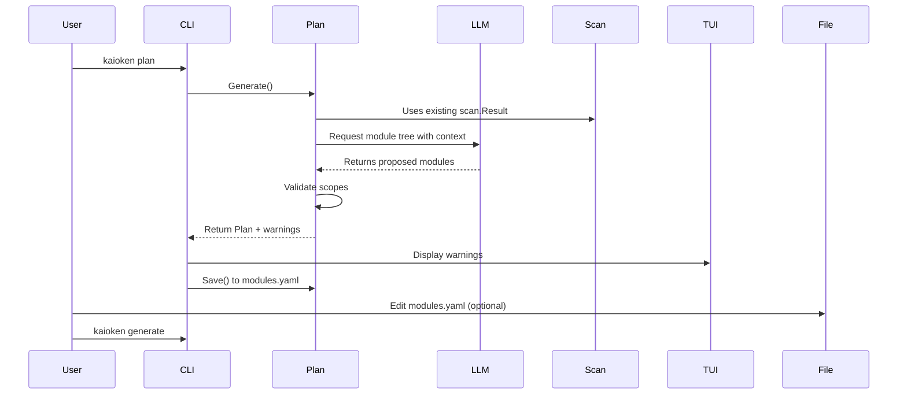

# Module Planning

This chapter describes how Kaioken uses an LLM to propose logical modules for a repository and validates the plan against scanned files. The planning phase produces `modules.yaml`, which serves as a human-editable checkpoint before knowledge card generation.

## Table of Contents
- [Module Planning Overview](#module-planning-overview)
- [Data Structures](#data-structures)
- [The Planning Process](#the-planning-process)
- [Validation](#validation)
- [File Resolution](#file-resolution)
- [Persistence](#persistence)
- [Integration with Knowledge Engine](#integration-with-knowledge-engine)
- [Referenced Files](#referenced-files)

## Module Planning Overview

The planning phase (`kaioken plan` command) takes a scanned repository inventory and asks an LLM to propose a hierarchical module structure. Each module represents a cohesive unit of functionality that will receive its own knowledge card. The output is saved to `.ainow/modules.yaml` (or `.kaioken/modules.yaml` depending on configuration) for user review and editing before proceeding to generation.

The process involves:
1. Using the existing scan result (file inventory) as context for the LLM
2. Asking the LLM to generate a module tree with IDs, titles, descriptions, and file scopes
3. Validating that all scoped files actually exist in the scan result
4. Returning the plan for persistence and user editing

## Data Structures

The planning logic centers around three core data structures defined in `internal/plan/plan.go`.

### Module

`internal/plan/plan.go:22-28`

```go
// Module is one knowledge unit: a cohesive part of the codebase that gets its
// own card set. Scope entries are repo-relative files or directory prefixes.
type Module struct {
	ID          string   `yaml:"id" json:"id"`
	Title       string   `yaml:"title" json:"title"`
	Description string   `yaml:"description" json:"description"`
	Scope       []string `yaml:"scope" json:"scope"`
	Children    []Module `yaml:"children,omitempty" json:"children,omitempty"`
}
```

A `Module` represents a node in the module tree. Key fields:
- `ID`: Short snake_case identifier (e.g., `api`, `auth_middleware`)
- `Title`: Human-readable name for the module
- `Description`: One-sentence summary of the module's purpose
- `Scope`: List of repo-relative file paths or directory prefixes belonging to this module
- `Children`: Submodules for hierarchical organization

### Plan

`internal/plan/plan.go:31-34`

```go
// Plan is the persisted module tree.
type Plan struct {
	Version int      `yaml:"version"`
	Modules []Module `yaml:"modules"`
}
```

The `Plan` struct represents the entire module hierarchy. It contains:
- `Version`: Schema version (currently hardcoded to 1)
- `Modules`: Root-level modules in the tree

### FlatModule

`internal/plan/plan.go:92-95`

```go
// FlatModule pairs a module with its full hierarchical id.
type FlatModule struct {
	ID string
	Module
}
```

`FlatModule` is a helper type used during validation and file resolution. It combines:
- `ID`: The full hierarchical ID (e.g., `backend/api/routes`)
- Embedded `Module`: The original module data

This flattening preserves hierarchy while simplifying iteration over all modules.

## The Planning Process

The `Generate` function orchestrates module proposal using an LLM. It does not perform scanning itself—it consumes an existing scan result.

`internal/plan/plan.go:123-151`

```go
// Generate scans nothing itself — it takes an existing scan result, asks the
// model for a module tree, validates scopes, and returns the plan.
func Generate(ctx context.Context, client *llm.Client, cfg *config.Config, res *scan.Result) (*Plan, error) {
	var user strings.Builder
	user.WriteString("Repository layout (dir → file count, sample files):\n\n")
	user.WriteString(res.TreeSummary(12))
	user.WriteString("\n\nKey manifest/config file contents:\n\n")
	user.WriteString(res.ManifestContents(4000))
	if len(cfg.Notes) > 0 {
		user.WriteString("\nProject steering notes from the maintainer (authoritative):\n")
		for _, n := range cfg.Notes {
			user.WriteString("- " + n + "\n")
		}
	}

	var out struct {
		Modules []Module `json:"modules"`
	}
	if err := client.ChatJSON(ctx, plannerSystem, user.String(), &out); err != nil {
		return nil, fmt.Errorf("planning modules: %w", err)
	}
	if len(out.Modules) == 0 {
		return nil, fmt.Errorf("model returned an empty module list")
	}
	p := &Plan{Version: 1, Modules: out.Modules}
	warnings := Validate(p, res)
	for _, w := range warnings {
		fmt.Fprintln(os.Stderr, "warn:", w)
	}
	return p, nil
}
```

### Process Flow
1. **Context Building**: Constructs a prompt for the LLM containing:
   - Repository tree summary (limited to 12 levels deep)
   - Contents of key manifest/config files (up to 4000 characters)
   - Any maintainer-provided steering notes from configuration
2. **LLM Invocation**: Sends the prompt along with the `plannerSystem` constant (detailed instructions) to the LLM via `client.ChatJSON`
3. **Response Parsing**: Decodes the LLM's JSON response into a temporary struct
4. **Validation**: Runs the generated plan through `Validate` to check scope accuracy
5. **Warning Output**: Prints any validation warnings to stderr (non-fatal)
6. **Return**: Returns the populated `Plan` or an error

The LLM is instructed via `plannerSystem` to:
- Create a hierarchical tree where top-level modules represent major deliverables
- Split large deliverables by functional area (not just technical layers)
- Aim for 3-10 files per leaf module
- Use directory prefixes in scope when whole directories belong to a module
- Ensure every important source file is covered by exactly one leaf module
- Generate short snake_case IDs without internal slashes
- Ignore lockfiles, build output, and assets

## Validation

The `Validate` function checks that all scoped entries in the plan correspond to actual scanned files. It returns warnings but never fails hard, as the plan is intended to be user-editable.

`internal/plan/plan.go:155-182`

```go
// Validate checks that scope entries actually match scanned files and returns
// human-readable warnings (it never fails hard — the plan is user-editable).
func Validate(p *Plan, res *scan.Result) []string {
	known := make(map[string]bool, len(res.Files))
	for _, f := range res.Files {
		known[f.Path] = true
	}
	var warnings []string
	for _, fm := range p.Flatten() {
		for _, s := range fm.Scope {
			s = strings.Trim(filepath.ToSlash(s), "/")
			if known[s] {
				continue
			}
			// directory prefix?
			matched := false
			for path := range known {
				if strings.HasPrefix(path, s+"/") {
					matched = true
					break
				}
			}
			if !matched {
				warnings = append(warnings,
					fmt.Sprintf("module %q: scope entry %q matches no scanned file", fm.ID, s))
			}
		}
	}
	return warnings
}
```

### Validation Algorithm
1. **File Index**: Creates a map of all scanned file paths for O(1) lookups
2. **Module Iteration**: Processes all modules via `p.Flatten()` (parents before children)
3. **Scope Checking**: For each scope entry in a module:
   - Normalizes the path (removes leading/trailing slashes, converts to forward slashes)
   - Checks for exact file match in the known files map
   - If not found, checks if any known file has the scope as a directory prefix (e.g., scope `src/` matches file `src/main.go`)
   - If neither match is found, adds a warning message
4. **Warning Format**: `module "module_id": scope entry "scope_path" matches no scanned file`

This validation helps catch typos in scope entries or modules that reference files excluded by configuration (like build artifacts).

## File Resolution

The `FilesFor` function resolves a module's scope entries to the actual list of files that belong to it, used during knowledge card generation.

`internal/plan/plan.go:186-201`

```go
// FilesFor resolves a module's scope entries against the scan result,
// returning the matching files (deduplicated, in scan order).
func FilesFor(m FlatModule, res *scan.Result) []scan.File {
	var out []scan.File
	seen := map[string]bool{}
	for _, s := range m.Scope {
		s = strings.Trim(filepath.ToSlash(s), "/")
		for _, f := range res.Files {
			if f.Path == s || strings.HasPrefix(f.Path, s+"/") {
				if !seen[f.Path] {
					seen[f.Path] = true
					out = append(out, f)
				}
			}
		}
	}
	return out
}
```

### Resolution Process
1. **Deduplication Setup**: Uses a `seen` map to avoid duplicate files when multiple scope entries overlap
2. **Scope Iteration**: For each scope entry in the module:
   - Normalizes the path (same as in `Validate`)
   - Scans through all files in the scan result
   - Matches files that either:
     - Exactly match the scope path (for file-specific scopes)
     - Have the scope as a directory prefix (for directory scopes)
3. **Order Preservation**: Adds files to the output slice in the order they appear in the scan result
4. **Deduplication**: Only adds each file once, even if matched by multiple scope entries

This function ensures that during knowledge generation, each module gets exactly the files it claims to own, without duplication.

## Persistence

The planning system includes functions to load, save, and locate the modules.yaml file.

### File Location

`internal/plan/plan.go:37-39`

```go
// FilePath returns the modules.yaml path for a repo.
func FilePath(repo string) string {
	return filepath.Join(repo, config.Dir, "modules.yaml")
}
```

Returns the path to modules.yaml within the repository's configuration directory (typically `.ainow` or `.kaioken`).

### Loading

`internal/plan/plan.go:42-55`

```go
// Load reads an existing plan.
func Load(repo string) (*Plan, error) {
	raw, err := os.ReadFile(FilePath(repo))
	if err != nil {
		if os.IsNotExist(err) {
			return nil, fmt.Errorf("no modules.yaml found — run `kaioken plan` first")
		}
		return nil, err
	}
	var p Plan
	if err := yaml.Unmarshal(raw, &p); err != nil {
		return nil, fmt.Errorf("parsing modules.yaml: %w", err)
	}
	return &p, nil
}
```

Loads and parses the existing modules.yaml file. Returns a specific error if the file doesn't exist, prompting the user to run `kaioken plan` first.

### Saving

`internal/plan/plan.go:58-70`

```go
// Save writes the plan with an explanatory header.
func (p *Plan) Save(repo string) error {
	if err := os.MkdirAll(filepath.Join(repo, config.Dir), 0o755); err != nil {
		return err
	}
	raw, err := yaml.Marshal(p)
	if err != nil {
		return err
	}
	header := []byte("# kaioken module plan — generated by `kaioken plan`, EDIT FREELY before\n" +
		"# running `kaioken generate`. Rename modules, adjust scopes, split or merge.\n" +
		"# Scope entries are repo-relative file paths or directory prefixes.\n")
	return os.WriteFile(FilePath(repo), append(header, raw...), 0o644)
}
```

Saves the plan to modules.yaml with:
1. Directory creation for the config folder if needed
2. YAML marshaling of the Plan struct
3. Prepending a header that explains the file's purpose and encourages editing
4. Writing the final file with user-readable permissions (0o644)

The header reminds users that modules.yaml is editable before generation and explains scope entry formats.

## Integration with Knowledge Engine

The planning phase fits into the broader knowledge engine workflow as follows:



Key integration points:
1. **Input**: Consumes the output of `scan.Result` (from `kaioken scan` or cached)
2. **LLM Interaction**: Uses the same `llm.Client` interface as other knowledge engine components
3. **Output**: Produces `modules.yaml` which is consumed by:
   - `generate.Run` (for knowledge card creation)
   - User editing (optional human-in-the-loop step)
4. **Validation Feedback**: Sends scope warnings to stderr for user awareness
5. **Persistence**: Uses the same config directory system as other internal packages

The plan is designed to be a stable checkpoint—users can adjust module boundaries, rename modules, or reorganize the hierarchy before proceeding to knowledge card generation, ensuring the final documentation aligns with architectural understanding.

## Referenced Files
- internal/plan/plan.go

<!-- kaioken:files internal/plan/plan.go -->
