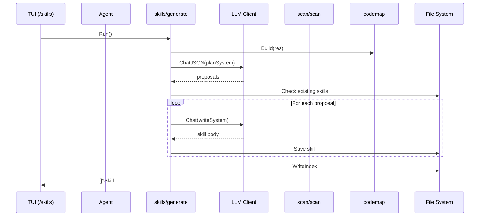
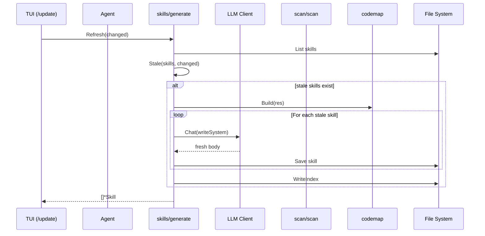
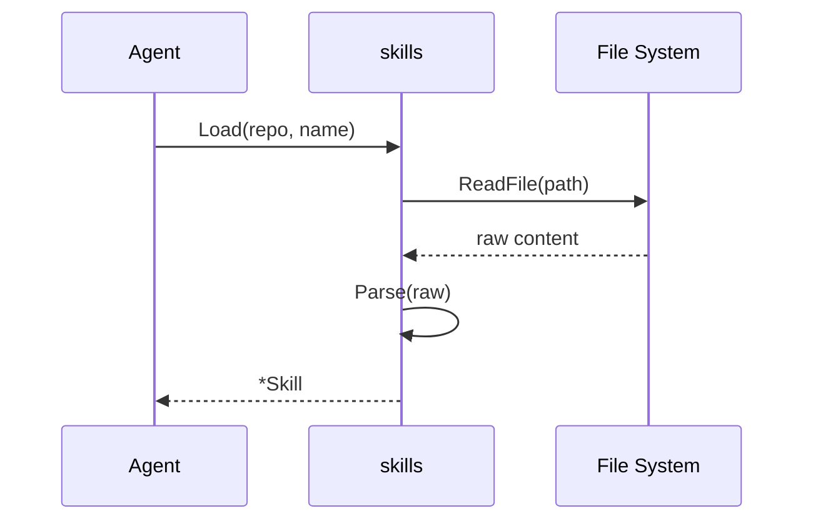

# Skills System

The Skills System in kaioken manages task guides (skills) that enable the agent to perform specific coding tasks. Skills are repository-specific, procedural documents stored in `.kaioken/skills/` that teach the agent *how* to accomplish recurring tasks (like adding an API endpoint or running tests) by detailing the exact files, functions, and conventions to follow. Unlike the wiki (which describes *what* the codebase contains), skills focus on *how to do* things within the project's unique context.

## Table of Contents
- [Overview](#overview)
- [Skill Structure](#skill-structure)
- [Skill Generation](#skill-generation)
- [Skill Refreshing](#skill-refreshing)
- [Skill Loading and Listing](#skill-loading-and-listing)
- [Skill Index](#skill-index)
- [Data Flow Diagrams](#data-flow-diagrams)
- [Referenced Files](#referenced-files)

## Overview

Skills are generated in two primary ways:
1. **Initial generation** via `kaioken skills` (or `/skills` in TUI), which analyzes the repository to propose and write a full set of skills
2. **Incremental refresh** via `kaioken update` (or `/update` in TUI), which regenerates only skills affected by file changes

Each skill follows the [Agent Skills format](https://github.com/agent-labs/agent-skills): a `SKILL.md` file with YAML frontmatter containing metadata (name, description, sources, generation timestamp, model used) and a markdown body with procedural guidance.

Skills are consumed by the agent during chat sessions: when the agent determines a skill is relevant to the user's request (based on description matching), it loads the skill to provide task-specific context for the LLM.

## Skill Structure

The `Skill` struct defines the schema for all skills:

```
internal/skills/skills.go:29-43
```

```go
// Skill is one generated capability document.
type Skill struct {
	// Name is a kebab-case identifier, also the directory name.
	Name string `yaml:"name"`
	// Description says what the skill covers and when to load it. Agent
	// runtimes match against this, so it carries the triggering weight.
	Description string `yaml:"description"`
	// Sources are the repo-relative files this skill was written from. They
	// drive incremental refresh: when one changes, the skill is stale.
	Sources     []string  `yaml:"sources,omitempty"`
	GeneratedAt time.Time `yaml:"generated_at,omitempty"`
	Model       string    `yaml:"model,omitempty"`

	// Body is the markdown after the frontmatter.
	Body string `yaml:"-"`
}
```

Key fields:
- `Name`: Kebab-case identifier used as the directory name (e.g., `add-an-api-endpoint`)
- `Description`: Human-readable explanation of what the skill covers and when to load it (used by agent for relevance matching)
- `Sources`: List of repo-relative files/directories the skill was derived from (used for staleness detection)
- `GeneratedAt`: Timestamp when the skill was last generated
- `Model`: LLM model used to generate the skill
- `Body`: Markdown content after the YAML frontmatter

Skills are stored in `.kaioken/skills/<name>/SKILL.md`. The `Slug` function normalizes skill names into safe directory names:

```
internal/skills/skills.go:54-78
```

```go
// Slug normalises a proposed name into a safe kebab-case directory name.
func Slug(s string) string {
	s = strings.ToLower(strings.TrimSpace(s))
	var b strings.Builder
	lastDash := true // trims leading dashes
	for _, r := range s {
		switch {
		case (r >= 'a' && r <= 'z') || (r >= '0' && r <= '9'):
			b.WriteRune(r)
			lastDash = false
		case r == '-' || r == '_' || r == ' ' || r == '/' || r == '.':
			if !lastDash {
				b.WriteByte('-')
				lastDash = true
			}
		}
	}
	out := strings.Trim(b.String(), "-")
	if out == "" {
		out = "skill"
	}
	if len(out) > 60 {
		out = strings.Trim(out[:60], "-")
	}
	return out
}
```

The `Render` method produces the complete `SKILL.md` text by marshaling the frontmatter and appending the body:

```
internal/skills/skills.go:81-88
```

```go
// Render produces the full SKILL.md text: frontmatter then body.
func (s *Skill) Render() string {
	meta := *s
	raw, err := yaml.Marshal(&meta)
	if err != nil {
		raw = []byte("name: " + s.Name + "\n")
	}
	return "---\n" + string(raw) + "---\n\n" + strings.TrimLeft(s.Body, "\n")
}
```

## Skill Generation

Skill generation occurs in two phases: planning (proposing which skills to create) and writing (generating each skill's content). Both phases use LLMs guided by repository context.

### Planning Phase

The `plan` function asks the LLM to propose skills based on:
- Repository file tree summary
- Manifest contents (package.json, Cargo.toml, etc.)
- Code skeleton (public symbols from codemap)
- Existing architecture brief and wiki chapters (to avoid duplication)
- Maintainer steering notes from config

```
internal/skills/generate.go:251-303
```

```go
// plan asks the model which tasks deserve a skill in this repository.
func plan(ctx context.Context, repo string, cfg *config.Config, client *llm.Client,
	res *scan.Result, idx *codemap.Index) ([]proposal, error) {

	var user strings.Builder
	user.WriteString("Repository layout:\n\n")
	user.WriteString(res.TreeSummary(10))
	user.WriteString("\n\nManifests (stack, scripts, entry points):\n\n")
	user.WriteString(res.ManifestContents(4000))
	user.WriteString("\n\nCode structure (public surface):\n\n")
	user.WriteString(idx.RepoSkeleton(8000))

	// The architecture brief and wiki, when present, already digested this
	// repository — reuse that rather than re-deriving it.
	if brief, err := os.ReadFile(filepath.Join(repo, config.Dir, "architecture.md")); err == nil {
		user.WriteString("\nArchitecture brief:\n")
		user.Write(brief)
		user.WriteString("\n")
	}
	if chapters := wikiChapters(repo); len(chapters) > 0 {
		user.WriteString("\nExisting wiki chapters (do not duplicate these; they describe, you prescribe):\n")
		for _, c := range chapters {
			user.WriteString("- " + c + "\n")
		}
	}
	if len(cfg.Notes) > 0 {
		user.WriteString("\nMaintainer steering notes (authoritative):\n")
		for _, n := range cfg.Notes {
			user.WriteString("- " + n + "\n")
		}
	}

	var out struct {
		Skills []proposal `json:"skills"`
	}
	if err := client.ChatJSON(ctx, planSystem, user.String(), &out); err != nil {
		return nil, err
	}
	if len(out.Skills) == 0 {
		return nil, fmt.Errorf("model proposed no skills")
	}

	seen := map[string]bool{}
	var props []proposal
	for _, p := range out.Skills {
		p.Name = Slug(p.Name)
		if p.Name == "" || seen[p.Name] {
			continue
		}
		seen[p.Name] = true
		props = append(props, p)
	}
	return props, nil
}
```

The `proposal` struct defines what the LLM returns during planning:

```
internal/skills/generate.go:50-55
```

```go
// proposal is one planned skill, before its body is written.
type proposal struct {
	Name        string   `json:"name"`
	Description string   `json:"description"`
	Task        string   `json:"task"`
	Files       []string `json:"files"`
}
```

The `planSystem` constant provides the LLM with instructions for skill proposal:

```
internal/skills/generate.go:57-80
```

```go
const planSystem = `You are deciding which SKILLS to write for a specific repository.

A skill is a short, task-oriented guide an AI coding agent loads at the moment it starts
work: "how do I do X in THIS project". Good skills describe RECURRING TASKS a contributor
actually performs — not descriptions of what the code is, which the wiki already covers.

Good skills for a typical repo look like:
- add-an-api-endpoint, add-a-cli-command, add-a-database-migration
- write-a-test, run-the-test-suite, debug-a-failing-build
- add-a-ui-component, wire-a-new-config-option, release-a-version

Bad skills (do NOT produce these):
- "architecture-overview", "project-structure" — those are wiki chapters, not tasks
- anything a general model already knows without this repo ("how to write Go")

Propose 5-12 skills that fit THIS repository's actual stack and layout. For each give:
- name: kebab-case, verb-led, specific ("add-a-tui-command", not "tui")
- description: one or two sentences saying what it covers AND when an agent should load it.
  This is what a runtime matches against, so name the concrete triggers.
- task: one sentence stating the task the skill teaches
- files: the repo-relative files or directories that show how this task is done here —
  include real examples an agent should imitate

Return ONLY JSON: {"skills":[{"name":"...","description":"...","task":"...","files":["..."]}]}`
```

### Writing Phase

The `write` function generates a skill's body from a proposal by:
1. Resolving the proposal's `Files` list into actual scanned files (handling directory prefixes)
2. Building a prompt containing:
   - Skill name, task, and description
   - Architecture brief (if available)
   - Maintainer notes
   - Code bundle (symbols and skeletons) for the resolved files
3. Instructing the LLM to write procedural guidance using the `writeSystem` template
4. Stripping any markdown fences the LLM might have added

```
internal/skills/generate.go:306-355
```

```go
// write generates one skill's body from its proposal.
func write(ctx context.Context, repo string, cfg *config.Config, client *llm.Client,
	res *scan.Result, idx *codemap.Index, p proposal) (*Skill, error) {

	files := resolve(res, p.Files)
	paths := make([]string, 0, len(files))
	for _, f := range files {
		paths = append(paths, f.Path)
	}

	var user strings.Builder
	fmt.Fprintf(&user, "Skill: %s\n\nTask it teaches:\n%s\n\nWhen it applies:\n%s\n",
		p.Name, p.Task, p.Description)
	if brief, err := os.ReadFile(filepath.Join(repo, config.Dir, "architecture.md")); err == nil {
		user.WriteString("\nArchitecture brief for this repository (use its vocabulary):\n")
		user.Write(brief)
		user.WriteString("\n")
	}
	if len(cfg.Notes) > 0 {
		user.WriteString("\nMaintainer steering notes (authoritative):\n")
		for _, n := range cfg.Notes {
			user.WriteString("- " + n + "\n")
		}
	}
	user.WriteString("\n")
	user.WriteString(idx.Bundle(paths, codemap.BundleOptions{
		Goal: p.Task + " " + p.Description, MaxTokens: cfg.MaxModuleTokens,
	}))

	body, err := client.Chat(ctx, writeSystem, user.String())
	if err != nil {
		return nil, err
	}
	body = unfence(strings.TrimSpace(body))
	if body == "" {
		return nil, fmt.Errorf("model returned an empty skill body")
	}

	desc := strings.TrimSpace(p.Description)
	if desc == "" {
		desc = p.Task
	}
	return &Skill{
		Name:        p.Name,
		Description: desc,
		Sources:     paths,
		GeneratedAt: time.Now().UTC(),
		Model:       client.Model,
		Body:        body,
	}, nil
}
```

The `writeSystem` constant defines the LLM's instructions for skill writing:

```
internal/skills/generate.go:82-118
```

```go
const writeSystem = `You write ONE skill for an AI coding agent working in a specific
repository. The agent has already read this project's wiki; your job is procedural, not
descriptive: how is this task actually performed HERE.

Write markdown with this shape:

# <Task title>

One or two sentences: what this skill covers and when to use it.

## Prerequisites
Only if there are real ones (a running service, a generated file, an env var).

## Steps
A numbered list. Each step names REAL files and functions from the sources, in the order a
contributor touches them. Where a step means "copy the existing pattern", show the pattern
with a short verbatim excerpt and its path.

## Conventions to follow
The local rules that are NOT obvious from the code alone: naming, error handling, where
registration happens, what must be updated in lockstep. Be specific to this repo.

## Verification
How to confirm the change worked here — the actual test/build/run command used in this repo.

## Common mistakes
Failure modes a newcomer or an agent hits in THIS codebase. Only real ones you can support
from the sources (a registry that must be updated, a test that must be regenerated).

Rules:
- Ground everything in the provided sources. Never invent a file, function, command or step.
- Be concise and imperative. This is a checklist an agent follows, not an essay. Aim for
  60-150 lines; if the task is genuinely simple, be shorter.
- Quote code verbatim when showing a pattern, and cite its path.
- Do NOT restate what the code is; state what to DO.

Output ONLY the markdown body. No frontmatter, no JSON, no commentary.`
```

The `resolve` function converts file/directory patterns from proposals into actual scanned files:

```
internal/skills/generate.go:358-376
```

```go
// resolve maps scope entries (files or directory prefixes) onto scanned files.
func resolve(res *scan.Result, scope []string) []scan.File {
	seen := map[string]bool{}
	var out []scan.File
	for _, s := range scope {
		s = strings.Trim(filepath.ToSlash(strings.TrimSpace(s)), "/")
		if s == "" {
			continue
		}
		for _, f := range res.Files {
			if f.Path == s || strings.HasPrefix(f.Path, s+"/") {
				if !seen[f.Path] {
					seen[f.Path] = true
					out = append(out, f)
				}
			}
		}
	}
	return out
}
```

The `unfence` helper removes markdown fences that LLMs sometimes wrap around responses:

```
internal/skills/generate.go:394-404
```

```go
// unfence strips a markdown fence some models wrap whole documents in.
func unfence(doc string) string {
	doc = strings.TrimSpace(doc)
	for _, tag := range []string{"```markdown", "```md", "```"} {
		if strings.HasPrefix(doc, tag) {
			doc = strings.TrimPrefix(doc, tag)
			doc = strings.TrimSuffix(strings.TrimSpace(doc), "```")
			break
		}
	}
	return strings.TrimSpace(doc)
}
```

### Generation Entry Points

The `Run` function orchestrates full skill generation:
1. Builds a codemap index from scan results
2. Plans skills via LLM
3. Writes each skill in parallel (respecting concurrency limits)
4. Saves skills to disk
5. Updates the skills index (README.md)

```
internal/skills/generate.go:127-192
```

```go
// Run plans and writes the full skill set for a repository.
func Run(ctx context.Context, repo string, cfg *config.Config, client *llm.Client,
	res *scan.Result, opts Options, pg Progress) ([]*Skill, error) {

	idx := codemap.Build(res)

	pg.started("planning skills")
	proposals, err := plan(ctx, repo, cfg, client, res, idx)
	if err != nil {
		return nil, fmt.Errorf("planning skills: %w", err)
	}
	pg.info(fmt.Sprintf("planned %d skills", len(proposals)))

	only := map[string]bool{}
	for _, n := range opts.Only {
		only[Slug(n)] = true
	}

	limit, _ := cfg.EffectiveConcurrency(client.Model)
	var mu sync.Mutex
	var written []*Skill

	g, gctx := errgroup.WithContext(ctx)
	g.SetLimit(limit)
	for _, p := range proposals {
		p := p
		if len(only) > 0 && !only[p.Name] {
			continue
		}
		if !opts.Force {
			if _, err := os.Stat(Path(repo, p.Name)); err == nil {
				pg.info("skip (exists): " + p.Name)
				continue
			}
		}
		g.Go(func() error {
			pg.started("write: " + p.Name)
			s, err := write(gctx, repo, cfg, client, res, idx, p)
			if err != nil {
				pg.failed(p.Name, err)
				return nil // one failed skill must not abort the set
			}
			if err := s.Save(repo); err != nil {
				pg.failed(p.Name, err)
				return nil
			}
			pg.wrote(filepath.ToSlash(filepath.Join(config.Dir, "skills", s.Name, "SKILL.md")),
				strings.Count(s.Body, "\n")+1)
			mu.Lock()
			written = append(written, s)
			mu.Unlock()
			return nil
		})
	}
	if err := g.Wait(); err != nil {
		return written, err
	}

	all, err := List(repo)
	if err != nil {
		return written, err
	}
	if err := WriteIndex(repo, all); err != nil {
		return written, err
	}
	return written, nil
}
```

The `Options` struct controls generation behavior:

```
internal/skills/generate.go:121-124
```

```go
// Options controls a generation run.
type Options struct {
	Force bool     // rewrite skills that already exist
	Only  []string // restrict to these skill names
}
```

## Skill Refreshing

Skills are incrementally refreshed when source files change via the `Refresh` function. This is called by `kaioken update` and ensures skills stay current with the codebase.

The refresh process:
1. Lists all existing skills
2. Identifies stale skills whose sources intersect changed files (using `Stale`)
3. Regenerates only stale skills in parallel
4. Updates the skills index

```
internal/skills/generate.go:196-248
```

```go
// Refresh regenerates only the skills whose sources the given paths changed.
// It is what `kaioken update` calls, so skills track the code like the wiki does.
func Refresh(ctx context.Context, repo string, cfg *config.Config, client *llm.Client,
	res *scan.Result, changed []string, pg Progress) ([]*Skill, error) {

	all, err := List(repo)
	if err != nil || len(all) == 0 {
		return nil, err
	}
	stale := Stale(all, changed)
	if len(stale) == 0 {
		return nil, nil
	}
	pg.info(fmt.Sprintf("%d skill(s) affected by the change", len(stale)))

	idx := codemap.Build(res)
	limit, _ := cfg.EffectiveConcurrency(client.Model)
	var mu sync.Mutex
	var updated []*Skill

	g, gctx := errgroup.WithContext(ctx)
	g.SetLimit(limit)
	for _, s := range stale {
		s := s
		g.Go(func() error {
			pg.started("refresh: " + s.Name)
			p := proposal{
				Name: s.Name, Description: s.Description,
				Task: s.Description, Files: s.Sources,
			}
			fresh, err := write(gctx, repo, cfg, client, res, idx, p)
			if err != nil {
				pg.failed(s.Name, err)
				return nil
			}
			if err := fresh.Save(repo); err != nil {
				pg.failed(s.Name, err)
				return nil
			}
			pg.wrote(filepath.ToSlash(filepath.Join(config.Dir, "skills", fresh.Name, "SKILL.md")),
				strings.Count(fresh.Body, "\n")+1)
			mu.Lock()
			updated = append(updated, fresh)
			mu.Unlock()
			return nil
		})
	}
	if err := g.Wait(); err != nil {
		return updated, err
	}
	if all, err := List(repo); err == nil {
		_ = WriteIndex(repo, all)
	}
	return updated, nil
}
```

Staleness detection uses the `Stale` and `intersects` functions:

```
internal/skills/skills.go:163-192
```

```go
// Stale reports the skills whose sources intersect the changed paths, so an
// update refreshes only what the change actually invalidates.
func Stale(all []*Skill, changed []string) []*Skill {
	if len(changed) == 0 {
		return nil
	}
	var out []*Skill
	for _, s := range all {
		if intersects(s.Sources, changed) {
			out = append(out, s)
		}
	}
	return out
}

// intersects reports whether any changed path falls under a source entry,
// treating a source as a file or a directory prefix.
func intersects(sources, changed []string) bool {
	for _, src := range sources {
		src = strings.Trim(filepath.ToSlash(strings.TrimSpace(src)), "/")
		if src == "" {
			continue
		}
		for _, c := range changed {
			c = filepath.ToSlash(c)
			if c == src || strings.HasPrefix(c, src+"/") {
				return true
			}
		}
	}
	return false
}
```

## Skill Loading and Listing

Skills can be loaded individually or listed en masse for use by the agent or CLI.

### Loading a Single Skill

The `Load` function reads a skill by name from disk:

```
internal/skills/skills.go:103-109
```

```go
// Load reads one skill by name.
func Load(repo, name string) (*Skill, error) {
	raw, err := os.ReadFile(Path(repo, name))
	if err != nil {
		return nil, err
	}
	return Parse(string(raw))
}
```

The `Parse` function handles both frontmatter-equipped and hand-written skills:

```
internal/skills/skills.go:114-131
```

```go
// Parse splits a SKILL.md into frontmatter and body. A file without
// frontmatter is not an error: it is treated as a hand-written skill whose
// name comes from its directory, so a user can drop one in by hand.
func Parse(text string) (*Skill, error) {
	text = strings.ReplaceAll(text, "\r\n", "\n")
	if !strings.HasPrefix(text, "---\n") {
		return &Skill{Body: text}, nil
	}
	rest := text[4:]
	end := strings.Index(rest, "\n---")
	if end == -1 {
		return &Skill{Body: text}, nil
	}
	var s Skill
	if err := yaml.Unmarshal([]byte(rest[:end+1]), &s); err != nil {
		return nil, fmt.Errorf("parsing skill frontmatter: %w", err)
	}
	body := rest[end+4:]
	s.Body = strings.TrimLeft(body, "\n")
	return &s, nil
}
```

### Listing All Skills

The `List` function returns all skills in a repository, sorted by name:

```
internal/skills/skills.go:135-159
```

```go
// List returns every skill in a repository, by name. A missing directory means
// none have been generated yet, which is not an error.
func List(repo string) ([]*Skill, error) {
	entries, err := os.ReadDir(Dir(repo))
	if err != nil {
		if os.IsNotExist(err) {
			return nil, nil
		}
		return nil, err
	}
	var out []*Skill
	for _, e := range entries {
		if !e.IsDir() {
			continue
		}
		s, err := Load(repo, e.Name())
		if err != nil {
			continue // a malformed skill must not hide the rest
		}
		if s.Name == "" {
			s.Name = e.Name() // hand-written skill: fall back to the directory
		}
		out = append(out, s)
	}
	sort.Slice(out, func(i, j int) bool { return out[i].Name < out[j].Name })
	return out, nil
}
```

## Skill Index

The skills index (`README.md` in `.kaioken/skills/`) serves as a catalog for the agent to discover relevant skills. It's generated by `WriteIndex`:

```
internal/skills/skills.go:196-213
```

```go
// WriteIndex renders the skills README: the catalog an agent reads to decide
// which skill to open.
func WriteIndex(repo string, all []*Skill) error {
	if len(all) == 0 {
		return nil
	}
	var b strings.Builder
	b.WriteString("# Project Skills\n\n")
	b.WriteString("Task-oriented guides for working in this repository, generated by Kaioken.\n")
	b.WriteString("Each skill says how to perform one recurring task here — which files to\n")
	b.WriteString("touch, in what order, and which local conventions apply.\n\n")
	b.WriteString("Open the skill matching your task before you start.\n\n")
	for _, s := range all {
		fmt.Fprintf(&b, "## [%s](%s/SKILL.md)\n%s\n\n", s.Name, s.Name, s.Description)
	}
	if err := os.MkdirAll(Dir(repo), 0o755); err != nil {
		return err
	}
	return os.WriteFile(filepath.Join(Dir(repo), "README.md"), []byte(b.String()), 0o644)
}
```

The index contains:
- A header explaining what skills are
- For each skill: a link to its `SKILL.md` file and its description

## Data Flow Diagrams

### Skill Generation Flow



### Skill Refresh Flow



### Skill Loading Flow (Agent)



## Referenced Files

- internal/skills/skills.go
- internal/skills/generate.go
- internal/skills/skills_test.go (for behavioral validation)

<!-- kaioken:files internal/skills/skills.go,internal/skills/generate.go,internal/skills/skills_test.go -->
