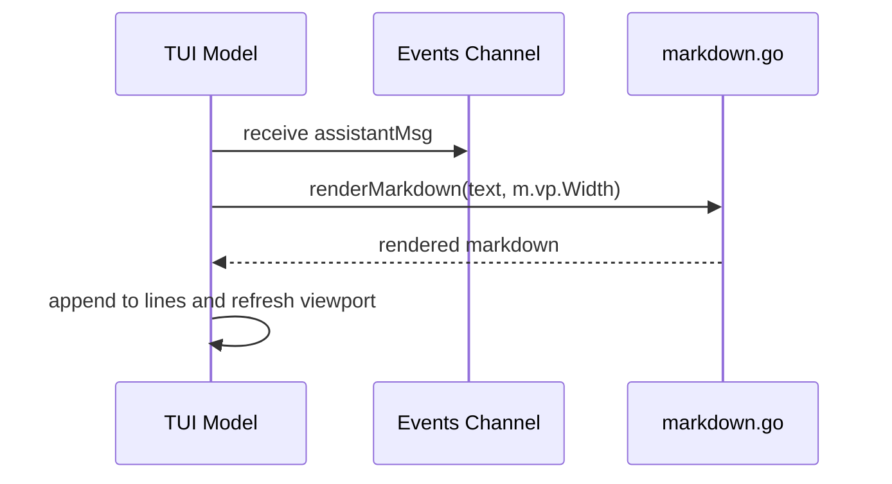

# Markdown Rendering

This chapter details how the TUI renders markdown-formatted assistant responses using the `glamour` library, including the rendering implementation, width handling, and configuration.

## Table of Contents
- [Overview](#overview)
- [Rendering Flow](#rendering-flow)
- [Markdown Rendering Implementation](#markdown-rendering-implementation)
- [Width Handling](#width-handling)
- [Configuration](#configuration)
- [Referenced Files](#referenced-files)

## Overview

The TUI defers markdown rendering until an assistant's message is complete to avoid constant reflow during streaming. While the LLM streams tokens, the live region shows raw text. Upon completion, the full message is processed by the `glamour` library to produce terminal-styled output that honors the terminal's background, wraps text to the viewport width, and supports emoji.

## Rendering Flow

When the LLM finishes generating an assistant response, the TUI follows this sequence:

1. The LLM sends the complete assistant text via an `assistantMsg` on the TUI's `events` channel.
2. The `Update` method handles `assistantMsg` by:
   - Clearing the live-streamed region (`m.live = ""`)
   - Passing the text and current viewport width to `renderMarkdown`
   - Appending the rendered result to the scrollback (`m.lines`)
   - Refreshing the viewport to display the new content



`internal/tui/tui.go:330-337`
```go
case assistantMsg:
	// The live region showed raw tokens as they arrived; replace it with
	// the markdown-rendered version now that the reply is complete.
	m.live = ""
	m.appendLine(renderMarkdown(msg.text, m.vp.Width))
	return m, listen(m.events)
```

## Markdown Rendering Implementation

The `renderMarkdown` function in `internal/tui/markdown.go` performs the actual conversion. It first checks if rendering is worthwhile:
- Returns early (with only assistant-style coloring) if width < 20 or if the text lacks markdown structure (determined by `looksLikeMarkdown`)
- Otherwise, uses a cached `glamour.TermRenderer` configured with:
  - `glamour.WithAutoStyle()`: adapts to terminal light/dark background
  - `glamour.WithWordWrap(width)`: wraps text at the given width
  - `glamour.WithEmoji()`: enables emoji rendering

The renderer is recreated only when the width changes, minimizing overhead.

`internal/tui/markdown.go:45-59`
```go
func renderMarkdown(text string, width int) string {
	if width < 20 || !looksLikeMarkdown(text) {
		return assistantStyle.Render(text)
	}
	r := markdownRenderer(width)
	if r == nil {
		return assistantStyle.Render(text)
	}
	out, err := r.Render(text)
	if err != nil {
		return assistantStyle.Render(text)
	}
	// Glamour frames blocks with blank lines; the TUI adds its own spacing.
	return strings.Trim(out, "\n")
}
```

The `looksLikeMarkdown` helper detects structural markdown elements to avoid unnecessary processing for plain text:

`internal/tui/markdown.go:64-83`
```go
func looksLikeMarkdown(text string) bool {
	if strings.Contains(text, "```") {
		return true
	}
	structural := 0
	for _, line := range strings.Split(text, "\n") {
		t := strings.TrimSpace(line)
		switch {
		case strings.HasPrefix(t, "#"),
			strings.HasPrefix(t, "- "), strings.HasPrefix(t, "* "),
			strings.HasPrefix(t, "> "), strings.HasPrefix(t, "|"),
			strings.HasPrefix(t, "1. "):
			structural++
		}
		if strings.Contains(t, "**") || strings.Contains(t, "`") {
			structural++
		}
	}
	return structural >= 2
}
```

Renderer caching ensures efficiency across resizes:

`internal/tui/markdown.go:24-40`
```go
func markdownRenderer(width int) *glamour.TermRenderer {
	rendererMu.Lock()
	defer rendererMu.Unlock()
	if renderer != nil && rendererWidth == width {
		return renderer
	}
	r, err := glamour.NewTermRenderer(
		glamour.WithAutoStyle(), // honors the terminal's light/dark background
		glamour.WithWordWrap(width),
		glamour.WithEmoji(),
	)
	if err != nil {
		return nil
	}
	renderer, rendererWidth = r, width
	return r
}
```

Global state for the renderer cache:

`internal/tui/markdown.go:17-19`
```go
var (
	rendererMu    sync.Mutex
	renderer      *glamour.TermRenderer
	rendererWidth int
)
```

## Width Handling

The viewport width (`m.vp.Width`) drives markdown rendering and is updated on terminal resize:
- On `tea.WindowSizeMsg`, the TUI sets `m.width, m.height = msg.Width, msg.Height` and updates the viewport (`m.vp.Width = msg.Width`)
- The cached scrollback wrap (`m.committed`) is invalidated (`m.committed = ""`) because width changes require re-wrapping
- The `markdownRenderer` function checks `rendererWidth` against the requested width to recreate the renderer only when necessary

This ensures markdown output always fits the current terminal width without manual reconfiguration.

## Configuration

Markdown rendering has no user-configurable options. Behavior is fixed to:
- Use `glamour` with auto-styling for terminal theme adaptation
- Apply word wrapping at the current viewport width
- Enable emoji rendering
- Fallback to plain assistant-style text for narrow widths (<20) or non-markdown content

All configuration relates to the viewport width, which is dynamically derived from the terminal size.

## Referenced Files
- internal/tui/tui.go
- internal/tui/markdown.go

<!-- kaioken:files internal/tui/markdown.go,internal/tui/tui.go -->
