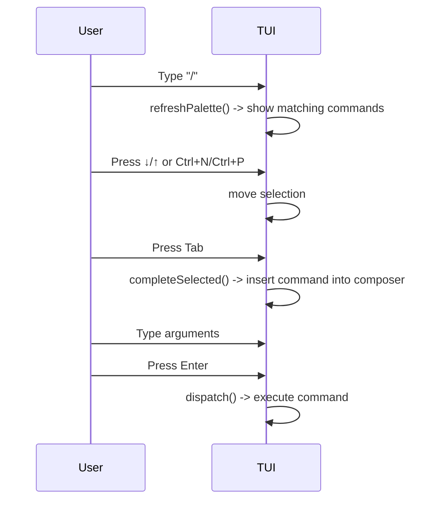
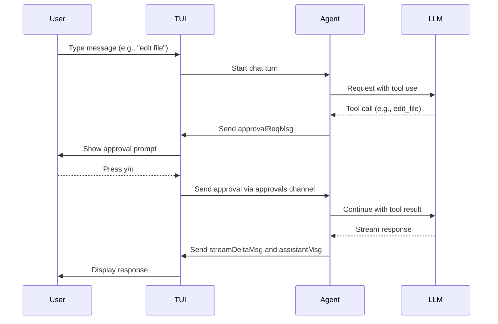

# Terminal User Interface (TUI)

The Terminal User Interface (TUI) is kaioken's interactive interface built with the Bubble Tea library. It provides a chat-based interface for interacting with the AI agent, managing sessions, executing slash commands, rendering markdown responses, and displaying contextual status information.

## Table of Contents
- [Model Structure](#model-structure)
- [Modes and Update Loop](#modes-and-update-loop)
- [Command Palette](#command-palette)
- [Markdown Rendering](#markdown-rendering)
- [Built-in Tutorial](#built-in-tutorial)
- [Status Line](#status-line)
- [Session Management](#session-management)
- [Approval Workflow](#approval-workflow)
- [Keybindings](#keybindings)
- [Referenced Files](#referenced-files)

## Model Structure

The TUI state is encapsulated in the `Model` struct ([internal/tui/tui.go:127-181](#internal/tui/tui.go:127-181)). It holds:

- **Repository and configuration**: `repo`, `cfg`, `global`, `apiKeys`, `client`
- **Conversation state**: `conversation`, `autoApprove`, `undoStack`, `sess`
- **UI components**: `vp` (viewport), `input` (textarea), `keyInput` (textinput for hidden key entry), `spin` (spinner), `list` (for pickers), `events` (channel for async messages), `approvals` (channel for approval responses)
- **Display state**: `lines` (scrollback), `committed` (cached wrapped scrollback), `live` (streaming assistant text), `busy` and `busyText` (for long operations), `busyStart` (timer for busy state), `mode` (chat or picker)
- **Command palette**: `pal` (palette state), `pendingKey`, `pendingApproval`, `approval` (current approval request), `cancel` (context cancel for ongoing operations)
- **Wiki browser**: `serveCancel`, `serveURL`
- **Flags**: `configMissing`, `suggestedSkills`, `width`, `height`, `ready`

The `Model` is initialized by `New` ([internal/tui/tui.go:194-257](#internal/tui/tui.go:194-257)) and run by `Run` ([internal/tui/tui.go:184-191](#internal/tui/tui.go:184-191)).

## Modes and Update Loop

The TUI operates in two modes:
- `modeChat`: normal chat input and command processing
- `modePicker`: model or session selection (see [internal/tui/tui.go:47-56](#internal/tui/tui.go:47-56))

The main update loop is in the `Update` method ([internal/tui/tui.go:284-426](#internal/tui/tui.go:284-426)), which handles:
- Window resizing
- Key presses (via `onKey`)
- Spinner ticks (when busy)
- Async messages from the agent and other operations (log, streamDelta, assistantMsg, busyMsg, doneMsg, approvalReqMsg, agentDoneMsg, modelsFetchedMsg, serveStartedMsg, serveStoppedMsg, undoRecordMsg, compactedMsg)

The `onKey` method ([internal/tui/tui.go:428-567](#internal/tui/tui.go:428-567)) processes key presses differently based on the current mode and state (e.g., in picker mode, during approval, when the palette is open, etc.).

### Update Loop Diagram
```mermaid
graph TD
    A[tea.Msg] --> B{Msg Type}
    B -->|spinner.TickMsg| C[Update spinner if busy]
    B -->|logMsg| D[Flush live and append line]
    B -->|streamDeltaMsg| E[Append to live and refresh viewport]
    B -->|assistantMsg| F[Replace live with rendered markdown and append]
    B -->|busyMsg| G[Set busy state and start/stop spinner]
    B -->|doneMsg| H[Handle completion (e.g., wiki done) and possibly suggest skills]
    B -->|approvalReqMsg| I[Show approval prompt]
    B -->|agentDoneMsg| J[Update conversation and save session]
    B -->|modelsFetchedMsg| K[Populate model picker list]
    B -->|serveStartedMsg/serveStoppedMsg| L[Update serve URL and append line]
    B -->|undoRecordMsg| M[Add to undo stack]
    B -->|compactedMsg| N[Replace conversation with summary and append line]
    B -->|tea.KeyMsg| O[onKey handler]
    B -->|tea.WindowSizeMsg| P[Handle resize]
```

## Command Palette

The command palette is opened by typing `/` and provides fuzzy completion for slash commands. It is implemented in [internal/tui/palette.go](#internal/tui/palette.go).

Key components:
- `palette` struct: tracks active state, list of commands, selected index, and offset for scrolling.
- `refreshPalette` ([internal/tui/tui.go:43-70](#internal/tui/tui.go:43-70)): called on input change to populate the palette with matching commands.
- Navigation: up/down (or ctrl+p/ctrl+n) to move selection, tab to complete, enter to run, esc to close.
- Rendering: `paletteView` ([internal/tui/palette.go:139-192](#internal/tui/palette.go:139-192)) formats the menu above the composer.

The palette only appears when the composer starts with `/` and no space (indicating the command name is being typed). Once a space is typed, the palette dismisses and the user types arguments.

### Palette Navigation Diagram


## Markdown Rendering

Assistant responses are rendered as markdown using the `glamour` library. Rendering is deferred until the assistant's message is complete to avoid continuous reflow during streaming.

See [internal/tui/markdown.go](#internal/tui/markdown.go):
- `markdownRenderer` ([internal/tui/markdown.go:24-40](#internal/tui/markdown.go:24-40)): returns a `glamour.TermRenderer` for the given viewport width, caching it until the width changes.
- `renderMarkdown` ([internal/tui/markdown.go:45-59](#internal/tui/markdown.go:45-59)): styles the assistant's complete message. If the width is too small or the text doesn't look like markdown, it falls back to plain styling.
- `looksLikeMarkdown` ([internal/tui/markdown.go:64-83](#internal/tui/markdown.go:64-83)): checks for markdown structures (code fences, headers, lists, etc.) to decide whether to render.

The TUI uses this in the `assistantMsg` handler ([internal/tui/tui.go:571-588](#internal/tui/tui.go:571-588)) to replace the raw streamed text (`live`) with the rendered markdown.

## Built-in Tutorial

The `/tutorial` command provides an interactive manual. It is implemented in [internal/tui/tutorial.go](#internal/tui/tutorial.go).

The tutorial is organized into chapters (e.g., "start", "chat", "sessions", etc.), each containing a set of commands. The tutorial data is in the `chapters` variable ([internal/tui/tutorial.go:29-89](#internal/tui/tutorial.go:29-89)).

Functions:
- `tutorialOverview` ([internal/tui/tutorial.go:119-167](#internal/tui/tutorial.go:119-167)): returns the landing page.
- `tutorialChapter` ([internal/tui/tutorial.go:170-187](#internal/tui/tutorial.go:170-187)): returns a specific chapter.
- `tutorialCommand` ([internal/tui/tutorial.go:190-224](#internal/tui/tutorial.go:190-224)): returns the details for a single command.
- `tutorialLines` ([internal/tui/tutorial.go:227-263](#internal/tui/tutorial.go:227-263)): resolves an argument (chapter name, command name, or "all") to the appropriate tutorial text.

The tutorial is displayed by appending lines to the scrollback via `appendLine` (see the `dispatch` method for the "tutorial" command in [internal/tui/tui.go:920-1043](#internal/tui/tui.go:920-1043)).

## Status Line

The status line is the single row under the composer, showing contextual information on the left and session details on the right.

It is built by the `statusLine` method ([internal/tui/tui.go:638-656](#internal/tui/tui.go:638-656)), which combines:
- Left: busy state (spinner and elapsed time) or help hints.
- Right: `sessionStatus` ([internal/tui/tui.go:661-680](#internal/tui/tui.go:661-680)), which shows:
    - If the wiki is being served: "serving"
    - The current model (shortened by `shortModel`)
    - Token usage (from the LLM client)

The status line also reflects the auto-approve (yolo) state by changing the prompt style.

## Session Management

Sessions are managed by the `session` package and integrated into the TUI.

Key points:
- A session is saved after each completed agent turn via `saveSession` ([internal/tui/tui.go:270-278](#internal/tui/tui.go:270-278)).
- Sessions are stored in `.kaioken/sessions/` per repository.
- The user can list sessions with `/sessions` ([internal/tui/tui.go:1582-1602](#internal/tui/tui.go:1582-1602)) and resume a session with `/resume [id]` ([internal/tui/tui.go:1605-1628](#internal/tui/tui.go:1605-1628)).
- The `sessionItem` type ([internal/tui/tui.go:1573-1575](#internal/tui/tui.go:1573-1575)) adapts a session for the picker list.
- When resuming, the TUI replays the transcript so the user can see the history ([internal/tui/tui.go:1631-1664](#internal/tui/tui.go:1631-1664)).

## Approval Workflow

When the agent wants to execute a tool that changes state (e.g., `edit_file`, `run_command`), it requests approval from the user.

The flow:
1. The agent sends an `approvalReqMsg` to the TUI events channel.
2. The TUI's `Update` method handles this by calling `showApproval` ([internal/tui/tui.go:801-837](#internal/tui/tui.go:801-837)).
3. `showApproval` displays a diff-style preview and sets `pendingApproval` to true.
4. The user responds with `y`/`Y`/`enter` to approve or `n`/`N`/`esc` to decline (handled in `onKey`).
5. The result is sent back to the agent via the `approvals` channel.

The approval UI includes:
- A header with the action and target.
- A gutter-styled diff showing additions and deletions.
- Key hints for yes/no.

### Approval Workflow Diagram


## Keybindings

The TUI uses various keybindings, many of which are handled in the `onKey` method.

Notable bindings:
- `enter`: send chat message or complete palette selection.
- `alt+enter` / `ctrl+j`: insert newline in the composer.
- `up`/`down` / `pgup`/`pgdown`: scroll the transcript (when composer is single-line) or move cursor in multi-line composer.
- `ctrl+d`: quit (if composer is empty).
- `ctrl+c` / `esc`: stop current task or clear composer.
- `tab`: complete selected palette command.
- In the palette: `up`/`

<!-- kaioken:files internal/tui/tui.go,internal/tui/palette.go,internal/tui/markdown.go,internal/tui/tutorial.go -->
