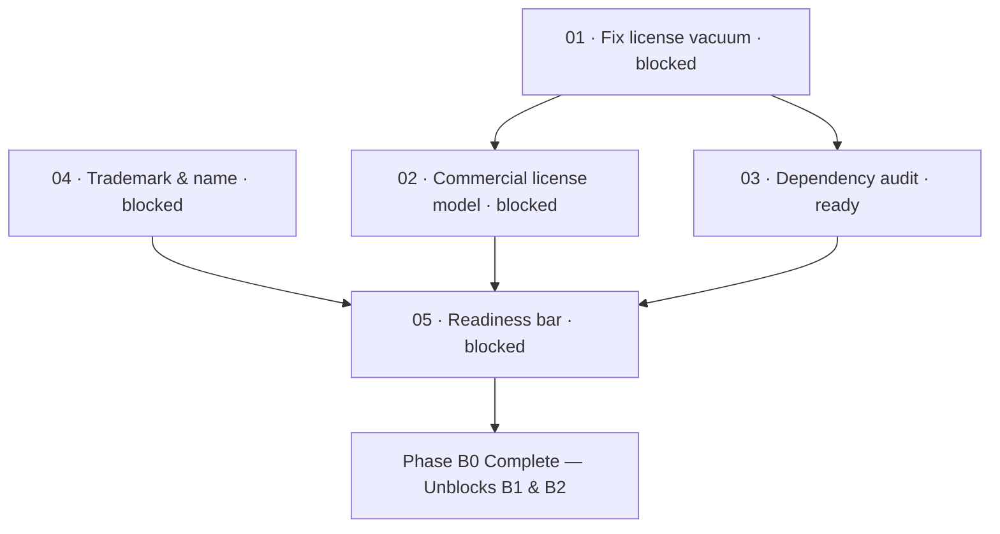

# B0 · Preconditions

> Establish the legal, licensing, intellectual property, and structural baselines required before
> accepting a single dollar from any customer.

| Field | Value |
|---|---|
| **Status** | `blocked` (pending human maintainer decisions on D1, commercial model, and trademark) |
| **Theme** | Legal and structural hygiene. Zero commercial sales until resolved |
| **Depends on** | Milestone M1 (Green build baseline) |
| **Blocks** | Phase B1 (Model & Positioning), Phase B2 (Billing Engineering), and all commercial monetization |
| **Touches** | Root `LICENSE`, `kaioken_v2/package.json`, trademark filings, corporate compliance records |
| **Risk** | **Critical — operating commercially without resolving these creates statutory tax and copyright liabilities** |

---

## Why this milestone is first

Nothing else in `money_print` can start until Phase B0 closes.

Most leaves in this phase are marked `blocked` on human decisions. That is correct, expected, and
principled rather than a failure of specification:
- An AI coding agent can implement a billing API or configure an OAuth provider, but it cannot choose
  the legal structure of a business, sign a copyright assignment, or accept personal liability for a
  trademark conflict.
- The repository is currently in a **legal vacuum**: the TypeScript engine in `kaioken_v2/` carries no
  license file, making it default "all rights reserved". Distributing binaries or claiming open-source
  status without a valid license is legally void.
- Upstream dependencies and project naming carry intellectual property constraints that must be audited
  before commercial transactions occur.

Closing B0 transforms Kaioken from an unlicensed solo repository into a legally sound entity capable of
releasing open-source code and transacting business.

---

## Leaves, in execution order

| # | Leaf | Size | Status | Gate-critical |
|---|---|---|---|---|
| 01 | [Fix the license vacuum](01-fix-the-license-vacuum.md) | S | `blocked` | **Yes — Precondition Zero** |
| 02 | [Choose the commercial license model](02-choose-the-commercial-license-model.md) | S | `blocked` | Yes |
| 03 | [Dependency license audit](03-dependency-license-audit.md) | M | `ready` | Yes |
| 04 | [Trademark and name clearance](04-trademark-and-name.md) | S | `blocked` | Yes |
| 05 | [The commercial readiness bar](05-readiness-bar.md) | S | `blocked` | **Yes — Final Gate for B0** |

---

## Dependency graph

---

## Done when

- [ ] A root `LICENSE` file is committed to the repository and referenced in `kaioken_v2/package.json`.
- [ ] The open-source vs proprietary licensing boundary is documented in a committed decision record.
- [ ] A mechanical npm license audit of `kaioken_v2` passes with zero unapproved or copyleft licenses.
- [ ] The Eclipse Theia core package licensing status (EPL-2.0 / GPL-2.0-with-classpath-exception) is
      evaluated by legal counsel and cleared for Studio distribution.
- [ ] The trademark risk of "Kaioken" is assessed by an IP professional, with a binding naming decision
      recorded.
- [ ] Every item on the [Commercial Readiness Bar](05-readiness-bar.md) passes verification.

---

## Traps

| Trap | Guard |
|---|---|
| Taking money before fixing the license | An unlicensed engine has no legal distribution right. Fix the license before any monetization |
| Assuming dual-licensing requires no maintenance | Selling proprietary commercial exceptions requires Contributor License Agreements (CLAs) and contract administration |
| Ignoring weak-copyleft upstream in Theia | Theia Blueprint is MIT at the wrapper, but core packages upstream are EPL-2.0. Route to legal counsel before shipping paid Studio |
| Postponing trademark review until revenue starts | Infringement claims after brand awareness exists destroy marketing equity and force emergency renames |
| Letting agents make legal determinations | Treat all legal analysis as preparation documents. Decisions belong to the human maintainer advised by qualified counsel |
