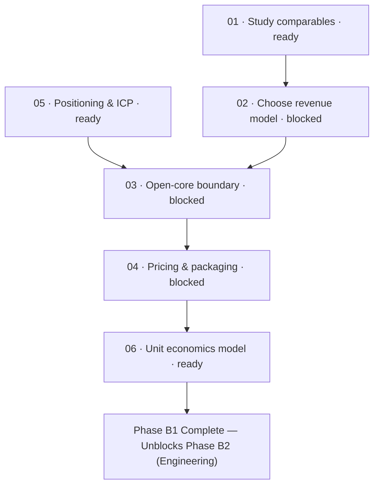

# B1 · Model and Positioning

> Decide what is sold, to whom, and at what price: establishing the open-core boundary,
> comparative pricing research, target customer profiles, and unit economics arithmetic.

| Field | Value |
|---|---|
| **Status** | `blocked` (awaits maintainer strategic decisions on revenue model and open-core boundary) |
| **Theme** | Business architecture and market positioning. Zero code in this phase |
| **Depends on** | Phase B0 ([`roadmap/money_print/b0-preconditions/`](roadmap/0_money_print/b0-preconditions/README.md)) |
| **Blocks** | Phase B2 ([`roadmap/money_print/b2-billing-engineering/`](roadmap/0_money_print/b2-billing-engineering/README.md)) |
| **Touches** | Product strategy, pricing documentation, competitive analysis |
| **Risk** | Strategic — mispricing or misjudging the open-core boundary eliminates either distribution or revenue |

---

## Why this milestone exists

Building billing engineering before deciding what is sold and at what margin is premature engineering.

Phase B1 answers the fundamental commercial questions:
1. **What do comparable tools charge?** Studying how peers like OpenCode and Kilo Code structure their
   free vs paid tiers.
2. **What is the revenue engine?** Metered inference margins vs flat subscriptions vs hosted daemons.
3. **Where is the open-core line drawn?** Determining what is free forever (to protect viral distribution)
   and what requires payment (to generate sustainable margin).
4. **Does the math work?** Modeling provider costs, token volume, gross margins, and heavy-user tail risks
   in an editable arithmetic model.

No code is written in this phase. Every output is a committed strategic decision, an editable financial model,
or a verified product boundary.

---

## Leaves, in execution order

| # | Leaf | Size | Status | Gate-critical |
|---|---|---|---|---|
| 01 | [Study the comparables](01-study-the-comparables.md) | M | `ready` | Yes |
| 02 | [Choose the revenue model](02-choose-the-revenue-model.md) | S | `blocked` | **Yes — Primary Commercial Fork** |
| 03 | [The open-core boundary](03-open-core-boundary.md) | M | `blocked` | **Yes — Product Definition** |
| 04 | [Pricing and packaging](04-pricing-and-packaging.md) | S | `blocked` | Yes |
| 05 | [Positioning and Ideal Customer Profile](05-positioning-and-icp.md) | S | `ready` | Yes |
| 06 | [Unit economics model](06-unit-economics-model.md) | M | `ready` | **Yes — Margin Guardrail** |

---

## Dependency graph

---

## Done when

- [ ] A structured survey of direct comparables is completed, with all vendor pricing marked `UNVERIFIED:`.
- [ ] Maintainer records an explicit choice among metered inference, seat subscription, or hybrid model.
- [ ] Every major product surface (CLI, TUI, Studio, Wiki, Registry, Daemon) is categorized as free or paid.
- [ ] A draft pricing table is committed with all numbers explicitly labeled `ASSUMPTION`.
- [ ] The Ideal Customer Profile (ICP) is articulated, highlighting Kaioken's durable codebase knowledge differentiator.
- [ ] An editable spreadsheet-style unit economics arithmetic model is committed, establishing gross margin thresholds.

---

## Traps

| Trap | Guard |
|---|---|
| Writing billing code before choosing the model | Phase B2 is gated on B1-02. Do not build Stripe checkout before knowing what is billed |
| Being too stingy with the free tier | The free tier is your entire distribution engine. If a solo developer cannot succeed alone, they will never recommend the paid layer |
| Being too generous with paid capabilities | If free users can consume your hosted inference or cloud daemons without paying, you will bankrupt the business |
| Treating revenue models as predictions | Model the economics as simple arithmetic over stated assumptions. Re-run the numbers when provider rates shift |
