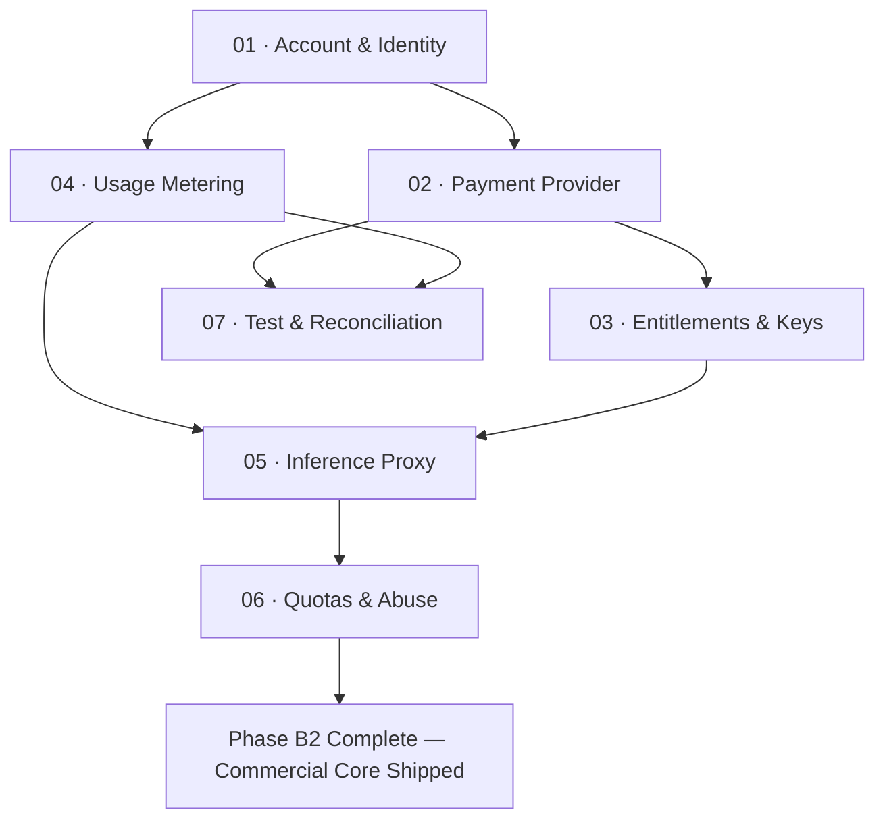

# B2 · Billing Engineering

> The code: engineering the accounts, payment integrations, entitlement keys, usage meters,
> hosted inference proxy, quota ceilings, and financial reconciliation systems.

| Field | Value |
|---|---|
| **Status** | `ready` (engineering is fully specifiable; execution gated on B0 license and B1-02 revenue model) |
| **Theme** | Production billing, auth, proxy, and metering infrastructure |
| **Depends on** | Phase B0 ([`roadmap/money_print/b0-preconditions/`](roadmap/0_money_print/b0-preconditions/README.md)), [`B1-02`](02-choose-the-revenue-model.md), and Phase B4 (Entity) |
| **Blocks** | Phase B3 (Distribution & GTM), Phase B5 (Customer Operations), Paid Customer Launch |
| **Touches** | `kaioken_v2/packages/model/`, `kaioken_v2/packages/agent/`, `kaioken_v2/apps/cli/`, hosted services |
| **Risk** | High — bugs in metering or quota controls cause financial leaks or unjustified customer charges |
| **Gate-critical** | **Yes — real engine gates must pass: `npm test` and `npm run typecheck`** |

---

## Why this milestone exists

Unlike Phase B0 and Phase B1, which are largely `blocked` on legal determinations and human strategic choices,
**Phase B2 is mostly `ready`**. Once the license is chosen and the hybrid revenue model is adopted, the
technical engineering required to take money, meter usage, and protect margins is concrete and specifiable.

Phase B2 builds the software systems that bridge the local open-source client to the commercial cloud:
1. **Account & Identity (`01`):** Introduces authentication and user identity to a codebase that currently
   has zero user concepts.
2. **Payment Provider Integration (`02`):** Connects to a Merchant of Record (MoR) to handle global payments
   and tax compliance.
3. **Entitlements & License Keys (`03`):** Issues cryptographically verifiable tokens that govern feature access.
4. **Usage Metering (`04`):** Measures token consumption accurately enough to bill without dispute, directly
   addressing Gap **G-4**.
5. **Inference Proxy & Margin (`05`):** Operates the hosted model proxy that adds the commercial retail margin.
6. **Quotas & Abuse Controls (`06`):** Hard resource stops that prevent negative gross margins, reusing
   the architecture from Milestone M7.
7. **Billing Test & Reconciliation (`07`):** Reconciles gateway receipts against provider invoices with a
   solo-operator monthly runbook.

---

## Leaves, in execution order

| # | Leaf | Size | Status | Gate-critical |
|---|---|---|---|---|
| 01 | [Account and identity](01-account-and-identity.md) | M | `ready` | Yes |
| 02 | [Payment provider integration](02-payment-provider-integration.md) | M | `ready` | Yes |
| 03 | [Entitlements and license keys](03-entitlements-and-license-keys.md) | M | `ready` | Yes |
| 04 | [Usage metering](04-usage-metering.md) | M | `ready` | **Yes — Financial Accuracy** |
| 05 | [Inference proxy and margin](05-inference-proxy-and-margin.md) | M | `ready` | **Yes — Revenue Engine** |
| 06 | [Quotas and abuse controls](06-quotas-and-abuse-controls.md) | M | `ready` | **Yes — Margin Protection** |
| 07 | [Billing test and reconciliation](07-billing-test-and-reconciliation.md) | S | `ready` | Yes |

---

## Dependency graph



---

## The real engine gates

Unlike business decision leaves, every implementation leaf in Phase B2 must pass the real engine gates
from `kaioken_v2/`:

```bash
# In kaioken_v2/
npm run typecheck    # tsc --build --force (Solution file check)
npm test             # npm run build && vitest run (Offline tests only)
node apps/cli/dist/bin.js scan --root .  # Smoke test
```

> **Standing Rule:** Phase B2 code must not break the offline determinism of Phase 1. If a developer runs
> `npm test` without an internet connection or payment API keys, all tests must pass cleanly.

---

## Done when

- [ ] CLI can authenticate a user via OAuth2 device flow and store an encrypted session token.
- [ ] Test checkout flow with an MoR provider successfully provisions a user subscription.
- [ ] Entitlement service issues ed25519-signed license keys that validate offline.
- [ ] Usage metering records verified provider token usage, rejecting unmeasured approximations (Gap G-4).
- [ ] Inference proxy routes requests to upstream providers, injects server-side keys, and logs billable tokens.
- [ ] Quota engine halts requests when customer credit allowances or spend ceilings trip.
- [ ] End-to-end sandbox purchase, inference run, and monthly reconciliation test pass.

---

## Traps

| Trap | Guard |
|---|---|
| Breaking offline tests with network payment checks | The test suite is deterministic and offline by design. Double all billing network calls with scripted doubles |
| Billing on unmeasured token counts (Gap G-4) | You cannot bill on estimates. Unmeasured provider responses must be flagged, not guessed |
| Direct Stripe gateway without tax automation | A solo developer cannot manage VAT registration in 40 jurisdictions. Use a Merchant of Record |
| Failing closed on mid-run subscription expiration | If a subscription lapses mid-session, let in-flight work finish gracefully; block subsequent runs |
