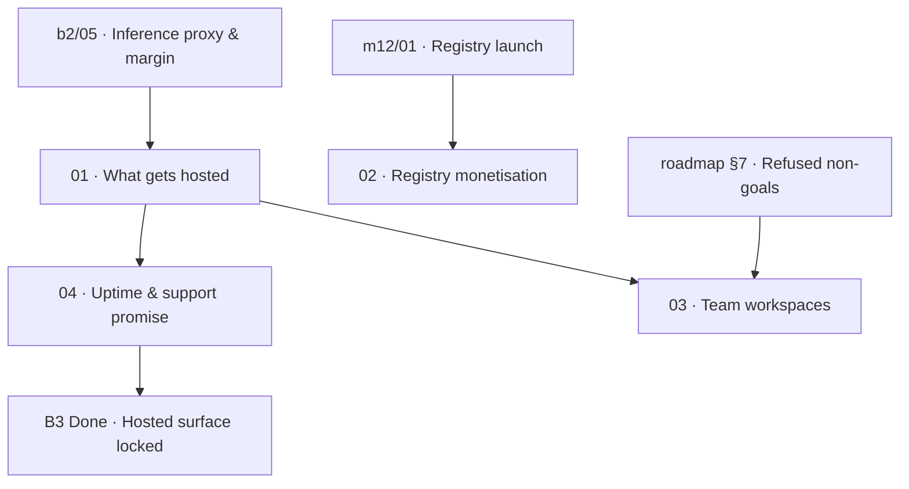

# B3 · Hosted surface

> Define the minimal viable hosted infrastructure that carries revenue, explicitly acknowledging that every hosted service transforms a one-time software build into a permanent, 24/7 operational pager for a solo maintainer.

| Field | Value |
|---|---|
| **Phase** | B3 · Hosted Surface |
| **Theme** | Operational minimalism · Pager minimization |
| **Depends on** | [`b1-model-and-positioning`](roadmap/0_money_print/b1-model-and-positioning/README.md), [`b2-billing-engineering`](roadmap/0_money_print/b2-billing-engineering/README.md) |
| **Blocks** | [`b5-go-to-market`](roadmap/0_money_print/b5-go-to-market/README.md), [`b6-scale`](roadmap/0_money_print/b6-scale/README.md) |
| **Status** | `ready` |

---

## Why this phase exists

Shipping client-side software is a one-time build: when a bug slips through, a user files an issue, the maintainer cuts a patch on their own schedule, and the user updates. 

Hosting server-side software is completely different. **Every item in this phase converts a one-time engineering build into a permanent, un-pausable operational obligation for exactly one person.** The moment Kaioken runs an internet-facing service that paying customers rely on, the maintainer quietly acquires a pager. When that service goes down at 03:00 on a Sunday, paying customers cannot work, credit card disputes begin, and support tickets accumulate.

Operating rule 1 ([`roadmap/README.md:404`](../../README.md#L404)) establishes that *the bottleneck is review, not generation*. In operations, the bottleneck is even harsher: **human attention and availability**. An AI agent cannot wake up at night to debug a crashed proxy, renew an expired TLS certificate, or negotiate with upstream LLM providers during an unannounced API outage.

Therefore, this phase exists to enforce radical operational discipline:
1. **Host the absolute minimum:** Every service not directly carrying revenue is eliminated from the hosted boundary.
2. **Reject high-overhead distractions:** Features like public registry hosting and real-time team collaboration are held behind explicit refusal criteria.
3. **Promise only what a solo human can deliver:** Sane, bounded uptime and support commitments that prevent burnout and eliminate false enterprise expectations.

---

## The operational reality: the solo pager

In the open-core and metered inference model ([`inspire/opencode/`](../../../inspire/opencode/)), revenue concentrates in services the user cannot trivially host themselves. However, each hosted candidate carries distinct operational failure modes:

| Candidate service | Revenue role | Operational failure mode | Solo maintainer pager impact |
|---|---|---|---|
| **Inference Proxy** | Carries core token margin (`b2/05`) | Upstream rate limits, token budget exhaustion, latency spikes | **Critical:** CLI and Studio hang if down |
| **Account & Entitlement** | Validates paid tier & credit balance | Auth DB corruption, JWT validation failure, webhook drop | **Critical:** Paying users locked out |
| **Extension Registry** | Ecosystem discovery (`registry-web`) | Malicious WASM/MCP packages, supply-chain attacks | **High:** Legal and moderation liability |
| **Hosted Wiki Publishing** | Web hosting for generated docs | Storage bloat, CDN cost runaway, DDoS targeting | **Medium:** Distraction from core engine |
| **Team Sync Server** | Multi-user shared sessions | WebSocket state desync, distributed race conditions | **Severe:** Multi-tenant distributed systems nightmare |

The strategy of Phase B3 is to prune this list down to **only the inference proxy and its companion entitlement check**, offloading database and infrastructure management to managed serverless platforms, while leaving everything else local, static, or deferred.

---

## Leaves, in execution order

| # | Leaf | Size | Status | Gate-critical |
|---|---|---|---|---|
| 01 | [The smallest hosted surface that carries revenue](01-what-gets-hosted.md) | M | `ready` | Yes |
| 02 | [Registry monetisation and operational liability](02-registry-monetisation.md) | M | `ready` | No |
| 03 | [Team workspaces and re-evaluating collaboration non-goals](03-team-workspaces.md) | M | `ready` | No |
| 04 | [Uptime, support boundaries, and refund commitments](04-uptime-and-support-promise.md) | S | `ready` | Yes |

---

## Dependency graph

---

## Done when

- [ ] The hosted surface is explicitly bounded in writing to only the inference proxy and lightweight entitlement validator.
- [ ] Hosted wiki publishing is formally rejected as a managed service; CLI `export` to user-owned storage is documented as the sole supported path.
- [ ] Extension registry monetisation is evaluated, and the decision to keep `registry-web` static, database-free, and un-monetised at launch is committed.
- [ ] Re-evaluation criteria for team collaboration features (shared sessions, RBAC) are documented with hard revenue and user count triggers; until those are met, the roadmap non-goal refusal stands.
- [ ] A written, public-facing uptime and support promise is drafted, containing no 24/7 SLA, stating a 48-business-hour response target, and specifying a clear refund mechanism.

---

## Traps

| Trap | Guard |
|---|---|
| Hosting a stateful database for session sync | Maintain the architectural invariant: local-first execution. Sessions stay on developer machines (`packages/session`). |
| Offering 99.9% uptime with financial penalties | A solo maintainer cannot guarantee 43 minutes of downtime per month. State "best effort" with pro-rated refunds instead. |
| Building hosted documentation portals | Users already have GitHub Pages, Vercel, and S3. Generate static Markdown/HTML via `kaioken export` and let users host their own docs. |
| Monetising the registry before having users | Paid listings attract spam and require active dispute moderation. Keep `registry-web` a free GitHub PR workflow. |
