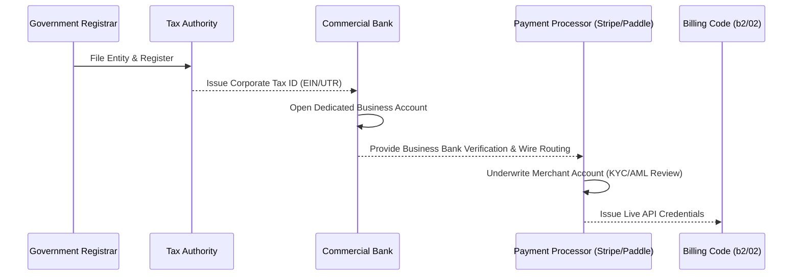

# B4-02 · Business banking and payment underwriting rails

> Establish commercial banking rails and navigate merchant payment processor underwriting in the strict prerequisite order, preventing payout freezes and account termination during commercial launch.

| Field | Value |
|---|---|
| **Status** | `ready` |
| **Size** | S |
| **Depends on** | [`01-entity-and-jurisdiction.md`](01-entity-and-jurisdiction.md) |
| **Blocks** | [`roadmap/money_print/b2-billing-engineering/02-payment-provider-integration.md`](02-payment-provider-integration.md), [`03-tax-and-invoicing.md`](03-tax-and-invoicing.md) |
| **Touches** | Commercial bank account setup, merchant processor verification dossiers |
| **Risk** | Medium. Payment processors routinely freeze payouts or demand 25% rolling reserves on newly incorporated developer-tool accounts if corporate banking and business verification documents are incomplete. |
| **Gate-critical** | Yes |

---

## Why this exists

A recurring trap for technical founders is attempting to set up payments in the wrong order:
1. Build the checkout integration in code.
2. Sign up for a payment gateway (Stripe, Paddle).
3. Discover the gateway requires an entity certificate and tax ID.
4. Discover the gateway refuses to deposit customer payouts into a personal bank account.
5. Spend four weeks waiting for banking approval while live customer checkouts are blocked or funds are held in escrow.

Payment rails are heavily regulated by financial authorities enforcing anti-money laundering (AML) and Know-Your-Customer (KYC) statutes. Payment processors are not banks; they are underwriting intermediaries. If an account experiences sudden transaction volume without established commercial banking rails, risk algorithms flag the account for suspected fraud, freezing payouts for 90 days.

This leaf documents the exact, non-blocking operational dependency sequence: **Entity -> Tax ID -> Dedicated Business Bank Account -> Payment Underwriting -> Live Billing Integration**.

---

## Current state

Verified against business path prerequisites:

| Dependency step | Requirement | Status |
|---|---|---|
| 1. Entity Formation | Approved Articles of Incorporation / Association | Gated behind [`01-entity-and-jurisdiction.md`](01-entity-and-jurisdiction.md) (`blocked`). |
| 2. Corporate Tax ID | Government-issued employer/business tax registration | Gated behind `01`. |
| 3. Commercial Bank Account | Dedicated business checking account in legal entity name | Not yet opened. |
| 4. Payment Processor Setup | Stripe / Paddle merchant account integration | Gated behind [`roadmap/money_print/b2-billing-engineering/02-payment-provider-integration.md`](02-payment-provider-integration.md). |
| 5. Public Compliance Terms | Live website URL displaying ToS, Privacy Policy, and Refund Policy | Gated behind [`04-terms-privacy-dpa.md`](04-terms-privacy-dpa.md) and [`roadmap/money_print/b3-hosted-surface/04-uptime-and-support-promise.md`](04-uptime-and-support-promise.md). |

`UNVERIFIED:` Time required for fintech banks (e.g. Mercury, Wise Business, Relay) vs traditional brick-and-mortar commercial banks to approve international entity applications (typically 2 to 10 business days).

---

## The strict operational dependency chain



Attempting to skip any step in this sequence inevitably triggers compliance holds.

---

## Payment processor underwriting checklist

Before submitting an application to Stripe, Paddle, or an alternative merchant processor, the maintainer must assemble this verification dossier:

1. **Proof of Legal Entity:** Certified copy of Certificate of Incorporation or Articles of Organization.
2. **Proof of Tax ID:** Official confirmation letter from national/state tax authority.
3. **Proof of Operating Address:** Bank statement, utility bill, or official registered agent lease in the entity's legal name.
4. **Beneficial Ownership Disclosure:** Government-issued photo ID (passport) for the maintainer holding 100% equity.
5. **Compliant Live Website:** Merchant processors inspect the website before enabling live mode. The site must publicly display:
   - Clear description of the software product ([`website/src/pages/docs/DocsIndex.tsx`](file:///D:/project/ai_now_know/website/src/pages/docs/DocsIndex.tsx)).
   - Public pricing table with currency units ([`roadmap/money_print/b5-go-to-market/04-pricing-page-and-checkout.md`](04-pricing-page-and-checkout.md)).
   - Transparent 14-day refund and cancellation policy ([`roadmap/money_print/b3-hosted-surface/04-uptime-and-support-promise.md`](04-uptime-and-support-promise.md)).
   - Complete legal entity name and contact email address in terms of service ([`04-terms-privacy-dpa.md`](04-terms-privacy-dpa.md)).

---

## Banking architecture for solo developers

To minimize foreign exchange conversion fees and maintain strict accounting segregation:

- **Dedicated Commercial Account:** Never run customer payments into a personal account. Mixing personal and corporate funds pierces the corporate veil, nullifying limited liability protections.
- **Multi-Currency Capability:** Software buyers globally purchase predominantly in USD, EUR, and GBP. Opening a multi-currency business account (e.g. through Wise Business, Revolut Business, or modern commercial banks) avoids forced 2%–3% ASSUMPTION foreign currency conversion margins levied by standard retail banks.
- **Segregated Tax & Reserve Sub-Account:** Configure automated transfers routing 20%–30% ASSUMPTION of every gross payout into a dedicated tax-holding sub-account to fund annual corporate taxes and VAT liabilities without cash-flow surprises.

---

## What done looks like

- [ ] Commercial business bank account opened under the official legal name of the entity.
- [ ] Bank account linked to Stripe / Paddle underwriting dashboard.
- [ ] KYC and beneficial ownership verification fully approved by payment processor.
- [ ] Payout schedule configured (e.g. weekly or monthly rolling payouts to business checking).
- [ ] A test payout of $1.00 successfully transferred from processor to business bank account.

---

## Steps

1. **Select Commercial Banking Partner.**
   Based on the jurisdiction chosen in `b4/01`, select an authorized commercial bank or licensed electronic money institution (EMI) offering business accounts with zero monthly maintenance fees and multi-currency capabilities.
2. **Submit Business Account Application.**
   Provide the Certificate of Incorporation, Tax ID, and maintainer identification.
3. **Verify Bank Account Routing Details.**
   Obtain official bank statement showing legal name, account number, routing/BIC/IBAN numbers, and physical address.
4. **Complete Payment Processor Onboarding.**
   Submit the verification dossier to Stripe or Paddle. Ensure the website matches the compliance requirements in the checklist above.
5. **Execute Verification Test.**
   Process a live test transaction ($1.00 ASSUMPTION), verify payment capture, and confirm deposit into the corporate bank account.

---

## In scope

- Commercial business bank account selection criteria.
- Payment processor KYC and underwriting requirements.
- Sequencing dependencies between corporate papers, banking, and billing code.
- Foreign exchange and multi-currency payout strategy.

---

## Out of scope

- Implementing webhook listeners in TypeScript (handled in `b2/02`).
- Setting up merchant-of-record sales tax collection rules (handled in `b4/03`).
- Applying for corporate venture debt or business credit lines.

---

## Gates

1. An active commercial business bank account exists in the legal entity's name.
2. Payment processor account status transitions from "Pending Verification" to "Active / Verified".
3. A test transaction settles successfully into the business checking account.

---

## Traps

| Trap | Guard |
|---|---|
| Applying for Stripe before the website is public | Stripe reviewers will reject or place a hold on applications where the URL returns a 404 or "Under Construction" page. Deploy docs, pricing, and ToS first. |
| Using a personal PayPal or Stripe account | Personal accounts cannot issue corporate invoices, trigger personal tax audits, and risk instant suspension when volume spikes. Use a business entity account exclusively. |
| Ignoring rolling reserve clauses | Processors may quietly impose a 10% rolling reserve for 90 days on new AI developer tools. Maintain an operational cash cushion. |

---

## Open questions

None. The dependency sequence and underwriting requirements are standard across major payment networks.

---

## Session brief

```xml
<task>
In roadmap/money_print/b4-company-formation/02-banking-and-payment-rails.md, establish the banking and payment underwriting requirements for Kaioken.

Document the practical dependency chain:
1. Entity formation (b4/01)
2. Tax ID issuance
3. Dedicated commercial bank account
4. Payment provider underwriting (Stripe/Paddle KYC)
5. Billing engineering going live (b2/02)

Detail the merchant underwriting checklist (corporate proof, beneficial ownership, compliant website with ToS and refund policy), multi-currency payout handling, and anti-fraud reserve risks.
</task>

<research_mode>
In your analysis, strictly separate:
- OBSERVED FACTS: Dependencies on b4/01, b2/02, and public website requirements.
- INFERENCES: Why payment gateways flag newly incorporated AI developer tools for rolling reserves.
- OPEN QUESTIONS: Specific banking vendor chosen once jurisdiction is selected.
</research_mode>

<verification_loop>
Verify all cross-references to b4/01, b2/02, and b3/04.
Ensure all financial percentages and assumptions carry ASSUMPTION labels.
</verification_loop>

<action_safety>
Scope strictly to roadmap/money_print/b4-company-formation/02-banking-and-payment-rails.md.
Do NOT modify engine source code.
Do NOT run git add or git commit.
</action_safety>

<structured_output_contract>
End with: (1) dependency sequence diagram, (2) underwriting verification checklist, (3) banking segregation strategy, (4) uncommitted working tree confirmation.
</structured_output_contract>
```
