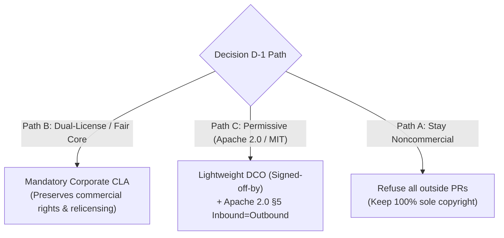

# B4-05 · Contributor licensing: CLA vs DCO vs copyright consolidation

> Resolve the contributor licensing policy before merging external contributions, balancing future relicensing flexibility against open-source contribution friction while safeguarding corporate copyright ownership.

| Field | Value |
|---|---|
| **Status** | `ready` |
| **Size** | M |
| **Depends on** | [`roadmap/decisions/d1-license.md`](../../decisions/d1-license.md), [`01-entity-and-jurisdiction.md`](01-entity-and-jurisdiction.md) |
| **Blocks** | Milestone M12 Ecosystem GA, merging any public external pull requests |
| **Touches** | `CONTRIBUTING.md`, `.github/workflows/`, GitHub pull request checks |
| **Risk** | High. Merging even a 10-line pull request from an outside developer without a Contributor License Agreement (CLA) or Developer Certificate of Origin (DCO) can permanently legally deadlock project relicensing. |
| **Gate-critical** | Yes |

---

## Why this exists

Under established copyright law across common law and civil jurisdictions, the author of an original software patch automatically retains exclusive copyright in their contribution unless a written legal agreement explicitly assigns that copyright or grants broad relicensing authorization to the project maintainer.

The master decision record [`roadmap/decisions/d1-license.md:23-28`](../../decisions/d1-license.md#L23-L28) establishes the strict operational deadline for Kaioken's licensing model: **March 2027**. The explicit rationale recorded in D1 is that:
> *"Relicensing gets harder with every outside contributor who lands a pull request. Under common law and open-source copyright precedent, changing a license requires consent from 100% of copyright holders unless a Contributor License Agreement (CLA) is in place. The decision must be made while the contributor list is still a solo maintainer."*

This decision is **time-sensitive in exactly the same way and for exactly the same reason**. Once an open-source repository begins receiving external contributions, merging code without an intentional contributor policy creates an irreversible legal trap:
1. If the project ever needs to relicense (e.g. from License Zero to Apache 2.0, or from open-core to a dual commercial model), the maintainer must locate, contact, and obtain signed written consent from **every single individual who ever contributed a merged commit**.
2. If even one contributor cannot be found, has died, or refuses consent, that contributor's code must be manually excised and completely rewritten from scratch.

However, requiring a heavy legal agreement creates immediate friction: casual open-source contributors often refuse to sign corporate CLAs, viewing them as asymmetric corporate rights grabs. This leaf resolves that tension.

---

## Current state

Verified against the repository working tree:

| Dimension | Current status | Evidence |
|---|---|---|
| **Contributor baseline** | 100% solo maintainer | `git shortlog -sn` reflects commits exclusively from the repository owner. |
| **External PRs** | Zero external PRs merged | Clean baseline. Zero third-party copyright claims currently exist. |
| **Current license** | License Zero Noncommercial (v1) / Unlicensed (v2) | [`roadmap/decisions/d1-license.md:38-45`](../../decisions/d1-license.md#L38-L45). Relicensing to open-source or commercial model is pending. |
| **Contributor gating** | None | No CLA bot, no DCO check, and no `CONTRIBUTING.md` exists in the repository. |

`UNVERIFIED:` Community abandonment rate of pull requests when confronted with automated GitHub CLA bots (frequently estimated in open-source studies at 15%–30% drop-off for casual documentation or typo fixes).

---

## The structural comparison: CLA vs DCO vs Inbound=Outbound

| Contributor mechanism | How it works | Impact on relicensing & commercial rights | Contributor friction | Industry standard usage |
|---|---|---|---|---|
| **1. Contributor License Agreement (CLA)** | Contributor signs an electronic agreement granting the corporate entity a perpetual, irrevocable, worldwide license to relicense, commercialize, and sub-license the contribution under any terms (or assigns full copyright). | **Maximum flexibility.** The corporate entity retains absolute authority to change licenses, sell proprietary enterprise editions, or dual-license without asking permission. | **High friction.** Deters hobbyist and casual contributors. Requires clicking an external OAuth workflow and signing a legal contract. | Canonical (Ubuntu), Google, Apache Foundation, Meta, HashiCorp (historically). |
| **2. Developer Certificate of Origin (DCO)** | Contributor adds a standard `Signed-off-by: Name <email>` trailer to git commits, certifying that the code is their own original work and they have the legal right to submit it under the project's existing license. | **Zero relicensing flexibility.** The contributor retains their own copyright. The project is legally locked into its current open-source license; relicensing requires 100% unanimous consent. | **Very low friction.** Standard git CLI flag (`git commit -s`). Supported natively across GitHub and Linux kernel. | Linux Kernel, CNCF / Kubernetes, Docker/Moby, Git. |
| **3. Inbound = Outbound (Default)** | No explicit document. Under licenses like Apache 2.0 (§5) or MIT, contributions submitted to the repository are legally presumed to be licensed under the project's existing outbound license. | **Zero relicensing flexibility.** Same as DCO, but with less explicit paper trail against corporate IP theft or employee moonlighting disputes. | **Zero friction.** Contributors simply open a PR and merge. | Most small-to-medium MIT open-source projects. |

---

## The strategic resolution for Kaioken

The choice of contributor mechanism depends directly on the resolution of Decision D-1 ([`roadmap/decisions/d1-license.md`](../../decisions/d1-license.md)):



### Recommendation
1. **If Decision D-1 selects Path C (Permissive Apache 2.0 / Open Core):**
   Adopt a **Developer Certificate of Origin (DCO)** enforced via an automated GitHub Action check (e.g. `dco-check`). 
   - *Rationale:* Apache 2.0 already provides strong patent grants and §5 inbound=outbound terms. Because commercialization is driven by hosted inference margin (`b2/05`) and cloud services rather than selling closed-source engine seats, relicensing the core engine is unnecessary. A DCO provides an ironclad audit trail proving contributors had the right to contribute, without the chilling effect of a heavy corporate CLA.
2. **If Decision D-1 selects Path B (Dual-Licensing / Commercial Core):**
   A **lightweight automated CLA** (e.g. via CLA-Assistant) is **mandatory before merging the first external PR**.
   - *Rationale:* Selling commercial exceptions requires the entity to guarantee complete, clean ownership of the codebase to paying customers.

---

## What done looks like

- [ ] Contributor policy formally adopted in alignment with Decision D-1.
- [ ] `CONTRIBUTING.md` authored at the repository root, clearly explaining the license terms and contributor requirements.
- [ ] An automated GitHub pull request check configured (either CLA-Assistant or DCO bot) blocking merge on unsigned contributions.
- [ ] Explicit exemption for internal maintainer commits.

---

## Steps

1. **Wait for Decision D-1 Resolution.**
   Ensure the maintainer has chosen Path B or Path C in [`roadmap/decisions/d1-license.md`](../../decisions/d1-license.md).
2. **Draft `CONTRIBUTING.md`.**
   Create `CONTRIBUTING.md` explaining:
   - Coding standards and local testing gates (`npm test` and `npm run typecheck` in `kaioken_v2/`).
   - Contributor signoff requirement (DCO `git commit -s` or CLA signoff).
   - Patent and copyright grant terms.
3. **Deploy GitHub PR Verification Action.**
   Add `.github/workflows/contributor-check.yml`:
   - If DCO: Run action verifying every commit in incoming PRs contains a valid `Signed-off-by:` trailer matching the commit author.
   - If CLA: Integrate CLA Assistant app configured against the company's legal entity.
4. **Enforce Branch Protection Gate.**
   Add the contributor verification workflow as a mandatory required status check on `master`/`main` before any pull request can be merged.

---

## In scope

- Analysis of CLA vs DCO vs inbound=outbound legal models.
- Alignment with Decision D-1 and March 2027 contributor expansion deadline.
- Defining contributor workflow guidelines in `CONTRIBUTING.md`.
- Automated CI gating for incoming pull requests.

---

## Out of scope

- Setting up manual paper signature workflows.
- Individually negotiating custom contributor agreements with corporations.
- Rewriting archived `.kaioken_v1/` git history.

---

## Gates

1. A committed `CONTRIBUTING.md` file specifying the contribution license model.
2. Automated GitHub Action verifying contributor signoff deployed and passing.
3. Zero external pull requests merged into `master` without verified contributor signoff.

---

## Traps

| Trap | Guard |
|---|---|
| Merging a "tiny" external PR without signoff | A 5-line PR fixing a critical regex still confers copyright to the contributor. Enforce the gate on 100% of external commits. |
| Using an intimidating 10-page corporate CLA for a permissive open-source project | If the project is Apache 2.0, a heavy CLA scares away contributors for zero practical benefit. Use DCO for Apache 2.0 projects. |
| Forgetting to assign maintainer commits to the company | The contributor policy must state that the corporate entity holds the assigned rights from the founder (`b4/01`). |

---

## Open questions

None. The trade-offs and trigger conditions tied to Decision D-1 are fully defined.

---

## Session brief

```xml
<task>
In roadmap/money_print/b4-company-formation/05-contributor-agreement.md, evaluate contributor licensing mechanisms (CLA vs DCO vs Inbound=Outbound) for Kaioken.

Cross-reference roadmap/decisions/d1-license.md and its March 2027 deadline reasoning: relicensing gets exponentially harder with every outside contributor who lands a pull request.

Examine the core tension:
1. A Contributor License Agreement (CLA) preserves absolute relicensing and commercial flexibility, but deters casual open-source contributors.
2. A Developer Certificate of Origin (DCO) minimizes contribution friction, but locks the codebase irrevocably into its current license.

Formulate the decision path contingent on Decision D-1: DCO if Path C (Permissive Apache 2.0), CLA if Path B (Dual-License).
</task>

<research_mode>
In your analysis, strictly separate:
- OBSERVED FACTS: Solo contributor baseline (100% copyright, 0 external PRs) and D1 deadline reasoning (lines 23-28).
- INFERENCES: Why casual developers often abandon PRs when faced with corporate CLAs.
- OPEN QUESTIONS: The maintainer's pending selection on Decision D-1.
</research_mode>

<verification_loop>
Verify citations to roadmap/decisions/d1-license.md.
Confirm that no legal claims are stated as formal legal advice.
</verification_loop>

<action_safety>
Scope strictly to roadmap/money_print/b4-company-formation/05-contributor-agreement.md.
Do NOT modify engine source code.
Do NOT run git add or git commit.
</action_safety>

<structured_output_contract>
End with: (1) comparative trade-off matrix across CLA, DCO, and Inbound=Outbound, (2) dependency mapping to Decision D-1, (3) implementation steps for CONTRIBUTING.md, (4) uncommitted working tree confirmation.
</structured_output_contract>
```
