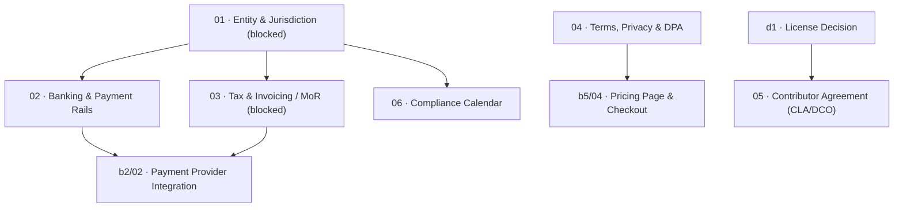

# B4 · Company formation

> Establish the legal, financial, and regulatory scaffolding required to sell commercial software, preparing the exact questions and decisions for a qualified professional without substituting for legal or accounting advice.

| Field | Value |
|---|---|
| **Phase** | B4 · Company Formation |
| **Theme** | Legal scaffolding · Liability limitation · Regulatory compliance |
| **Depends on** | [`roadmap/decisions/d1-license.md`](../../decisions/d1-license.md), [`roadmap/money_print/b0-preconditions/`](roadmap/0_money_print/b0-preconditions/README.md) |
| **Blocks** | [`roadmap/money_print/b2-billing-engineering/02-payment-provider-integration.md`](02-payment-provider-integration.md), [`roadmap/money_print/b5-go-to-market/`](roadmap/0_money_print/b5-go-to-market/README.md) |
| **Status** | `blocked` (pending maintainer jurisdictional decision and professional counsel) |

---

## Foundation: preparation, not legal advice

This phase establishes the legal, tax, and corporate infrastructure necessary to transform Kaioken from a personal research project into a solvent commercial enterprise. 

> [!IMPORTANT]
> **Legal and Tax Disclaimer:** The documents in this phase do **not** constitute legal, tax, financial, or corporate governance advice. The maintainer's personal domicile and tax jurisdiction are **not recorded anywhere in this repository and must not be assumed** — do not default to a Delaware C-Corp, a US LLC, a UK Ltd, an Estonian e-Residency entity, or any other specific corporate structure. 
>
> Every leaf in this phase exists to produce **the precise questions to ask and decisions to make** in consultation with a qualified attorney, chartered accountant, or licensed tax advisor in the maintainer's own jurisdiction. These documents are preparation for an informed conversation with a professional, not a substitute for one.

---

## Why this phase exists

Writing code as an individual is legally straightforward: an open-source disclaimer ("THE SOFTWARE IS PROVIDED AS IS, WITHOUT WARRANTY OF ANY KIND") protects the author from most civil liability for bugs.

Selling software commercially changes everything:
1. **Personal Liability:** If the software causes data loss, leaks proprietary customer IP, or infringes a third-party patent, a sole proprietor without an entity faces unlimited personal liability — putting personal bank accounts and assets at risk.
2. **Payment Ingestion:** Payment providers (Stripe, Paddle, Adyen) cannot legally pay out commercial funds to a vacuum. They require verified corporate entities, business bank accounts, beneficial ownership declarations, and Know-Your-Customer (KYC) identity audits.
3. **Cross-Border Tax Liability:** Selling digital software across international borders triggers statutory Value-Added Tax (VAT), Goods and Services Tax (GST), and economic nexus sales tax obligations across hundreds of state and national jurisdictions from dollar one.
4. **Source Code Privacy:** Because Kaioken reads and analyzes proprietary source code ([`kaioken_v2/apps/cli/src/main.ts`](file:///D:/project/ai_now_know/kaioken_v2/apps/cli/src/main.ts)), passing prompts through a hosted inference proxy (`b2/05`, `b3/01`) touches trade secrets. Corporate customers cannot legally touch the software without an explicit Data Processing Agreement (DPA) and clear Terms of Service.

Operating rule 1 ([`roadmap/README.md:404`](../../README.md#L404)) warns that review capacity is the bottleneck. The administrative, accounting, and legal overhead of running an improperly structured company can easily consume 20 hours a week of un-delegatable human labor. This phase designs the legal scaffolding to be as **automated, outsourced, and lightweight as possible**, specifically emphasizing Merchant-of-Record (MoR) architectures to eliminate tax reporting overhead.

---

## The practical dependency sequence

Most solo technical founders attempt this sequence in reverse: they build checkout buttons, then try to connect Stripe, discover Stripe requires a business bank account, discover the bank requires corporate registration papers, and discover their personal tax setup is entangled.

The correct, non-blocking sequence is strictly linear:

---

## Leaves, in execution order

| # | Leaf | Size | Status | Gate-critical |
|---|---|---|---|---|
| 01 | [Entity choice, jurisdiction, and liability shielding](01-entity-and-jurisdiction.md) | M | `blocked` | Yes |
| 02 | [Business banking and payment underwriting rails](02-banking-and-payment-rails.md) | S | `ready` | Yes |
| 03 | [Cross-border tax, VAT, and the Merchant-of-Record decision](03-tax-and-invoicing.md) | M | `blocked` | Yes |
| 04 | [Terms of service, source code privacy, and DPA commitments](04-terms-privacy-dpa.md) | L | `ready` | Yes |
| 05 | [Contributor licensing: CLA vs DCO vs copyright consolidation](05-contributor-agreement.md) | M | `ready` | Yes |
| 06 | [Corporate records and compliance calendar](06-records-and-compliance-calendar.md) | S | `ready` | No |

---

## Done when

- [ ] The maintainer's operating jurisdiction is chosen and recorded in private company documents.
- [ ] A limited liability legal entity is formed and registered with relevant state/national authorities.
- [ ] A dedicated commercial business bank account is open and funded, fully segregated from personal finances.
- [ ] The tax architecture is finalized: Merchant of Record (MoR) vs Direct Processor + Tax Automation.
- [ ] Public Terms of Service, Privacy Policy, and Data Processing Agreement (DPA) are published on the website.
- [ ] The contributor policy (CLA vs DCO) is enacted before merging the first external pull request.
- [ ] A recurring annual compliance and tax filing calendar is committed to the company records.

---

## Traps

| Trap | Guard |
|---|---|
| Defaulting to Delaware C-Corp without counsel | Non-US residents or solo bootstrappers often copy Silicon Valley venture playbooks, resulting in dual-taxation, expensive franchise taxes, and US filing penalties ($25,000+ Form 5472 penalties). Consult a local professional. |
| Co-mingling personal and business finances | Using a personal debit card for hosting or personal account for customer payments pierces the corporate veil, destroying limited liability protection. Segregate 100% of finances on day one. |
| Attempting manual international VAT compliance | Manually registering for VAT/GST across the EU, UK, Canada, and US states is suicidal for a solo operator. Use a Merchant of Record (Paddle, Lemon Squeezy) to transfer statutory tax liability. |
| Leaving source code retention terms ambiguous | Enterprise developers will not use a proxy that logs code. The privacy policy must explicitly state zero-retention for prompt source code in the inference proxy. |
