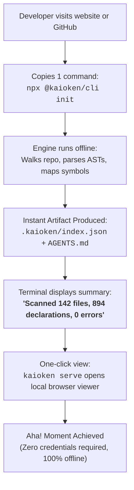

# B5-03 · The onboarding funnel and repairing documentation leaks

> Streamline the developer onboarding funnel from landing page to successful first execution, resolving the five-surface documentation fragmentation that causes new adopters to bounce.

| Field | Value |
|---|---|
| **Status** | `ready` |
| **Size** | M |
| **Depends on** | [`roadmap/m12-ecosystem-ga/03-docs-consolidation.md`](../../m12-ecosystem-ga/03-docs-consolidation.md), [`01-launch-narrative.md`](01-launch-narrative.md) |
| **Blocks** | [`02-first-hundred-users.md`](02-first-hundred-users.md), [`04-pricing-page-and-checkout.md`](04-pricing-page-and-checkout.md) |
| **Touches** | `website/src/pages/docs/DocsIndex.tsx`, `website/src/data/docs-nav.ts`, root `README.md`, CLI first-run output |
| **Risk** | High. Developer tool onboarding is unforgiving. If a developer encounters a single syntax error, broken link, or obsolete command during their first five minutes, 80%+ will abandon the tool permanently. |
| **Gate-critical** | Yes |

---

## Why this exists

A developer onboarding funnel is a high-velocity conversion pipeline:
1. **Discovery:** Developer lands on GitHub repo or website.
2. **Evaluation (30 seconds):** Skims the hero copy and terminal animation to understand the product.
3. **Execution (3 minutes):** Copies a single shell command into their terminal to test on their own repository.
4. **"Aha!" Moment (5 minutes):** Inspects the generated output and realizes the tool solves an actual problem.

Currently, **this funnel leaks catastrophically at step 3**. As established in [`roadmap/m12-ecosystem-ga/03-docs-consolidation.md:17-27`](../../m12-ecosystem-ga/03-docs-consolidation.md#L17-L27), Kaioken's documentation is fragmented across five conflicting surfaces:
- The marketing website cites archived Go v1 internal functions (`Tools()`, `serve.go`).
- The root `README.md` retains historical build references.
- The engine `kaioken_v2/README.md` documents 19 modular packages.
- The registry docs exist in a siloed web portal (`registry-web/content/`).
- The roadmap tree itself introduces internal planning vocabulary.

A newcomer who clones the repository finds no root `package.json` (the Node workspace is under `kaioken_v2/`), runs `npm install` and hits an error, or copies a deprecated CLI flag from the website that crashes `kaioken_v2/apps/cli/src/main.ts`. **A fragmented documentation funnel destroys adoption before product value can be demonstrated.**

This leaf redesigns the onboarding path into a single, bulletproof 3-minute quickstart.

---

## Current state

Verified against working tree:

| Funnel stage | Current state | Failure point | Fix required |
|---|---|---|---|
| **Landing Page** | `website/` (React/Tailwind) | Describes Go v1 capabilities in `website/src/data/roadmap.ts` | Update feature copy to match canonical v2 TypeScript commands ([`roadmap/m12-ecosystem-ga/03-docs-consolidation.md`](../../m12-ecosystem-ga/03-docs-consolidation.md)). |
| **Install Step** | Clone repo -> `cd kaioken_v2` -> `npm ci` -> `npm run build` | Requires full git clone, Node 22 toolchain, and compiling packages manually. Massive friction. | Publish `@kaioken/cli` to npm; provide single `npx @kaioken/cli init` command. |
| **First Command** | `kaioken init` in [`kaioken_v2/apps/cli/src/main.ts:36-39`](file:///D:/project/ai_now_know/kaioken_v2/apps/cli/src/main.ts#L36-L39) | Functional, but requires setting up model credentials if user wants full wiki generation. | Graceful degradation: run `scan` and `symbols` completely offline with zero API keys required. |
| **Inspection Step** | Terminal stdout or `kaioken serve` ([`apps/cli/src/main.ts:49-50`](file:///D:/project/ai_now_know/kaioken_v2/apps/cli/src/main.ts#L49-L50)) | User has to guess where `.kaioken/` files were written. | Print clickable terminal hyperlinks to local `.kaioken/index.json` and launch `kaioken serve` automatically. |

`UNVERIFIED:` Bounce rates for developer CLI tools requiring an API key on first run vs tools offering an immediate offline demonstration (industry benchmarks indicate a 60% drop-off when an API key prompt blocks initial execution).

---

## The golden onboarding path: under 3 minutes to value

The unified onboarding funnel eliminates repo cloning entirely, leading with a guaranteed offline success path:



---

## Tactical audit: eliminating the 5 leak points

| Leak point | Root cause | Enforcement action |
|---|---|---|
| **1. Obsolete Go Flags** | Website lists legacy CLI flags from v1 Go implementation. | Audit all flags against [`kaioken_v2/apps/cli/src/main.ts:31-124`](file:///D:/project/ai_now_know/kaioken_v2/apps/cli/src/main.ts#L31-L124). Purge all mentions of `go.mod`, `golangci-lint`, and Tauri. |
| **2. Source Clone Barrier** | README instructs users to clone the repo to test it. | Replace README quickstart with published npm package command: `npx @kaioken/cli init`. Source cloning is reserved for engine contributors. |
| **3. Credential Wall** | First-run setup halts if `ANTHROPIC_API_KEY` or `OPENAI_API_KEY` is missing. | Update CLI `init` flow: if no API key is detected, complete the structural AST scan, generate `AGENTS.md` and `.kaioken/scan.json`, and print: *"Offline structural index complete! To enable generative chapter wikis, add a model key or use Kaioken Cloud."* |
| **4. Invisible Output** | Output files written quietly into `.kaioken/` hidden folder. | Enhance CLI stdout: print a visual ASCII summary of identified modules, top exported symbols, and a direct localhost URL to `kaioken serve`. |
| **5. Broken Subsystem Links** | Website docs link to non-existent `/docs/registry` or outdated markdown files. | Enforce automated link-checking in CI across all markdown files in `website/` and `registry-web/`. |

---

## What done looks like

- [ ] A fresh terminal session in any third-party TypeScript/Python/Go repo executes `npx @kaioken/cli init` and reaches a green exit 0 in $< 60$ seconds with no API key.
- [ ] Website documentation (`website/src/pages/docs/DocsIndex.tsx`) provides exactly one canonical quickstart guide.
- [ ] All five documentation surfaces reconciled per [`roadmap/m12-ecosystem-ga/03-docs-consolidation.md`](../../m12-ecosystem-ga/03-docs-consolidation.md).
- [ ] The CLI displays a clickable localhost link to `kaioken serve` upon completing initialization.
- [ ] Measured time-to-first-value on a 50-file test repository is $< 3$ minutes.

---

## Steps

1. **Verify Canonical Command Set.**
   Cross-reference every command documented on the website against [`kaioken_v2/apps/cli/src/main.ts`](file:///D:/project/ai_now_know/kaioken_v2/apps/cli/src/main.ts). Ensure flags match TypeScript definitions.
2. **Optimize `kaioken init` Offline Graceful Fallback.**
   Verify that running `kaioken init` without environment variables successfully generates:
   - `.kaioken/scan.json` (Tree-sitter file declarations)
   - `.kaioken/index.json` (symbol lookup table)
   - `AGENTS.md` (instructions for downstream coding agents)
   without throwing unhandled API key exceptions.
3. **Draft the Unified Quickstart Page.**
   Create `website/src/pages/Quickstart.tsx`:
   - Step 1: `npx @kaioken/cli init` (explain what it did offline).
   - Step 2: `kaioken serve` (show how to browse knowledge).
   - Step 3: Add model keys or connect Kaioken Cloud for deep multi-pass wikis (`kaioken wiki x5`).
4. **Deploy Broken Link Checker.**
   Configure GitHub Action running `lychee` or markdown link-checker across `website/`, `README.md`, and `docs/`.

---

## In scope

- Analyzing and streamlining the user onboarding funnel.
- Identifying and plugging documentation leaks across the five surfaces.
- Specifying the zero-credential offline quickstart flow.
- Optimizing CLI first-run feedback and output presentation.

---

## Out of scope

- Redesigning the underlying AST parsing logic in `packages/index`.
- Modifying the visual CSS styling of the web documentation layout.
- Supporting legacy Node versions ($< 22$).

---

## Gates

1. A tested, documented 3-minute quickstart guide published on the website.
2. Clean run of `npm run build` from `website/` with zero missing docs routes or broken internal links.
3. Successful manual verification of `npx @kaioken/cli init` in an external repository without credentials.

---

## Traps

| Trap | Guard |
|---|---|
| Demanding an API key before showing value | Developers will close the tab if asked for an OpenAI key within 10 seconds. Show the AST index and symbol map offline first. |
| Leaving stale Go paths in quickstart examples | Stale paths like `kaioken v1/` confuse users immediately. Every path in documentation must exist in `kaioken_v2/`. |
| Overwhelming newcomers with 20 CLI commands | Focus the quickstart strictly on three commands: `init`, `serve`, and `status`. Leave advanced commands (`prism`, `fetcher`, `draft`) for reference docs. |

---

## Open questions

None. The onboarding funnel requirements and five-surface documentation fixes are fully established.

---

## Session brief

```xml
<task>
In roadmap/money_print/b5-go-to-market/03-docs-and-onboarding-funnel.md, design the streamlined developer onboarding funnel and document how to repair the documentation leaks.

Cross-reference roadmap/m12-ecosystem-ga/03-docs-consolidation.md (the five fragmented surfaces: root README, engine README, website, registry-web, and roadmap).

Establish:
1. The golden path: from landing page to successful first run in under 3 minutes (npx @kaioken/cli init).
2. The zero-credential offline success path: why the initial scan and AGENTS.md generation must succeed without API keys.
3. The five specific leak points and their tactical fixes.
4. Measurable onboarding gates.
</task>

<research_mode>
In your analysis, strictly separate:
- OBSERVED FACTS: Structure of apps/cli/src/main.ts (init, scan, serve), m12/03 docs audit findings, and website docs structure.
- INFERENCES: Why developers abandon CLI tools that require credit cards or API keys upfront.
- OPEN QUESTIONS: Exact npm package publishing timeline.
</research_mode>

<verification_loop>
Verify citations to roadmap/m12-ecosystem-ga/03-docs-consolidation.md and apps/cli/src/main.ts.
Confirm that no commands are documented that do not exist in main.ts.
</verification_loop>

<action_safety>
Scope strictly to roadmap/money_print/b5-go-to-market/03-docs-and-onboarding-funnel.md.
Do NOT modify engine source code.
Do NOT run git add or git commit.
</action_safety>

<structured_output_contract>
End with: (1) onboarding funnel flow diagram, (2) five leak points and fixes table, (3) time-to-value benchmarks, (4) uncommitted working tree confirmation.
</structured_output_contract>
```
