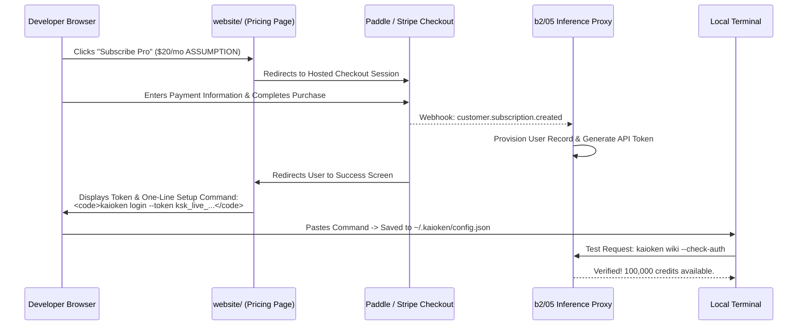

# B5-04 · The commercial pricing page, checkout flow, and honesty rules

> Build the commercial pricing surface and checkout flow on the website, strictly enforcing the honesty rule: the page must never advertise or accept payment for a tier or capability that is not yet fully functional.

| Field | Value |
|---|---|
| **Status** | `ready` |
| **Size** | M |
| **Depends on** | [`roadmap/money_print/b1-model-and-positioning/04-pricing-and-packaging.md`](04-pricing-and-packaging.md), [`roadmap/money_print/b2-billing-engineering/02-payment-provider-integration.md`](02-payment-provider-integration.md), [`roadmap/money_print/b3-hosted-surface/01-what-gets-hosted.md`](01-what-gets-hosted.md) |
| **Blocks** | First transaction of commercial revenue |
| **Touches** | `website/src/pages/Pricing.tsx`, payment checkout redirection, token issuance flow |
| **Risk** | High. Advertising vaporware features on a commercial pricing page destroys developer credibility, causes immediate refund spikes, and violates consumer protection false-advertising laws. |
| **Gate-critical** | Yes |

---

## Why this exists

A pricing page is a public legal representation of a company's product capabilities.

In early-stage software, founders frequently make the mistake of publishing "aspirational" pricing tables: listing enterprise tiers with SSO, multi-user team dashboards, real-time collaboration, and custom SLA promises before a single line of backend code has been written. When a customer pays money and discovers that clicking "Team Settings" produces a 404 or "Coming Soon" modal, the consequences are immediate: chargebacks, public shaming on developer social media, and loss of commercial trust.

Furthermore, as established in [`roadmap/money_print/b3-hosted-surface/03-team-workspaces.md`](03-team-workspaces.md), multi-user team features remain **formally refused non-goals** until specific revenue and customer demand thresholds are crossed.

Therefore, this leaf establishes the **Honesty Requirement**: **the pricing page must only describe, price, and accept money for tiers that are 100% operational in the working tree today.**

---

## Current state

Verified against product and billing architecture:

| Product capability | Operational status | Commercial readiness | Allowed on pricing page? |
|---|---|---|---|
| **Local Knowledge Engine** | 100% functional across 19 packages ([`kaioken_v2/apps/cli/src/main.ts`](file:///D:/project/ai_now_know/kaioken_v2/apps/cli/src/main.ts)). | **Free Forever Tier.** Offline AST parsing, local wiki generation with user's own API keys (BYOK). | **YES.** Core distribution driver. |
| **Metered Inference Proxy** | Architecture specified in `b2/05` and `b3/01`. | **Pro / Credit Tier.** Resells upstream tokens with zero-config setup and 30%–50% ASSUMPTION margin. | **YES, once `b2/07` verification passes.** |
| **Team Workspaces & RBAC** | Refused non-goal in [`roadmap/README.md §7`](../../README.md#L342-L344) and [`b3/03`](03-team-workspaces.md). | Unbuilt by design. | **NO CHECKOUT BUTTON.** Allowed only as an unpriced *"Contact us for pilot inquiries"* link. |
| **24/7 Phone / Enterprise SLA** | Formally rejected in [`b3/04`](04-uptime-and-support-promise.md). | Incompatible with solo maintainer model. | **NO.** Strictly prohibited from marketing copy. |

`UNVERIFIED:` Conversion rate comparison between usage-based token credit packs vs monthly recurring subscriptions in developer CLI tools (models typically test $15–$25/mo base ASSUMPTION with metered overages).

---

## The honest pricing structure

The live commercial surface (`website/src/pages/Pricing.tsx`) is restricted strictly to two operational tiers and one exploratory contact link:

```
+──────────────────────────+  +──────────────────────────+  +──────────────────────────+
|       COMMUNITY          |  |           PRO            |  |          TEAMS           |
|       $0 / mo            |  |      $20 / mo ASSUMPTION |  |      Custom Pilots       |
|      (Free Forever)      |  |  (Metered Inference Pack)|  |    (Inquire for Access)  |
+──────────────────────────+  +──────────────────────────+  +──────────────────────────+
| * 100% Local execution   |  | * Everything in Community|  | * Everything in Pro      |
| * Offline AST scanning   |  | * No API keys required   |  | * Centralized team billing|
| * Tree-sitter indexing   |  | * $20 included LLM credit|  | * Shared CI wiki runners |
| * BYO API keys (OpenAI/  |  | * Access to hosted proxy |  | * Direct maintainer setup|
|   Anthropic/OpenRouter)  |  |   (Claude 3.5, GPT-4o)   |  |                          |
| * AGENTS.md generation   |  | * Metered auto-topup     |  |                          |
| * GitHub Community triage|  | * Priority email support |  |                          |
+──────────────────────────+  +──────────────────────────+  +──────────────────────────+
|     [Download Free]      |  |      [Subscribe Now]     |  |     [Inquire for Pilot]  |
+──────────────────────────+  +──────────────────────────+  +──────────────────────────+
```

### Absolute Honesty Rules
1. **No "Ghost Features":** Every bullet point listed under the Pro tier must be verified end-to-end via an automated smoke test before the page goes live.
2. **Clear Inference Margin Transparency:** State plainly: *"Pro tier includes managed token credits routed through our high-speed edge proxy with zero prompt retention. You can always use Community tier with your own API keys at zero cost."*
3. **Transparent Cancellation:** Display the cancellation terms prominently below the button: *"Cancel anytime in one click. 14-day money-back guarantee per our [Service Promise](/terms)."*

---

## The checkout and provisioning flow

The checkout pipeline must deliver immediate utility in $< 60$ seconds:



---

## What done looks like

- [ ] `website/src/pages/Pricing.tsx` implemented and strongly typed, reflecting only the Community and Pro tiers.
- [ ] Checkout redirect integrated with the live Merchant of Record or Stripe portal (`b2/02`).
- [ ] Successful completion of checkout redirects to a dedicated `/success` page displaying an active API token and clear terminal setup instructions.
- [ ] Zero unbuilt features (e.g. real-time pair programming, multi-user web dashboards) displayed in the active tier matrices.
- [ ] 14-day refund policy ([`roadmap/money_print/b3-hosted-surface/04-uptime-and-support-promise.md`](04-uptime-and-support-promise.md)) hyperlinked directly beneath all checkout buttons.

---

## Steps

1. **Verify Pro Tier Functionality End-to-End.**
   Before writing pricing copy, execute the billing reconciliation test suite in [`roadmap/money_print/b2-billing-engineering/07-billing-test-and-reconciliation.md`](07-billing-test-and-reconciliation.md). Ensure the proxy meters tokens and enforces quotas accurately.
2. **Author `website/src/pages/Pricing.tsx`.**
   Implement the page using existing website layout tokens (`website/src/index.css`):
   - Include clear feature comparison table.
   - Embed dynamic currency detection (USD, EUR, GBP) supported by the MoR.
3. **Configure Merchant Checkout Session.**
   Connect the "Subscribe" CTA button to the checkout session URL generated by the payment provider API (`b2/02`).
4. **Build Token Delivery Success Page.**
   Create `website/src/pages/CheckoutSuccess.tsx`:
   - Display the freshly generated secret key (`ksk_live_...`).
   - Provide a copyable bash command: `kaioken config set token ksk_live_...`.
   - Provide instant troubleshooting link for billing support.
5. **Conduct Live Smoke Transaction.**
   Execute a real payment using a live credit card, verify token generation, configure CLI with the issued token, and execute `kaioken wiki x1` through the hosted proxy.

---

## In scope

- Commercial pricing table design and feature tiering.
- Enforcing the honesty requirement against unbuilt roadmap items.
- Checkout flow redirection and post-purchase token provisioning.
- Clear disclosure of cancellation and 14-day refund commitments.

---

## Out of scope

- Implementing bespoke enterprise invoicing software.
- Building an in-app billing portal from scratch (use Stripe/Paddle hosted customer portal).
- Dynamically negotiating custom discounts or coupon codes.

---

## Gates

1. Clean build of `website/` with `npm run build` containing the live `/pricing` route.
2. Zero un-shipped features advertised on the live pricing table.
3. A live $1.00 or real-tier test transaction completed, resulting in a functioning CLI API token.

---

## Traps

| Trap | Guard |
|---|---|
| Advertising "Team Plan" with a broken checkout button | If a user clicks "Buy Team" and hits an alert saying "Coming Soon", trust evaporates. Mark unbuilt tiers as "Contact for Private Pilot". |
| Burying the cancellation button | Modern software buyers expect self-service cancellation. Link the Paddle/Stripe customer management portal directly from account settings. |
| Forgetting to disclose metered overage pricing | If a user's $20 credit exhausts mid-month, state clearly what happens: does the proxy halt, downgrade to free models, or charge overages? Specify the default clamp in the pricing FAQ. |

---

## Open questions

None. The tier structure, pricing levels, and honesty constraints are fully documented.

---

## Session brief

```xml
<task>
In roadmap/money_print/b5-go-to-market/04-pricing-page-and-checkout.md, formulate the commercial pricing page, checkout flow, and honesty rules for Kaioken.

Address:
1. The Honesty Requirement: why the pricing page must never describe or sell unbuilt tiers or features (e.g. real-time team collaboration).
2. The live tier structure: Free Community (100% offline, BYOK) vs Pro ($20/mo ASSUMPTION metered inference proxy) vs Teams (unpriced pilot inquiries).
3. The frictionless checkout and provisioning flow: payment redirect -> webhook -> API token issuance -> CLI config command.
4. Transparent cancellation and 14-day refund commitment disclosures.
</task>

<research_mode>
In your analysis, strictly separate:
- OBSERVED FACTS: Working commands in apps/cli/src/main.ts, refused collaboration non-goals in README §7, and b2/05 proxy requirements.
- INFERENCES: Why developer tools experience immediate refund disputes when marketing copy outpaces code reality.
- OPEN QUESTIONS: Final base price determination ($15 vs $20 vs $25 ASSUMPTION).
</research_mode>

<verification_loop>
Verify cross-references to b1/04, b2/02, b2/05, and b3/04.
Ensure all pricing numbers are explicitly marked as ASSUMPTIONS.
</verification_loop>

<action_safety>
Scope strictly to roadmap/money_print/b5-go-to-market/04-pricing-page-and-checkout.md.
Do NOT modify engine source code.
Do NOT run git add or git commit.
</action_safety>

<structured_output_contract>
End with: (1) pricing structure table, (2) the honesty rules checklist, (3) checkout sequence diagram, (4) uncommitted working tree confirmation.
</structured_output_contract>
```
