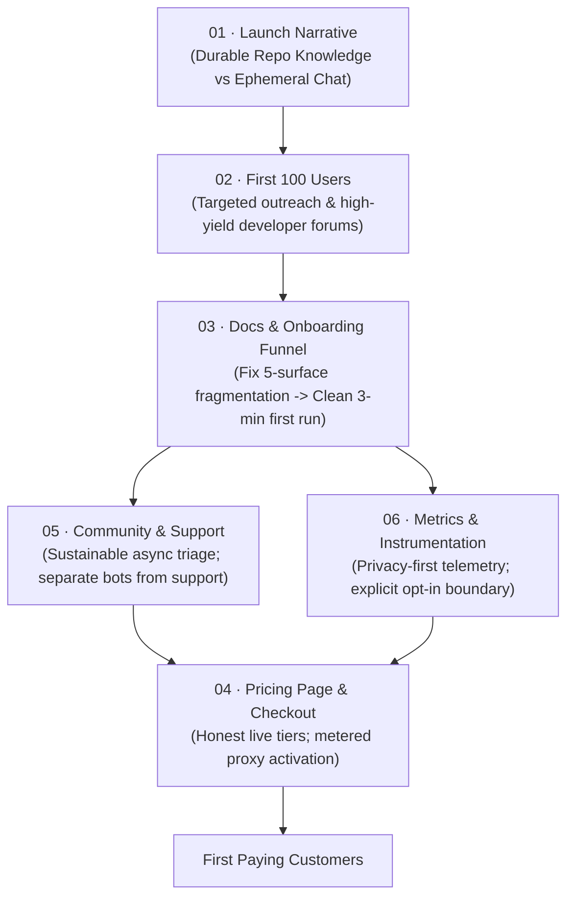

# B5 · Go to market

> Acquire the first cohort of users and convert them into paying customers, anchored directly in the engineering roadmap's quarterly reality check: "How many people other than you ran Kaioken this quarter?"

| Field | Value |
|---|---|
| **Phase** | B5 · Go to Market |
| **Theme** | Distribution · User acquisition · Conversion funnel · Ethical instrumentation |
| **Depends on** | [`roadmap/money_print/b1-model-and-positioning/`](roadmap/0_money_print/b1-model-and-positioning/README.md), [`roadmap/money_print/b2-billing-engineering/`](roadmap/0_money_print/b2-billing-engineering/README.md), [`roadmap/money_print/b3-hosted-surface/`](roadmap/0_money_print/b3-hosted-surface/README.md), [`roadmap/money_print/b4-company-formation/`](roadmap/0_money_print/b4-company-formation/README.md) |
| **Blocks** | [`roadmap/money_print/b6-scale/`](roadmap/0_money_print/b6-scale/README.md) |
| **Status** | `ready` |

---

## The honest baseline: Question 2

The master engineering roadmap defines five quarterly checkpoints that decide whether this project is a real product or an abandoned experiment ([`roadmap/README.md:414-426`](../../README.md#L414-L426)).

Question 2 is the most uncompromising:
> **"How many people other than you ran Kaioken this quarter?"** ([`roadmap/README.md:421`](../../README.md#L421))

As of today, the honest answer to Question 2 is: **zero**.

The engine is sophisticated (19 packages, offline AST parsing, multi-pass knowledge generation, deterministic test gates), but nobody outside the maintainer's local workstation has installed or executed it. Building billing systems, company entities, and pricing pages in a vacuum is meaningless if developers do not run the software.

Therefore, Phase B5 enforces an essential discipline: **free usage precedes paid conversion**. The first objective is not extracting money; it is getting developers to run `kaioken scan` and `kaioken init` on their own codebases, experiencing the moment where an agent understands their repository structure without hallucinating. Only when developers rely on that durable knowledge can the paid inference layer earn revenue.

---

## Why this phase exists

Vibe-coded projects possess an insidious failure mode: the founder can generate thousands of lines of high-quality code every week, confusing code volume with product traction. Marketing, onboarding, documentation polishing, and user support cannot be solved by asking an agent to write more packages.

This phase exists to:
1. **Differentiate from generic chat clients:** Ground Kaioken's positioning in durable, provenance-tracked repository knowledge rather than competing as "another AI coding assistant".
2. **Execute a concrete path to the first 100 users:** Rank channels by effort and yield, driving organic adoption before spending marketing budget.
3. **Plug the onboarding leaks:** Eliminate friction between landing on the homepage and completing a successful first local run ([`roadmap/m12-ecosystem-ga/03-docs-consolidation.md`](../../m12-ecosystem-ga/03-docs-consolidation.md)).
4. **Publish an honest pricing and checkout flow:** Launch commercial tiers that reflect what currently works, rejecting vaporware marketing.
5. **Establish sustainable support and ethical telemetry:** Build community channels that respect solo maintainer time and telemetry that honors absolute source code privacy.

---

## The go-to-market funnel

---

## Leaves, in execution order

| # | Leaf | Size | Status | Gate-critical |
|---|---|---|---|---|
| 01 | [The launch narrative: durable knowledge vs ephemeral chat](01-launch-narrative.md) | M | `ready` | Yes |
| 02 | [Acquiring the first hundred users: channels, effort, and yield](02-first-hundred-users.md) | M | `ready` | Yes |
| 03 | [The onboarding funnel and repairing documentation leaks](03-docs-and-onboarding-funnel.md) | M | `ready` | Yes |
| 04 | [The commercial pricing page, checkout, and honesty rules](04-pricing-page-and-checkout.md) | M | `ready` | Yes |
| 05 | [Sustainable community channels and support boundaries](05-community-and-support-channel.md) | S | `ready` | No |
| 06 | [Ethical instrumentation, privacy boundaries, and telemetry](06-metrics-and-instrumentation.md) | M | `ready` | Yes |

---

## Done when

- [ ] A defensible, one-sentence launch narrative is published, clearly distinguishing Kaioken from generic coding agents.
- [ ] A concrete outreach campaign to acquire the first 100 active users is executed across identified channels.
- [ ] The five-surface documentation fragmentation identified in M12-03 is resolved, resulting in a single tested 3-minute quickstart.
- [ ] A live pricing page and functional checkout flow are deployed, describing only tiers that currently work.
- [ ] Community support channels are established with strict asynchronous boundaries protecting solo maintainer focus.
- [ ] Product telemetry is implemented with explicit, transparent user consent, strictly collecting zero source code or confidential file paths.
- [ ] Quarterly Checkpoint Question 2 is answered with a verified number $> 0$.

---

## Traps

| Trap | Guard |
|---|---|
| Optimizing conversion before adoption | Do not spend weeks tweaking pricing copy when zero developers have run the CLI. Drive free local usage first. |
| Pitching Kaioken as a "Cursor alternative" | Competing directly with heavily funded IDEs on basic chat/autocomplete is suicide. Pitch Kaioken as the **knowledge engine** that feeds durable context to any IDE or agent. |
| Allowing documentation fragmentation to persist | If the README, website, and CLI describe three different installation commands, 80% of newcomers bounce. Unify docs first. |
| Collecting hidden telemetry on private repositories | Telemetry that phones home private repository paths or code snippets destroys developer trust permanently. Enforce strict privacy opt-in. |
