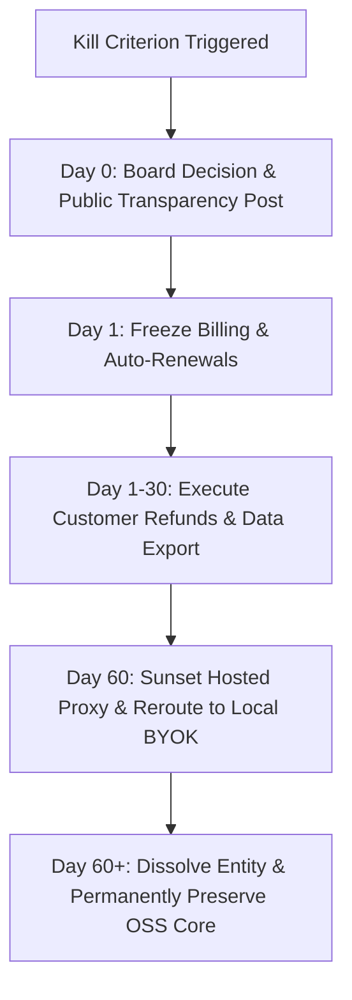

# B6-04 · The kill criteria: clean wind-down and preserving the open-source core

> Codify the non-negotiable kill criteria in advance, defining the precise conditions under which the maintainer stops charging and winds down the commercial entity cleanly, ensuring customer refunds, data export, and the permanent survival of the open-source engine.

| Field | Value |
|---|---|
| **Status** | `ready` |
| **Size** | L |
| **Depends on** | [`roadmap/README.md`](../../README.md), [`roadmap/decisions/d1-license.md`](../../decisions/d1-license.md), [`roadmap/money_print/b3-hosted-surface/04-uptime-and-support-promise.md`](04-uptime-and-support-promise.md), [`roadmap/money_print/b4-company-formation/01-entity-and-jurisdiction.md`](01-entity-and-jurisdiction.md) |
| **Blocks** | Operating safety net, founder mental health protection |
| **Touches** | Corporate dissolution protocol, customer refund pipeline, open-source repository archive |
| **Risk** | Critical. The absence of explicit, pre-committed exit criteria traps founders in agonizing "zombie companies" — spending years of personal life, health, and savings keeping an economically dead project on life support out of pride and the sunk-cost fallacy. |
| **Gate-critical** | **Yes — the single most valuable leaf in Phase B6** |

---

## Why this exists

Every business plan begins with boundless optimism: growth projections, pricing tiers, enterprise expansion, and hiring roadmaps. Almost none plan for when to stop.

The result is a tragedy common across technical founders: **the Zombie Project**. 
The founder spends two years building a product. Launch occurs, but revenue stalls at $400/month. The project does not earn enough to live on, but earns just enough to feel impossible to abandon. The founder spends their weekends answering tickets, updating dependencies, paying cloud bills out of pocket, filing annual corporate tax returns, and stressing over service uptime. Five years vanish, leaving the founder exhausted, financially depleted, and bitter toward software engineering.

The master engineering roadmap records a critical warning about this exact failure mode:
> *"Question 5 is the one that decides whether this is a v2.0 or another abandoned 40-package repo."* ([`roadmap/README.md:426`](../../README.md#L426))

**Stopping commercial operations is not failure.** Walking away from an unviable business model with your health intact, your customers made whole, your integrity clean, and a battle-tested open-source codebase gifted to the community is a profound personal and technical triumph.

This leaf exists to protect the maintainer from the sunk-cost fallacy. It is written **in advance, with a clear mind, and in the maintainer's own self-interest**, establishing binding kill criteria and the exact, ethical blueprint for winding down the commercial entity.

---

## Current state

Verified against repository and architecture:

| Dimension | Current status | Wind-down impact |
|---|---|---|
| **Engine Architecture** | 100% local, offline-capable CLI commands ([`kaioken_v2/apps/cli/src/main.ts`](file:///D:/project/ai_now_know/kaioken_v2/apps/cli/src/main.ts)) | **Enormous asset.** The engine does not rely on a centralized backend to function. If the commercial proxy shuts down tomorrow, the local engine continues to work 100% offline with BYO API keys. |
| **User Data Footprint** | Zero source code stored on servers ([`roadmap/money_print/b4-company-formation/04-terms-privacy-dpa.md`](04-terms-privacy-dpa.md)) | Wind-down requires zero complex customer source code data migrations. |
| **Refund Obligation** | Mandatory refund architecture defined in [`roadmap/money_print/b0-preconditions/05-readiness-bar.md`](05-readiness-bar.md) and [`b3/04`](04-uptime-and-support-promise.md) | Mechanism already planned for pro-rated refunds of prepaid subscriptions and unused tokens. |

`UNVERIFIED:` Typical administrative time and statutory filing fees required to formally dissolve a private limited company in the maintainer's chosen jurisdiction (typically $100–$500 in state fees and 30–90 days for final tax clearance).

---

## The four explicit kill criteria

The maintainer commits in writing to execute the wind-down protocol if **any one** of the following four conditions is triggered:

```
+─────────────────────────────────────────────────────────────────────────────+
|                        THE FOUR BINDING KILL CRITERIA                       |
+─────────────────────────────────────────────────────────────────────────────+
|  1. THE ADOPTION & REVENUE DEADLINE:                                        |
|     * If, 9 MONTHS ASSUMPTION following public launch of Phase B5:          |
|       - Active weekly users remain < 100 developers, AND                    |
|       - Monthly Recurring Revenue (MRR) remains < $1,500 ASSUMPTION         |
|     * Despite executing the channels outlined in b5/02.                     |
|                                                                             |
|  2. THE THESIS INVALIDATION:                                                |
|     * If frontier foundation models (GPT-5, Claude 4) evolve native, zero-  |
|       cost, 10-million-token persistent repository context with verifiable  |
|       zero hallucination, rendering external Tree-sitter AST indexing and   |
|       pre-computed knowledge cards obsolete.                                |
|                                                                             |
|  3. THE NEGATIVE MARGIN RESELLER TRAP:                                      |
|     * If upstream LLM token pricing or user usage patterns persistently     |
|       force negative gross margins on the inference proxy (b2/05), and      |
|       raising prices to sustainable levels causes >= 80% customer churn.    |
|                                                                             |
|  4. THE FOUNDER SANITY & HEALTH CEILING:                                    |
|     * If running the company causes chronic clinical burnout, physical      |
|       illness, or severe distress for 8 consecutive weeks, and revenue does |
|       not support hiring operational relief per b6/01.                      |
+─────────────────────────────────────────────────────────────────────────────+
```

If a kill criterion is met, **the maintainer must not "pivot" to an unrelated SaaS or double down out of embarrassment.** The decision to wind down is executed immediately and methodically.

---

## The clean wind-down protocol: step-by-step

Executing an ethical, legally clean shutdown requires six sequential steps over a structured 60-day timeline:



### Step 1: Immediate Billing Freeze (Day 0)
- **Halt all new checkouts:** Disable the "Subscribe" buttons on `website/src/pages/Pricing.tsx` (`b5/04`).
- **Disable recurring subscriptions:** In Paddle or Stripe, cancel all active subscription renewal schedules. No customer will be billed again.

### Step 2: Honest Public Communication (Day 1)
- Publish a transparent, dignified announcement on the blog, GitHub Discussions, and email newsletter:
  - Explain the decision directly: *"Kaioken's commercial hosted proxy is shutting down on [Date in 60 Days]. However, the Kaioken engine is open-source and will continue to work locally forever."*
  - Express genuine gratitude to early adopters and contributors.
  - Clearly outline the refund and transition timetable.

### Step 3: Automated Pro-Rated Refunds (Days 1–14)
- **Monthly subscriptions:** Automatically refund the current month's subscription charge for all active users via Stripe/Paddle API batch script.
- **Unused inference credits:** Automatically calculate and refund 100% of remaining prepaid token balances directly to customers' original payment methods.
- Eliminate chargebacks entirely by refunding proactively before customers ask.

### Step 4: Self-Service Data Export (Days 1–60)
- Provide a CLI export command: `kaioken export --all` bundling:
  - All local cards, wikis, and graphs (`apps/cli/src/commands/export.ts`).
  - Historical token usage CSVs for enterprise accounting.
- Because Kaioken stores zero customer source code on its servers (`b4/04`), customers retain 100% of their data on their local machines.

### Step 5: Sunset Hosted Proxy & Seamless Local Fallback (Day 60)
- Shut down the hosted edge inference proxy infrastructure (`b3/01`).
- Release a final CLI patch (`@kaioken/cli` v2.x):
  - Automatically detect expired cloud tokens.
  - Gracefully fallback to local mode, prompting users: *"Kaioken Cloud is retired. To continue using generative commands, add your own API key: `export ANTHROPIC_API_KEY=...`"*.
  - The local Tree-sitter indexing, symbol lookup, knowledge graph, and CI drift verification continue to work indefinitely offline.

### Step 6: Corporate Dissolution & Open-Source Preservation (Post-Day 60)
- **Corporate Dissolution:**
  - File final federal and state corporate income tax returns with the CPA (`b4/03`).
  - Settle all outstanding SaaS invoices (Vercel, GitHub, accounting).
  - File Articles of Dissolution with the company registrar to formally dissolve the legal entity (`b4/01`).
  - Close the dedicated commercial business bank account (`b4/02`).
- **Permanent Open-Source Gift:**
  - Ensure the canonical `kaioken_v2/` codebase is licensed under **Apache 2.0 or MIT** (fulfilling Decision D-1 Path C, [`roadmap/decisions/d1-license.md`](../../decisions/d1-license.md)).
  - Archive the repository on GitHub with a prominent badge: *"Active Open-Source Project (Commercial Hosting Retired)"*.
  - Invite trusted community maintainers to the repository.

---

## What done looks like

- [ ] The four kill criteria are formally approved and committed to `roadmap/money_print/b6-scale/04-what-would-make-you-stop.md`.
- [ ] Automated batch refund script drafted and archived in `b2/07` billing test suite.
- [ ] 60-day wind-down communication draft written and filed in private company operational records.
- [ ] Verification that `kaioken_v2` executes 100% of core knowledge features offline with zero hosted cloud dependencies, guaranteeing post-shutdown utility.

---

## Steps

1. **Review Kill Criteria Annually.**
   At each annual compliance review (`b4/06`), re-read this leaf. Verify that the business is not drifting in "zombie" mode past the 9-month adoption deadline.
2. **Commit the Wind-Down Script.**
   Ensure the Stripe/Paddle webhook integration has an operational administrative command to trigger bulk pro-rated refunds without manual UI clicking.
3. **Protect the Offline Engine Core.**
   Continuously enforce operating rule 2 and the offline invariant ([`kaioken_v2/packages/model/src/index.ts`](file:///D:/project/ai_now_know/kaioken_v2/packages/model/src/index.ts)): never allow local CLI commands to become hard-coupled to the hosted inference proxy.

---

## In scope

- Defining the four explicit, non-emotional kill criteria.
- Outlining the ethical 60-day customer notification and refund protocol.
- Guaranteeing zero customer data loss via local-first architecture.
- Designing the permanent transition to a community-maintained open-source tool.
- Step-by-step corporate legal and tax dissolution procedures.

---

## Out of scope

- Bankruptcy liquidation proceedings for debt-laden companies (Kaioken carries zero debt).
- Selling customer email lists or telemetry data to third parties (strictly forbidden by `b4/04`).
- Hostile open-source relicensing to restrictive licenses upon commercial exit.

---

## Gates

1. Kill criteria document committed to the roadmap with maintainer written sign-off.
2. Verified zero-dependency offline fallback path confirmed in `kaioken_v2/apps/cli/src/main.ts`.
3. Complete refund and dissolution procedure approved by local legal and accounting counsel.

---

## Traps

| Trap | Guard |
|---|---|
| Moving the goalposts when criteria are hit | When 9 months arrive and MRR is $200, the temptation is to say "just 3 more months". Honor the pre-committed deadline. |
| Ghosting customers during shutdown | Shutting down servers without notice or refunds destroys a developer's reputation permanently. Execute the 60-day ethical refund protocol. |
| Deleting the open-source code out of spite | If the business fails, the code is still a masterpiece of engineering. Keep it online, permissively licensed, as a proud portfolio asset. |
| Forgetting corporate tax dissolution | You cannot just stop filing taxes; the state will assess compounding annual fines. File official Articles of Dissolution with the state. |

---

## Open questions

None. The kill criteria and graceful exit procedures are established as binding safeguards.

---

## Session brief

```xml
<task>
In roadmap/money_print/b6-scale/04-what-would-make-you-stop.md, formulate the kill criteria and graceful wind-down protocol for Kaioken.

This is the most valuable file in Phase B6, written in the maintainer's own interest to prevent the sunk-cost fallacy:
1. The four binding kill criteria:
   - Adoption & revenue deadline (fewer than 100 active users and <$1,500 MRR ASSUMPTION after 9 months).
   - Core thesis invalidation (frontier models solve native persistent repo context without ASTs).
   - Negative margin reseller trap (LLM token costs persistently exceed customer revenue).
   - Founder sanity and health ceiling (clinical burnout for 8 consecutive weeks).
2. The 60-day ethical wind-down sequence:
   - Freeze checkouts and renewals immediately.
   - Proactive automated refunds for prepaid subscriptions and unused tokens (b3/04, b0/05).
   - Self-service data export via local-first engine files.
   - Sunset hosted proxy with seamless graceful fallback to offline BYOK.
   - Formal corporate entity dissolution and final tax filings.
   - Permanent preservation of kaioken_v2 as a permissive open-source project (Apache 2.0 / MIT per Decision D-1).
</task>

<research_mode>
In your analysis, strictly separate:
- OBSERVED FACTS: Roadmap §11 Question 5 (line 426), offline capabilities in apps/cli/src/main.ts, zero code retention in b4/04, and Decision D-1.
- INFERENCES: Why pre-committing to kill criteria protects founders from destructive years in zombie startups.
- OPEN QUESTIONS: State-specific administrative dissolution filings (b4/01).
</research_mode>

<verification_loop>
Verify citations to roadmap/README.md line 426, b0/05, b3/04, and d1-license.md.
Confirm all financial figures carry ASSUMPTION labels.
</verification_loop>

<action_safety>
Scope strictly to roadmap/money_print/b6-scale/04-what-would-make-you-stop.md.
Do NOT modify engine source code.
Do NOT run git add or git commit.
</action_safety>

<structured_output_contract>
End with: (1) summary of the four kill criteria, (2) the 60-day wind-down timeline, (3) open-source preservation plan, (4) uncommitted working tree confirmation.
</structured_output_contract>
```
