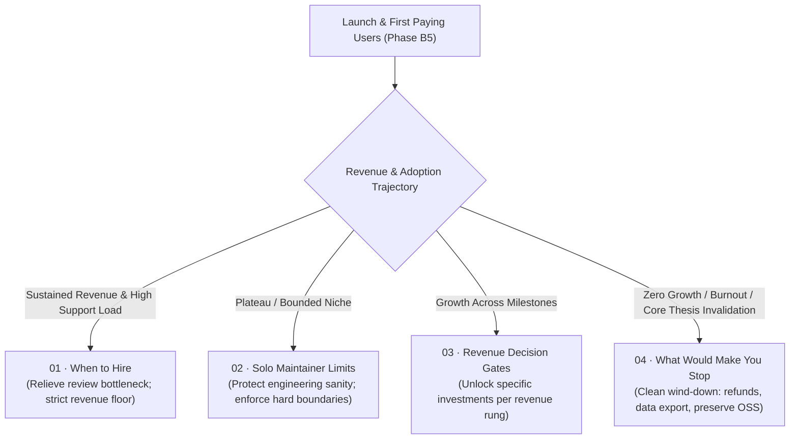

# B6 · Scale and sustainability

> Define the strategic choices for scaling the business if it succeeds, and the honest kill criteria for winding down or open-sourcing if it does not — written in advance so the maintainer never makes existential decisions while tired and under pressure.

| Field | Value |
|---|---|
| **Phase** | B6 · Scale and Sustainability |
| **Theme** | Long-term sustainability · Hiring triggers · Ceiling analysis · Kill criteria |
| **Depends on** | [`roadmap/money_print/b3-hosted-surface/`](roadmap/0_money_print/b3-hosted-surface/README.md), [`roadmap/money_print/b4-company-formation/`](roadmap/0_money_print/b4-company-formation/README.md), [`roadmap/money_print/b5-go-to-market/`](roadmap/0_money_print/b5-go-to-market/README.md) |
| **Blocks** | Post-launch operations, multi-year business viability |
| **Status** | `ready` |

---

## Why this phase exists

Starting a commercial software project is intoxicating; scaling one is grinding; failing without an exit plan is demoralizing.

Most solo technical founders fail to plan for both extremes:
1. **If it works:** The maintainer becomes trapped by their own success. Revenue grows to $10,000/month, but support tickets, billing reconciliation, security inquiries, and PR reviews explode. The maintainer works 80 hours a week, burns out, stops releasing software, and watches customers churn.
2. **If it does not work:** The maintainer drifts in limbo for years, spending thousands of dollars annually on hosting, corporate renewals, and accounting fees for an unlicensed or unprofitable product that nobody uses, unable to decide when to stop.

Operating rule 1 ([`roadmap/README.md:404`](../../README.md#L404)) establishes that *the bottleneck is review, not generation*. In a company, that bottleneck extends to every non-generative task: triaging user bug reports, answering angry support emails, balancing books, and responding to service outages. **AI coding agents do not compress these responsibilities.**

Phase B6 exists so the maintainer does not have to make structural, hiring, or shutdown decisions while exhausted, financially stressed, and under customer pressure. Everything is committed to the roadmap in advance: the hiring triggers, the solo maintainer ceiling, the ladder of revenue gates, and the clean kill criteria.

---

## The two paths: expansion vs graceful sunset

---

## Leaves, in execution order

| # | Leaf | Size | Status | Gate-critical |
|---|---|---|---|---|
| 01 | [Trigger conditions and financial thresholds for the first hire](01-when-to-hire.md) | M | `ready` | No |
| 02 | [The honest solo maintainer ceiling: uncompressible work](02-solo-maintainer-limits.md) | M | `ready` | Yes |
| 03 | [Revenue milestones and decision gates](03-revenue-milestones-and-decision-gates.md) | M | `ready` | Yes |
| 04 | [The kill criteria: clean wind-down and preserving the open-source core](04-what-would-make-you-stop.md) | L | `ready` | **Yes — Highest Value Leaf** |

---

## Done when

- [ ] Quantitative, non-emotional hiring thresholds (revenue floor, support hours, review backlog) are established in writing.
- [ ] The four categories of work that cannot be compressed with AI agents are enumerated with time caps.
- [ ] An editable revenue decision ladder is committed, pairing every dollar milestone with the exact capability it unlocks.
- [ ] Binding kill criteria are defined in advance, specifying the exact metrics that trigger a decision to cease commercial operations.
- [ ] A formal, step-by-step corporate and technical wind-down procedure is drafted, ensuring customer refunds, data export, and the permanent survival of the open-source engine.

---

## Traps

| Trap | Guard |
|---|---|
| Hiring based on fatigue rather than revenue | Never hire an employee because "I feel overwhelmed" if revenue does not cover their salary. A premature hire accelerates bankruptcy. |
| Believing AI replaces the need to hire | Coding agents generate code; they do not resolve credit card chargebacks, review external security audits, or answer enterprise procurement questionnaires. |
| Treating shutdown as failure rather than strategy | Zombie companies drain years of a developer's life. A clean, disciplined wind-down that preserves a thriving open-source tool is a massive success. |
| Hiding kill criteria from the roadmap | Writing down when to quit before launching prevents the sunk-cost fallacy from trapping the founder. |
