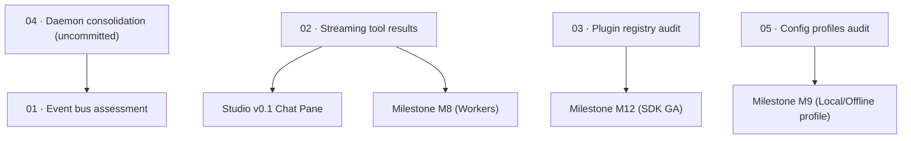

# Cross-Cutting Architectural Enablers

> Five substrate systems that span across milestones: two open, two shipped, and one uncommitted
> on disk.

| Field | Value |
|---|---|
| **Theme** | Architectural plumbing spanning CLI, TUI, Daemon, and Studio |
| **Scope** | Cross-package infrastructure: events, streaming, extensions, daemon, profiles |
| **Depends on** | Milestone M1 (Green everywhere) |
| **Blocks** | Milestone M7 (Sandboxing), M8 (Background workers), Studio v0.1 |
| **Status** | Mixed (3 shipped / uncommitted, 2 open) |

## Why these enablers are cross-cutting

In the original v1 architecture, these five capabilities were conceptualised as Go primitives (such
as channels `chan tea.Msg` and Goroutines). The v2 TypeScript rewrite absorbed several of them into
clean package boundaries (`packages/ext`, `packages/serve`), but left others either uncommitted,
fragmented across competing entry points, or reliant on Go assumptions that no longer hold.

These five systems do not belong to a single milestone because they are **substrates**: every
milestone that touches UI, agent loops, or long-running workers relies on them.

| Enabler | Scope | Status | v2 Reality & Leaf |
|---|---|---|---|
| **1. Event Bus** | Typed event bus that GUI, CLI, TUI, and daemon all subscribe to | **OPEN** | Was intended to replace `chan tea.Msg`. Must be re-assessed under Theia's RPC and `@earendil-works/pi-tui`. [`01-event-bus.md`](./01-event-bus.md) |
| **2. Streaming Tool Results** | Pipe large outputs (test runs, builds) incrementally instead of buffering | **OPEN** | Blocks Studio chat pane and M8 subagent monitor. [`02-streaming-tool-results.md`](./02-streaming-tool-results.md) |
| **3. Plugin / Tool Registry** | Dynamically extensible tools without touching core agent code | **SHIPPED** | Shipped as `packages/ext`. Needs code audit for M12 SDK freeze. [`03-plugin-tool-registry-audit.md`](./03-plugin-tool-registry-audit.md) |
| **4. Daemon Mode** | Long-running process holding index, wiki state, and sessions | **SHIPPED / UNCOMMITTED** | Fragmented: `agent-serve` is shipped; `daemon` command (1,928 lines) is uncommitted on disk. Needs consolidation. [`04-daemon-mode-consolidation.md`](./04-daemon-mode-consolidation.md) |
| **5. Configuration Profiles** | Named profiles (review, wiki, chat) presetting model, tokens, tools, prompt | **SHIPPED (AUDIT)** | Marked shipped in master roadmap; audit against code reveals no dedicated profile system exists. Feeds M9 offline profile. [`05-configuration-profiles-audit.md`](./05-configuration-profiles-audit.md) |

## Leaves, in execution order

| # | Leaf | Size | Status | Gate-critical |
|---|---|---|---|---|
| 01 | [Re-assess the event bus under Theia RPC and TUI](./01-event-bus.md) | S | `ready` | No |
| 02 | [Implement streaming tool results for long-running commands](./02-streaming-tool-results.md) | M | `ready` | **Yes — blocks Studio Chat & M8** |
| 03 | [Audit plugin and tool registry surface in packages/ext](./03-plugin-tool-registry-audit.md) | S | `ready` | No |
| 04 | [Consolidate daemon mode and land in-flight work](./04-daemon-mode-consolidation.md) | M | `ready` | **Yes — P0 hygiene** |
| 05 | [Audit and formalise configuration profiles for M9](./05-configuration-profiles-audit.md) | S | `ready` | No |

## Dependency graph

## Done when

- [ ] Uncommitted daemon work is either integrated cleanly or split into `apps/cli/src/commands/daemon.ts` with green tests.
- [ ] Tool results can stream line-by-line during gate verification and agent execution without whole-turn buffering.
- [ ] The extension API contract in `packages/ext` is documented and characterisation tests exist.
- [ ] The event bus question is decisively resolved: either built as a shared package or declared superseded by Theia RPC / WebSocket events.
- [ ] Configuration profile resolution is unified across CLI, TUI, and Daemon.

## Traps

| Trap | Guard |
|---|---|
| Building an enterprise event bus when Theia RPC and Node EventEmitter already suffice | Re-assess honest need first in leaf `01`. Do not build a generic messaging bus without consumers. |
| Treating `agent-serve` and `daemon` as redundant duplicates | `agent-serve` is a stdio NDJSON stream for editor child processes; `daemon` is a multi-workspace HTTP/SSE server. Clarify their distinct roles before refactoring. |
| Assuming configuration profiles exist because the master roadmap marked them checked | Leaf `05` explicitly audits the code. The codebase has flags and config defaults, but no `--profile` engine. Record facts, not marketing claims. |
