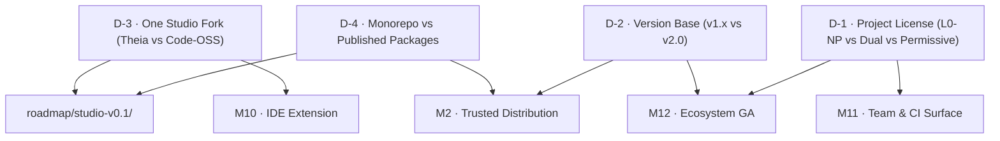

# Architecture and Governance Decision Records

> Strategic decisions that cannot be vibe coded: the four foundational choices governing licensing,
> versioning, client shell consolidation, and package distribution.

| Field | Value |
|---|---|
| **Purpose** | Deliberate human decision points, separated from the mechanical build tree |
| **Document type** | Architecture Decision Records (ADRs) with options, trade-offs, and recommendations |
| **Status** | Unresolved / Pending maintainer determination |
| **Blocks** | Milestones M2, M10, M11, M12, and Studio v0.1 |

## What a decision record is (and why these are separated)

In a fully vibe-coded project, AI coding agents excel at executing bounded, unambiguous implementation
briefs against green gates. However, an agent handed an underspecified architectural dilemma will
confidently invent a plausible path of least resistance — quietly making irrevocable licensing,
versioning, or dependency commitments without human alignment.

The `decisions/` folder separates **decision records** from build briefs:
- **Build briefs (`m01/`, `studio-v0.1/`):** Prescribe *how to build* an already-decided deliverable.
- **Decision records (`decisions/`):** Frame *how to decide*. They articulate the options, evaluate
  the trade-offs, identify what work is blocked, and present a reasoned recommendation — **without
  pretending a decision has been made when it has not.**

Every decision file follows the mandatory leaf contract in [`roadmap/CONVENTIONS.md`](../CONVENTIONS.md).
Their "Steps" section defines the process for reaching the decision, and their "Session brief" is a
structured research-and-recommend brief utilising a `<research_mode>` block that keeps observed facts,
inferences, and open questions strictly partitioned.

## The four decisions

| ID | Decision Record | Deadline | What it blocks | Urgency |
|---|---|---|---|---|
| **D-1** | [Project License (Noncommercial vs Dual vs Permissive)](./d1-license.md) | **March 2027** | Milestone M11 (Marketplace Action) & Milestone M12 (GA) | Medium (hard wall in Q4) |
| **D-2** | [Engine Version Base (Inherit v1.x vs Re-base v2.0)](./d2-version-base.md) | **Before M2** | Milestone M2 (Trusted distribution) & Release tagging | High (blocks release tags) |
| **D-3** | [Studio Shell Consolidation (Theia vs Code-OSS)](./d3-one-studio-fork.md) | **Immediate** | `roadmap/studio-v0.1/` & Milestone M10 (IDE extension) | **P0 (violates rule 1)** |
| **D-4** | [Studio Workspace Linkage (Monorepo vs Published Packages)](./d4-monorepo-vs-published-packages.md) | **Studio Step 1** | `roadmap/studio-v0.1/01-spike-and-stop.md` & Milestone M2 | **P0 (blocks Studio v0.1)** |

## Summary of decisions and blocking impact

## Done when

- [ ] All four decision records are reviewed by the human maintainer.
- [ ] Explicit determinations are signed off and recorded in each file's Status table (transitioning from `blocked` to `done`).
- [ ] Upstream milestone briefs are updated to reference the chosen paths.
