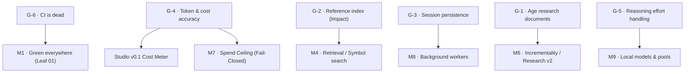

# Known Gaps in Kaioken v2 (Documented, Not Scheduled)

> Six documented-but-unscheduled architectural gaps recorded in `kaioken_v2/README.md`, preserved
> honestly rather than obscured.

| Field | Value |
|---|---|
| **Theme** | The project's thesis turned on itself: radical honesty over confident wrong answers |
| **Origin** | Documented in `kaioken_v2/README.md` §Known gaps (lines 370–396) |
| **Status** | Unscheduled roadmap candidates |
| **Blocks** | Various future milestones (M1, M4, M7, M8, M9, Studio) |

## The principle these gaps embody

Kaioken exists to prevent software engineering agents from inventing confident, plausible, but
wrong answers about a codebase.

It would be a fatal contradiction if the project applied that standard to code while concealing the
incompleteness of its own architecture. These six gaps are not bugs swept under the rug; they are
**deliberate design boundaries, known edge cases, and deferred subsystems** recorded out loud in
the codebase README. Where a capability does not exist, the engine says so plainly in its command
output, documentation, and metadata.

Until an engineering session is scheduled to close each gap, their existence and constraints are
catalogued here.

## The six gaps

| ID | Title | Severity | Why it exists | Cost to close | Milestone attachment |
|---|---|---|---|---|---|
| **G-1** | [Research is not aged](./g1-age-research-documents.md) | Medium | URL sources cannot be looked up in local file scan; provenance would flag all research `orphaned` | Requires a re-fetch and web-caching layer | Milestone M6 or Research v2 |
| **G-2** | [Reference index for real impact](./g2-reference-index-for-real-impact.md) | High | `impact` reports documentation impact, not call-graph blast radius; no reference index exists | Requires cross-file AST reference graph | Milestone M4 (Advanced search & symbols) |
| **G-3** | [Session persistence and resume](./g3-session-persistence-and-resume.md) | Medium | Chat transcript lives in memory only; CLI exits drop history | Wire `packages/session` storage into `runChat` | Milestone M8 or Studio v0.1 Chat |
| **G-4** | [Token and cost accuracy](./g4-token-and-cost-accuracy.md) | **High (Load-bearing)** | Model provider accounting variance; unmeasured tokens print warnings | Model catalog sync, fail-closed spend limits | Studio Cost Meter & Milestone M7 Spend Ceiling |
| **G-5** | [Reasoning effort handling](./g5-reasoning-effort-handling.md) | Low | Some provider endpoints refuse requests if reasoning is explicitly disabled | Per-endpoint thinking parameter mapping | Milestone M9 (Provider pool & local models) |
| **G-6** | [CI is dead](./g6-ci-is-dead.md) | **Critical (P0)** | Archived Go v1 left GitHub Actions pointing at nonexistent directory | Retarget `ci.yml` at `kaioken_v2` | Milestone M1-01 (`01-retarget-ci-workflow.md`) |

## How gaps attach to the roadmap

## Done when

- [ ] Every gap has a dedicated markdown brief detailing its technical mechanism, current code evidence, consequences, and resolution path.
- [ ] G-6 is resolved by executing M1-01.
- [ ] Gaps G-1 through G-5 are evaluated and either scheduled into milestones M4–M9 or kept explicitly documented with runtime warnings.
