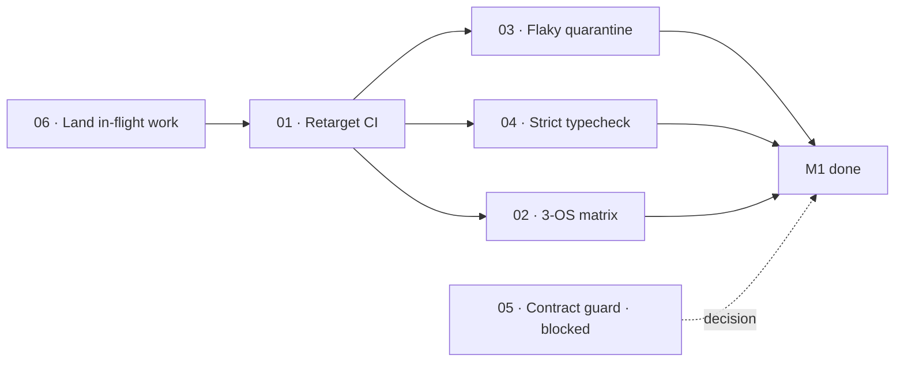

# M1 · Green everywhere

> Rebuild the verification gate around the TypeScript engine, so that "the build is green" becomes a
> statement that can be true or false again.

| Field | Value |
|---|---|
| **Original target** | v1.4 · August 2026 |
| **Verdict** | **RE-SPEC — and urgent.** See [README §2](../README.md#2-the-master-milestone-table) |
| **Theme** | Harden. Zero new subsystems |
| **Depends on** | Nothing. This is the root of the dependency graph |
| **Blocks** | Every other milestone, via operating rule 2 |
| **Status** | `ready` |

## Why this milestone is first

Operating rule 2 states that a green build is a **precondition, not a milestone**: an agent that
starts a task on a red build will "fix" things that were never broken, and in a fully vibe-coded
project that failure mode compounds every session after it.

The rule currently has nothing behind it. All four CI jobs point at `kaioken v1/`, a directory
that no longer exists — so every job fails at `working-directory:` before it runs a single test.
CI is not stale here; it is **dead**. Until M1-01 lands, no milestone below can claim a gate.

The original M1 was written against the Go binary. Its five ships map onto the TypeScript engine as
follows; the *intent* of each survives, the artifacts do not.

| Original ship (v1, Go) | This milestone's leaf | Why it changed |
|---|---|---|
| CI matrix on Windows/macOS/Linux | `01`, `02` | Jobs must target `kaioken_v2` and a Node toolchain; Go and Rust jobs are deleted outright |
| Fix the two known flaky tests | `03` | Re-identify against the vitest suite — the v1 flakes were Go tests and are archived with v1 |
| Zero `any` in `desktop/src` | `04` | `desktop/` is archived. The equivalent surface is `kaioken_v2` + the Studio workspace |
| Contract-version guard | `05` | **Largely obsolete.** Theia runs the packages in-process, which removes the sidecar-mismatch class entirely. The leaf records the decision rather than building the guard |
| Land the in-flight work | `06` | The uncommitted `apps/cli/src/commands/daemon.ts` and the modified `main.ts` / `packages/serve/src/index.ts` |

## Leaves, in execution order

| # | Leaf | Size | Status | Gate-critical |
|---|---|---|---|---|
| 01 | [Retarget the CI workflow at kaioken_v2](./01-retarget-ci-workflow.md) | S | `ready` | **Yes — P0** |
| 02 | [Add the three-OS matrix and make jobs required](./02-three-os-matrix.md) | M | `ready` | Yes |
| 03 | [Identify and quarantine flaky tests, with written reasons](./03-flaky-test-quarantine.md) | M | `ready` | Yes |
| 04 | [Drive `any` out of the engine and Studio workspace](./04-strict-typecheck.md) | M | `ready` | Yes |
| 05 | [Decide the contract-version guard: build or retire](./05-contract-version-guard.md) | S | `blocked` | No |
| 06 | [Land the in-flight daemon and serve work](./06-land-in-flight-work.md) | M | `ready` | No |

## Dependency graph

`06` runs **before** `01` in practice if the uncommitted work is still on disk: retargeting CI while
a dirty tree holds unreviewed changes makes the first green run meaningless. Land or revert it first.

## Done when

- [ ] A fresh clone on a machine that is not yours builds and passes **from CI**, on all three OSes,
      with no manual steps.
- [ ] Every CI job references a path that exists.
- [ ] No job references Go, Rust, Cargo, Tauri, or `kaioken v1/`.
- [ ] Zero quarantined tests without a written reason committed alongside the quarantine.
- [ ] The working tree is clean — nothing in-flight is being carried.

## Traps

| Trap | Guard |
|---|---|
| An agent "fixes" the old Go jobs instead of deleting them | The brief must say **delete**, and name the jobs: `go-test`, `clippy`, `tauri-build` |
| `tsc --noEmit` on the root config reports success while checking nothing | Root `tsconfig.json` is a solution file with `"files": []`. Use `tsc -b --force` |
| A vitest test that needs a network call or an API key gets "fixed" by adding a key to CI | Phase 1 is deterministic and offline **by design**. Such a test is wrong by design — delete or rewrite it, never grant it credentials |
| Quarantining a flake without recording why, then forgetting it was quarantined | Rule: no quarantine lands without a committed reason and an owner |
| Windows path handling — the repo lives on `D:\` and the vault on `S:\` | Use repo-relative paths in every workflow file |
