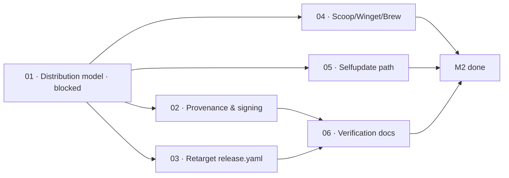

# M2 · Trusted distribution

> Rebuild the release, packaging, and provenance verification pipeline for the TypeScript engine,
> so that strangers can install and verify Kaioken without blindly trusting unverified binaries.

| Field | Value |
|---|---|
| **Original target** | v1.5 · September 2026 |
| **Verdict** | **RE-SPEC ENTIRELY.** See [README §2](../README.md#2-the-master-milestone-table) |
| **Theme** | Verifiable distribution. Zero Go, Rust, or Tauri release artifacts |
| **Depends on** | `m01-green-everywhere` |
| **Blocks** | External adoption, `m11-team-and-ci` |
| **Status** | `ready` |

## Why this milestone is re-specced

The original M2 was designed around a compiled Go binary: `goreleaser` running `cosign` keyless
signing, a Tauri desktop auto-updater, NSIS/DMG/AppImage bundling, and an internal Go package
(`internal/selfupdate/verify.go`) verifying Rekor inclusion proofs.

With the archival of the Go engine (`e46fe1b5`), **every single artifact in that pipeline became
defunct**. There is no Go executable to compile with GoReleaser, no Tauri app to update, and no
`internal/selfupdate` package.

However, the core requirement survives intact: **how does someone other than the maintainer install
Kaioken and verify its provenance?** Node and npm require a completely different trust architecture:
npm publish with SLSA provenance attestations, standalone executables (via Node Single Executable
Applications or Bun compilation), and package manager formulas (Scoop, Winget, Homebrew) that wrap
Node runtimes. M2 re-specces this entire surface from first principles.

| Original ship (v1, Go) | This milestone's leaf | Why it changed |
|---|---|---|
| goreleaser + cosign keyless signing | `02`, `03` | GoReleaser cannot build Node workspaces; replaced with npm provenance and Sigstore attestations |
| `kaioken selfupdate` end to end | `05` | Re-architected for npm global packages or executable swap obeying operating rule 7 |
| NSIS / DMG / AppImage installers | `01`, `04` | Succeeded by package managers (Scoop/Winget/Homebrew) and Studio's Electron bundler |
| Tauri auto-updater | `01` | **Dead with Tauri.** Studio handles desktop updates; CLI updates through npm or package managers |
| Scoop / Winget / Homebrew manifests | `04` | Retargeted from Go binary zip releases to npm / Node CLI shims |
| Rekor inclusion proof verification | `06` | Documented via GitHub SLSA attestations and Sigstore transparency log verification |

## Leaves, in execution order

| # | Leaf | Size | Status | Gate-critical |
|---|---|---|---|---|
| 01 | [Decide the distribution model: npm, binary, or Studio](./01-decide-the-distribution-model.md) | M | `blocked` | **Yes — blocks M2** |
| 02 | [Configure npm provenance and Sigstore signing](./02-npm-provenance-and-signing.md) | M | `ready` | Yes |
| 03 | [Retarget the release workflow at kaioken_v2](./03-release-workflow-retarget.md) | S | `ready` | **Yes — P0 for releases** |
| 04 | [Package for Scoop, Winget, and Homebrew](./04-installers-and-package-managers.md) | M | `ready` | No |
| 05 | [Implement the selfupdate path with build-then-swap](./05-selfupdate-path.md) | M | `ready` | No |
| 06 | [Document provenance verification and attestation limits](./06-provenance-verification-docs.md) | S | `ready` | No |

## Dependency graph

Leaf `01` is the architectural gate for the milestone: until the maintainer decides between scoped
npm packages, standalone compiled binaries, or Studio-only distribution, downstream release scripts
cannot be finalized.

## Done when

- [ ] A non-maintainer can install `kaioken` with a single command on Windows, macOS, or Linux.
- [ ] Every release artifact is signed or attested with verifiable provenance linked to the GitHub repository commit.
- [ ] `.github/workflows/release.yaml` runs on release tags without referencing Go, GoReleaser, or `kaioken v1/`.
- [ ] Scoop and Winget manifests install a working CLI on Windows that passes `scan --root .`.
- [ ] A public documentation page (`ROADMAP/provenance.md` or website guide) clearly explains how to verify signatures and honestly states what is and is not attested.

## Traps

| Trap | Guard |
|---|---|
| Retaining `goreleaser` to build Node packages | GoReleaser is designed for Go/Rust binaries. Forcing it to package Node causes obscure archive and build errors |
| Overwriting running executables in-place on Windows | Operating rule 7: build-then-swap. Windows locks executing files; updates must stage a new file and swap |
| Publishing to npm without provenance | npm provenance requires GitHub Actions OIDC tokens (`id-token: write`). Never publish manually from a laptop |
| Ignoring native tree-sitter bindings in binary distribution | Standalone Node executables (Node SEA) often fail to bundle native `.node` or `.wasm` files unless explicitly included |
| Forgetting License Zero constraints | The Noncommercial license prevents publishing to commercial enterprise repositories without explicit notices |
