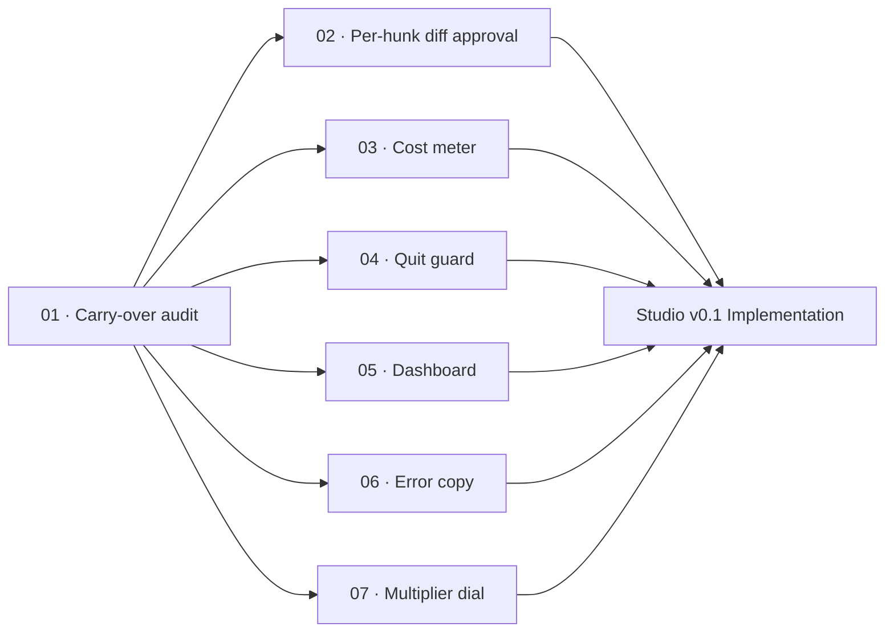

# M3 · Desktop depth pass

> [!important]
> **VERDICT: SUPERSEDED BY `roadmap/studio-v0.1/`**
> The Tauri desktop shell is archived and dead. This milestone does NOT build Tauri routes.
> What SURVIVES the supersession and carries directly into Kaioken Studio (Theia) is the core
> functional depth: per-hunk diff approval, the session cost meter, the quit guard, the workspace
> dashboard, comprehensive error copy, and the multiplier dial. Each leaf in this folder documents
> the precise behavioral requirement so Studio can implement it.

| Field | Value |
|---|---|
| **Original target** | v1.6 · October 2026 |
| **Verdict** | **SUPERSEDED** by `roadmap/studio-v0.1/` (see [README §2](../README.md#2-the-master-milestone-table)) |
| **Theme** | Core UI interaction depth. Carried over into Studio |
| **Depends on** | `m01-green-everywhere`, `kaioken_v2/docs/studio-v0.1-scope.md` |
| **Blocks** | Studio v0.1 GA, `m08-background-workers` |
| **Status** | `ready` |

## Why this milestone is superseded — and what survives

In v1, M3 was planned as an audit of the Tauri desktop shell: "No new screens. Every screen that
exists becomes fully functional" (`.kaioken_v1/ROADMAP.md:86`).

Commit `e46fe1b5` archived the Tauri app (`desktop/` and `src-tauri/`) along with the Go engine.
Building or fixing Tauri routes is dead work. The desktop shell is now **Kaioken Studio**, an
in-process Theia IDE blueprint (`ide_kaioken/kaioken_studio_theia/` and `kaioken_v2/docs/studio-v0.1-scope.md`).

However, the **substance of the original v1.6 ships survives 100%**. An agentic coding environment
is only as trustworthy as its human approval surface and cost transparency:
- If a diff approval dialog forces whole-file accept/reject, the desktop loses its primary advantage over the TUI.
- If closing a window destroys a multi-chapter wiki generation run, user trust is permanently ruined.
- If spending is invisible, users will not run deep multiplier settings.
- If error messages dump cryptic HTTP codes, users cannot self-correct.

The leaves in this folder preserve these hard-won operational requirements, translating them into
actionable specifications for the Kaioken Studio Theia extension (`theia-extensions/kaioken/`).

## The 7 original v1.6 ships: carry-over matrix

| # | Original ship (v1, Tauri) | Status in Studio | Surviving Leaf |
|---|---|---|---|
| 1 | Structured per-hunk diff approval | **Carries over verbatim.** Monaco diff editor in chat pane | `02-per-hunk-diff-approval.md` |
| 2 | Always-visible cost meter | **Carries over verbatim.** Status bar token/spend widget | `03-session-cost-meter.md` |
| 3 | Quit-with-active-runs guard | **Carries over verbatim.** Electron window close interception | `04-quit-with-active-runs-guard.md` |
| 4 | Workspace dashboard | **Carries over verbatim.** Repository overview welcome widget | `05-workspace-dashboard.md` |
| 5 | Empty states + error copy per `ApiError.code` | **Carries over verbatim.** Engine error taxonomy translation | `06-error-copy-per-failure-code.md` |
| 6 | Wiki/skills editors + multiplier dial & estimate | **Partially carries over.** Multiplier dial and estimate survive (`07`); WYSIWYG wiki editor is a refused non-goal (README §7) | `07-multiplier-dial-and-estimate.md` |
| 7 | Stale-wiki banner with one-click update | **Carries over verbatim.** Status bar & Wiki TreeWidget indicator | `05-workspace-dashboard.md` |

## Leaves, in execution order

| # | Leaf | Size | Status | Gate-critical |
|---|---|---|---|---|
| 01 | [Audit v1.6 desktop ships for Studio carry-over](./01-carry-over-audit.md) | S | `ready` | No |
| 02 | [Specify structured per-hunk diff approval](./02-per-hunk-diff-approval.md) | M | `ready` | **Yes — P0 for Studio UI** |
| 03 | [Specify the always-visible session cost meter](./03-session-cost-meter.md) | M | `ready` | Yes |
| 04 | [Specify the quit guard with active runs](./04-quit-with-active-runs-guard.md) | S | `ready` | Yes |
| 05 | [Specify the workspace dashboard landing view](./05-workspace-dashboard.md) | M | `ready` | No |
| 06 | [Map error copy and recovery actions per failure code](./06-error-copy-per-failure-code.md) | M | `ready` | No |
| 07 | [Specify the multiplier dial and cost preview](./07-multiplier-dial-and-estimate.md) | M | `ready` | Yes |

## Dependency graph

## Done when

- [ ] Every leaf in this milestone has a detailed functional specification that can be handed to a Studio Theia coding session.
- [ ] Studio v0.1 implements the approval safety protocol (focus never on Approve, Y/N/A/Esc shortcuts, 5-minute auto-deny).
- [ ] Active background operations (wiki runs, chat generations) block window close with a confirmation prompt.
- [ ] Session cost accumulation is visible in the status bar, with an honest indicator when model accounting is estimated (Gap G-4).
- [ ] Opening a repository displays a dashboard with git status and staleness reports instead of a blank "No files open" view.
- [ ] All engine error codes map to plain-English sentences with clear next actions.

## Traps

| Trap | Guard |
|---|---|
| Re-implementing Tauri routes or Rust IPC | Tauri is archived. Build exclusively for the Theia extension (`theia-extensions/kaioken/`) |
| Allowing default focus on "Approve" in diffs | Safety protocol rule: default focus must always be on Deny / Review to prevent accidental spacebar approvals |
| Hiding model accounting uncertainty | Gap G-4: when provider token counts are unavailable, show explicit `~` estimate flag, never pretend exactness |
| Attempting a WYSIWYG wiki editor | Explicitly refused non-goal (README §7). The wiki is generated; hand-editing destroys provenance |
