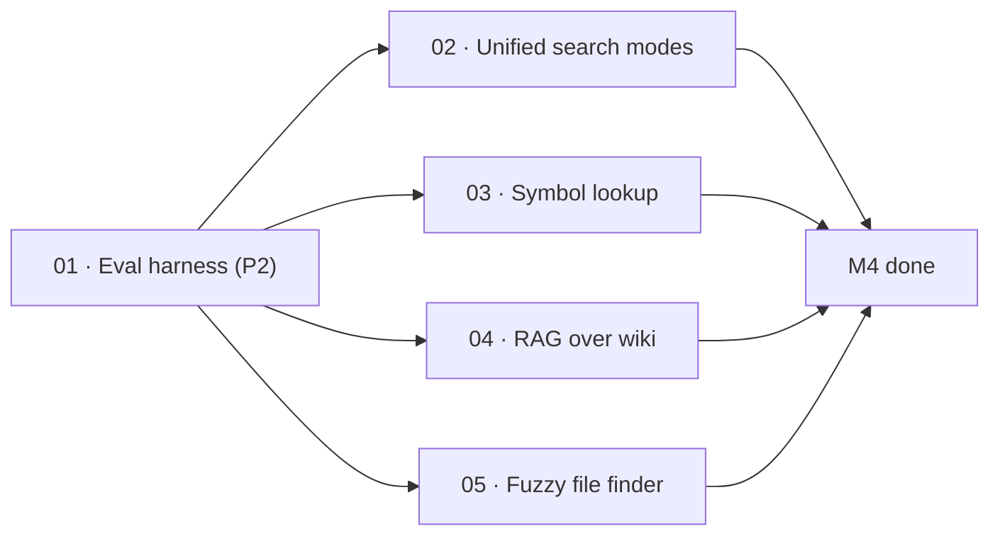

# M4 · Retrieval that earns its keep

> Replace blunt full-text scanning and fractured tools with precision retrieval across symbols, docs, and code — proven by an offline eval harness before any search change lands.

| Field | Value |
|---|---|
| **Original target** | v1.7 · November 2026 |
| **Verdict** | **PARTIAL, MOSTLY OPEN.** See [README §2](../README.md#2-the-master-milestone-table) |
| **Theme** | Precision retrieval, tool unification, and offline evaluation |
| **Depends on** | M1 (`01-retarget-ci-workflow` for a functioning CI gate) |
| **Blocks** | M7 (sandboxed autonomy), M8 (background workers), M10 (Studio knowledge on hover) |
| **Status** | `ready` |

## Why this milestone is the highest-value open work

In a codebase knowledge engine, retrieval quality determines whether agent sessions succeed in single turns or flounder through multi-round-trip exploration loops. `packages/search` is currently **BM25 lexical only** (`analyze.ts`, `bm25.ts`, `corpus.ts`, `index-store.ts`). `packages/prism` supplies parent-child chunking and module-level retrieval substrate, while `packages/index/src/oracle.ts` provides exact symbol declaration lookup.

However, **no evaluation harness exists anywhere in the repository**. The source roadmap mandated building the eval harness **FIRST, in bold**, because without an objective, deterministic benchmark, any change to ranking formulas, tokenizers, or chunking strategies is guesswork. Sizing M4 starts with Priority **P2** for the entire roadmap: establishing an offline test suite of ~30 canonical questions against Kaioken's own codebase, writing down the baseline scores, and gating all subsequent retrieval enhancements on demonstrable metric gains.

Once the harness is established, M4 unifies fragmented agent tools (`wiki_search`, `symbol_lookup`) into a single multi-mode search tool, wires O(1) symbol declaration lookups directly into retrieval, connects `packages/prism` RAG into chat context with markdown citations, and adds a global fuzzy file finder to eliminate wasteful directory traversal chains.

| Original ship (v1, Go) | This milestone's leaf | Why it changed |
|---|---|---|
| Retrieval eval harness (P2 priority) | `01` | Must be built first. Neither Go v1 nor the v2 rewrite created an eval harness; phase 1 offline constraints apply strictly |
| Unified `search` (substring / regex / symbol / semantic) | `02` | Replaces fragmented agent tools (`wiki_search`, `symbol_lookup` in `packages/agent/src/tools.ts`) with a single tool picking modes adaptively |
| Symbol lookup off the index | `03` | `packages/index/src/oracle.ts` already implements O(1) `lookup(name)`; wire this directly into search paths instead of scanning full-text chunks |
| RAG over wiki with citations | `04` | Auto-retrieve relevant generated wiki chapters into agent context with source line citations, backed by `packages/prism` |
| Fuzzy file finder | `05` | Global fzf-style path matching over `packages/scan` inventory to collapse repetitive file-listing tool calls |

## Leaves, in execution order

| # | Leaf | Size | Status | Gate-critical |
|---|---|---|---|---|
| 01 | [Build the retrieval eval harness](./01-retrieval-eval-harness.md) | M | `ready` | **Yes — P2** |
| 02 | [Unify search tool modes](./02-unified-search-tool-modes.md) | M | `ready` | No |
| 03 | [Wire O(1) symbol lookup off the index](./03-symbol-lookup-off-the-index.md) | S | `ready` | No |
| 04 | [Implement RAG over wiki with citations](./04-rag-over-wiki-with-citations.md) | M | `ready` | No |
| 05 | [Add global fuzzy file finder](./05-fuzzy-file-finder.md) | S | `ready` | No |

## Dependency graph

`01` **must** be executed and its baseline recorded before leaves `02` through `05` land. Any PR modifying retrieval scoring or indexing behavior without running the harness violates operating rule 4.

## Done when

- [ ] `npm test` runs an offline, deterministic retrieval eval suite across ~30 canonical repository questions.
- [ ] Baseline retrieval metrics (MRR, Recall@1, Recall@5) are recorded and committed in `packages/search/test/eval/BASELINE.md`.
- [ ] Agent tools expose a single `search` tool with `mode: "substring" | "regex" | "symbol" | "semantic"`.
- [ ] Regular expression search executes with linear-time safety guards preventing ReDoS.
- [ ] Symbol lookups resolve in O(1) against `SymbolOracle` without scanning BM25 chunk texts.
- [ ] Wiki RAG provides relevant chapter context with source doc and line citation links back to `.kaioken/wiki/`.
- [ ] Fuzzy file search returns top-ranked repository paths in <10ms for typical prefix/substring inputs.

## Traps

| Trap | Guard |
|---|---|
| Tuning retrieval algorithms before writing down the baseline | Leaf 01 is non-negotiable P2. No ranking changes may land until the eval harness exists and its initial score is committed |
| Adding external network calls or remote vector databases to the eval suite | Phase 1 is offline and deterministic by design. The eval harness must run in `vitest` with zero credentials and zero network dependencies |
| Unsafe regular expressions causing exponential catastrophic backtracking (ReDoS) | Validate regex patterns or enforce linear-time matching limits before executing searches |
| Breaking the offline BM25 fallback when semantic embedding is missing | `SearchIndex` in `packages/search/src/index-store.ts` must gracefully degrade to pure lexical BM25 ranking when no embedding provider is passed |
| Fragmenting agent tool schemas into five narrow search utilities | Keep the tool surface unified so the model chooses `mode` rather than the caller managing separate tools |
