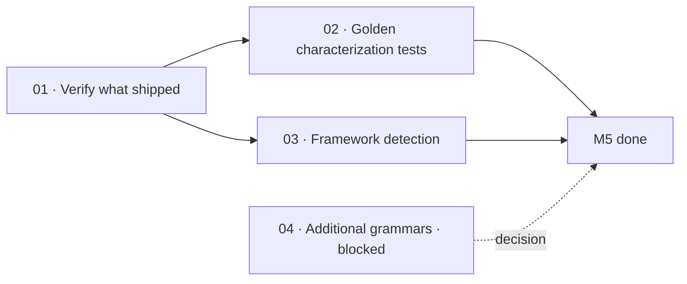

# M5 · Tree-sitter codemap

> Real tree-sitter AST parsing for Go, JavaScript, TypeScript, Python, and Rust was absorbed and completed early by the v2 TypeScript rewrite; the remaining work hardens regression protection and adds framework detection.

| Field | Value |
|---|---|
| **Original target** | v1.8 · December 2026 |
| **Verdict** | **ALREADY DONE.** See [README §2](../README.md#2-the-master-milestone-table) |
| **Theme** | AST-accurate declaration extraction and structural characterization |
| **Depends on** | M1 (`01-retarget-ci-workflow` for CI verification) |
| **Blocks** | Nothing strictly blocking; provides regression defense for all downstream consumers |
| **Status** | `ready` |

## Why this milestone is largely complete

The original 12-month roadmap called M5 *"the highest-leverage quality work in the year"* and *"the riskiest refactor"*, because in Go v1 the engine relied on fragile line-by-line regex parsers. Migrating those parsers to tree-sitter ASTs was expected to take a full month of delicate surgery.

**The TypeScript rewrite absorbed this refactor entirely.** `packages/index` shipped with real, query-driven tree-sitter parsing from day one. It utilizes `web-tree-sitter` (`packages/index/package.json:21`) with precompiled WASM grammars (`packages/index/src/grammars.ts:21-41`) and declarative Tree-Sitter S-expression query files (`src/queries/{go,javascript,typescript,python,rust}.scm`). Functions, methods, classes, interfaces, structs, enums, traits, and module-level constants are parsed directly into typed AST symbols with exact 1-based start and end line ranges (`packages/index/src/extract.ts:105-128`).

Because the central technical challenge has already shipped, M5's leaves are not an implementation plan for a parser that already exists. Instead, they focus on:
1. **Verifying what shipped** against the original promises to produce an honest gap list.
2. **Inverting characterization tests** into permanent golden-file regression protection per operating rule 4.
3. **Implementing framework detection** (Next.js, Django, Rails, Spring) on top of the existing extractors.
4. **Recording the decision** that refuses generic 40-language expansion in favor of actual demonstrated need.

| Original ship (v1, Go) | This milestone's leaf | Why it changed |
|---|---|---|
| Grammars replacing regex parsers | `01` | **Already shipped in v2.** Real tree-sitter runs across 5 languages; leaf audits actual vs promised symbol kinds |
| Golden-file characterization tests | `02` | **Task inverted.** Required before the swap in v1; now serves as post-swap regression protection per operating rule 4 |
| Framework detection (Next.js, Django, Rails, Spring) | `03` | **Genuinely open.** Detects frameworks from manifests and entry points on top of the scanner and ASTs |
| 40-language tree-sitter support | `04` | **Refused non-goal** (README §7). Sized as a narrow evaluation of whether a specific 6th language is justified; status `blocked` |

## Leaves, in execution order

| # | Leaf | Size | Status | Gate-critical |
|---|---|---|---|---|
| 01 | [Verify what shipped against the promise](./01-verify-what-shipped.md) | S | `ready` | No |
| 02 | [Build golden-file characterization tests](./02-golden-file-characterization-tests.md) | M | `ready` | **Yes** |
| 03 | [Implement framework detection](./03-framework-detection.md) | M | `ready` | No |
| 04 | [Decide additional grammar support](./04-additional-grammars-decision.md) | S | `blocked` | No |

## Dependency graph

`02` is gate-critical because operating rule 4 dictates that golden characterization files must be checked in before any further query adjustments or parser changes are permitted.

## Done when

- [ ] An honest audit report documents all extracted AST node types across the 5 shipped languages and identifies all remaining syntax gaps.
- [ ] Golden-file characterization fixtures exist in `packages/index/test/fixtures/golden/` for all 5 languages, verified by automated `vitest` assertions.
- [ ] Framework detection reliably identifies Next.js, Django, Rails, and Spring Boot projects from package manifests and entry point files.
- [ ] A written decision on additional languages is recorded, explicitly enforcing the refusal of the 40-language long tail.

## Traps

| Trap | Guard |
|---|---|
| Re-implementing tree-sitter parsers that already exist | Read `packages/index/src/extract.ts` and `src/grammars.ts` first; verify existing AST capabilities before proposing code changes |
| Modifying `.scm` queries without golden regression protection | Leaf 02 golden files must be committed before adjusting any query in `packages/index/src/queries/` |
| Falling into the "40-language tree-sitter" trap | Tree-sitter grammars have high maintenance tails; evaluate specific language demand only and refuse the general case |
| Conflating framework detection with AST extraction | Framework detection belongs in a high-level classifier over `packages/scan` and file manifests, not embedded directly inside tree-sitter query files |
