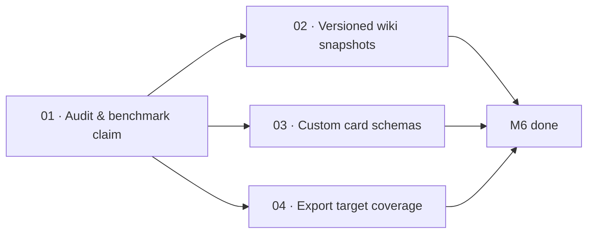

# M6 · Incrementality everywhere

> The core incremental engine — `update`, `provenance`, `status --check`, `export`, and `agentsmd` — shipped with the v2 rewrite; the remaining work benchmarks performance, adds versioned snapshots, and expands schemas and export targets.

| Field | Value |
|---|---|
| **Original target** | v1.9 · January 2027 |
| **Verdict** | **LARGELY DONE.** See [README §2](../README.md#2-the-master-milestone-table) |
| **Theme** | Hash-driven incremental generation, diffable documentation history, and multi-agent export |
| **Depends on** | M1 (`01-retarget-ci-workflow` for CI gate) |
| **Blocks** | M11 (Team & CI surface / PR-triggered incremental update) |
| **Status** | `ready` |

## Why this milestone is largely complete

In Go v1, every documentation run re-scanned and re-generated all documentation from scratch, leading to excessive LLM spend, slow CI runs, and non-deterministic churn. The 12-month plan slated M6 as the major architectural overhaul that would introduce incremental updates and staleness detection.

**The v2 TypeScript rewrite implemented incrementality as foundational machinery:**
- `packages/provenance` calculates exact source file hashes and computes staleness (`packages/provenance/src/staleness.ts:15`) by comparing fresh scan hashes against recorded provenance records.
- `apps/cli/src/commands/status.ts:44` implements `kaioken status --check`, providing an offline CI drift gate (exit code 0 for fresh, 1 for stale) requiring zero API keys.
- `apps/cli/src/commands/update.ts:35` implements `kaioken update`, which computes the exact set of stale cards and wiki documents deterministically before making any model calls, regenerating only the invalidated artifacts.
- `apps/cli/src/commands/export.ts` and `packages/agentsmd` already package knowledge artifacts and synchronize `AGENTS.md`.

Because the underlying incremental machinery is already live, M6's leaves are focused on measuring and completing the genuine remainder:
1. **Auditing and benchmarking the shipped claim**: proving that a one-file change triggers a run measured in seconds and single-digit API calls.
2. **Versioned wiki snapshots**: making documentation generations git-trackable so documentation evolution is diffable.
3. **Custom card schemas**: extending `packages/templates` and `packages/plan` to support user-defined card templates beyond the fixed 5-file schema.
4. **Export target coverage**: evaluating `--export claude-md, agents-md, cursor, qoder` support and recording how gap **G-1** affects export visibility.

| Original ship (v1, Go) | This milestone's leaf | Why it changed |
|---|---|---|
| Diff-driven card and wiki updates | `01` | **Shipped in v2.** `update`, `provenance`, and `status --check` exist; leaf benchmarks and proves the performance claim |
| Versioned wiki with diffs | `02` | **Genuinely open.** Wiki currently overwrites `.kaioken/wiki/` in place; needs git-trackable generation snapshots |
| Custom card schemas | `03` | **Genuinely open.** Cards currently adhere to a fixed TypeScript schema; user-defined templates remain to be built |
| `--export claude-md/agents-md/cursor/qoder` | `04` | `export` and `agentsmd` exist; leaf audits supported formats against the promise and documents gap G-1 |

## Leaves, in execution order

| # | Leaf | Size | Status | Gate-critical |
|---|---|---|---|---|
| 01 | [Audit and benchmark incremental updates](./01-audit-what-shipped.md) | M | `ready` | **Yes** |
| 02 | [Implement versioned wiki snapshots](./02-versioned-wiki-snapshots.md) | M | `ready` | No |
| 03 | [Support custom card schemas](./03-custom-card-schemas.md) | M | `ready` | No |
| 04 | [Audit and expand export target coverage](./04-export-target-coverage.md) | S | `ready` | No |

## Dependency graph

`01` runs first to establish verified execution time and API call baselines before modifying generation or snapshotting flows.

## Done when

- [ ] A committed benchmark report in `packages/provenance/BENCHMARK.md` proves that modifying a single source file triggers an incremental update completing in seconds and using single-digit API calls.
- [ ] `kaioken status --check` reliably catches out-of-date documentation in CI.
- [ ] Wiki generations can be snapshot into git-trackable directory structures (`.kaioken/snapshots/` or exported trees) and compared with standard `git diff`.
- [ ] Users can define custom card schemas in `.kaioken/templates/cards/` that validate and generate domain-specific cards.
- [ ] `kaioken export` supports named target formats (`--format claude-md | agents-md | cursor | qoder`) with clear reporting on gap G-1 limitations.

## Traps

| Trap | Guard |
|---|---|
| Assuming `update` works fast without measuring API call counts | Leaf 01 must mock or instrument the model pool and record exact API request counts |
| Storing snapshots inside `.kaioken/` without a git-tracking plan | `.kaioken/` is gitignored by default; versioned snapshots must either write to a tracked directory or be explicitly exportable |
| Breaking deterministic staleness detection with fuzzy logic | `computeStaleness()` must remain 100% hash-deterministic and offline |
| Ignoring gap G-1 in export commands | Document explicitly in export output that research documents are omitted from exports until G-1 is resolved |
