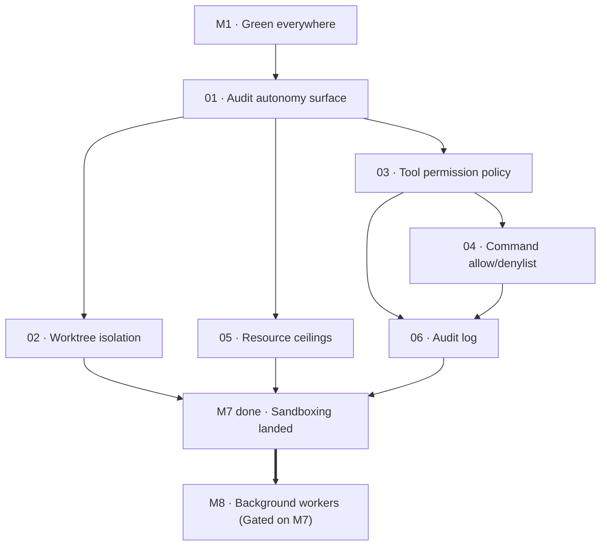

# M7 · Permissions and sandboxing

> Guard the autonomy surface before letting an agent run unattended: worktree isolation, strict permission policies, command denylists, hard resource ceilings, and a replayable audit log.

| Field | Value |
|---|---|
| **Original target** | v1.10 · February 2027 |
| **Verdict** | **OPEN AND OUT OF SEQUENCE — PROMOTED TO P1.** See [README §2](../README.md#2-the-master-milestone-table) and [§12](../README.md#12-suggested-next-block) |
| **Theme** | Safety and sandboxing substrate. Precondition for unattended execution |
| **Depends on** | `M1` (green CI baseline). Nothing in M2–M6 blocks this |
| **Blocks** | `M8` (Background workers) directly — unattended execution cannot ship unguarded |
| **Status** | `ready` |

## Why this milestone is promoted to P1

The master roadmap's own foundational sequencing rule is unequivocal: **sandboxing ships before unattended execution, not after**. An autonomous background agent with unrestricted file write access and arbitrary shell execution privileges on your own repository is, in the words of the plan, a bad afternoon waiting to happen.

A detailed audit of the TypeScript v2 codebase reveals that **autonomy already ships unguarded**:
- Running `kaioken chat --write --yes` exposes full workspace mutation tools (`edit`, `write`, `bash`) with zero human approval prompt (`apps/cli/src/agent-host.ts:85`, `apps/cli/src/commands/chat.ts:156-163`).
- The `bash` tool (`apps/cli/src/agent-host.ts:189`) executes arbitrary child processes in `root` with the user's host environment privileges.
- Background runtime paths (`daemon.ts` and `agent-serve.ts`) already execute or schedule agent turns without filesystem sandboxing or resource enforcement.

The rule has therefore already been breached in the codebase. Promoting M7 ahead of M8 closes this active vulnerability. **Milestone M8 is strictly gated behind M7**: no background worker, overnight refactor daemon, or unattended task may run until the isolation, permission policies, command rules, resource ceilings, and audit logging specified in this milestone are fully landed and verified. This dependency is enforced in both directions.

| Original ship (v1, Go) | This milestone's leaf | Why it changed |
|---|---|---|
| Worktree isolation | `02` | Retargeted from Go git execs to `@kaioken/gitops`. Creates throwaway worktrees so failed runs leave no dirty working tree |
| Per-tool allow/deny/ask policy | `03` | Configurable permission matrix declared in `.kaioken/permissions.json` instead of ad-hoc CLI flags |
| `run_command` allow/denylist | `04` | Pattern-based regex rules for `bash` / shell execution where the **deny list strictly wins** |
| Resource ceilings | `05` | Hard stops for turns, token spend, and wall-clock time; fail-closed when cost accounting is missing (G-4) |
| Audit log | `06` | Append-only `.kaioken/audit/` event log of every tool invocation and outcome, replayable post-mortem |

## Leaves, in execution order

| # | Leaf | Size | Status | Gate-critical |
|---|---|---|---|---|
| 01 | [Audit current autonomy surface](./01-audit-current-autonomy-surface.md) | S | `ready` | Yes — P1 baseline |
| 02 | [Git worktree isolation](./02-git-worktree-isolation.md) | M | `ready` | Yes |
| 03 | [Tool permission policy](./03-tool-permission-policy.md) | M | `ready` | Yes |
| 04 | [Run-command allow/deny list](./04-run-command-allow-deny-list.md) | M | `ready` | Yes |
| 05 | [Resource ceilings](./05-resource-ceilings.md) | M | `ready` | Yes |
| 06 | [Audit log](./06-audit-log.md) | M | `ready` | No |

## Dependency graph

## Done when

- [ ] You can hand an autonomous agent run a complex refactoring task, walk away, and the worst possible case is a wasted git worktree.
- [ ] No tool call modifying files (`edit`, `write`, `bash`, or mutating MCP extensions) can execute in unattended mode without an explicit policy grant.
- [ ] Any command matching the deny list is rejected immediately, even if it matches an allow rule — verified by automated precedence tests.
- [ ] Runs terminate abruptly when maximum turns, spend, or wall-clock limits are reached ("hard stops, not prompts asking nicely").
- [ ] Every tool call, argument, and execution outcome made during an unattended run is recorded in a replayable, structured audit log.
- [ ] All engine gates (`npm test`, `npm run typecheck`) pass cleanly in `kaioken_v2/`.

## Traps

| Trap | Guard |
|---|---|
| Soft ceilings: prompt-based resource limits ("please finish soon") | ceiled loops must abort at the runtime driver layer (`agent-host.ts`), not by injecting conversational hints |
| Deny-list precedence ambiguity | Deny rules evaluated first and unconditionally terminate matching commands with error code |
| Failing open on missing token cost figures (Gap G-4) | When provider cost accounting is absent or synthesized, spend limits fail closed and fall back to turn limits |
| Dirtying the primary workspace during an aborted run | All unattended writes take place inside ephemeral git worktrees created under `.kaioken/worktrees/` |
| Bypassing the permission matrix via MCP extensions | MCP tools pass through the same permission checker before execution (`agent-host.ts:135-140`) |
