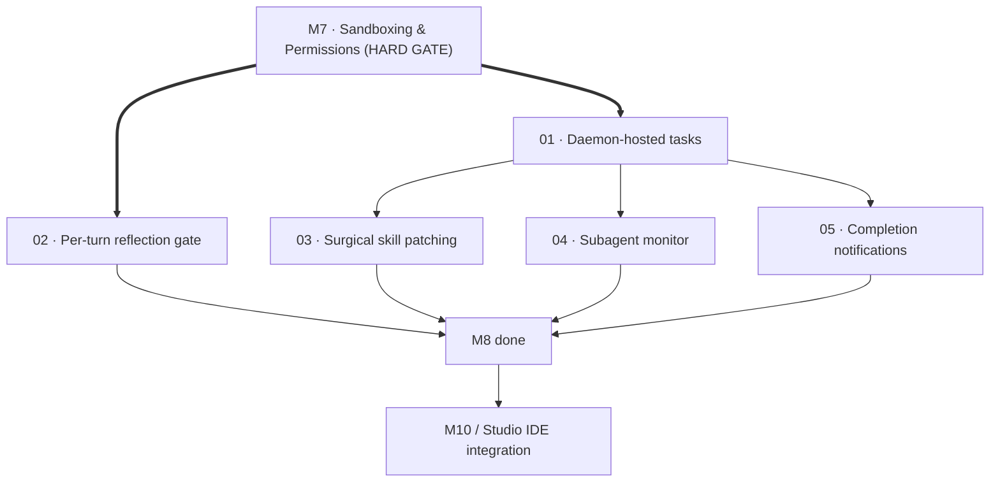

# M8 · Background workers

> Gated strictly behind M7 sandboxing: run long-running tasks asynchronously under a daemon, reflect on tool signals turn-by-turn, surgically patch learned skills, monitor live subagents, and receive OS notifications on completion.

| Field | Value |
|---|---|
| **Original target** | v1.11 · March 2027 |
| **Verdict** | **STARTED, BUT STRICTLY GATED BEHIND M7.** See [README §2](../README.md#2-the-master-milestone-table) |
| **Theme** | Unattended and asynchronous execution substrate |
| **Depends on** | **`M7` (Permissions & Sandboxing) is a non-negotiable hard blocker** |
| **Blocks** | `M10` (IDE extension integration), `M11` (Team & CI automation) |
| **Status** | `ready` |

## Why this milestone is gated behind M7

The done-condition for this milestone is evocative and demanding: **queue a refactor before bed, review a worktree diff in the morning**. 

Substantial pieces of this milestone are already partially built in the codebase:
- The `daemon` command exists uncommitted on disk at `apps/cli/src/commands/daemon.ts` (~1,900 lines of workspace and task management).
- The `agent-serve` command has shipped at `apps/cli/src/commands/agent-serve.ts`.
- Skill extraction and learning exists in `packages/skillgen` and `apps/cli/src/commands/learn.ts`.

However, running an autonomous worker while you sleep requires absolute confidence that the agent cannot destroy the repository, blow through an API quota, run catastrophic shell commands, or mutate your active workspace. **Milestone M8 cannot and will not execute unattended tasks until Milestone M7 is fully landed.** Every leaf in this folder inherits and restates this gate.

| Original ship (v1, Go) | This milestone's leaf | Why it changed |
|---|---|---|
| Daemon-hosted long tasks | `01` | Stabilize uncommitted `daemon.ts` into a robust background task runner using M7 worktrees |
| Per-turn reflection gate | `02` | Shift `packages/session/src/signals.ts` from session-end evaluation to per-turn recovery monitoring |
| Surgical skill patching | `03` | Update specific sections in `.kaioken/skills/` without clobbering human edits; flag `origin: learned` |
| Subagent monitor | `04` | Expose live subagent status, reasoning deltas, and tool activity over daemon SSE streams |
| OS notifications | `05` | Native desktop notifications (macOS, Windows, Linux) when unattended jobs conclude |

## Leaves, in execution order

| # | Leaf | Size | Status | Gate-critical |
|---|---|---|---|---|
| 01 | [Daemon-hosted long-running tasks](./01-daemon-hosted-long-running-tasks.md) | M | `ready` | **Yes — P1** |
| 02 | [Per-turn reflection gate](./02-per-turn-reflection-gate.md) | M | `ready` | Yes |
| 03 | [Surgical skill patching](./03-surgical-skill-patching.md) | M | `ready` | No |
| 04 | [Subagent monitor](./04-subagent-monitor.md) | M | `ready` | No |
| 05 | [Completion notifications](./05-completion-notifications.md) | S | `ready` | No |

## Dependency graph

## Done when

- [ ] A developer can submit a complex, multi-turn task (e.g. `kaioken daemon task "refactor auth to use jose"`) and immediately disconnect.
- [ ] The task executes inside an isolated git worktree created via `packages/gitops/src/worktree.ts` (M7-02).
- [ ] Tool errors and user corrections are evaluated per turn, triggering corrective pivots rather than spinning in unguided retry loops.
- [ ] Learned procedures are surgically integrated into `.kaioken/skills/` with `origin: learned` frontmatter, preserving existing human instructions.
- [ ] Running `kaioken daemon monitor` or querying the daemon HTTP/SSE endpoint renders live subagent state and intermediate reasoning.
- [ ] A native OS desktop notification alerts the developer when the task completes or fails.

## Traps

| Trap | Guard |
|---|---|
| Running daemon workers directly on the main branch | Enforce M7-02 worktree isolation: background tasks MUST execute inside `.kaioken/worktrees/<id>` |
| Full file overwrite of existing skills during learning | Surgical AST/markdown patching in `packages/skillgen` preserves manual instructions and sets `origin: learned` |
| Silent agent hangs during long-running background tasks | Subagent monitor (04) and resource ceilings (M7-05) enforce timeouts and streaming progress heartbeats |
| Daemon memory leaks across multiple worker runs | Run sessions in worker subprocesses or cleanly tear down Pi agent session caches upon task completion |
| Annoying notification spam on incremental steps | Restrict OS notifications strictly to terminal states (job completed, job failed, or human approval required) |
