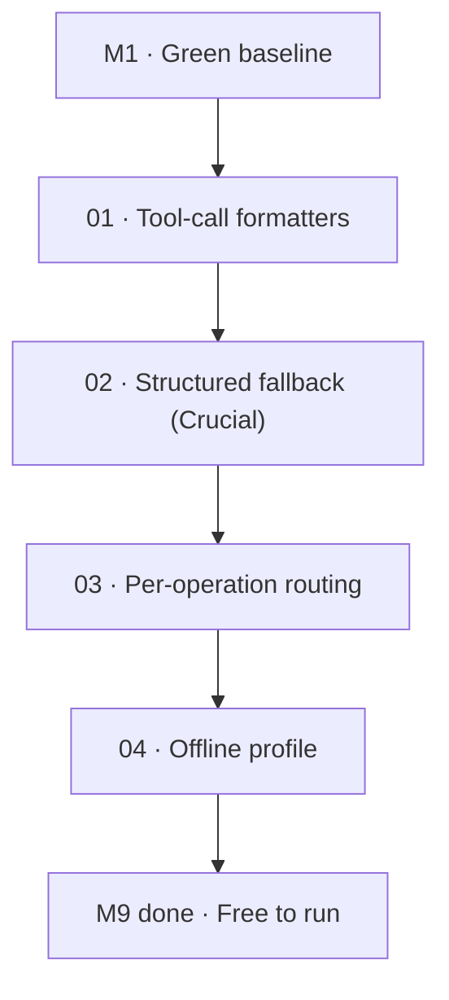

# M9 · Local-model path

> The largest adoption lever in the entire roadmap: enable Kaioken to run completely free and offline against open weights via Ollama, vLLM, and llama.cpp, with robust tool-call formatting and structured recovery.

| Field | Value |
|---|---|
| **Original target** | v1.12 · April 2027 |
| **Verdict** | **OPEN.** See [README §2](../README.md#2-the-master-milestone-table) |
| **Theme** | Free-to-run local model support. Zero-credential offline operation |
| **Depends on** | `M1` (green CI baseline). Can proceed in parallel with M7/M8 |
| **Blocks** | Broader open-source adoption, developer onboarding, enterprise air-gapped deployments |
| **Status** | `ready` |

## Why this milestone is the largest adoption lever

The source plan calls Milestone M9 **THE BIGGEST ADOPTION LEVER IN THE ROADMAP**, because "free to run" removes the single largest barrier to anyone trying the tool at all. When every generative command (`wiki`, `cards`, `plan`, `chat`) bills an API key, users hesitate to run deep passes (`x5` or `x10`), and developers behind enterprise firewalls or privacy policies cannot use the tool at all.

Phase 1 through 5 of Kaioken's engine (`scan`, `index`, `search`, `prism`, `provenance`) are already offline and deterministic by design. The bottleneck to running fully local has been the generative layer:
1. Small and open-weight models (Qwen 2.5 Coder, DeepSeek-R1-Distill, Llama 3.3) frequently emit malformed tool calls that crash rigid API clients.
2. Open serving engines (vLLM, Ollama, llama.cpp) require Hermes-style or ChatML prompting conventions rather than proprietary tool APIs.
3. Hybrid economics: running lightweight operations (scanning, planning, compacting) on free local models while reserving frontier remote models for final chapter writing offers 10x cost reductions.

The insertion point is clean: `packages/model` (`index.ts`, `pool.ts`, `retry.ts`) and `apps/cli/src/model.ts`.

| Original ship (v1, Go) | This milestone's leaf | Why it changed |
|---|---|---|
| Tool-call formatters for open models | `01` | Hermes-style prompt templates and schemas for Ollama, vLLM, and llama.cpp endpoints |
| Structured-output fallback | `02` | Resilient JSON/XML repair for malformed tool calls — *the exact failure mode that breaks local models* |
| Per-operation local/remote routing | `03` | Route by `ModelRequest.purpose`: cheap local for planning/compacting, strong remote for generation |
| Documented offline profile | `04` | Ship a named, documented "offline" configuration profile with recommended models and multiplier |

## Leaves, in execution order

| # | Leaf | Size | Status | Gate-critical |
|---|---|---|---|---|
| 01 | [Tool-call formatters for open models](./01-tool-call-formatters-for-open-models.md) | M | `ready` | Yes |
| 02 | [Structured-output fallback for malformed calls](./02-structured-output-fallback.md) | M | `ready` | **Yes — P1 for local stability** |
| 03 | [Per-operation model routing](./03-per-operation-model-routing.md) | M | `ready` | No |
| 04 | [Documented offline profile](./04-offline-profile.md) | S | `ready` | No |

## Dependency graph

## Done when

- [ ] `kaioken wiki x2` completes on a mid-sized repository (~20,000 LOC), entirely local, with zero external network requests and zero API keys configured.
- [ ] The generated wiki chapters and cards are structurally grounded and usable.
- [ ] Malformed tool calls (trailing commas, unquoted keys, embedded markdown fences) emitted by local 7B–32B models are recovered automatically without crashing the agent loop.
- [ ] Users can configure local providers (`ollama`, `vllm`, `llamacpp`) using standard OpenAI-compatible base URLs in `.kaioken/model.json`.
- [ ] Per-operation routing allows local planning and indexing with remote generation.

## Traps

| Trap | Guard |
|---|---|
| Blaming local model failure on "capability" when it is syntax | The plan is emphatic: what actually breaks on local models is malformed tool calls, not lack of intelligence. Build aggressive fallback parsing |
| Rigid proprietary tool-call expectations | Open models often output `<tool_call>` XML blocks in plain text; formatters must extract calls from content as well as tool fields |
| Context window exhaustion on small models | Local models often run 8k–32k context windows; enforce tight token budgeting and compaction |
| Failing on reasoning model endpoint quirks (Gap G-5) | Request reasoning at `minimal` or map thinking parameters per provider to prevent endpoint 400 errors |
| Over-optimistic hardware requirements | Base profiles on realistic consumer hardware: Qwen 2.5 Coder 7B/14B (Ollama) or 32B (quantized) |
