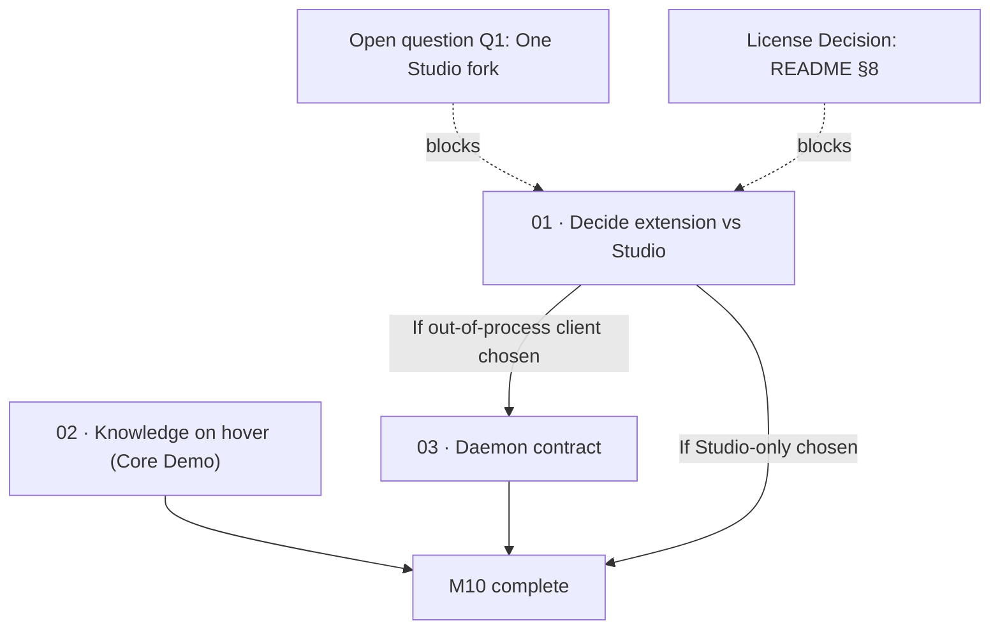

# M10 · IDE Extension

> Reconcile editor integration against Studio: evaluate the thin VS Code extension against in-process Theia, salvage "knowledge on hover" as the flagship demo, and lock down the daemon contract if an out-of-process client survives.

| Field | Value |
|---|---|
| **Original target** | v1.13 · May 2027 |
| **Verdict** | **SUPERSEDED / MERGED into the two Studio forks.** See [README §2](../README.md#2-the-master-milestone-table) |
| **Theme** | Reach — people who are not the maintainer / editor surface |
| **Depends on** | M8 (background workers/daemon), M7 (permissions & sandboxing), [decisions/Q1](../decisions/) (one Studio fork) |
| **Blocks** | M12 (Ecosystem GA) |
| **Status** | `superseded` |

> [!warning] License collision: commercial developer workflows
> This milestone lands directly on developer workstations and commercial editors (VS Code, Cursor, Windsurf).
> Kaioken is licensed under **License Zero Noncommercial Public License 2.0.1**, which strictly forbids commercial use.
> Shipping an extension intended for everyday developer adoption while under License Zero creates an immediate legal contradiction for any engineer working in a commercial enterprise.
> This milestone cannot achieve its intended "reach" without resolving the license choice documented in [README §8](../README.md#8-the-license-decision) (Path A, B, or C).
> Every leaf in this folder records this open dependency.

## Why this milestone exists and why it was superseded

The original v1 roadmap planned a thin VS Code extension (and conditionally JetBrains) that communicated with a local Kaioken daemon over WebSocket. The reasoning was straightforward: the Go binary exposed a daemon mode and a versioned RPC contract (`ContractVersion`), making an editor extension a lightweight presentation shell over an existing backend service.

**Kaioken Studio changes that calculus completely.** The creation of the Studio desktop shell (`ide_kaioken/kaioken_studio_theia/` and `ide_kaioken/kaioken_studio/`) runs the canonical TypeScript engine packages (`@kaioken/index`, `@kaioken/scan`, `@kaioken/search`, `@kaioken/wiki`, `@kaioken/agent`) **in-process**. Theia's architecture hosts backend services directly via InversifyJS and internal RPC channels (`RpcConnectionHandler`), rendering a separate daemon process and an out-of-process WebSocket transport redundant for the flagship desktop product.

Furthermore, operating rule 1 and rule 7 state that **review is the bottleneck** and **two clients is one too many for a solo maintainer** ([README §7](../README.md#7-deliberately-not-on-the-roadmap)). Maintaining both a standalone custom IDE shell (Studio) and a separate extension for third-party editors splits review capacity across two disparate frontend platforms. Right now, that rule is being broken even further: **two Studio forks already exist** (`ide_kaioken/kaioken_studio_theia/` and `ide_kaioken/kaioken_studio/`), meaning the shell layer is currently duplicated before an extension is even built.

What survives from the original M10 specification is the single most valuable capability in the entire list: **KNOWLEDGE ON HOVER** — hovering a symbol in the editor resolves into the generated wiki and module cards. The original plan explicitly designated this as *"the demo that sells the whole project."* Whether delivered inside Studio or via a thin extension, hover resolution is the core interaction that justifies the entire knowledge engine to a working engineer.

| Original ship (v1, Go) | This milestone's leaf | Why it changed |
|---|---|---|
| VS Code extension over daemon | `01` | **Re-evaluated against Studio.** Studio runs packages in-process; `01` evaluates whether to ship Studio only, extension only, or both, constrained by open question Q1. |
| Knowledge on hover | `02` | **Salvaged and given primary depth.** Named "the demo that sells the whole project." Resolves symbols through `packages/index` into the wiki, surfacing live staleness from `packages/provenance`. |
| Daemon thin-client protocol | `03` | **Conditional.** If any out-of-process client ships, it requires a versioned contract, deliberately resurrecting the `ContractVersion` guard retired for Studio. |
| JetBrains extension | *(refused)* | Explicit non-goal. The original plan stated "JetBrains only if VS Code lands early." Maintaining two external plugins plus Studio violates the solo-maintainer rule. |

## Leaves, in execution order

| # | Leaf | Size | Status | Gate-critical |
|---|---|---|---|---|
| 01 | [Decide extension vs Studio](./01-decide-extension-vs-studio.md) | S | `blocked` | No |
| 02 | [Knowledge on hover: symbol-to-wiki resolution](./02-knowledge-on-hover.md) | M | `ready` | Yes |
| 03 | [Daemon thin-client protocol and contract](./03-daemon-thin-client-contract.md) | M | `blocked` | No |

## Dependency graph

## Done when

- [ ] A written decision is committed on open question Q1 resolving the client strategy: Studio only, thin extension only, or both.
- [ ] Hovering a code symbol resolves deterministically through `@kaioken/index` (`SymbolOracle`) to its documentation in `.kaioken/wiki/` or `.kaioken/cards/`.
- [ ] Stale or orphaned documentation is visibly flagged in the hover tooltip using `@kaioken/provenance` (`computeStaleness`), never masquerading as current.
- [ ] If an out-of-process client is retained, a versioned RPC/WebSocket contract is formalized with a handshake guard matching or superseding `CONTRACT_VERSION = 4`.
- [ ] The license dependency on [roadmap/decisions/](../decisions/) is explicitly addressed before any public release of an extension artifact.

## Traps

| Trap | Guard |
|---|---|
| Building a VS Code extension while maintaining two Studio forks | Enforce operating rule: two clients is one too many. Leaf `01` must resolve Q1 before any extension UI code is written. |
| Showing a stale wiki chapter on hover without warning | A hover that silently displays decayed documentation destroys trust. Surface staleness badges directly from `packages/provenance`. |
| Re-inventing symbol search instead of using `SymbolOracle` | Use `packages/index/src/oracle.ts:17` (`SymbolOracle.lookupIn` and `lookup`) — it provides definitive repository declaration checks. |
| Forgetting that out-of-process clients resurrect version skew | In-process Theia eliminated the mismatch class; an out-of-process daemon client brings back version skew, requiring a strict handshake. |
| Glossing over License Zero in enterprise editors | State the commercial restriction openly in all extension manifests and documentation until relicensing is resolved. |
