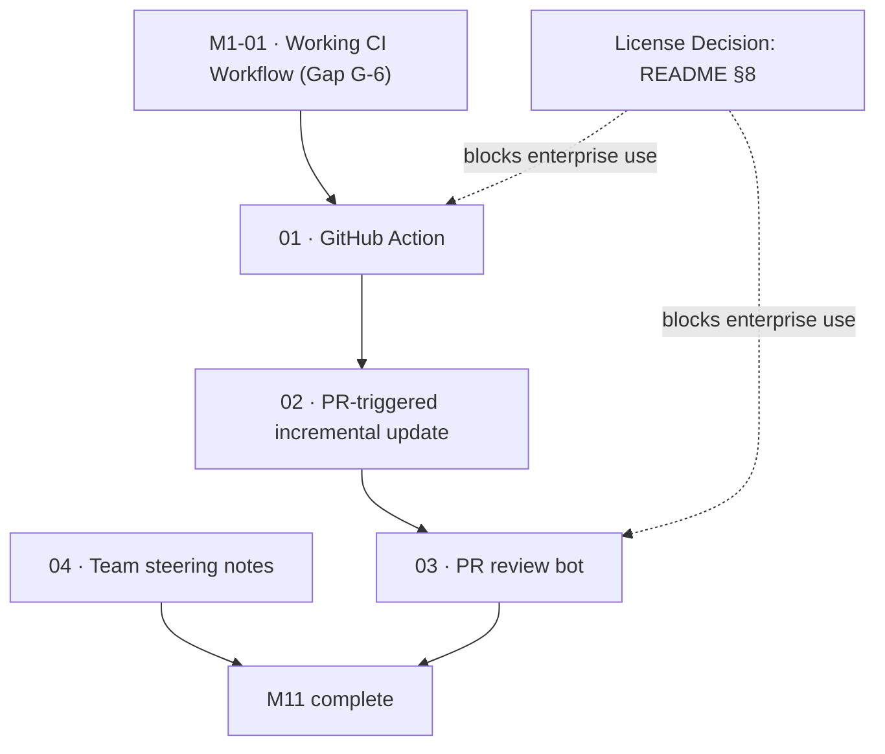

# M11 · Team and CI Surface

> Bring Kaioken into automated team workflows: publish an official GitHub Action, wire PR-triggered incremental documentation updates, build an architecturally-grounded PR review bot from scratch, and rescue version-controlled team steering notes.

| Field | Value |
|---|---|
| **Original target** | v1.14 · June 2027 |
| **Verdict** | **OPEN.** Seeded by `hook` command. Review bot is a build, not a port. See [README §2](../README.md#2-the-master-milestone-table) |
| **Theme** | Reach — people who are not the maintainer / CI and teams |
| **Depends on** | [M1-01](../m01-green-everywhere/01-retarget-ci-workflow.md) (working CI workflow), M6 (incrementality), `packages/provenance`, `packages/impact` |
| **Blocks** | M12 (Ecosystem GA) |
| **Status** | `ready` |

> [!warning] Critical license collision: commercial team contexts
> Every feature in this milestone is designed for **teams and continuous integration pipelines**.
> In practice, CI runners and multi-contributor pull request workflows exist overwhelmingly inside **commercial organizations**.
> Kaioken is currently licensed under **License Zero Noncommercial Public License 2.0.1**, which strictly prohibits commercial deployment.
> If a company installs this GitHub Action or wires this review bot to a private corporate repository, they are violating the license.
> Therefore, this entire milestone collides head-on with the licensing model. Work in this milestone depends directly on making the license decision scheduled for Q4 in [README §8](../README.md#8-the-license-decision) and [roadmap/decisions/](../decisions/) (Path A: stay noncommercial portfolio, Path B: dual-license commercial tier, or Path C: permissive open core).
> Every leaf in this folder flags this dependency under its Open Questions.

## Why this milestone exists

Individual developers reading documentation in their editor (M10) is only half the reach equation. The real test of a knowledge engine is whether it survives and provides value when **multiple people collaborate on a codebase over time**.

Without automation, documentation inevitably rots. The existing `hook` command (`kaioken_v2/apps/cli/src/commands/hook.ts:6`) was the first local seed for automation: installing a git `post-commit` hook that triggers background updates. M11 expands that seed into the central integration surface where teams actually collaborate: the **pull request and continuous integration pipeline**.

However, v2 differs fundamentally from v1 in this space:
1. **The PR review bot is a build, not a port.** While v1 had an experimental `internal/review` package, it was archived with commit `e46fe1b5` and has **no v2 equivalent whatsoever**. M11 builds the review bot from the ground up on top of `packages/agent`, `packages/model`, and `packages/index`.
2. **Impact analysis is documentation impact only (Gap G-2).** When scoping PR updates, `packages/impact/src/predict.ts:24` answers which cards and chapters are affected. It does **not** trace a complete AST call graph, because no reference index exists. Planning around `impact` must respect this boundary.
3. **Collaboration scope is strictly disciplined.** In the public feature board (Category 08, [README §5](../README.md#08--collaboration--entire-category-is-a-7-non-goal-until-users-exist)), almost the entire category was refused as non-goals: *shared session servers, pair programming mode, role-based permissions, and live activity feeds* are explicitly refused per README §7 until real multi-user adoption exists. **The single item rescued is Team Steering Notes (`04`)**, because it requires zero distributed infrastructure — it is simply version-controlled markdown that unifies agent prompts across a team.

| Original ship (v1, Go) | This milestone's leaf | Why it changed |
|---|---|---|
| CI/CD plugin (GitHub Action) | `01` | **Rebuilt for v2.** Package as a composite GitHub Action running Node 22 and `kaioken_v2`. Gated behind M1-01: our own CI must pass before publishing CI actions. |
| PR-triggered wiki update | `02` | **Surgical incrementality.** Uses `packages/provenance` (`computeStaleness`) and `packages/impact` (`predict`) to regenerate only what the PR diff invalidated. |
| PR review bot on webhook | `03` | **Build from scratch.** v1's `internal/review` is gone. Build a grounded reviewer utilizing `SymbolOracle` and module cards to comment on GitHub pull requests. |
| Team steering notes | `04` | **Rescued from refused collaboration.** The only multi-user feature kept; version-controlled markdown under `.kaioken/notes/` guiding agent behavior. |

## Leaves, in execution order

| # | Leaf | Size | Status | Gate-critical |
|---|---|---|---|---|
| 01 | [Publish GitHub Action to Marketplace](./01-github-action.md) | M | `ready` | Yes |
| 02 | [PR-triggered incremental update](./02-pr-triggered-incremental-update.md) | M | `ready` | No |
| 03 | [PR review bot on webhook](./03-pr-review-bot.md) | M | `ready` | No |
| 04 | [Team steering notes in version control](./04-team-steering-notes.md) | S | `ready` | No |

## Dependency graph

## Done when

- [ ] An official `action.yml` is published and tested in a clean GitHub workflow, executing `kaioken status --check` and `kaioken wiki`.
- [ ] PR workflows can trigger incremental documentation updates using `packages/provenance` and `packages/impact` without regenerating unaffected modules.
- [ ] A PR review bot comments on GitHub pull request diffs, grounding its feedback in module cards and verifying symbol existence via `SymbolOracle`.
- [ ] Version-controlled steering notes in `.kaioken/notes/` are automatically loaded into `packages/agent` system prompts during execution.
- [ ] The commercial licensing collision is documented across all team-facing artifacts.

## Traps

| Trap | Guard |
|---|---|
| Publishing a GitHub Action while Kaioken's own CI is red or dead | Gap G-6 is a hard blocker: M1-01 must land before publishing any CI product. You cannot ship a CI tool while your own workflow fails. |
| Assuming `impact` produces a semantic call graph | Gap G-2 explicitly documents that `impact` traces documentation impact and lexical identifier matches only. Do not claim call-graph precision. |
| Re-introducing multi-user distributed systems | Do not attempt to build real-time shared chat, WebSocket session servers, or RBAC. Only team steering notes are rescued; all other multi-user items remain refused non-goals. |
| Attempting to "port" the nonexistent review package | Acknowledge that `internal/review` does not exist in v2. Leaf `03` is a fresh build on top of `packages/agent`. |
| Ignoring License Zero in corporate CI | CI actions run on commercial cloud runners; clearly state the noncommercial constraint until relicensing is resolved. |
