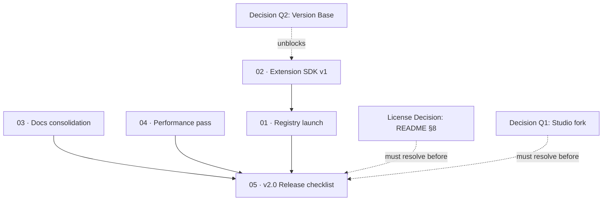

# M12 · Ecosystem GA (v2.0)

> Complete the transition to general availability: launch the community extension registry, freeze the Extension SDK v1 schema with a compatibility promise, consolidate fragmented documentation across all five surfaces, establish empirical performance baselines, and clear the comprehensive v2.0 release gate.

| Field | Value |
|---|---|
| **Original target** | v2.0 · July 2027 |
| **Verdict** | **OPEN.** packages/ext and registry-web exist. Version base unresolved (Q2). See [README §2](../README.md#2-the-master-milestone-table) |
| **Theme** | Reach — ecosystem, community authors, and production stability |
| **Depends on** | M1–M11, [decisions/Q1](../decisions/) (one Studio fork), [decisions/Q2](../decisions/) (version base), [decisions/license](../decisions/) |
| **Blocks** | v2.0 General Availability release tag |
| **Status** | `ready` |

> [!warning] The ultimate license gate
> Releasing Kaioken as a General Availability v2.0 product with a public extension ecosystem while under **License Zero Noncommercial Public License 2.0.1** caps adoption at hobbyists and academic projects.
> Third-party developers will not invest time building extensions if commercial teams are legally prohibited from using them.
> As stated in [README §8](../README.md#8-the-license-decision), the deadline for the license decision is **March 2027** — well before M12 ships.
> Drifting into GA without resolving whether Kaioken is Path A (portfolio/noncommercial), Path B (dual-licensed commercial tier), or Path C (permissive open core with hosted monetization) is unacceptable.
> Every leaf in this milestone references the license decision as an explicit release gate.

## Why this milestone exists

Milestones M1 through M11 build and harden the engine, the desktop shell, and the integration surfaces. Milestone M12 is where Kaioken shifts from an individual maintainer's project into a **self-sustaining ecosystem**.

Several key substrates already exist in the codebase:
- `kaioken_v2/packages/ext/` provides the extension mechanism, runtime permission checking, and manifest loading ([`packages/ext/src/manifest.ts:16`](file:///D:/project/ai_now_know/kaioken_v2/packages/ext/src/manifest.ts#L16)).
- `registry-web/` is already implemented as a React 19 / Vite front-end with serverless Vercel endpoints designed to query GitHub releases ([`registry-web/README.md:1`](file:///D:/project/ai_now_know/registry-web/README.md#L1)).

However, graduating to v2.0 GA introduces irrevocable commitments that cannot be vibe-coded casually:
1. **Freezing the Extension Schema (`02`):** Publishing an Extension SDK and committing to backwards compatibility is a one-way door. Once third-party authors publish extensions against `extension.yaml`, breaking changes require a major version bump.
2. **Moderation is a Real Obligation (`01`):** A public extension registry cannot simply be a web UI over a JSON file. Hosting third-party WASM modules and MCP server commands creates supply-chain and malware liability. A binding moderation policy and incident response SLA are mandatory.
3. **Consolidating Fragmented Documentation (`03`):** Today, five separate surfaces document parts of the project: the root `README.md`, `kaioken_v2/README.md`, `website/` docs, `registry-web/content/`, and now the `roadmap/` tree itself. GA requires reconciling them into a unified docs home and purging all Go v1 artifacts.
4. **Empirical Benchmarks (`04`):** The v1.3.1 Go performance numbers do not transfer to the Node 22 / TypeScript engine. A fresh empirical baseline must be measured and committed.
5. **The Final Gate (`05`):** Checkpoint Question 5 ([README §11](../README.md#11-quarterly-checkpoints)) asks: *"What is still half-wired from a previous quarter? Fix it before starting new work."* The source plan identifies this as the question that determines whether Kaioken becomes a real v2.0 or another abandoned repository.

| Original ship (v1, Go) | This milestone's leaf | Why it changed |
|---|---|---|
| Registry launch | `01` | `registry-web/` exists; connect to `babtix/kaioken-extensions`, open PR submission flow, publish binding moderation policy. |
| Extension SDK v1 | `02` | Freeze `extension.yaml` schema with JSON Schema export and a version compatibility promise for the v2.x lifecycle. |
| Docs consolidation | `03` | Unify all five surfaces (Root README, Engine README, Website, Registry, Roadmap) into a single authoritative source. |
| Performance pass vs baseline | `04` | Establish fresh empirical TypeScript benchmark baseline (Go v1 baseline does not transfer) for wall-clock time and token cost. |
| License decision & v2 release | `05` | The final release gate: resolve Q1, Q2, License, answer quarterly checkpoints in writing, and close all half-wired work. |

## Leaves, in execution order

| # | Leaf | Size | Status | Gate-critical |
|---|---|---|---|---|
| 01 | [Registry launch and moderation policy](./01-registry-launch.md) | M | `blocked` | No |
| 02 | [Extension SDK v1 and schema freeze](./02-extension-sdk-v1.md) | M | `blocked` | Yes |
| 03 | [Documentation consolidation and audit](./03-docs-consolidation.md) | M | `ready` | No |
| 04 | [Performance pass against TS baseline](./04-performance-pass.md) | M | `ready` | Yes |
| 05 | [v2.0 Release checklist and final gates](./05-v2-release-checklist.md) | M | `blocked` | **Yes — Release Gate** |

## Dependency graph

## Done when

- [ ] `registry-web/` is deployed to production, querying the live index at `babtix/kaioken-extensions`.
- [ ] A binding moderation policy and incident response SLA are committed and published.
- [ ] `extension.yaml` schema is frozen, versioned, exported as JSON Schema, and covered by a compatibility promise for all v2.x releases.
- [ ] All five documentation surfaces are audited, Go v1 leftovers removed, and a single docs hierarchy published.
- [ ] Empirical performance metrics for `scan`, `index`, `search`, and `wiki` on the TypeScript engine are measured and committed to the repository.
- [ ] All five quarterly checkpoint questions are answered in writing, with zero half-wired items remaining in the codebase.
- [ ] The v2.0 release tag is created under the ratified versioning scheme and license model.

## Traps

| Trap | Guard |
|---|---|
| Treating the registry moderation policy as a checkbox | Third-party extensions execute code (WASM, MCP). A real moderation SLA and takedown process are mandatory legal requirements. |
| Freezing a mutable schema | Freezing `extension.yaml` is a one-way door. Field types and permission scopes cannot change without breaking plugins. |
| Relying on Go v1 benchmarks | Go performance figures are completely irrelevant to Node 22. Establish a new TS baseline before claiming optimization. |
| Leaving previous quarter features half-wired | Enforce Checkpoint Question 5 ruthlessly in leaf `05`: complete or cleanly remove any half-finished features before tagging v2.0. |
| Releasing without a license decision | You cannot drift into GA under License Zero without deliberately deciding whether to keep it or relicense. |
