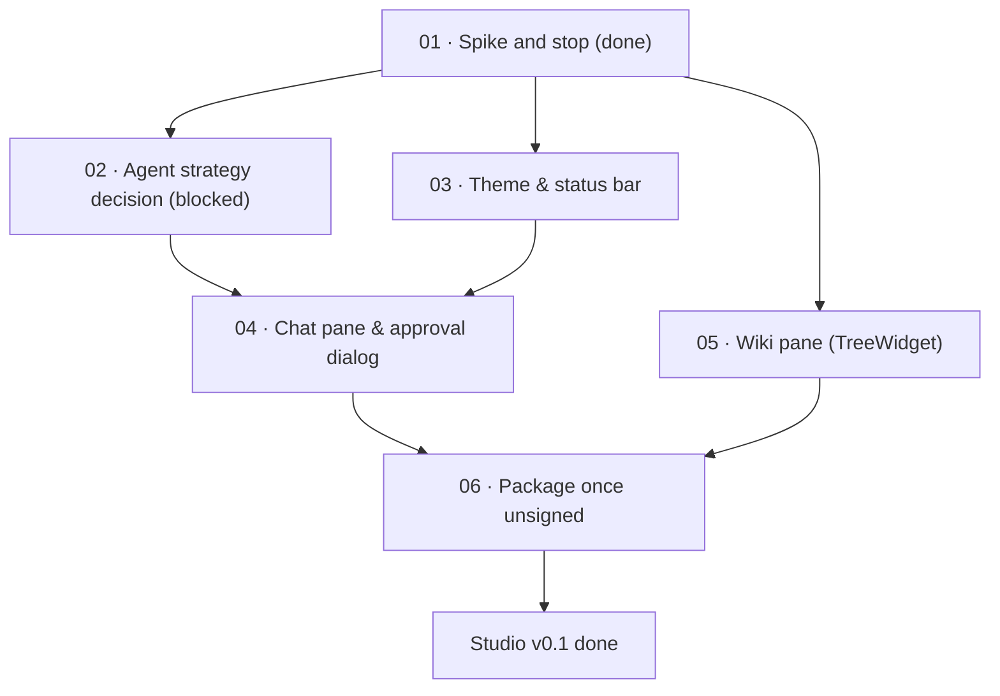

# Kaioken Studio v0.1 · The Active Desktop Build

> The smallest build that proves the thesis: a branded Theia desktop app where Kaioken's existing
> TypeScript packages run in-process, and an agent run can be driven end to end from a GUI.

| Field | Value |
|---|---|
| **Original target** | Supersedes M3 (Desktop depth pass) and M10 (IDE extension) |
| **Verdict** | **ACTIVE BUILD** — started 2026-09-01 ahead of `apps/tui` stabilisation |
| **Shell foundation** | Eclipse Theia Blueprint (`ide_kaioken/kaioken_studio_theia/`) |
| **Depends on** | `cross-cutting/04-daemon-mode-consolidation.md`, `decisions/d3-one-studio-fork.md`, `decisions/d4-monorepo-vs-published-packages.md` |
| **Blocks** | M2 (distribution story), M7 (GUI approval surface), M10 (IDE extension consolidation) |
| **Status** | `in-progress` (spike completed; chat pane blocked on strategy decision) |

## What Studio v0.1 is

Quoted directly from the scope document ([`kaioken_v2/docs/studio-v0.1-scope.md:24-30`](../../kaioken_v2/docs/studio-v0.1-scope.md#L24-L30)):

> *The smallest build that proves the thesis: a branded Theia desktop app where Kaioken's existing TypeScript packages run in-process, and an agent run can be driven end to end from a GUI. It is not the twelve-pane studio in `DESIGN.md`. It is two Kaioken panes bolted onto an IDE that already supplies the editor, terminal, file tree and command palette for free.*

Success looks like: open a repository, watch it index, ask the agent to change something, approve the diff in a GUI dialog, and see the file change in the Monaco editor — without touching a terminal.

> [!warning] The Two-Fork Problem (Open Question Q1)
> Two desktop shells currently exist in this repository:
> 1. A Theia fork at [`ide_kaioken/kaioken_studio_theia/`](../../ide_kaioken/kaioken_studio_theia/)
> 2. A Code-OSS fork at [`ide_kaioken/kaioken_studio/`](../../ide_kaioken/kaioken_studio/)
>
> Operating rule 1 states that review capacity is the project's single bottleneck, and the master roadmap explicitly records: *two clients is one too many for a solo maintainer*. Running both violates the project's most load-bearing operating rule at the shell layer.
>
> **This milestone folder assumes Theia.** If decision record [`decisions/d3-one-studio-fork.md`](../decisions/d3-one-studio-fork.md) resolves in favour of Code-OSS, virtually this entire folder is rewritten.

## In scope

Verified against [`kaioken_v2/docs/studio-v0.1-scope.md:37-70`](../../kaioken_v2/docs/studio-v0.1-scope.md#L37-L70):

| Area | Item | Detail |
|---|---|---|
| **Shell** | Fork `eclipse-theia/theia-ide` | Blueprint template at `ide_kaioken/kaioken_studio_theia/` |
| **Shell** | Rebrand | App name ("Kaioken Studio"), icons ×3 platforms, welcome page, About dialog, config dir renamed from `.theia-ide` to `.kaioken-studio` |
| **Shell** | Kaioken dark theme | ANSI-derived, through Theia's own theming system (`MonacoThemingService.registerParsedTheme`) |
| **Shell** | Bundler swap | esbuild (upstream Theia 1.75+ already defaults to esbuild; see `studio-v0.1-build-notes.md` §4) |
| **Shell** | Target | Electron only (`yarn electron start`) |
| **Integration** | One extension | `theia-extensions/kaioken/` (`theia-ide-kaioken-ext`) |
| **Integration** | Backend services in-process | `@kaioken/index`, `@kaioken/scan`, `@kaioken/search`, `@kaioken/agent`, `@kaioken/wiki` |
| **Integration** | Transport | Theia standard RPC (`RpcConnectionHandler` + InversifyJS over WebSocket) |
| **Integration** | Workspace linkage | Step 1 temporary path resolution (`KAIOKEN_ENGINE_ROOT`), settling on monorepo vs published packages via `decisions/d4-monorepo-vs-published-packages.md` |
| **Pane 1** | Chat / agent runs | Transcript with collapsible tool-call cards, streaming assistant output, inline diff approval — *the surface that has to feel good* |
| **Pane 2** | Wiki browser | `TreeWidget` navigator over generated docs plus a markdown reader — *cheapest real value; reuses a base class* |
| **Chrome** | Status bar | Connection state, active run count, session token accumulator |
| **Chrome** | Multiplier control | ×1–×10 in the composer, with cost preview |
| **Chrome** | Approval dialog | Full safety protocol: focus never on Approve, `Y`/`N`/`A`/`Esc`, five-minute auto-deny |

**Inherited free from Theia — build nothing:**
Monaco editor + diffs, terminal (run `apps/tui` inside it), file explorer, command palette, settings UI, keybindings, themes engine, Git/SCM.

## Explicitly out of scope for v0.1

From [`kaioken_v2/docs/studio-v0.1-scope.md:73-86`](../../kaioken_v2/docs/studio-v0.1-scope.md#L73-L86):

| Category | Deferred elements |
|---|---|
| **Deferred panes** | Research, Graph, Cards, Browser, Activity, Extensions, Cost, Workspaces picker, custom Settings |
| **Deferred chrome** | Custom 44px frameless titlebar, 68px nav rail (use Theia stock activity bar), shell-wide glassmorphism, WebGL CRT backdrop, ambient shaders |
| **Deferred distribution** | Code signing, macOS notarisation, auto-updater, browser target, public release of any kind — v0.1 runs unpackaged via `yarn electron start` |

> [!important]
> The graph explorer is the single largest custom build in the entire product and belongs in its own dedicated version. It must not bleed into v0.1.

## The seven done criteria

From [`kaioken_v2/docs/studio-v0.1-scope.md:107-118`](../../kaioken_v2/docs/studio-v0.1-scope.md#L107-L118):

1. **Branded launch:** The app launches branded, with no "Theia" or "Blueprint" string visible to an end user.
2. **Repository indexing:** Opening a repository indexes it, with progress shown in the UI.
3. **Gated agent run:** An agent run streams into the chat pane, tool calls render as collapsible cards, and file edits are gated by the approval dialog.
4. **Editor reflection:** Approving an edit changes the file on disk, and the change is immediately visible in the Monaco editor.
5. **Wiki navigation:** Generated wiki documents are browsable in the `TreeWidget` tree and readable in the markdown reader.
6. **Multiplier cost preview:** The multiplier dial (×1–×10) changes run depth, and its cost preview is shown before execution.
7. **Engine protection:** `apps/tui` still builds and passes its tests — the shared `@kaioken/*` packages were not broken in service of the GUI.

## Standing risks to re-check at start

From [`kaioken_v2/docs/studio-v0.1-scope.md:121-129`](../../kaioken_v2/docs/studio-v0.1-scope.md#L121-L129):

| Risk | Observed reality & mitigation |
|---|---|
| **Theia AI overlap** | Theia 1.74+ ships Coder/Architect agents and AI Registry. `02-agent-strategy-decision.md` must resolve whether Kaioken replaces them or exposes tools into them before building chat. |
| **Native module rebuilds** | Switching browser ↔ electron targets triggers native module churn. v0.1 avoids this entirely by building Electron only. |
| **Workspace coupling** | Merging workspaces affects Kaioken's build, test and release story. Spiked via runtime path resolution; permanent choice handled in `decisions/d4-monorepo-vs-published-packages.md`. |
| **Windows Spectre libs** | Known hard build error (`MSB8040` on `@vscode/windows-ca-certs`). Resolved by installing `Microsoft.VisualStudio.Component.VC.Runtimes.x86.x64.Spectre` in VS Build Tools. |

## Leaves, in execution order

| # | Leaf | Size | Status | Gate-critical |
|---|---|---|---|---|
| 01 | [Spike, and stop](./01-spike-and-stop.md) | M | `done` | **Yes — central thesis gate** |
| 02 | [Agent strategy decision: replace or expose MCP](./02-agent-strategy-decision.md) | M | `blocked` | **Yes — blocks chat pane** |
| 03 | [Kaioken dark theme and status bar telemetry](./03-theme-and-status-bar.md) | S | `ready` | No |
| 04 | [Chat pane, streaming transcript, and approval dialog](./04-chat-pane-and-approval-dialog.md) | L | `blocked` | **Yes — hero surface** |
| 05 | [Wiki browser pane on TreeWidget](./05-wiki-pane.md) | S | `ready` | No |
| 06 | [Package once, unsigned, on Windows](./06-package-once-unsigned.md) | M | `ready` | No |

## Dependency graph

## Done when

- [ ] All six leaves have executed and their individual verification criteria have passed.
- [ ] The app boots with `yarn electron start` from `ide_kaioken/kaioken_studio_theia/` without console errors.
- [ ] The 7 done criteria listed above are verified manually and recorded with screenshots.
- [ ] No regression in `kaioken_v2`: `npm run typecheck && npm test` remains green.

## Traps

| Trap | Guard |
|---|---|
| Building the chat pane before deciding the Theia AI agent strategy | Leaf `02` is marked `blocked`. Do not write chat UI until the replace-vs-MCP strategy is resolved. |
| Re-introducing the 12 panes from `DESIGN.md` | Enforce the explicit out-of-scope table. Studio v0.1 has exactly two panes: Chat and Wiki. |
| CommonJS vs ESM import collision in Theia extension backend | Theia compiles CJS; `kaioken_v2` is ESM. Must use `new Function('specifier', 'return import(specifier);')` bridge in `theia-extensions/kaioken/src/node/kaioken-engine.ts`. |
| Breaking `apps/tui` while modifying shared packages | Rule 7 of done criteria: run `npm test` in `kaioken_v2` after any Studio change. Studio should touch zero files in `kaioken_v2/packages`. |
