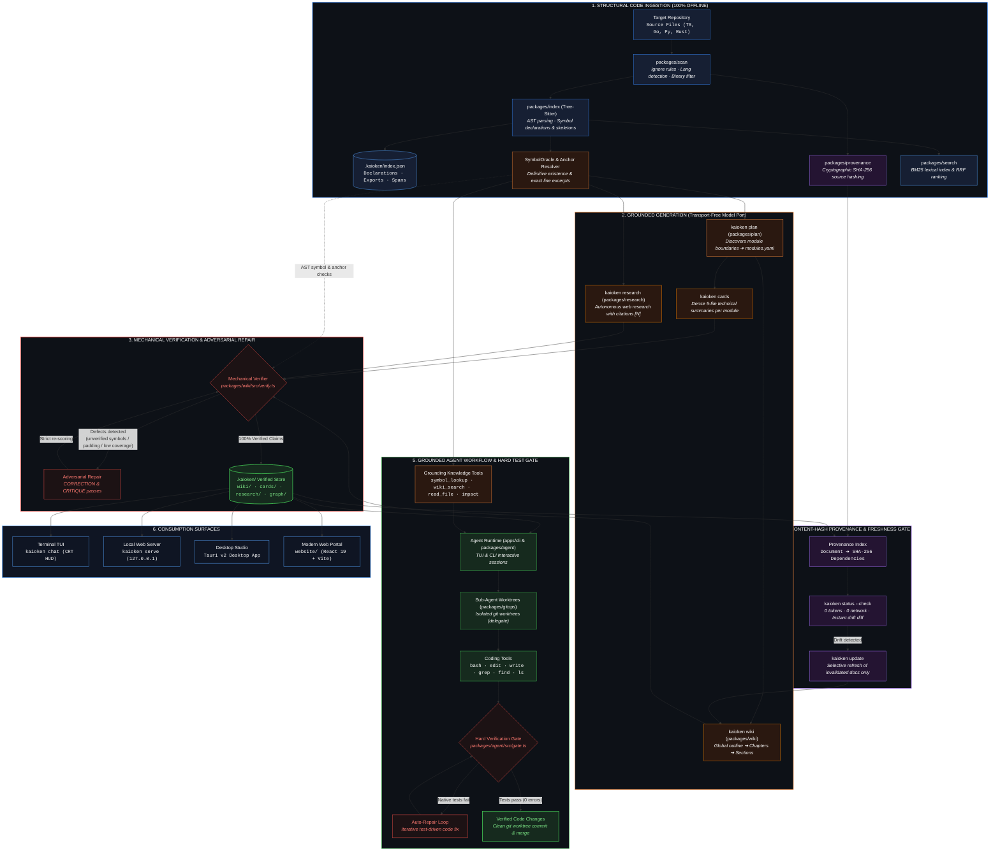

<p align="center">
  
</p>

<p align="center">
  <b>A Repository Knowledge Engine &amp; Agentic Development Ecosystem</b><br>
  <i>Deterministic code indexing, verifiable documentation, and grounded AI agents that eliminate documentation rot and LLM hallucinations.</i>
</p>

<p align="center">
  <a href="https://nodejs.org/"></a>
  <a href="https://www.typescriptlang.org/"></a>
  <a href="#core-pillars--design-principles"></a>
  <a href="#testing--quality-assurance"></a>
  <a href="https://github.com/babtix/kaioken"></a>
  <a href="#license--authors"></a>
</p>

---

## Table of Contents

- [Overview](#overview)
- [The Problem Kaioken Solves](#the-problem-kaioken-solves)
- [Core Pillars & Design Principles](#core-pillars--design-principles)
- [Repository & Monorepo Structure](#repository--monorepo-structure)
- [Quick Start](#quick-start)
- [Command Surface](#command-surface)
- [The Kaioken Multiplier ($\times 1$ to $\times 10$)](#the-kaioken-multiplier-times-1-to-times-10)
- [Artifact Layout (`.kaioken/`)](#artifact-layout-kaioken)
- [Supported Languages](#supported-languages)
- [Testing & Quality Assurance](#testing--quality-assurance)
- [Design System & UI Surfaces](#design-system--ui-surfaces)
- [License & Authors](#license--authors)

---

## Overview

**Kaioken** is a repository knowledge engine. It scans codebases, builds structural AST indices of their declarations, and coordinates AI agents to generate, verify, and maintain deeply grounded documentation artifacts:

- **Deep Technical Wikis**: Multi-pass, structured technical documentation where every claim is validated against AST symbols.
- **Modular Knowledge Cards**: Dense, standardized 5-file technical summaries per module.
- **Deterministic Provenance**: Content-hash tracking across every source file; incremental updates only regenerate documentation that code changes actually invalidated.
- **Grounded Agent Workflows**: Interactive Terminal UI (TUI) and CLI chat where the agent queries exact repository tools (`symbol_lookup`, `wiki_search`, `impact`, `skill_load`) instead of operating on fuzzy context dumps.
- **Deep Web Research**: Autonomous research agents that search, fetch, sanitize, and verify web sources, resolving all citations against actual content hashes.
- **Hard Verification Gate**: Native build and test validation enforcing that code compiles and passes tests before agent tasks can be marked complete.

---

## The Problem Kaioken Solves

Large codebases suffer from two compounding problems when combined with AI:

1. **Documentation Rot**: Code moves faster than documentation. Engineering teams abandon wikis because maintaining them manually is untenable, and nobody knows which chapters are stale.
2. **LLM Hallucination & Context Bloat**: AI models invent nonexistent functions, hallucinate imports, paraphrase code incorrectly, pad prose, or miss critical conventions when blindly given arbitrary byte slices of a repository.

### The Kaioken Solution

<p align="center">
  
</p>



### Core Architecture & Verification Guarantees

- **Claims are checked, not trusted**: Every symbol in backticks, quoted code snippet, line anchor, and file path asserted by an LLM is mechanically checked against the structural AST index (`SymbolOracle`, `resolveRange`, `resolveExcerpt`).
- **Definitive negative guarantees**: The `SymbolOracle` can definitively answer *"this repository declares no symbol by that name"*, directly neutralizing model hallucinations.
- **Structure before text**: Skeletons and signatures always fit the token budget, so nothing in scope is ever invisible to the model. Detail is rationed, never coverage.
- **Deterministic staleness (0 tokens)**: Invalidation is governed by cryptographic SHA-256 source content hashes recorded in `ProvenanceIndex`. Running `kaioken status --check` executes offline in milliseconds with zero tokens spent.
- **Adversarial repair loop**: Unverifiable claims, hallucinated symbols, and generic padding are rejected. Documents undergo adversarial correction and critique passes, only accepting revisions if the verification score strictly improves.
- **Hard native test gate (`verify`)**: When writing code, agents discover and run the repository's native test suites (`npm test`, `go test`, `cargo test`, `Makefile`). If broken, the agent enters an automated test-fix repair loop before completing the task.
- **Sub-agent isolation (`delegate`)**: Autonomous coding tasks execute on isolated Git worktrees (`packages/gitops`), preventing dirty working trees and file collision conflicts.

---

## Core Pillars & Design Principles

### 1. Offline-First & Zero Secrets in Core
The core engine stages work fully offline without internet or API credentials:
- `scan`, `symbols`, `search`, `serve`, `status`, `verify`, and `graph` require **zero network calls and no API keys**.
- The generative stages talk through a clean, transport-free `ModelClient` port (`packages/model`). Provider specifics are isolated strictly in `apps/cli`.

### 2. Human-in-the-Loop Checkpoints
Expensive model calls should never run on blind assumptions. Kaioken enforces strategic human checkpoints:
- `kaioken plan` writes `.kaioken/modules.yaml` and stops. Maintainers review and refine module boundaries before generating cards.
- `kaioken wiki --plan` proposes a global outline before writing hundreds of pages of documentation.

### 3. Radical Compute & Cost Transparency
AI operations consume real compute, tokens, and money. The **Kaioken Multiplier** ($\times 1$ to $\times 10$) controls the depth, search breadth, and adversarial verification passes. Estimated token counts and costs are presented up front.

### 4. Self-Verification Gate
An agent's declaration of success is merely a claim. Kaioken discovers the repository's native verification tools (e.g., `npm test`, `go test`, `cargo test`, `Makefile`) and executes them natively as a hard verification gate. If a repo cannot be tested, the gate reports `unverifiable` rather than falsely passing.

---

## Repository & Monorepo Structure

This repository is organized as a multi-project workspace:

```
.
├── kaioken_v2/             # The canonical Kaioken TypeScript engine (npm monorepo)
│   ├── apps/
│   │   ├── cli/            # Main CLI binary (kaioken) and command dispatcher
│   │   └── tui/            # Interactive Terminal UI (kaioken-tui) with streaming & CRT HUD
│   └── packages/
│       ├── agent/          # Agent core: tool definitions, prompt construction, verification gate
│       ├── agentsmd/       # AGENTS.md instruction collector and knowledge injector
│       ├── ext/            # Extension lifecycle, manifest validator, WASM & MCP runner
│       ├── gitops/         # Git status, diff snapshots, worktree isolation, commit hooks
│       ├── graph/          # Knowledge graph builder, coverage metrics, handoff export bundles
│       ├── impact/         # Blast-radius prediction for proposed changes
│       ├── index/          # Tree-Sitter AST parser, symbol extraction, anchor resolver
│       ├── model/          # Transport-free ModelClient port (provider-agnostic)
│       ├── plan/           # Module planning and knowledge card generator
│       ├── prism/          # Document chunking, vector embeddings, grounded RAG Q&A
│       ├── provenance/     # Source content-hash records, staleness & invalidation engine
│       ├── research/       # Web research pipeline, page sanitizer, citation verifier
│       ├── scan/           # Repository traversal, ignore rules, language detection, risk flags
│       ├── search/         # In-memory BM25 lexical search & Reciprocal Rank Fusion
│       ├── serve/          # Zero-dependency local documentation web server
│       ├── session/        # Session persistence, conversation tree branching, undo journal
│       ├── skillgen/       # Procedural skill generation & distillation
│       ├── templates/      # Parameterized prompt templates (/t:<name>)
│       └── wiki/           # Multi-pass wiki cascade, claim extraction, verification
│
├── website/                # Main showcase & documentation web app (React 19, Vite, Tailwind 4)
├── website-legacy/         # Legacy web portal
├── registry-web/           # Community extensions registry portal (browse, search, submit wizard)
├── web-news/               # Serverless publishing feed for project news and release notes
├── assets/                 # Brand assets, architecture diagrams, and wallpapers
├── DESIGN.md               # Master Kaioken Design System v2 specification (TUI, GUI, Web, Mobile)
├── kaioken_main_STUDIO/    # Kaioken Studio (Tauri v2 desktop GUI) architectural blueprint
└── ide_kaioken/            # Experimental agentic IDE builds (VS Code Code-OSS & Theia)
```

### Key Packages at a Glance

| Package | Responsibility | Offline? |
|---|---|:---:|
| `packages/scan` | High-speed directory traversal, ignore rule filtering, risk classification | Yes |
| `packages/index` | Tree-Sitter symbol extraction, grounding oracle, anchor verification | Yes |
| `packages/search` | BM25 lexical ranking and Reciprocal Rank Fusion (RRF) | Yes |
| `packages/serve` | Zero-dependency HTTP server hosting documentation locally | Yes |
| `packages/provenance` | Content-hash tracking, staleness detection, invalidation calculation | Yes |
| `packages/graph` | Derived relationship graph between documentation and source files | Yes |
| `packages/agent` | Agent tool definitions (`symbol_lookup`, `wiki_search`, `read_file`), quality gate | Yes |
| `packages/plan` | Proposes module boundaries and generates structured module cards | Via port |
| `packages/wiki` | Plans outlines, drafts chapters, extracts claims, and runs verification | Via port |
| `packages/research` | Multi-agent web research with strict citation verification (`[N]`) | External |

---

## Quick Start

### Prerequisites

- **Node.js**: `>= 22.0.0`
- **npm**: `>= 10.0.0`
- **Git**: Installed and available on `PATH`

### 1. Clone & Build the Engine

```bash
# Clone the repository
git clone https://github.com/babtix/kaioken.git
cd kaioken/kaioken_v2

# Install dependencies and build all packages
npm install
npm run build
```

> **Note**: Building executes `tsc --build` and automatically mirrors Tree-Sitter `.scm` query files into `packages/index/dist/queries/`.

### 2. Run the Core CLI Commands

All commands can be executed against any target repository using `--root`:

```bash
# 1. Scan a repository (deterministic inventory, risk flags)
node apps/cli/dist/bin.js scan --root /path/to/repo

# 2. Look up declarations using the structural index
node apps/cli/dist/bin.js symbols myFunction --root /path/to/repo
node apps/cli/dist/bin.js symbols src/index.ts --root /path/to/repo

# 3. Search symbols, wiki passages, cards, and skills
node apps/cli/dist/bin.js search "auth provider" --root /path/to/repo

# 4. Serve the generated documentation locally on 127.0.0.1
node apps/cli/dist/bin.js serve --root /path/to/repo

# 5. Check documentation freshness against the current code
node apps/cli/dist/bin.js status --check --root /path/to/repo

# 6. Run repository verification gate (tests & builds)
node apps/cli/dist/bin.js verify --root /path/to/repo
```

### 3. Generate Knowledge (Model Enabled)

To run generative commands, set an API key for your preferred provider (e.g., OpenRouter, OpenAI, Anthropic, or local Ollama):

```bash
export OPENROUTER_API_KEY="sk-or-..."

# Propose module boundaries (checkpoints to .kaioken/modules.yaml for review)
node apps/cli/dist/bin.js plan x3 --root /path/to/repo

# Generate knowledge cards for each approved module
node apps/cli/dist/bin.js cards x3 --root /path/to/repo

# Generate the deep technical wiki
node apps/cli/dist/bin.js wiki x3 --root /path/to/repo

# After modifying code: incrementally refresh only what changed
node apps/cli/dist/bin.js update --dry-run --root /path/to/repo
node apps/cli/dist/bin.js update x1 --root /path/to/repo
```

### 4. Launch the Interactive Terminal UI (TUI)

```bash
node apps/tui/dist/bin.js --root /path/to/repo
```

The TUI provides a full CRT HUD experience, command autocomplete (`/wiki`, `/research`, `/diff`, `/undo`, `/yolo`), token-by-token streaming, and conversation branching.

---

## Command Surface

| Command | Purpose | Network? |
|---|---|:---:|
| `scan` | Walk repository, build file inventory, flag risky files (secrets, binaries). | No |
| `symbols` | Search symbols or list declarations for a specific file via Tree-Sitter AST. | No |
| `search` | Multi-tenant search across symbols, wiki, cards, and skills via BM25. | No |
| `serve` | Host documentation locally with navigation, search, and status badges. | No |
| `status` | Report documentation drift and staleness without calling models. | No |
| `plan` | Propose `.kaioken/modules.yaml` module tree with human-in-the-loop review. | Model |
| `cards` | Generate dense 5-file technical cards for each module. | Model |
| `wiki` | Multi-pass wiki cascade (outline $\to$ section plans $\to$ full chapters). | Model |
| `update` | Incrementally regenerate only documents invalidated by recent commits. | Model |
| `research` | Deep web research with citation verification (`[N]` pinned to content hashes). | Web + Model |
| `chat` | Conversational agent equipped with repository inspection tools. | Model |
| `verify` | Automatically run detected build and test commands as a quality gate. | No |
| `graph` | Derive relationship graph between documents, cards, and source files. | No |
| `export` | Package knowledge into a standalone bundle readable without Kaioken installed. | No |

---

## The Kaioken Multiplier ($\times 1$ to $\times 10$)

The multiplier is a conscious dial balancing speed, compute cost, and verification depth:

```
[×1] ───► Public surface, main flow, and high-level section summaries.
[×2] ───► Adds detailed subsection documents and architectural flow diagrams.
[×3] ───► Exhaustive coverage of all declarations and exported symbols (Default).
[×4..9] ─► Critique-and-revise loops: scores drafts against rubrics, eliminates padding.
[×10] ──► Adversarial grounding repair: detects and fixes every grounding failure.
```

---

## Artifact Layout (`.kaioken/`)

All Kaioken generated knowledge is written into `.kaioken/` inside the target repository:

```
.kaioken/
├── config.yaml          # Model configuration, scope exclusions, steering notes
├── modules.yaml         # Maintainer-approved module tree (Human-in-the-loop)
├── wiki_plan.yaml       # Proposed wiki outline and chapter breakdown
├── architecture.md      # Authoritative architectural brief & canonical glossary
├── state.json           # SHA-256 hashes per module for incremental updates
├── risk.json            # Scan risk report (detected credentials, large binaries)
├── graph.json           # Knowledge graph linking documents to source files
├── wiki/                # Generated deep wiki chapters (Markdown)
│   ├── Architecture/
│   ├── Pipelines/
│   └── CHANGELOG.md
├── knowledge/<module>/  # Structured 5-file knowledge cards
│   ├── _module.yaml     # Metadata (scope, timestamp, model)
│   ├── overview.md      # Purpose, responsibilities, and public interface
│   ├── architecture.md  # Internal structure and design patterns
│   ├── conventions.md   # Idioms, rules, and error handling patterns
│   ├── tech_stack.md    # Libraries, frameworks, and versions
│   └── setup_commands.md# Build, run, and test commands
├── skills/              # Handwritten and distilled agent task procedures
└── research/            # Cited research reports from /research
```

---

## Supported Languages

Kaioken uses **Tree-Sitter** for concrete syntax tree parsing and symbol extraction:

- **TypeScript** & **TSX**
- **JavaScript** & **JSX**
- **Python**
- **Go**
- **Rust**

Adding a new language is strictly declarative: add a grammar definition in `packages/index/src/grammars.ts` and provide a `.scm` query file in `packages/index/src/queries/`.

---

## Testing & Quality Assurance

Kaioken enforces a strict testing discipline: **"If a stage needs an API key or network connection to be tested, it is designed wrong."**

```bash
# Run all tests across the monorepo (offline)
cd kaioken_v2
npm test
```

- **400+ Offline Tests**: All test suites run without network access, using scripted model doubles that record and validate prompts.
- **Evidence Contract**: Verifiers mechanically cross-check quoted code against real source files.
- **SSRF Prevention & Security**: Built-in sanitization for research URLs, safe archive extraction (`packages/ext`), and isolated subprocess timeouts.

---

## Design System & UI Surfaces

Kaioken spans multiple developer surfaces bound by a unified design philosophy:

- **Terminal UI (`apps/tui`)**: Built with CRT scanline accents, state-driven HUD borders, and 16-color ANSI terminal parity.
- **Web Portal (`website/`)**: React 19, Tailwind CSS v4, Base UI, WebGL ambient shader backdrops, and interactive Mermaid diagrams.
- **Extension Registry (`registry-web/`)**: Zero-database community hub powered by GitHub PR moderation and live manifest linting.
- **Kaioken Studio (`kaioken_main_STUDIO/`, `ide_kaioken/`)**: Architecture for a native agentic IDE marrying editor velocity with autonomous sub-agents.

For the complete architectural design specification, see [DESIGN.md](DESIGN.md).

---

## License & Authors

- **Author & Architect**: [Babtix / Babtich El Habib](https://github.com/babtix)
- **News & Updates**: [kaioken-news.vercel.app](https://kaioken-news.vercel.app)
- **License**: Licensed under the [License Zero Noncommercial Public License 2.0.1](LICENSE) (Commercial licenses available; subcomponents under MIT where indicated).

---

<p align="center">
  <b>Built for developers who value verifiable truth over generative illusion.</b>
</p>
