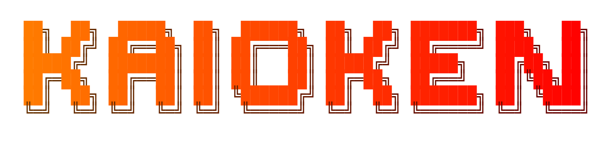
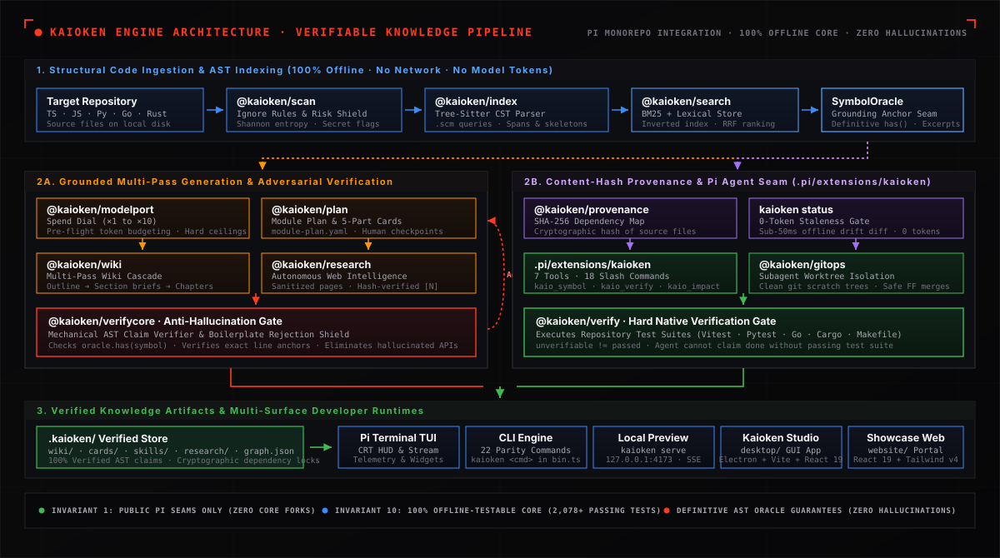

<p align="center">
  
</p>

<p align="center">
  <b>The Repository Knowledge Engine &amp; Grounded Agentic Runtime</b><br>
  <i>Deterministic AST indexing, cryptographic zero-token provenance, and grounded AI agents that eliminate documentation rot and LLM hallucinations.</i>
</p>

<p align="center">
  <a href="https://nodejs.org/"></a>
  <a href="https://www.typescriptlang.org/"></a>
  <a href="#repository-structure"></a>
  <a href="kaiopi/docs/roadmap/README.md"></a>
  <a href="#testing--quality-assurance"></a>
  <a href="https://github.com/babtix/kaioken"></a>
  <a href="#license--authors"></a>
</p>

---

## Overview

**Kaioken** is an offline-first repository knowledge engine and grounded AI runtime. It parses codebases into abstract syntax trees (AST), tracks cryptographic content-hash provenance across every file, and equips autonomous coding agents to generate, verify, and maintain deeply grounded documentation without hallucinations:

- **Deterministic AST Indexing**: Tree-Sitter parsing extracts exact declarations, exports, and source spans across TypeScript, JavaScript, Python, Go, and Rust.
- **Definitive Symbol Oracle**: Emits binary guarantees (`has(name)`). Code quotes and line anchors are validated against real source bytes, preventing hallucinations.
- **Cryptographic Provenance**: Pinned to SHA-256 source hashes. `kaioken status` detects code drift in milliseconds offline with zero network calls and zero model tokens.
- **Grounded Pi Agent Extension**: Equips the **Pi** agent harness with 7 deterministic grounding tools and 18 interactive slash commands.
- **Hard Native Test Gate**: Runs repository test suites (`npm test`, `pytest`, `cargo test`, `go test`). Agents cannot mark tasks complete unless tests pass.
- **Worktree Isolation**: Autonomous subagents run in isolated Git worktrees, preventing dirty states and merge collisions.

---

## Architecture

Kaioken replaces ungrounded LLM generation with AST verification, cryptographic staleness gates, and tool-grounded agent execution:

<p align="center">
  
</p>

---

## Core Invariants

1. **Clean Pi Extension Seams**: Zero core forks or monkey-patching. All agent tools, telemetry, and hooks enter through the official Pi Extension API.
2. **100% Offline Core**: Zero hard network or API key dependencies. Indexing, symbol resolution, provenance, and tests run completely offline.
3. **Definitive Grounding**: Quoted code must match source byte-for-byte; fuzzy matching and unverified symbols are strictly rejected.
4. **Zero-Token Freshness**: Documentation staleness is verified by comparing SHA-256 hashes in under 50ms with 0 tokens spent.
5. **Hard Test Verification**: Agents cannot self-certify completion; native test suites must exit with code `0`.

---

## Repository Structure

```
.
├── kaiopi/                     # Primary Unified Monorepo (Pi + Kaioken)
│   ├── kaioken/                # Engine source & CLI entrypoint (bin.ts)
│   ├── .pi/extensions/kaioken/ # Pi Agent Extension (7 tools, 18 commands, HUD)
│   ├── packages/               # Upstream Pi Agent Harness
│   └── docs/                   # Architectural blueprints & roadmap
│
├── desktop/                    # Kaioken Studio Desktop App (Electron + Vite + React 19)
├── website/                    # Modern Showcase Web Portal (React 19 + Vite)
├── registry-web/               # Extension Registry Portal (React 19 + Vite)
├── web-news/                   # Release Notes & Publishing Feed
├── assets/                     # Logos, architectural diagrams, media
└── DESIGN.md                   # Master Kaioken Design System Specification
```

---

## Pi Agent Extension & CLI

### Grounding Tools

| Tool | Purpose |
|---|---|
| `kaio_symbol_lookup` | Definitive AST lookup. Returns exact file, line, and signature, or a strict negative guarantee. |
| `kaio_read_file` | Reads exact line ranges with verified anchors for verbatim quoting. |
| `kaio_wiki_search` | BM25 + Reciprocal Rank Fusion search across wiki chapters, cards, and skills. |
| `kaio_impact` | Predicts transitive files and modules broken by changing a symbol before making edits. |
| `kaio_skill_load` | Loads distilled task execution procedures from `.kaioken/skills/`. |
| `kaio_status` | 0-token staleness diff comparing documentation against current source code. |
| `kaio_verify` | Executes native repo build and test suites. Task cannot complete without passing tests. |

### Commands (CLI & `/kaio-*`)

Available via interactive Pi slash commands (`/kaio-<cmd>`) and CLI (`node kaiopi/kaioken/bin.ts <cmd>`):

- `scan`: Repository inventory, AST symbol indexing, and secret scanning.
- `symbols`: Direct query to the AST Symbol Oracle for declaration details.
- `status`: 0-token documentation staleness and source drift report.
- `search`: In-memory BM25 lexical and structural search with RRF ranking.
- `impact`: Transitive AST blast-radius prediction for proposed symbol changes.
- `verify`: Native build and test runner execution gate (Vitest, Pytest, Go, Cargo).
- `plan`: Module clustering and `.kaioken/module-plan.yaml` maintainer checkpoints.
- `cards`: Generates and inspects uniform 5-part module knowledge cards.
- `wiki`: Multi-pass streaming wiki cascade with AST claim auditing.
- `serve`: Starts zero-dependency local documentation server (`127.0.0.1:4173`).
- `update`: Incrementally refreshes only documents invalidated by recent commits.
- `research`: Autonomous web research with hash-anchored citations (`[N]`).
- `skills` / `skillgen`: Procedural task catalog and automatic synthesis from repo commands.
- `delegate` / `merge`: Isolated Git worktree execution and verified fast-forward merges.
- `spend`: Token budgeting, spend dials ($\times 1$ to $\times 10$), and pricing matrices.
- `graph` / `export`: Knowledge dependency graph and standalone static bundles.

---

## Quick Start

### 1. Build & Verify

```bash
cd kaiopi
npm install
npm run build:kaioken
npm run check:kaioken
```

### 2. Run CLI Commands

```bash
# Scan repository and index AST symbols
node kaioken/bin.ts scan --table --entropy --root /path/to/repo

# Query the Symbol Oracle
node kaioken/bin.ts symbols MyFunction --root /path/to/repo

# Check documentation freshness (0 tokens, offline)
node kaioken/bin.ts status --root /path/to/repo

# Serve documentation locally
node kaioken/bin.ts serve --root /path/to/repo
```

### 3. Launch Pi with the Kaioken Extension

```bash
npx pi --extension .pi/extensions/kaioken
```

---

## Artifact Layout (`.kaioken/`)

Generated knowledge artifacts are stored deterministically in `.kaioken/`:

```
.kaioken/
├── scan.json            # File inventory, content hashes, and risk report
├── index.json           # Tree-Sitter AST symbols, declarations, and spans
├── provenance.json      # Cryptographic SHA-256 source dependency mappings
├── verification.json    # Verification audit report & grounding defect scores
├── module-plan.yaml     # Human-reviewed module tree checkpoint
├── wiki-plan.yaml       # Multi-pass wiki outline and chapter plan
├── graph.json           # Knowledge graph linking documents to source files
├── cards/               # Verified 5-part module knowledge cards (JSON)
├── wiki/                # Generated deep markdown wiki chapters
├── skills/              # Handwritten and distilled agent task procedures
└── research/            # Cited research reports from /kaio-research
```

---

## Testing & Quality Assurance

```bash
cd kaiopi
npm run check:kaioken
npx vitest run .pi/extensions/kaioken kaioken
```

- **2,078+ Passing Offline Tests**: All tests execute completely offline without network calls or API keys.
- **Offline Network Isolation Guard**: Enforces that core engine modules never import network libraries.
- **Barrel Completeness Gate**: Validates 100% reachable export symbols across all modules.

---

## Developer Surfaces

Unified experience across 5 dedicated surfaces governed by [DESIGN.md](DESIGN.md):

1. **Terminal TUI (`kaiopi/.pi/extensions/kaioken/ui`)**: Full-screen CRT HUD, 24-bit TrueColor headers, and telemetry sparklines.
2. **Local Preview Server (`kaiopi/kaioken/serve`)**: Zero-dependency offline server (`127.0.0.1:4173`) with SSE live-reload and interactive graph visualization.
3. **Kaioken Studio (`desktop/`)**: Native desktop IDE built with Electron, Vite, React 19, and Tailwind CSS.
4. **Showcase Web Portal (`website/`)**: Modern web portal built with React 19, Vite, and Base UI.
5. **Community Registry (`registry-web/`)**: Hub for browsing, searching, and submitting extensions.

---

## Contributing & License

- **Contributing**: Pull requests are welcome under the [License Zero Noncommercial Public License 2.0.1](LICENSE). See [CONTRIBUTING.md](CONTRIBUTING.md) for offline-first guidelines.
- **Author & Architect**: [Babtix / Babtich El Habib](https://github.com/babtix)
- **Repository**: [https://github.com/babtix/kaioken](https://github.com/babtix/kaioken)
- **News & Announcements**: [https://kaioken-news.vercel.app](https://kaioken-news.vercel.app)
- **License**: [License Zero Noncommercial Public License 2.0.1](LICENSE) (Commercial licenses available; subcomponents under MIT where indicated).

---

<p align="center">
  <b>Built for developers who demand verifiable truth over generative illusion.</b>
</p>
