<p align="center">
  
</p>

<p align="center">
  <b>A Repository Knowledge Engine &amp; Agentic Development Ecosystem</b><br>
  <i>Deterministic code indexing, verifiable documentation, and grounded AI agents that eliminate documentation rot and LLM hallucinations.</i>
</p>

<p align="center">
  <a href="https://nodejs.org/"></a>
  <a href="https://www.typescriptlang.org/"></a>
  <a href="#core-pillars--design-principles"></a>
  <a href="#testing--quality-assurance"></a>
  <a href="https://github.com/babtix/kaioken"></a>
  <a href="#license--authors"></a>
</p>

---

## Table of Contents

- [Overview](#overview)
- [The Problem Kaioken Solves](#the-problem-kaioken-solves)
- [Architectural Pipeline](#architectural-pipeline)
- [Core Pillars & Design Principles](#core-pillars--design-principles)
- [Repository & Monorepo Structure](#repository--monorepo-structure)
- [Monorepo Packages & Apps Reference](#monorepo-packages--apps-reference)
- [Quick Start](#quick-start)
- [Complete Command Surface (27 Commands)](#complete-command-surface-27-commands)
- [The Kaioken Multiplier ($\times 1$ to $\times 10$)](#the-kaioken-multiplier-times-1-to-times-10)
- [Artifact Layout (`.kaioken/`)](#artifact-layout-kaioken)
- [Supported Languages](#supported-languages)
- [Testing & Quality Assurance](#testing--quality-assurance)
- [Design System & UI Surfaces](#design-system--ui-surfaces)
- [Contributing](#contributing)
- [License & Authors](#license--authors)

---

## Overview

**Kaioken** is a repository knowledge engine and grounded agent runtime. It indexes codebases through concrete syntax tree (AST) parsing, computes cryptographic content-hash provenance across every file, and coordinates autonomous AI agents to generate, verify, and maintain deeply grounded documentation artifacts:

- **Deterministic AST Indexing**: Concrete syntax tree parsing via Tree-Sitter across TypeScript/JavaScript, Python, Go, and Rust. Extracts declarations, signatures, spans, and structural skeletons.
- **Definitive Grounding Oracle**: The `SymbolOracle` provides mechanical positive and negative guarantees (`has(name)`). Quoted code excerpts and line anchors are validated against real source files via `resolveExcerpt`, refusing hallucinations and fuzzy paraphrases.
- **Deep Technical Wikis**: Multi-pass hierarchical cascade (outline $\to$ section plans $\to$ full chapters) where every claimed symbol, file path, and code excerpt is verified against the structural index.
- **Uniform Knowledge Cards**: Compact, structured 5-part technical summaries per module (`summary`, `keyPoints`, `entryPoints`, `sources`, and mechanical `verification` report).
- **Cryptographic Provenance (Zero Tokens)**: Document dependencies are pinned to source SHA-256 hashes. Running `kaioken status --check` detects code drift in milliseconds offline with zero network calls and zero model tokens.
- **Grounded Agent Runtime**: Full-featured Terminal UI (`kaioken-tui`) and CLI agent (`kaioken chat`) querying deterministic repository tools (`symbol_lookup`, `wiki_search`, `read_file`, `impact`, `prism`, `skill_load`) instead of operating on noisy, unvetted context dumps.
- **Hard Native Test Gate**: Discovers and runs the repository's native build and test suites (`npm test`, `go test`, `cargo test`, `Makefile`). If broken, the agent auto-repairs code before completing tasks.
- **Subagent Worktree Isolation**: Autonomous coding tasks execute on isolated Git worktrees (`packages/gitops`), preventing dirty working directories and file merge collisions.
- **Impact Blast-Radius Analysis**: Predicts the exact declarations, dependent files, cards, wiki documents, and skills that will be invalidated by a proposed code change.
- **Semantic RAG with Prism**: Module-scoped document ingestion, parent-child chunking, vector embeddings, and grounded question answering (`kaioken prism`).
- **Sandboxed Community Extensions**: Secure extension runner (`packages/ext`) supporting declarative guides, WASM tools, and Model Context Protocol (MCP) servers with cryptographic version-trust locks.
- **Continuous Skill Distillation**: Distills successful problem-solving workflows into reusable, executable task guides under `.kaioken/skills/` (`kaioken learn`).
- **Autonomous Cited Web Research**: Multi-turn research agent that plans subquestions, searches, fetches, sanitizes pages, and verifies every citation (`[N]`) against content hashes.
- **HTTP/SSE Background Daemon**: Loopback HTTP and Server-Sent Events daemon (`kaioken daemon`) powering desktop GUIs (Kaioken Studio) and external IDE integrations.

---

## The Problem Kaioken Solves

Large codebases suffer from two compounding failures when paired with LLMs:

1. **Documentation Rot**: Code moves faster than documentation. Engineering teams abandon wikis because manual maintenance is untenable, and nobody knows which chapters have become dangerously obsolete.
2. **LLM Hallucination & Context Bloat**: Language models invent nonexistent functions, hallucinate imports, paraphrase signatures incorrectly, pad prose, or miss critical conventions when blindly given arbitrary byte slices of a repository.

### The Kaioken Solution

Kaioken replaces ungrounded generation with **mechanical AST verification**, **cryptographic staleness gates**, and **tool-grounded agent workflows**:

<p align="center">
  
</p>

---

## Architectural Pipeline

```mermaid
flowchart TD
    %% ─────────────────────────────────────────────────────────────
    %% STAGE 1: INGESTION & STRUCTURAL AST INDEXING (OFFLINE)
    %% ─────────────────────────────────────────────────────────────
    subgraph STAGE1 ["1. STRUCTURAL CODE INGESTION (100% OFFLINE)"]
        direction TB
        REPO["Target Repository<br/><code>Source Files (TS, JS, Py, Go, Rust)</code>"] --> SCAN["packages/scan<br/><i>Ignore rules · Lang detection · Risk flags</i>"]
        SCAN --> PARSER["packages/index (Tree-Sitter)<br/><i>AST parsing · Symbol declarations &amp; skeletons</i>"]
        PARSER --> INDEX_STORE[(".kaioken/index.json<br/><code>Declarations · Exports · Spans</code>")]
        PARSER --> ORACLE["SymbolOracle &amp; Anchor Resolver<br/><i>Definitive existence &amp; exact line excerpts</i>"]
        SCAN --> PROV_ENGINE["packages/provenance<br/><i>Cryptographic SHA-256 source hashing</i>"]
        PARSER --> BM25["packages/search<br/><i>BM25 lexical index &amp; RRF ranking</i>"]
    end

    %% ─────────────────────────────────────────────────────────────
    %% STAGE 2: GROUNDED MULTI-PASS GENERATION & RAG
    %% ─────────────────────────────────────────────────────────────
    subgraph STAGE2 ["2. GROUNDED GENERATION &amp; RAG (Model Port)"]
        direction TB
        ORACLE --> INIT["kaioken init (apps/cli)<br/><i>Scan · Index · Record model · AGENTS.md</i>"]
        INIT --> PLAN["kaioken plan (packages/plan)<br/><i>Discovers module boundaries ➔ module-plan.yaml</i>"]
        PLAN --> CARDS["kaioken cards (packages/plan)<br/><i>Uniform 5-part cards ➔ .kaioken/cards/*.json</i>"]
        PLAN --> WIKI["kaioken wiki (packages/wiki)<br/><i>Outline ➔ Chapters ➔ Sections</i>"]
        ORACLE --> PRISM["kaioken prism (packages/prism)<br/><i>Parent-child chunking &amp; vector RAG</i>"]
        ORACLE --> RESEARCH["kaioken research (packages/research)<br/><i>Autonomous web research with citations [N]</i>"]
    end

    %% ─────────────────────────────────────────────────────────────
    %% STAGE 3: MECHANICAL VERIFICATION & ADVERSARIAL REPAIR
    %% ─────────────────────────────────────────────────────────────
    subgraph STAGE3 ["3. MECHANICAL VERIFICATION &amp; ADVERSARIAL REPAIR"]
        direction TB
        WIKI --> VERIFY_ENGINE{"Mechanical Verifier<br/><i>AST symbols · anchors · file paths</i>"}
        CARDS --> VERIFY_ENGINE
        RESEARCH --> VERIFY_ENGINE
        PRISM --> VERIFY_ENGINE
        
        ORACLE -. "AST symbol &amp; anchor checks" .-> VERIFY_ENGINE
        
        VERIFY_ENGINE -- "Defects detected<br/>(unverified symbols / padding / low coverage)" --> REPAIR_LOOP["Adversarial Repair<br/><i>CORRECTION &amp; CRITIQUE passes</i>"]
        REPAIR_LOOP -- "Strict re-scoring" --> VERIFY_ENGINE
        
        VERIFY_ENGINE -- "100% Verified Claims" --> ARTIFACTS[(".kaioken/ Verified Store<br/><code>wiki/ · cards/ · research/ · graph/</code>")]
    end

    %% ─────────────────────────────────────────────────────────────
    %% STAGE 4: DETERMINISTIC DRIFT & ZERO-TOKEN REFRESH
    %% ─────────────────────────────────────────────────────────────
    subgraph STAGE4 ["4. CONTENT-HASH PROVENANCE &amp; FRESHNESS GATE"]
        direction TB
        PROV_ENGINE --> PROV_MAP["Provenance Tracking<br/><code>Embedded SHA-256 File Dependencies</code>"]
        ARTIFACTS --> PROV_MAP
        PROV_MAP --> STATUS_CHECK["kaioken status --check<br/><i>0 tokens · 0 network · Instant drift diff</i>"]
        STATUS_CHECK -- "Drift detected" --> UPDATE_CMD["kaioken update<br/><i>Selective refresh of invalidated docs only</i>"]
        UPDATE_CMD --> WIKI
    end

    %% ─────────────────────────────────────────────────────────────
    %% STAGE 5: GROUNDED AGENT WORKFLOW & HARD TEST GATE
    %% ─────────────────────────────────────────────────────────────
    subgraph STAGE5 ["5. GROUNDED AGENT WORKFLOW &amp; HARD TEST GATE"]
        direction TB
        ARTIFACTS --> AGENT_HOST["Agent Runtime (apps/cli &amp; packages/agent)<br/><i>TUI, CLI &amp; HTTP/SSE daemon</i>"]
        ORACLE --> AGENT_TOOLS["Grounding Knowledge Tools<br/><code>symbol_lookup · wiki_search · read_file · impact · prism</code>"]
        AGENT_TOOLS --> AGENT_HOST
        
        AGENT_HOST --> DELEGATE["Sub-Agent Worktrees (packages/gitops)<br/><i>Isolated git worktrees (delegate)</i>"]
        DELEGATE --> CODING_TOOLS["Coding Tools<br/><code>bash · edit · write · grep · find · ls</code>"]
        
        CODING_TOOLS --> TEST_GATE{"Hard Verification Gate<br/><i>packages/agent/src/gate.ts</i>"}
        TEST_GATE -- "Native tests fail" --> AGENT_FIX["Auto-Repair Loop<br/><i>Iterative test-driven code fix</i>"]
        AGENT_FIX --> TEST_GATE
        TEST_GATE -- "Tests pass (0 errors)" --> VERIFIED_CODE["Verified Code Changes<br/><i>Clean git worktree commit &amp; merge</i>"]

        AGENT_HOST --> LEARN["Continuous Learning (packages/skillgen)<br/><i>Distill session into .kaioken/skills/</i>"]
    end

    %% ─────────────────────────────────────────────────────────────
    %% STAGE 6: CONSUMPTION SURFACES & DAEMON
    %% ─────────────────────────────────────────────────────────────
    subgraph STAGE6 ["6. CONSUMPTION SURFACES &amp; RUNTIMES"]
        direction LR
        SURF_TUI["Terminal TUI<br/><code>kaioken-tui (CRT HUD)</code>"]
        SURF_SERVE["Local Web Server<br/><code>kaioken serve (127.0.0.1)</code>"]
        SURF_DAEMON["HTTP / SSE Daemon<br/><code>kaioken daemon (API loopback)</code>"]
        SURF_STUDIO["Desktop Studio<br/><code>desktop/ (Electron + Vite)</code>"]
        SURF_WEB["Modern Web Portal<br/><code>website/ (React 19 + Vite)</code>"]
        SURF_REG["Extension Registry<br/><code>registry-web/ (Community Hub)</code>"]
    end

    ARTIFACTS --> SURF_TUI
    ARTIFACTS --> SURF_SERVE
    ARTIFACTS --> SURF_DAEMON
    SURF_DAEMON --> SURF_STUDIO
    ARTIFACTS --> SURF_WEB
    ARTIFACTS --> SURF_REG

    %% Styling
    style STAGE1 fill:#0d1117,stroke:#388bfd,stroke-width:1.5px,color:#fff
    style STAGE2 fill:#0d1117,stroke:#f0883e,stroke-width:1.5px,color:#fff
    style STAGE3 fill:#0d1117,stroke:#f85149,stroke-width:1.5px,color:#fff
    style STAGE4 fill:#0d1117,stroke:#a371f7,stroke-width:1.5px,color:#fff
    style STAGE5 fill:#0d1117,stroke:#3fb950,stroke-width:1.5px,color:#fff
    style STAGE6 fill:#0f1523,stroke:#58a6ff,stroke-width:1.5px,color:#fff
    
    style ARTIFACTS fill:#162a1e,stroke:#3fb950,stroke-width:2px,color:#7ee787
    style VERIFIED_CODE fill:#162a1e,stroke:#3fb950,stroke-width:2px,color:#7ee787
    style REPO fill:#161f33,stroke:#388bfd,color:#fff
    style SCAN fill:#161f33,stroke:#388bfd,color:#fff
    style PARSER fill:#161f33,stroke:#388bfd,color:#fff
    style INDEX_STORE fill:#161f33,stroke:#58a6ff,color:#fff
    style ORACLE fill:#2a1810,stroke:#f0883e,color:#fff
    style PROV_ENGINE fill:#241432,stroke:#a371f7,color:#fff
    style BM25 fill:#161f33,stroke:#58a6ff,color:#fff
    
    style INIT fill:#2a1810,stroke:#f0883e,color:#fff
    style PLAN fill:#2a1810,stroke:#f0883e,color:#fff
    style CARDS fill:#2a1810,stroke:#ff8700,color:#fff
    style WIKI fill:#2a1810,stroke:#ff8700,color:#fff
    style PRISM fill:#2a1810,stroke:#ff8700,color:#fff
    style RESEARCH fill:#2a1810,stroke:#ff8700,color:#fff
    
    style VERIFY_ENGINE fill:#1c1214,stroke:#f85149,color:#ff7b72
    style REPAIR_LOOP fill:#1c1214,stroke:#f85149,color:#ff7b72
    
    style PROV_MAP fill:#241432,stroke:#a371f7,color:#fff
    style STATUS_CHECK fill:#241432,stroke:#a371f7,color:#fff
    style UPDATE_CMD fill:#241432,stroke:#a371f7,color:#fff
    
    style AGENT_HOST fill:#162a1e,stroke:#3fb950,color:#fff
    style AGENT_TOOLS fill:#2a1810,stroke:#f0883e,color:#fff
    style DELEGATE fill:#162a1e,stroke:#3fb950,color:#fff
    style CODING_TOOLS fill:#162a1e,stroke:#3fb950,color:#fff
    style TEST_GATE fill:#1c1214,stroke:#f85149,color:#ff7b72
    style AGENT_FIX fill:#1c1214,stroke:#f85149,color:#ff7b72
    style LEARN fill:#162a1e,stroke:#3fb950,color:#fff
    
    style SURF_TUI fill:#0f1523,stroke:#58a6ff,color:#fff
    style SURF_SERVE fill:#0f1523,stroke:#58a6ff,color:#fff
    style SURF_DAEMON fill:#0f1523,stroke:#58a6ff,color:#fff
    style SURF_STUDIO fill:#0f1523,stroke:#58a6ff,color:#fff
    style SURF_WEB fill:#0f1523,stroke:#58a6ff,color:#fff
    style SURF_REG fill:#0f1523,stroke:#58a6ff,color:#fff
```



### Pipeline Breakdown: Stage 1 → Stage 6

Each stage has a strict contract: what it reads, what it writes, and what it is forbidden from doing.

#### Stage 1: Structural Code Ingestion & AST Indexing (100% Offline)

*Invariant: zero network calls, zero API credentials, deterministic syntax-tree extraction.*

- **Repository traversal & hygiene (`packages/scan`):** high-speed directory walk honoring `.gitignore` / `.kaiokenignore`; filters binaries, minified bundles, and build artifacts; detects language topology and flags risks (hardcoded secrets, high-entropy tokens, oversized files) into `.kaioken/scan.json`.
- **CST parsing (`packages/index` via Tree-Sitter):** grammars declared in `packages/index/src/grammars.ts` with `.scm` queries under `packages/index/src/queries/`; extracts top-level declarations, classes, interfaces, methods, exported signatures, and exact source spans (byte offsets, line/column) into `.kaioken/index.json`.
- **Grounding oracle (`packages/index/src/oracle.ts` — `SymbolOracle`):** definitive lookup layer. `has(name)` / `hasFile(path)` give binary positive/negative guarantees — a generated claim that an identifier exists is rejected if `has(name)` is false, killing hallucinated APIs before they ship.
- **Exact anchor resolver (`packages/index/src/anchors.ts` — `resolveExcerpt`):** pure-function line resolver; matches must be verbatim. Fuzzy matching is forbidden, so paraphrased or invented code blocks cannot masquerade as real excerpts.
- **Content hashing (`packages/provenance`):** deterministic SHA-256 per source file during scan; establishes the cryptographic baseline for drift detection.
- **Lexical index (`packages/search`):** in-memory BM25 with Reciprocal Rank Fusion (RRF) for sub-millisecond symbol/file discovery.

#### Stage 2: Grounded Multi-Pass Generation & Modular Planning

*Invariant: abstracted model transport; human checkpoints before compute is spent.*

- **Bootstrap (`kaioken init`, `apps/cli`):** scans + indexes the repo, records the active provider in `.kaioken/model.json`, synthesizes/refreshes root `AGENTS.md`.
- **Module planning (`kaioken plan`, `packages/plan`):** discovers cohesive module boundaries via directory clustering + dependency topology; writes `.kaioken/module-plan.yaml` and **halts** for maintainer review (rename/split/merge before generation).
- **Knowledge cards (`packages/plan/src/cards.ts`):** uniform 5-part JSON per module (`.kaioken/cards/<module>.json`): `summary`, `keyPoints`, `entryPoints`, `sources` (paths + SHA-256), and mechanical `verification` report.
- **Deep wiki cascade (`packages/wiki`: `plan.ts` → `brief.ts` → `generate.ts`):** Pass 1 outline (`.kaioken/wiki-plan.yaml`) → Pass 2 section briefs (symbols + target files) → Pass 3 full chapters with diagrams + verified anchors.
- **Vector RAG (`packages/prism`):** hierarchical parent-child chunking + embeddings for module-scoped Q&A.
- **Cited web research (`packages/research`):** decomposes queries into subquestions, searches/fetches/sanitizes pages, validates every `[N]` citation against immutable page snapshots + content hashes.
- **Model port (`packages/model`):** transport-free `ModelClient` interface; provider specifics (OpenRouter, Anthropic, OpenAI, Groq, Ollama) live only in `apps/cli` wiring.

#### Stage 3: Mechanical Verification & Adversarial Repair

*Invariant: unverified prose cannot ship; critique loops enforce coverage.*

- **Claim extraction (`packages/wiki/src/claims.ts`, `packages/wiki/src/verify.ts`):** parses generated markdown/cards to extract declared symbols, quoted code blocks, line anchors, and file paths.
- **Defect detection via `SymbolOracle`:** every identifier → `oracle.has(symbol)`; every file link → `oracle.hasFile(path)`; every excerpt → `resolveExcerpt` against current sources. Misses = hallucinated-symbol / broken-excerpt / orphan-path defects.
- **Adversarial repair loop (the ×1 → ×10 multiplier):** on defects, `CORRECTION` + `CRITIQUE` passes re-score prose conciseness, technical depth, and grounding accuracy. Only 100%-verified documents are committed to `.kaioken/wiki/` and `.kaioken/cards/`.

#### Stage 4: Content-Hash Provenance & Zero-Token Staleness Gate

*Invariant: sub-millisecond drift detection in CI with zero tokens and zero network.*

- **Provenance panning (`packages/provenance`, `packages/provenance/src/staleness.ts`):** every card/chapter embeds file dependencies with exact SHA-256 hashes at generation time.
- **Freshness check (`kaioken status --check`):** re-scans sources offline, compares current hashes vs. recorded hashes; classifies each document as `current` / `stale` (modified) / `orphaned` (deleted/renamed) / `undocumented` (new files, no card).
- **Selective invalidation (`kaioken update`):** refreshes only cards/chapters tied to changed files instead of regenerating the whole wiki.

#### Stage 5: Grounded Agent Runtime & Hard Native Test Gate

*Invariant: agent self-declarations are not evidence; native repo suites decide pass/fail.*

- **Agent loop (`packages/agent`, `apps/cli`, `apps/tui`):** tools `symbol_lookup`, `wiki_search`, `read_file`, `impact`, `prism`, `skill_load` — the agent inspects AST symbols + verified chapters instead of guessing from byte windows.
- **Worktree isolation (`packages/gitops`):** autonomous execution in detached Git worktrees (`delegate`), preventing workspace pollution and overwrites.
- **Blast-radius prediction (`packages/impact`):** given a change/diff, walks AST dependencies to predict broken declarations, modules, tests, and docs.
- **Hard verification gate (`packages/agent/src/gate.ts`):** discovers native commands (`npm test`, `go test`, `cargo test`, `Makefile`) and runs them; if nothing is discoverable the verdict is `unverifiable`, never a false `passed`; on failure the agent auto-repairs until exit code `0`.
- **Skill distillation (`packages/skillgen`, `kaioken learn`):** extracts successful multi-turn workflows into reusable guides under `.kaioken/skills/`.

#### Stage 6: Universal Developer Consumption Surfaces & Daemon

*Invariant: one headless engine, many interfaces.*

- **Terminal UI (`apps/tui`, `kaioken-tui`):** full-screen CRT-accented HUD, token streaming, slash commands (`/wiki`, `/research`, `/diff`, `/undo`), JSONL conversation-tree branching (`packages/session`).
- **Local server (`packages/serve`, `kaioken serve`):** zero-dependency HTTP host at `127.0.0.1:7777` with search, dependency-graph view, and freshness badges.
- **Daemon (`apps/cli/src/daemon.ts`, `kaioken daemon`):** loopback HTTP/SSE background process streaming JSON events + agent status.
- **Desktop (`desktop/` — Electron + Vite app, Studio blueprint):** orchestrates local workflows over the daemon loopback.
- **Web surfaces (`website/` + `registry-web/`):** React 19 / Vite / Tailwind v4 portal (architecture, docs) and community extension registry.

---

## Core Pillars & Design Principles

### 1. Offline-First & Zero Secrets in Core
The core engine stages work fully offline without internet or API credentials:
- `scan`, `symbols`, `search`, `serve`, `status`, `verify`, `graph`, `export`, `impact`, and `hook` require **zero network calls and no API keys**.
- The generative stages talk through a clean, transport-free `ModelClient` port (`packages/model`). Provider specifics are strictly isolated.

### 2. Human-in-the-Loop Checkpoints
Expensive model calls should never run on blind assumptions. Kaioken enforces strategic human checkpoints:
- `kaioken plan` writes `.kaioken/module-plan.yaml` and stops. Maintainers review and refine module boundaries before generating cards.
- `kaioken wiki --plan` proposes a global outline (`.kaioken/wiki-plan.yaml`) before writing hundreds of pages of documentation.

### 3. Radical Compute & Cost Transparency
AI operations consume real compute, tokens, and money. The **Kaioken Multiplier** ($\times 1$ to $\times 10$) controls depth, search breadth, and adversarial verification passes. Estimated token counts and costs are presented up front.

### 4. Hard Self-Verification Gate
An agent's declaration of success is merely a claim. Kaioken discovers the repository's native verification tools (e.g., `npm test`, `go test`, `cargo test`, `Makefile`) and executes them natively as a hard verification gate. If a repo cannot be tested, the gate reports `unverifiable` rather than falsely passing.

---

## Repository & Monorepo Structure

The workspace is organized as a multi-project repository:

> **Path note:** the TypeScript engine lives in `.kaioken_v2/` in this checkout (dot-prefixed).
> In the public `github.com/babtix/kaioken` history and older docs the same directory appears as
> `kaioken_v2/`. Treat the two names as aliases. Likewise the desktop app lives in `desktop/`
> (see root `package.json` scripts `desktop:dev` / `desktop:build`); older docs calling it
> `kaioken_main_STUDIO/` refer to the same Studio blueprint.

```
.
├── .kaioken_v2/             # Canonical Kaioken TypeScript engine (npm workspaces monorepo)
│   ├── apps/
│   │   ├── cli/            # Main CLI binary (kaioken) and HTTP/SSE daemon
│   │   └── tui/            # Full-screen interactive Terminal UI (kaioken-tui)
│   └── packages/
│       ├── agent/          # Agent core: tools, prompt builder, hard verification gate
│       ├── agentsmd/       # AGENTS.md instruction collector and knowledge injector
│       ├── ext/            # Extensions: declarative, WASM sandbox, MCP tool runner
│       ├── gitops/         # Git diff snapshots, subagent worktree isolation, post-commit hooks
│       ├── graph/          # Knowledge graph builder, coverage stats, bundle export
│       ├── impact/         # AST blast-radius prediction for proposed changes
│       ├── index/          # Tree-Sitter AST parser, symbol extraction, anchor resolver
│       ├── model/          # Transport-free ModelClient port (provider-agnostic)
│       ├── plan/           # Module planning and uniform 5-part knowledge cards
│       ├── prism/          # Document chunking, vector embeddings, grounded RAG Q&A
│       ├── provenance/     # Source content-hash records, staleness & invalidation engine
│       ├── research/       # Autonomous web research pipeline, page sanitizer, citation verifier
│       ├── scan/           # Repository traversal, ignore rules, language detection, risk flags
│       ├── search/         # In-memory BM25 lexical search & Reciprocal Rank Fusion
│       ├── serve/          # Zero-dependency local documentation web server
│       ├── session/        # Multi-turn session persistence, tree branching, undo journal
│       ├── skillgen/       # Procedural skill generation & distillation from sessions
│       ├── templates/      # Parameterized prompt templates (/t:<name>)
│       └── wiki/           # Multi-pass wiki cascade, claim extraction, verification
│
├── website/                # Modern showcase & documentation web app (React 19, Vite, Tailwind 4)
├── registry-web/           # Community extension registry portal (browse, search, submit wizard)
├── web-news/               # Serverless publishing feed for project news and release notes
├── assets/                 # Brand assets, architecture diagrams, and wallpapers
├── DESIGN.md               # Master Kaioken Design System v2 specification (TUI, GUI, Web, Mobile)
├── desktop/                # Kaioken Studio desktop app (Electron + Vite; see `desktop/` README)
└── .kaioken_v1/            # Archive of the original v1 Go prototype
```

---

## Monorepo Packages & Apps Reference

All packages in `.kaioken_v2/packages/` are modular composite TypeScript projects with isolated responsibilities:

| Package / App | Responsibility | Offline? |
|---|---|:---:|
| `apps/cli` | Main CLI executable (`kaioken`), command dispatch, provider model wiring, HTTP/SSE daemon (`daemon.ts`). | Partial |
| `apps/tui` | Full-screen interactive Terminal UI (`kaioken-tui`), CRT HUD, streaming prose, session trees. | Partial |
| `packages/scan` | High-speed directory traversal, ignore rule filtering, binary detection, risk classification. | Yes |
| `packages/index` | Tree-Sitter AST symbol extraction, grounding oracle (`SymbolOracle`), line anchor verification. | Yes |
| `packages/search` | In-memory BM25 lexical ranking and Reciprocal Rank Fusion (RRF). | Yes |
| `packages/provenance` | Cryptographic SHA-256 content-hash tracking, zero-token drift detection, invalidation engine. | Yes |
| `packages/graph` | Derived relationship graph linking docs, cards, skills, and source files; bundle export. | Yes |
| `packages/agent` | Agent tool definitions (`symbol_lookup`, `wiki_search`, `read_file`), prompt builder, hard verification gate. | Yes |
| `packages/agentsmd` | Discovers, parses, and injects hierarchical `AGENTS.md` instructions and context files into model prompts. | Yes |
| `packages/gitops` | Git status diffs, subagent git worktree isolation (`delegate`), and automated post-commit hook management. | Yes |
| `packages/impact` | AST-level blast-radius analysis predicting affected declarations, dependents, and stale docs for any change. | Yes |
| `packages/session` | Multi-turn conversation persistence (JSONL), tree branching, compaction, auto-titling, and undo journal. | Yes |
| `packages/ext` | Safe sandboxed extension manager: declarative guides, WASM tools, and MCP servers with version trust. | Yes |
| `packages/prism` | Document ingestion, parent-child chunking, vector embeddings, and grounded RAG Q&A per module. | Mixed |
| `packages/skillgen` | Procedural skill generation and continuous distillation from successful agent execution sessions. | Mixed |
| `packages/templates` | Parameterized prompt templates with schema validation (`/t:<name>`). | Yes |
| `packages/serve` | Zero-dependency HTTP server hosting documentation locally with search and freshness badges. | Yes |
| `packages/model` | Transport-free ModelClient port (abstract interface isolating provider dependencies). | Yes |
| `packages/plan` | Discovers module boundaries (`module-plan.yaml`) and generates structured 5-file module cards. | Via port |
| `packages/wiki` | Multi-pass wiki cascade (outline $\to$ section plans $\to$ full chapters), claim extraction, and verification. | Via port |
| `packages/research` | Autonomous multi-agent web research with strict citation verification (`[N]`) pinned to content hashes. | External |

---

## Quick Start

### Prerequisites

- **Node.js**: `>= 22.0.0`
- **npm**: `>= 10.0.0`
- **Git**: Installed and available on `PATH`

### 1. Clone & Build the Engine

```bash
# Clone the repository
git clone https://github.com/babtix/kaioken.git
cd kaioken/.kaioken_v2

# Install dependencies and build all packages
npm install
npm run build
```

> **Note**: `npm run build` runs `tsc --build` across all composite project references and copies Tree-Sitter `.scm` queries into `packages/index/dist/queries/`.

### 2. Link Globally (Optional)

To invoke `kaioken` and `kaioken-tui` from anywhere on your machine:

```bash
npm link --workspace=apps/cli
npm link --workspace=apps/tui
```

*(Alternatively, run via `node apps/cli/dist/bin.js` and `node apps/tui/dist/bin.js`)*

### 3. Bootstrap Any Repository with `kaioken init`

Point Kaioken at your target codebase:

```bash
# 1-step bootstrap: scans repo, indexes AST symbols, sets model, and writes/refreshes AGENTS.md
kaioken init --model openrouter/anthropic/claude-sonnet-4.5 --root /path/to/repo
```

### 4. Run Core Offline Commands

Explore your repository with zero model calls and zero network requests:

```bash
# Scan repository (inventory, risk report)
kaioken scan --root /path/to/repo

# Look up declarations using the structural Tree-Sitter AST index
kaioken symbols myFunction --root /path/to/repo
kaioken symbols src/index.ts --root /path/to/repo

# Fast in-memory BM25 lexical search
kaioken search "authentication token" --root /path/to/repo

# Predict blast-radius of a proposed change
kaioken impact "replace bcrypt with argon2" --root /path/to/repo

# Check documentation freshness against current source code (0 tokens)
kaioken status --check --root /path/to/repo

# Run native repository verification gate (tests & builds)
kaioken verify --root /path/to/repo

# Serve generated documentation on local HTTP server (127.0.0.1:7777)
kaioken serve --root /path/to/repo
```

### 5. Generate Grounded Knowledge (Model Enabled)

Configure your API key (e.g., OpenRouter, Anthropic, OpenAI, Groq, or local Ollama):

```bash
export OPENROUTER_API_KEY="sk-or-..."

# Step 1: Propose module boundaries (checkpoints to .kaioken/module-plan.yaml)
kaioken plan x3 --root /path/to/repo

# Step 2: Generate verified 5-part knowledge cards for each module
kaioken cards x3 --root /path/to/repo

# Step 3: Generate the deep technical wiki
kaioken wiki x3 --root /path/to/repo

# After modifying code: incrementally refresh only what changed
kaioken update --dry-run --root /path/to/repo
kaioken update x1 --root /path/to/repo
```

### 6. Launch the Interactive Terminal UI (TUI)

```bash
kaioken-tui --root /path/to/repo
```

The TUI provides a complete CRT HUD interface, token-by-token streaming, slash commands (`/wiki`, `/research`, `/diff`, `/undo`, `/yolo`), and conversation tree branching.

### 7. Launch the HTTP/SSE Daemon (Studio & IDEs)

```bash
kaioken daemon --port 7778 --root /path/to/repo
```

Starts the loopback HTTP and Server-Sent Events daemon used by **Kaioken Studio** (Tauri v2 desktop GUI) and IDE extensions.

---

## Complete Command Surface (27 Commands)

The Kaioken CLI provides 27 commands grouped by function:

### Core & Ingestion (100% Offline)

| Command | Purpose | Model / Network? |
|---|---|:---:|
| `init` | First-run setup: scans, builds AST index, records model, and generates `AGENTS.md`. | Offline (unless generating prompt) |
| `scan` | High-speed repo traversal, ignore rules, risk classification (`.kaioken/scan.json`). | Offline |
| `symbols` | Look up declarations for a file or query symbol existence via `SymbolOracle`. | Offline |
| `search` | BM25 lexical ranking and Reciprocal Rank Fusion across symbols, wiki, and cards. | Offline |
| `serve` | Zero-dependency local documentation server on `127.0.0.1:7777`. | Offline |
| `status` | Reports documentation drift against source code without spending tokens (`--check` for CI). | Offline (0 tokens) |
| `verify` | Automatically detects and runs native repo build and test suites as a hard quality gate. | Offline |
| `graph` | Derives relationship graph connecting documents to source files (`.kaioken/graph.json`). | Offline |
| `export` | Packages knowledge into a standalone portable bundle readable without Kaioken installed. | Offline |
| `impact` | AST-level blast-radius analysis predicting declarations and docs affected by a proposed change. | Offline |
| `onboard` | Assembles `ONBOARDING.md` at repo root from wiki, cards, skills, and scan results. | Offline |
| `draft` | Drafts commit message and PR description matching repository commit style. | Offline / Advisory |
| `hook` | Installs or removes Git post-commit hook for automatic background documentation updates. | Offline |

### Grounded Knowledge Generation

| Command | Purpose | Model / Network? |
|---|---|:---:|
| `plan` | Discovers module boundaries and writes `.kaioken/module-plan.yaml` for human review. | Model |
| `cards` | Generates uniform 5-part knowledge cards (`.kaioken/cards/<module>.json`) with verification. | Model |
| `wiki` | Multi-pass wiki cascade (outline $\to$ section plans $\to$ full chapters) with claim checking. | Model |
| `update` | Incrementally regenerates only the documents invalidated by recent commits. | Model |
| `research` | Deep multi-agent web research with strict citation verification (`[N]`) pinned to page hashes. | Web + Model |
| `prism` | Modular vector RAG: parent-child document chunking, embeddings, and grounded Q&A. | Mixed (Model/Embed) |

### Grounded Agent & Execution

| Command | Purpose | Model / Network? |
|---|---|:---:|
| `chat` | Grounded agent conversation equipped with AST inspection tools (`--write` enables safe edits). | Model |
| `agent-serve` | Long-lived JSON-over-stdio process for editor plugins and embedders. | Model |
| `daemon` | Background HTTP/SSE server (Contract v4) powering Kaioken Studio and desktop integrations. | Mixed |
| `learn` | Evaluates conversation sessions and distills problem-solving workflows into `.kaioken/skills/`. | Model |
| `handoff` | Distills a conversation into a structured continuation briefing (`.kaioken/handoffs/`). | Model |
| `skills` | Discovers and writes procedural task guides under `.kaioken/skills/` (`list` to view). | Model |
| `ext` | Community extension manager: list, install, trust, enable, disable, and run MCP/WASM tools. | Mixed |
| `fetcher` | Manages page readers for research (`auto`, `api`, or `http` via Firecrawl / direct). | External |

---

## The Kaioken Multiplier ($\times 1$ to $\times 10$)

The multiplier is a conscious dial balancing speed, compute cost, and verification depth:

```
[×1] ───► Public surface, main flow, and high-level section summaries.
[×2] ───► Adds detailed subsection documents and architectural flow diagrams.
[×3] ───► Exhaustive coverage of all declarations and exported symbols (Default).
[×4..9] ─► Critique-and-revise loops: scores drafts against rubrics, eliminates padding.
[×10] ──► Adversarial grounding repair: detects and fixes every grounding failure.
```

---

## Artifact Layout (`.kaioken/`)

All Kaioken-generated knowledge is written into `.kaioken/` inside the target repository:

```
.kaioken/
├── model.json           # Active model configuration (provider and model ID)
├── scan.json            # Repository file inventory, content hashes, and risk report
├── index.json           # Tree-Sitter AST parsed symbols, declarations, spans, skeletons
├── module-plan.yaml     # Maintainer-approved module tree checkpoint
├── wiki-plan.yaml       # Proposed wiki outline and chapter breakdown
├── graph.json           # Knowledge graph linking documents to source files
├── wiki/                # Generated deep markdown wiki chapters
│   ├── Architecture/
│   ├── Pipelines/
│   └── CHANGELOG.md
├── cards/               # Verified 5-part module knowledge cards (JSON)
│   ├── core.json
│   └── api.json
├── skills/              # Handwritten and distilled agent task procedures
├── research/            # Cited research reports from /research
├── prism/               # Custom vector / semantic document stores
├── handoffs/            # Session continuation briefings
└── extensions/          # Installed sandboxed community extensions
```

---

## Supported Languages

Kaioken uses **Tree-Sitter** for concrete syntax tree parsing and symbol extraction:

- **TypeScript** & **TSX**
- **JavaScript** & **JSX**
- **Python**
- **Go**
- **Rust**

Adding a new language is strictly declarative: add a grammar definition in `packages/index/src/grammars.ts` and provide a Tree-Sitter `.scm` query file in `packages/index/src/queries/`.

---

## Testing & Quality Assurance

Kaioken enforces a strict testing discipline: **"If a stage needs an API key or network connection to be tested, it is designed wrong."**

```bash
# Run all tests across the monorepo (100% offline)
cd .kaioken_v2
npm test
```

- **1,050+ Offline Tests**: Over 1,050 tests across 71 test suites pass with zero network access, using deterministic model doubles that validate prompts and contracts.
- **Evidence Contracts**: Verifiers cross-check quoted code against real source files via AST positions.
- **SSRF Prevention & Security**: Built-in sanitization for research URLs, safe archive extraction (`packages/ext`), and isolated subprocess timeouts.

---

## Design System & UI Surfaces

Kaioken spans multiple developer surfaces bound by a unified design philosophy:

- **Terminal UI (`apps/tui`)**: Built with CRT scanline accents, state-driven HUD borders, and 16-color ANSI terminal parity.
- **Kaioken Studio (`desktop/`)**: Electron + Vite desktop app pairing high-velocity code editing with background agent orchestration over the `kaioken daemon` HTTP/SSE stream.
- **Web Portal (`website/`)**: React 19, Vite, Tailwind CSS v4, Base UI, WebGL ambient shader backdrops, and interactive Mermaid diagrams.
- **Extension Registry (`registry-web/`)**: Community hub for discovering and submitting extensions with live manifest linting.
- **News Feed (`web-news/`)**: Serverless publishing feed for project announcements and release logs ([kaioken-news.vercel.app](https://kaioken-news.vercel.app)).

For the complete architectural design specification, see [DESIGN.md](DESIGN.md).

### Architecture Deep Links

| Concern | Canonical source |
|---|---|
| Grounding oracle (`SymbolOracle.has` / `hasFile`) | [`.kaioken_v2/packages/index/src/oracle.ts`](.kaioken_v2/packages/index/src/oracle.ts) |
| Exact excerpt anchors (`resolveExcerpt`, no fuzzy matches) | [`.kaioken_v2/packages/index/src/anchors.ts`](.kaioken_v2/packages/index/src/anchors.ts) |
| Grammar + query contract for new languages | [`packages/index/src/grammars.ts`](.kaioken_v2/packages/index/src/grammars.ts) + [`packages/index/src/queries/`](.kaioken_v2/packages/index/src/queries/) |
| Zero-token staleness / freshness verdicts | [`.kaioken_v2/packages/provenance/src/staleness.ts`](.kaioken_v2/packages/provenance/src/staleness.ts) |
| Hard native test gate (`unverifiable` ≠ `passed`) | [`.kaioken_v2/packages/agent/src/gate.ts`](.kaioken_v2/packages/agent/src/gate.ts) |
| 5-part knowledge cards | [`.kaioken_v2/packages/plan/src/cards.ts`](.kaioken_v2/packages/plan/src/cards.ts) |
| Wiki claim extraction + verification | [`.kaioken_v2/packages/wiki/src/claims.ts`](.kaioken_v2/packages/wiki/src/claims.ts), [`verify.ts`](.kaioken_v2/packages/wiki/src/verify.ts) |

---

## Contributing

PRs are welcome under the [License Zero Noncommercial Public License 2.0.1](LICENSE) — please read
[CONTRIBUTING.md](CONTRIBUTING.md) first (offline-first testing, grounding contract, AI-disclosure rule).
Be kind per the [Code of Conduct](CODE_OF_CONDUCT.md), and report vulnerabilities privately per
[SECURITY.md](SECURITY.md).

---

## License & Authors

- **Author & Architect**: [Babtix / Babtich El Habib](https://github.com/babtix)
- **News & Updates**: [kaioken-news.vercel.app](https://kaioken-news.vercel.app)
- **Repository**: [github.com/babtix/kaioken](https://github.com/babtix/kaioken)
- **License**: Licensed under the [License Zero Noncommercial Public License 2.0.1](LICENSE) (Commercial licenses available; subcomponents under MIT where indicated).

---

<p align="center">
  <b>Built for developers who value verifiable truth over generative illusion.</b>
</p>
