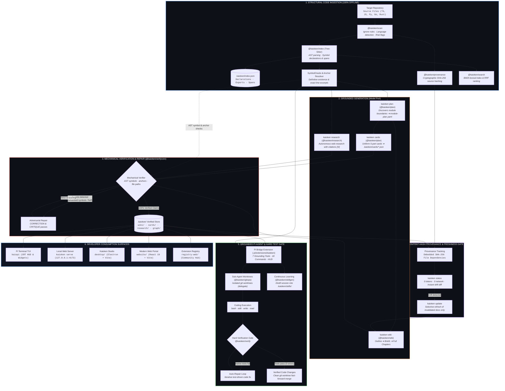

<p align="center">
  
</p>

<p align="center">
  <b>The Repository Knowledge Engine &amp; Grounded Agentic Ecosystem</b><br>
  <i>Deterministic AST code indexing, cryptographic zero-token provenance, and grounded AI agents that eliminate documentation rot and LLM hallucinations.</i>
</p>

<p align="center">
  <a href="https://nodejs.org/"></a>
  <a href="https://www.typescriptlang.org/"></a>
  <a href="#repository--monorepo-structure"></a>
  <a href="kaiopi/docs/roadmap/README.md"></a>
  <a href="#testing--quality-assurance"></a>
  <a href="https://github.com/babtix/kaioken"></a>
  <a href="#license--authors"></a>
</p>

---

## Table of Contents

- [Executive Overview](#executive-overview)
- [The Problem Kaioken Solves](#the-problem-kaioken-solves)
- [Architectural Pipeline](#architectural-pipeline)
- [Core Architectural Invariants](#core-architectural-invariants)
- [Repository & Monorepo Structure](#repository--monorepo-structure)
- [The 18 Core Packages Reference (`kaiopi/kaioken/`)](#the-18-core-packages-reference-kaiopikaioken)
- [Pi Agent Bridge Extension (`.pi/extensions/kaioken`)](#pi-agent-bridge-extension-piextensionskaioken)
- [CLI Surface Reference (22 Commands in `bin.ts`)](#cli-surface-reference-22-commands-in-bints)
- [Quick Start](#quick-start)
- [The Kaioken Multiplier ($\times 1$ to $\times 10$)](#the-kaioken-multiplier-times-1-to-times-10)
- [Artifact Layout (`.kaioken/`)](#artifact-layout-kaioken)
- [Supported Languages](#supported-languages)
- [Testing & Quality Assurance](#testing--quality-assurance)
- [Developer Surfaces & Design System](#developer-surfaces--design-system)
- [Contributing](#contributing)
- [License & Authors](#license--authors)

---

## Executive Overview

**Kaioken** is an enterprise-grade repository knowledge engine and grounded AI agent runtime. It indexes codebases through concrete syntax tree (AST) parsing, computes cryptographic content-hash provenance across every file, and coordinates autonomous AI agents to generate, verify, and maintain deeply grounded documentation artifacts with mathematical certainty:

- **Deterministic AST Indexing**: Concrete syntax tree parsing via Tree-Sitter across TypeScript/JavaScript, Python, Go, and Rust. Extracts exact declarations, exports, parameter signatures, and source spans.
- **Definitive Grounding Oracle**: The `SymbolOracle` provides mechanical positive and negative guarantees (`has(name)`). Quoted code excerpts and line anchors are validated against real source files via `resolveExcerpt`, permanently refusing hallucinations and fuzzy paraphrases.
- **Deep Technical Wikis**: Multi-pass hierarchical cascade (outline $\to$ section plans $\to$ full chapters) where every claimed symbol, file path, and code excerpt is verified against the structural index.
- **Uniform Knowledge Cards**: Compact, structured 5-part technical summaries per module (`summary`, `keyPoints`, `entryPoints`, `sources`, and mechanical `verification` report).
- **Cryptographic Provenance (Zero Tokens)**: Document dependencies are pinned to source SHA-256 hashes. Running `kaioken status` detects code drift in milliseconds offline with zero network calls and zero model tokens.
- **Grounded Pi Agent Extension**: Deeply integrated with the **Pi** agentic coding harness (`kaiopi/.pi/extensions/kaioken`), equipping AI agents with 7 definitive grounding tools and 18 interactive slash commands.
- **Hard Native Test Gate**: Discovers and runs the repository's native build and test suites (`npm test`, `pytest`, `cargo test`, `go test`, `Makefile`). An agent cannot claim a task as done unless native verification passes cleanly.
- **Subagent Worktree Isolation**: Autonomous coding tasks execute on isolated Git worktrees (`@kaioken/gitops`), preventing dirty working directories and file merge collisions.
- **Impact Blast-Radius Analysis**: Predicts the exact declarations, dependent files, cards, wiki documents, and skills that will be invalidated by any proposed code change.
- **Autonomous Cited Web Research**: Multi-turn research agent (`@kaioken/research`) that plans subquestions, searches, fetches, sanitizes pages, and verifies every citation (`[N]`) against content hashes.

---

## The Problem Kaioken Solves

Large software codebases suffer from two compounding failures when paired with AI systems:

1. **Documentation Rot**: Code moves faster than documentation. Engineering teams abandon wikis because manual maintenance is untenable, and nobody knows which chapters have become dangerously obsolete.
2. **LLM Hallucination & Context Bloat**: Language models invent nonexistent functions, hallucinate imports, paraphrase signatures incorrectly, pad prose with boilerplate fluff, or miss critical conventions when blindly given arbitrary byte slices of a repository.

### The Kaioken Solution

Kaioken replaces ungrounded generation with **mechanical AST verification**, **cryptographic staleness gates**, and **tool-grounded agent workflows**:

<p align="center">
  
</p>

---

## Architectural Pipeline



---

## Core Architectural Invariants

### 1. Invariant 1: Public Pi Extension Seams
Zero core forks or monkey-patching of `@earendil-works/pi-*`. All agent capabilities, status badges, telemetry widgets, prompt hooks, and tools enter cleanly through the official Pi Extension API.

### 2. Invariant 10: 100% Offline-Testable Core
Zero hard network dependencies or API key requirements in core packages. Every scanner, parser, grounding oracle, search indexer, provenance tracker, and test runner is verifiable offline.

### 3. Definitive Symbol Oracle Guarantees
The `SymbolOracle` never guesses. If an identifier does not exist in the AST symbol index, `has(name)` returns false and emits a negative guarantee. Quoted code blocks must match source byte-for-byte; fuzzy matching is forbidden.

### 4. Zero-Token Cryptographic Staleness Gates
Documentation freshness is calculated by comparing SHA-256 source file hashes against embedded dependency records. Drift is detected in under 50 milliseconds with 0 tokens spent.

### 5. Hard Native Test Gates (`unverifiable` $\neq$ `passed`)
An agent cannot declare a task complete on its own authority. Native repository test suites (`npm test`, `pytest`, `cargo test`, `go test`) must execute and pass with exit code `0`. If a repository has no test suite, the gate returns `unverifiable`.

---

## Repository & Monorepo Structure

The workspace is organized as a multi-tier monorepo centered on `kaiopi/`:

```
.
├── kaiopi/                     # Primary Unified Monorepo (Pi + Kaioken)
│   ├── kaioken/                # 18 Modular TypeScript packages (@kaioken/*) & CLI
│   │   ├── bin.ts              # Root CLI binary (kaioken) providing full command parity
│   │   ├── scan/               # @kaioken/scan: fast traversal, ignore rules, risk shield
│   │   ├── index/              # @kaioken/index: Tree-Sitter AST parser & SymbolOracle
│   │   ├── search/             # @kaioken/search: BM25 lexical search & RRF ranking
│   │   ├── provenance/         # @kaioken/provenance: SHA-256 source hashing & drift detection
│   │   ├── verifycore/         # @kaioken/verifycore: anti-hallucination shield & anchor matcher
│   │   ├── verify/             # @kaioken/verify: native test runners & diagnostic repair
│   │   ├── impact/             # @kaioken/impact: AST blast-radius prediction
│   │   ├── plan/               # @kaioken/plan: module planning & 5-part knowledge cards
│   │   ├── wiki/               # @kaioken/wiki: multi-pass streaming wiki cascade
│   │   ├── serve/              # @kaioken/serve: zero-dependency HTTP server & preview
│   │   ├── research/           # @kaioken/research: grounded web research & citation verifier
│   │   ├── skills/             # @kaioken/skills: executable task procedures
│   │   ├── skillgen/           # @kaioken/skillgen: autonomous procedure synthesis
│   │   ├── gitops/             # @kaioken/gitops: worktree isolation & safe fast-forward merges
│   │   ├── graph/              # @kaioken/graph: knowledge graph & bundle exporter
│   │   ├── modelport/          # @kaioken/modelport: token budgeting, spend dial, pricing cards
│   │   ├── completion/         # @kaioken/completion: shell auto-completions (bash, zsh, fish)
│   │   └── evals/              # @kaioken/evals: 10-probe groundedness evaluation suite
│   │
│   ├── .pi/extensions/kaioken/ # Pi Agent Bridge Extension
│   │   ├── tools/              # 7 definitive grounding tools for Pi agents
│   │   ├── commands/           # 18 interactive slash commands (/kaio-*)
│   │   ├── hooks/              # Prompt hooks, verify-before-done, destructive command block
│   │   ├── ui/                 # HUD telemetry widgets, CRT/WCAG themes, keyboard suite
│   │   └── prompts/            # Grounded system prompt rules & drift line injection
│   │
│   ├── packages/               # Upstream Pi Agentic Harness (@earendil-works/pi-*)
│   │   ├── coding-agent/       # Core agent loop, session manager, extension runner
│   │   ├── tui/                # Terminal UI framework, double-buffering, widgets
│   │   ├── agent/              # Base agent abstractions and tool interfaces
│   │   └── ai/                 # Multi-provider LLM transport & streaming client
│   │
│   └── docs/                   # Architectural blueprints & roadmap checklists
│       ├── roadmap/            # 2,000 features quality roadmap & 20 category plans
│       └── phases/             # Architecture phase specifications (Phases 0–9)
│
├── desktop/                    # Kaioken Studio Desktop App (Electron + Vite + React 19)
├── website/                    # Modern Showcase Web Portal (React 19, Vite, Tailwind v4)
├── registry-web/               # Community Extension Registry Portal (React 19 + Vite)
├── web-news/                   # Serverless Release Notes & Publishing Feed
├── assets/                     # Brand logos, architectural diagrams, wallpapers
├── DESIGN.md                   # Master Kaioken Design System v2 Specification
└── package.json                # Root workspace configuration
```

---

## The 18 Core Packages Reference (`kaiopi/kaioken/`)

All 18 packages in `kaiopi/kaioken/` are composite, modular TypeScript libraries with strict boundary enforcement:

| Package | Export Name | Purpose | Offline? |
|---|---|---|:---:|
| `scan` | `@kaioken/scan` | Directory traversal, `.gitignore` / `.kaiokenignore` filtering, Shannon entropy secret scanning. | Yes |
| `index` | `@kaioken/index` | Tree-Sitter AST symbol extraction, `SymbolOracle`, exact anchor line resolution (`resolveExcerpt`). | Yes |
| `search` | `@kaioken/search` | In-memory BM25 lexical ranking, Reciprocal Rank Fusion (RRF), directory boost scoring. | Yes |
| `provenance` | `@kaioken/provenance` | SHA-256 cryptographic source hashing, zero-token drift detection, freshness dial calculation. | Yes |
| `verifycore` | `@kaioken/verifycore` | O(1) basename verification, quote anchor matching, boilerplate rejection, hallucination shield. | Yes |
| `verify` | `@kaioken/verify` | Native test runner auto-detection (Vitest, Pytest, Go, Cargo), failure extraction, repair loops. | Yes |
| `impact` | `@kaioken/impact` | Transitive AST dependency graph traversal, blast-radius risk scoring (0–100), safe-rename simulation. | Yes |
| `plan` | `@kaioken/plan` | Directory clustering, `.kaioken/module-plan.yaml` checkpoints, uniform 5-part knowledge cards. | Model Port |
| `wiki` | `@kaioken/wiki` | Multi-pass streaming wiki cascade (outline $\to$ section plans $\to$ full chapters), claim auditing. | Model Port |
| `serve` | `@kaioken/serve` | Zero-dependency HTTP server (`127.0.0.1:4173`), SSE live-reload, interactive graph previews. | Yes |
| `research` | `@kaioken/research` | Autonomous web research agent, page sanitization, hash-anchored citation validation (`[N]`). | External Web |
| `skills` | `@kaioken/skills` | Procedural task guides catalog under `.kaioken/skills/`, step-through procedure debugger. | Yes |
| `skillgen` | `@kaioken/skillgen` | Automated procedure synthesis from repository commands (`package.json`, `Makefile`, etc.). | Model Port |
| `gitops` | `@kaioken/gitops` | Subagent isolated Git worktrees (`delegate`), post-commit hook management, safe fast-forward merges. | Yes |
| `graph` | `@kaioken/graph` | Knowledge dependency graph (Mermaid, Markdown, JSON), standalone static bundle exporter. | Yes |
| `modelport` | `@kaioken/modelport` | Provider-agnostic model client interface, pre-flight token estimation, spend dial ($\times 1$–$\times 10$). | Yes |
| `completion` | `@kaioken/completion` | Full CLI parity auto-completion script generators for Bash, Zsh, and Fish shells. | Yes |
| `evals` | `@kaioken/evals` | 10-probe groundedness evaluation suite, multi-language fixture testing, benchmark scorecards. | Yes |

---

## Pi Agent Bridge Extension (`.pi/extensions/kaioken`)

The bridge extension seamlessly embeds Kaioken's truth layer into any **Pi** coding agent session without patching or forking core runtime code.

### 1. The 7 Grounding Tools
Agents automatically query these deterministic tools instead of guessing:

| Tool Name | Label | Description & Invariant |
|---|---|---|
| `kaio_symbol_lookup` | Symbol Oracle | Definitive AST lookup. Returns exact file, line, and signature, or a strict negative guarantee: `"NEGATIVE GUARANTEE: no symbol matching ... is declared. Do not invent it."` |
| `kaio_read_file` | Grounded Read | Reads exact line ranges with verified anchors. Preferred over raw reads for code quoting. |
| `kaio_wiki_search` | Wiki/Card Search | BM25 + Reciprocal Rank Fusion search across wiki chapters, knowledge cards, and skills. |
| `kaio_impact` | Blast Radius | Predicts transitive files and modules broken by changing a symbol before making edits. |
| `kaio_skill_load` | Load Procedure | Loads distilled task execution procedures from `.kaioken/skills/`. |
| `kaio_status` | Drift Check | 0-token staleness diff comparing docs against current source code before updating docs. |
| `kaio_verify` | Hard Test Gate | Runs native repo build and test suites. Task cannot be marked complete without `VERIFY: PASS`. |

### 2. The 18 Slash Commands
Interactive terminal commands available inside Pi agent sessions:

- `/kaio-scan`: Run repo inventory, AST symbol index, and risk flags.
- `/kaio-symbols`: Query the AST Symbol Oracle for declaration details.
- `/kaio-search`: Run BM25 lexical and structural search across the codebase.
- `/kaio-status`: Check 0-token documentation staleness and source drift report.
- `/kaio-verify`: Trigger the hard verification gate (native build & test runners).
- `/kaio-graph`: Build and render the knowledge dependency graph (Mermaid / JSON).
- `/kaio-serve`: Start the offline documentation preview web server (`127.0.0.1:4173`).
- `/kaio-export`: Export static standalone documentation bundle.
- `/kaio-delegate`: Spin up an isolated Git worktree for safe subagent task execution.
- `/kaio-merge`: Verify a worktree and fast-forward merge it back to main.
- `/kaio-plan`: Propose and review the module decomposition plan (`module-plan.yaml`).
- `/kaio-cards`: Generate and inspect verified 5-part module knowledge cards.
- `/kaio-wiki`: Run multi-pass wiki cascade with claim verification.
- `/kaio-update`: Incrementally refresh only the documents invalidated by recent commits.
- `/kaio-research`: Run autonomous grounded web research with hash-anchored citations.
- `/kaio-skills`: Load and inspect distilled task procedures.
- `/kaio-keys`: Display visual keyboard shortcut cheat-sheet overlay.
- `/kaio-palette`: Open the interactive fuzzy command palette.

---

## CLI Surface Reference (22 Commands in `bin.ts`)

The root `kaioken` executable (`kaiopi/kaioken/bin.ts`) provides full CLI command parity:

```bash
kaioken <command> [options] [arguments]
```

| Command | Purpose | Key Flags | Offline? |
|---|---|---|:---:|
| `scan` | Traverses repo, indexes AST symbols, scans secrets. | `--progress`, `--table`, `--entropy`, `--quarantine` | Yes |
| `symbols` | Queries the AST Symbol Oracle for declarations. | `--root <path>` | Yes |
| `status` | Checks 0-token documentation freshness vs source. | `--root <path>`, `--json` | Yes |
| `search` | BM25 search across symbols, wiki, and cards. | `--preview`, `--explain`, `--boost <path:mul>`, `--limit <n>` | Yes |
| `impact` | Predicts blast-radius for a proposed change. | `--root <path>`, `<symbol>` | Yes |
| `verify` | Discovers & runs native repo test suites. | `--root <path>` | Yes |
| `plan` | Decomposes codebase into cohesive modules. | `--multiplier <n>`, `--tree`, `--coverage`, `--lint`, `--split`, `--merge` | Model |
| `cards` | Generates & inspects 5-part knowledge cards. | `--3d`, `--flip`, `--badge`, `--dedupe`, `--export <dir>` | Model |
| `wiki` | Multi-pass streaming documentation generator. | `--heatmap`, `--validate-links`, `--budget <tokens>` | Model |
| `serve` | Starts local offline HTTP documentation server. | `--port <n>`, `--host <str>` | Yes |
| `research` | Conducts grounded multi-turn web research. | `--root <path>` | External |
| `skills` | Inspects procedural task execution guides. | `--root <path>` | Yes |
| `skillgen` | Synthesizes procedures from repo build commands. | `--root <path>` | Model |
| `graph` | Renders knowledge dependency graph. | `--format <mermaid\|markdown\|json>`, `--write` | Yes |
| `gitops` | Manages worktrees, diffs, and hooks. | `--action <status\|delegate\|merge\|prune\|diff\|install-hook>` | Yes |
| `evals` | Runs 10-probe groundedness evaluation suite. | `--repo <path>`, `--json` | Yes |
| `spend` | Spend transparency, token budgeting, pricing. | `--multiplier <n>`, `--budget <usd>`, `--matrix`, `--audit`, `--dial` | Yes |
| `export` | Exports standalone portable documentation tree. | `--root <path>` | Yes |
| `update` | Incrementally refreshes invalidated docs. | `--dry-run`, `--root <path>` | Model |
| `delegate` | Spawns isolated task branch in Git worktree. | `--root <path>`, `<task-name>` | Yes |
| `merge` | Verifies and fast-forward merges a worktree. | `--root <path>`, `<task-name>` | Yes |
| `completion`| Emits shell auto-completion script. | `<bash\|zsh\|fish>` | Yes |

---

## Quick Start

### Prerequisites

- **Node.js**: `>= 22.0.0`
- **npm**: `>= 10.0.0`
- **Git**: Installed and available on `PATH`

### 1. Build Kaioken Core Packages

```bash
# Navigate to the primary monorepo
cd kaiopi

# Install dependencies
npm install

# Build all 18 Kaioken packages
npm run build:kaioken

# Verify typecheck and offline compliance (0 errors)
npm run check:kaioken
```

### 2. Run the 22-Command Standalone CLI

```bash
# Run scan on any target repository
node kaioken/bin.ts scan --table --entropy --root /path/to/repo

# Query the Symbol Oracle
node kaioken/bin.ts symbols MyFunction --root /path/to/repo

# Check 0-token documentation freshness
node kaioken/bin.ts status --root /path/to/repo

# Start the local documentation server (127.0.0.1:4173)
node kaioken/bin.ts serve --root /path/to/repo
```

### 3. Launch Pi with the Grounded Kaioken Extension

```bash
# Launch interactive Pi session with full Kaioken grounding
npx pi --extension .pi/extensions/kaioken
```

Inside the interactive session, the Kaioken CRT HUD displays real-time telemetry, and all 18 slash commands (`/kaio-*`) and 7 grounding tools are active.

---

## The Kaioken Multiplier ($\times 1$ to $\times 10$)

The Kaioken multiplier provides a conscious dial balancing generation depth, compute budget, and adversarial verification passes:

```
[×1] ───► Public surface, main flow, and high-level module summaries.
[×2] ───► Adds detailed subsection documents and architectural flow diagrams.
[×3] ───► Exhaustive coverage of all declarations and exported symbols (Default).
[×4..9] ─► Critique-and-revise loops: scores drafts against rubrics, eliminates boilerplate.
[×10] ──► Adversarial grounding repair: detects and fixes every grounding defect.
```

---

## Artifact Layout (`.kaioken/`)

All generated knowledge artifacts are written deterministically into `.kaioken/` inside the target repository:

```
.kaioken/
├── scan.json            # Repository file inventory, content hashes, and risk report
├── index.json           # Tree-Sitter AST parsed symbols, declarations, spans, skeletons
├── provenance.json      # Cryptographic SHA-256 source dependency mappings
├── verification.json    # Mechanical verification audit report & grounding defect scores
├── module-plan.yaml     # Human-reviewed module tree checkpoint
├── wiki-plan.yaml       # Multi-pass wiki outline and chapter plan
├── graph.json           # Knowledge graph linking documents to source files
├── cards/               # Verified 5-part module knowledge cards (JSON)
│   ├── core.json
│   └── api.json
├── wiki/                # Generated deep markdown wiki chapters
│   ├── Architecture.md
│   └── DataFlow.md
├── skills/              # Handwritten and distilled agent task procedures
└── research/            # Cited research reports from /kaio-research
```

---

## Supported Languages

Kaioken uses **Tree-Sitter** for concrete syntax tree parsing and symbol extraction:

- **TypeScript** & **TSX**
- **JavaScript** & **JSX**
- **Python**
- **Go**
- **Rust**

Adding a new language grammar is strictly declarative: add the parser mapping in `kaiopi/kaioken/index/src/grammars.ts` and provide Tree-Sitter `.scm` queries under `kaiopi/kaioken/index/src/queries/`.

---

## Testing & Quality Assurance

Kaioken enforces a strict engineering discipline: **"If a core stage needs an API key or network connection to be tested, it is architecturally broken."**

```bash
# Run Kaioken verification check (typecheck, offline compliance, barrel check)
cd kaiopi
npm run check:kaioken

# Run complete Vitest suite across Kaioken packages and Pi extension
npx vitest run .pi/extensions/kaioken kaioken
```

- **2,078+ Passing Offline Tests**: Over 2,078 tests pass completely offline with zero external network dependencies.
- **Offline Network Isolation Guard**: `scripts/check-kaioken-offline.mjs` verifies that no core package imports network libraries.
- **Barrel Completeness Gate**: `scripts/check-kaioken-barrels.mjs` validates 100% reachable export symbols across all 18 packages.

---

## Developer Surfaces & Design System

Kaioken delivers a unified developer experience across five dedicated surfaces governed by the master specification in [DESIGN.md](DESIGN.md):

1. **Terminal TUI (`kaiopi/.pi/extensions/kaioken/ui`)**: Full-screen CRT HUD, 24-bit TrueColor gradient headers, telemetry sparklines, and WCAG AAA / Amber CRT themes.
2. **Local Preview Server (`@kaioken/serve`)**: Zero-dependency offline web server (`127.0.0.1:4173`) with SSE live-reload and interactive Cytoscape graph visualization.
3. **Kaioken Studio (`desktop/`)**: Native desktop IDE built with Electron, Vite, React 19, and Tailwind CSS.
4. **Showcase Web Portal (`website/`)**: Modern web portal built with React 19, Vite, Tailwind CSS v4, Base UI, and interactive Mermaid diagrams.
5. **Community Registry (`registry-web/`)**: Community hub for browsing, searching, and submitting extensions with live manifest linting.

---

## Contributing

Pull requests are warmly welcomed under the [License Zero Noncommercial Public License 2.0.1](LICENSE). Please review [CONTRIBUTING.md](CONTRIBUTING.md) for offline-first guidelines and grounding invariants before submitting changes.

---

## License & Authors

- **Author & Architect**: [Babtix / Babtich El Habib](https://github.com/babtix)
- **Repository**: [https://github.com/babtix/kaioken](https://github.com/babtix/kaioken)
- **News & Announcements**: [https://kaioken-news.vercel.app](https://kaioken-news.vercel.app)
- **License**: Licensed under the [License Zero Noncommercial Public License 2.0.1](LICENSE) (Commercial licenses available; subcomponents under MIT where indicated).

---

<p align="center">
  <b>Built for developers who demand verifiable truth over generative illusion.</b>
</p>
