# Architecture Overview

Kaioken is a terminal-based AI coding assistant that combines an interactive chat agent with a knowledge engine. The chat agent allows users to converse with LLMs to perform coding tasks like editing files and running commands, with changes shown as diffs for approval. The knowledge engine scans repositories, generates structured documentation (knowledge cards and wiki), and incrementally updates it over time. Recent enhancements include multi-provider LLM support, a workspace explorer UI, git worktree helpers, enhanced agent tools (including permissions, context tracking, and directory notes), and a hybrid research engine with supervisor, router, and PDF exporter.

## Table of Contents
- [Architecture](#architecture)
- [Architecture](#architecture)
- [Key Components](#key-components)
- [Data Flow](#data-flow)
- [Glossary](#glossary)
- [Referenced Files](#referenced-files)

## Architecture

Kaioken follows a layered architecture where high-level components depend on lower-level utilities, with configuration as a cross-cutting concern.

```mermaid
graph TD
    cmd[cli/cmd/kaioken/main.go] --> tui[cli/internal/tui/tui.go]
    cmd --> agent[cli/internal/agent/agent.go]
    cmd --> wiki[cli/internal/wiki/wiki.go]
    cmd --> llm[cli/internal/llm/]
    cmd --> skills[cli/internal/skills/skills.go]
    cmd --> scan[cli/internal/scan/scan.go]
    cmd --> plan[cli/internal/plan/plan.go]
    cmd --> codemap[cli/internal/codemap/codemap.go]
    cmd --> session[cli/internal/session/session.go]
    cmd --> state[cli/internal/state/state.go]
    cmd --> serve[cli/internal/serve/serve.go]
    cmd --> gitx[cli/internal/gitx/gitx.go]
    cmd --> research[cli/internal/research/]
    cmd --> supervisor[cli/internal/supervisor/]
    cmd --> router[cli/internal/router/]
    cmd --> pdfexporter[cli/internal/pdfexporter/]
    tui --> agent
    tui --> wiki
    tui --> llm
    tui --> skills
    tui --> scan
    tui --> plan
    tui --> session
    tui --> state
    tui --> serve
    tui --> codemap
    tui --> gitx
    tui --> research
    tui --> supervisor
    tui --> router
    tui --> pdfexporter
    agent --> llm
    agent --> codemap
    agent --> scan
    agent --> session
    agent --> skills
    agent --> wiki
    agent --> state
    agent --> research
    agent --> supervisor
    agent --> router
    agent --> pdfexporter
    wiki --> scan
    wiki --> plan
    wiki --> llm
    wiki --> codemap
    wiki --> state
    wiki --> gitx
    wiki --> skills
    wiki --> research
    wiki --> supervisor
    wiki --> router
    wiki --> pdfexporter
    llm --> config[cli/internal/config/config.go]
    config --> tui
    config --> agent
    config --> wiki
    config --> llm
    config --> skills
    config --> scan
    config --> plan
    config --> codemap
    config --> session
    config --> state
    config --> serve
    config --> gitx
    config --> research
    config --> supervisor
    config --> router
    config --> pdfexporter
```

### Component Responsibilities

- **cli/cmd/kaioken/main.go**: Entry point; defines CLI commands (`init`, `scan`, `plan`, `generate`, `wiki`, `update`, `models`, `status`, `skills`, `hook`, `serve`) and depends on all internal packages.
- **cli/internal/tui/tui.go**: Terminal UI (Bubble Tea); handles user input, displays output, and orchestrates interactions with agent, LLM, session, skills, wiki, serve, codemap, scan, plan, state, and gitx. Now includes a workspace explorer UI for navigating repository structure and symbols.
- **cli/internal/agent/agent.go**: Chat agent; processes user messages, invokes LLM with tools (which have been enhanced to include permissions, context tracking, and directory notes features), and manages approvals via UI; depends on llm, config, codemap, scan, session, skills, wiki, and state.
- **cli/internal/wiki/wiki.go**: Knowledge engine; generates modules, knowledge cards, and wiki documentation; functions as a repository knowledge base for incremental updates and contextual awareness; depends on scan, plan, llm, config, codemap, state, state, and skills.
- **cli/internal/llm/**: LLM provider integration; supports multiple providers (OpenRouter, OpenAI, Anthropic, etc.); handles streaming, tool use, token budgeting, and retries; depends on config.
- **cli/internal/skills/skills.go**: Manages task guides (skills); depends on scan, llm, and config.
- **cli/internal/scan/scan.go**: Inventorys repository files; depends on config.
- **cli/internal/plan/plan.go**: Plans repository modules (`modules.yaml`); depends on scan, llm, and config.
- **cli/internal/codemap/codemap.go**: Parses source code to build symbol indexes and skeletons; no internal dependencies.
- **cli/internal/session/session.go**: Manages chat session persistence; depends on llm.
- **cli/internal/state/state.go**: Tracks wiki build state for incremental updates; depends on scan.
- **cli/internal/serve/serve.go**: Serves generated wiki via HTTP; depends on wiki.
- **cli/internal/gitx/gitx.go**: Git integration (hooks, diffs, worktree helpers, etc.); no internal dependencies.
- **cli/internal/config/config.go**: Manages global and per-repo configuration; depends on environment and standard library.
- **cli/internal/research/**: Hybrid research engine; responsible for advanced research capabilities; depends on config.
- **cli/internal/supervisor/**: Supervisor; oversees agent operations and task coordination; depends on config.
- **cli/internal/router/**: Router; directs requests to appropriate LLMs or tools based on context; depends on config.
- **cli/internal/pdfexporter/**: PDF exporter; converts wiki content or notes to PDF format; depends on config.

## Key Components

### Command Line Interface (`cli/cmd/kaioken/main.go`)

The CLI entry point defines all user-facing commands and orchestrates high-level operations by delegating to internal packages.

| Declaration | Line Range | Description |
|-------------|------------|-------------|
| | | |

<!-- kaioken:files internal/tui/tui.go,internal/agent/agent.go,internal/wiki/wiki.go -->
