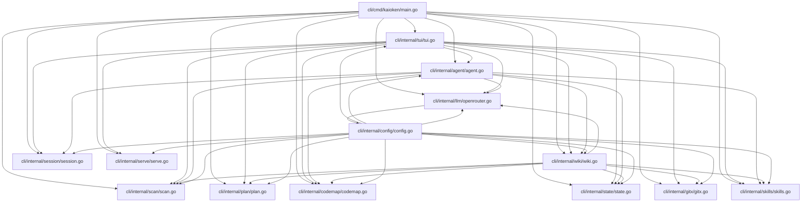

# Architecture Overview

Kaioken is a terminal-based AI coding assistant that combines an interactive chat agent with a knowledge engine. The chat agent allows users to converse with LLMs to perform coding tasks like editing files and running commands, with changes shown as diffs for approval. The knowledge engine scans repositories, generates structured documentation (knowledge cards and wiki), and incrementally updates it over time.

## Table of Contents
- [Architecture](#architecture)
- [Key Components](#key-components)
- [Data Flow](#data-flow)
- [Glossary](#glossary)
- [Referenced Files](#referenced-files)

## Architecture

Kaioken follows a layered architecture where high-level components depend on lower-level utilities, with configuration as a cross-cutting concern.

### Component Responsibilities

- **cli/cmd/kaioken/main.go**: Entry point; defines CLI commands (`init`, `scan`, `plan`, `generate`, `wiki`, `update`, `models`, `status`, `skills`, `hook`, `serve`) and depends on all internal packages.
- **cli/internal/tui/tui.go**: Terminal UI (Bubble Tea); handles user input, displays output, and orchestrates interactions with agent, LLM, session, skills, wiki, serve, codemap, scan, plan, state, and gitx.
- **cli/internal/agent/agent.go**: Chat agent; processes user messages, invokes LLM with tools (`read_file`, `edit_file`, etc.), and manages approvals via UI; depends on llm, config, codemap, scan, session, skills, wiki, and state.
- **cli/internal/wiki/wiki.go**: Knowledge engine; generates modules, knowledge cards, and wiki documentation; depends on scan, plan, llm, config, codemap, state, gitx, and skills.
- **cli/internal/llm/openrouter.go**: LLM provider integration; handles streaming, tool use, token budgeting, and retries; depends on config.
- **cli/internal/skills/skills.go**: Manages task guides (skills); depends on scan, llm, and config.
- **cli/internal/scan/scan.go**: Inventorys repository files; depends on config.
- **cli/internal/plan/plan.go**: Plans repository modules (`modules.yaml`); depends on scan, llm, and config.
- **cli/internal/codemap/codemap.go**: Parses source code to build symbol indexes and skeletons; no internal dependencies.
- **cli/internal/session/session.go**: Manages chat session persistence; depends on llm.
- **cli/internal/state/state.go**: Tracks wiki build state for incremental updates; depends on scan.
- **cli/internal/serve/serve.go**: Serves generated wiki via HTTP; depends on wiki.
- **cli/internal/gitx/gitx.go**: Git integration (hooks, diffs, etc.); no internal dependencies.
- **cli/internal/config/config.go**: Manages global and per-repo configuration; depends on environment and standard library.

## Key Components

### Command Line Interface (`cli/cmd/kaioken/main.go`)

The CLI entry point defines all user-facing commands and orchestrates high-level operations by delegating to internal packages.

| Declaration | Line Range | Description |
|-------------|------------|-------------|
| `func main()` | Not in source block | Entry point; parses command-line arguments and dispatches to subcommand handlers. |
| `func initCmd()` | Not in source block | Handles `kaioken init` command to create default configuration. |
| `func scanCmd()` | Not in source block | Handles `kaioken scan` to inventory repository files. |
| `func planCmd()` | Not in source block | Handles `kaioken plan` to generate module plan. |
| `func generateCmd()` | Not in source block | Handles `kaioken generate` to create knowledge cards. |
| `func wikiCmd()` | Not in source block | Handles `kaioken wiki`/`/wiki` to run knowledge generation pipeline. |
| `func updateCmd()` | Not in source block | Handles `kaioken update`/`/update` for incremental wiki updates. |
| `func modelsCmd()` | Not in source block | Handles `kaioken models` to list available LLM models. |
| `func statusCmd()` | Not in source block | Handles `kaioken status` to check module freshness. |
| `func skillsCmd()` | Not in source block | Handles `kaioken skills` to build/task guides. |
| `func hookCmd()` | Not in source block | Handles `kaioken hook` to manage Git post-commit hooks. |
| `func serveCmd()` | Not in source block | Handles `kaioken serve`/`/serve` to start wiki browser. |

### Terminal User Interface (`cli/internal/tui/tui.go`)

The TUI built with Bubble Tea manages the interactive chat interface, command palette, and live updates. It orchestrates interactions with all core components.

Exported declarations from source:

| Declaration | Line Range | Description |
|-------------|------------|-------------|
| `func Run(repo string) error` | L188-195 | Starts the TUI event loop for a repository. Resolves absolute path and runs Bubble Tea program. |
| `func New(repo string) Model` | L201-264 | Constructs initial TUI state: loads configuration, initializes UI components (textarea, spinner, list), sets up event channels, and resets conversation. |
| `func (m *Model) resetConversation()` | L266-272 | Clears conversation history to initial system prompt and creates new session object. |
| `func (m *Model) saveSession()` | L277-285 | Persists current conversation to session storage; reports save failures via status line. |
| `func (m Model) Init() tea.Cmd` | L287-289 | Returns initial commands: cursor blink and event listener setup. |
| `func (m Model) Update(msg tea.Msg) (tea.Model, tea.Cmd)` | L291-431 | Main state update handler: processes window resizes, key presses, async messages (logs, busy states, approvals, agent responses, etc.). |
| `func (m Model) onKey(msg tea.KeyMsg) (tea.Model, tea.Cmd)` | L433-572 | Handles keyboard input: manages

<!-- kaioken:files internal/tui/tui.go,internal/agent/agent.go,internal/wiki/wiki.go -->
