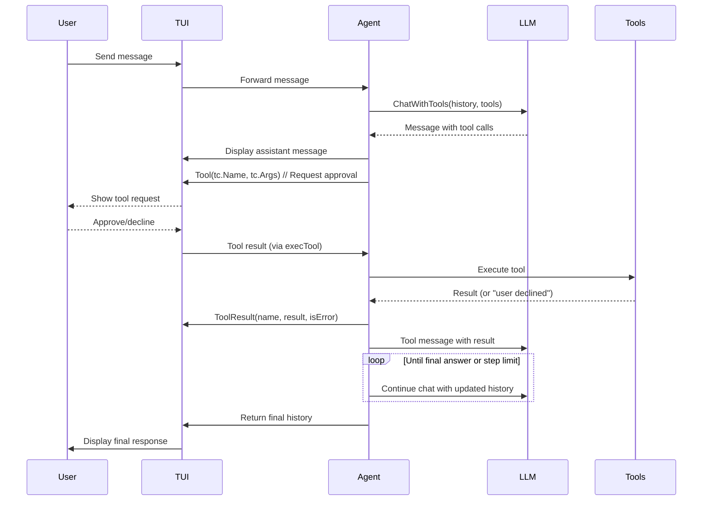

# Chat Agent

The chat agent processes user messages, coordinates interactions with the LLM, manages tool execution under user approval, and leverages generated wiki knowledge for context-aware assistance.

## Table of Contents
- [System Prompt](#system-prompt)
- [The chat Method](#the-chat-method)
- [The Run Method](#the-run-method)
- [Tool Execution Flow](#tool-execution-flow)
- [Knowledge Integration](#knowledge-integration)

## System Prompt

The agent's behavior is guided by a dynamically generated system message that establishes its role, available tools, and operational guidelines.

`cli/internal/agent/agent.go:12-31`
```go
func SystemPrompt(root string, allowRun bool) string {
	var b strings.Builder
	b.WriteString("You are Kaioken, an AI coding assistant embedded in a terminal, working inside the ")
	b.WriteString("repository at:\n  " + root + "\n\n")
	b.WriteString("You help the user understand and modify this codebase. You have tools:\n")
	b.WriteString("- read_file, list_files, search: inspect the repo. Use them liberally before answering.\n")
	b.WriteString("- read_knowledge: open Kaioken's generated docs for this repo; call it with no\n")
	b.WriteString("  argument to see what exists.\n")
	b.WriteString("- write_file, edit_file: change files. Prefer edit_file for small changes; use a unique old_string.\n")
	if allowRun {
		b.WriteString("- run_command: run shell commands (build, test, git) in the repo root.\n")
	}
	b.WriteString(knowledgeSummary(root))
	b.WriteString("\nGuidelines:\n")
	b.WriteString("- Every file change and command runs only after the user approves it, so propose concrete edits.\n")
	b.WriteString("- Ground answers in the actual files — read before you claim. Never invent file contents.\n")
	b.WriteString("- Keep prose concise. When you finish a task, briefly say what you changed.\n")
	b.WriteString("- Make minimal, targeted edits that match the surrounding code style.\n")
	return b.String()
}
```

The prompt includes:
- Repository context (`root`)
- Tool descriptions with usage guidance
- Conditional `run_command` tool based on `allowRun` flag
- Knowledge base reference via `read_knowledge` and `knowledgeSummary(root)`
- Behavioral guidelines emphasizing approval, factual grounding, conciseness, and style consistency

## The chat Method

Handles single-turn LLM interactions, optionally streaming responses to the UI while collecting the complete message for tool processing.

`cli/internal/agent/agent.go:35-40`
```go
func (a *Agent) chat(ctx context.Context, history []llm.Message, tools []llm.Tool) (llm.Message, error) {
	if a.NoStream {
		return a.Client.ChatWithTools(ctx, history, tools)
	}
	return a.Client.ChatWithToolsStream(ctx, history, tools, a.UI.AssistantDelta)
}
```

Key aspects:
- Respects `a.NoStream` flag to choose between streaming and non-streaming LLM calls
- Uses `a.Client` (from `kaioken/internal/llm`) for actual LLM communication
- When streaming, delivers incremental updates via `a.UI.AssistantDelta`
- Returns the fully assembled LLM message regardless of streaming mode
- Propagates LLM errors directly to the caller

## The Run Method

Implements the agent's core reasoning loop, managing tool use, approvals, and conversation history until task completion or step limit.

`cli/internal/agent/agent.go:45-89`
```go
func (a *Agent) Run(ctx context.Context, history []llm.Message) ([]llm.Message, error) {
	steps := a.MaxSteps
	if steps <= 0 {
		steps = 25
	}
	tools := a.Tools()

	for i := 0; i < steps; i++ {
		if ctx.Err() != nil {
			return history, ctx.Err()
		}
		msg, err := a.chat(ctx, history, tools)
		if err != nil {
			return history, err
		}
		history = append(history, msg)

		if text := strings.TrimSpace(msg.Content); text != "" {
			a.UI.Assistant(msg.Content)
		}

		if len(msg.ToolCalls) == 0 {
			return history, nil // final answer
		}

		for _, tc := range msg.ToolCalls {
			if ctx.Err() != nil {
				return history, ctx.Err()
			}
			a.UI.Tool(tc.Function.Name, tc.Function.Arguments)
			result := a.execTool(ctx, tc)
			isErr := strings.HasPrefix(result, "error:") ||
				strings.HasPrefix(result, "user declined") ||
				strings.Contains(result, "exited with error")
			a.UI.ToolResult(tc.Function.Name, result, isErr)
			history = append(history, llm.Message{
				Role:       "tool",
				ToolCallID: tc.ID,
				Name:       tc.Function.Name,
				Content:    result,
			})
		}
	}
	return history, fmt.Errorf("stopped after %d steps without a final answer", steps)
}
```

Core responsibilities:
1. **Step Management**: Enforces `a.MaxSteps` (default 25) to prevent infinite loops
2. **Context Handling**: Checks for cancellation at each iteration
3. **LLM Interaction**: Delegates to `chat` for model communication
4. **Response Processing**:
   - Displays LLM-generated text via `a.UI.Assistant`
   - Identifies tool calls in LLM responses
5. **Tool Execution Loop**:
   - Notifies UI of impending tool execution via `a.UI.Tool`
   - Executes tool via internal `execTool` method
   - Classifies results as errors based on specific prefixes/patterns
   - Reports outcomes to UI via `a.UI.ToolResult`
   - Appends tool results to conversation history for LLM context
6. **Termination Conditions**:
   - Returns history when LLM provides final answer (no tool calls)
   - Returns error on context cancellation or step exhaustion

## Tool Execution Flow

The agent coordinates tool use through a strict approval workflow where the UI mediates user consent before any state-changing operation.



Key approval mechanics:
- The agent never executes tools directly; it requests UI-mediated approval
- `a.UI.Tool` presents the tool name/arguments to the user for consent
- Declined tools return `"user declined"` result, treated as non-fatal error
- Only approved tools proceed to actual execution via `a.execTool`
- All tool results (success/error/decline) are fed back to the LLM as tool messages

## Knowledge Integration

The agent leverages wiki-generated documentation through the `read_knowledge` tool, which provides access to structured repository insights.

From the system prompt (`cli/internal/agent/agent.go:12-31`):
> "- read_knowledge: open Kaioken's generated docs for this repo; call it with no\n>   argument to see what exists."

This enables:
- **Contextual Awareness**: Agents consult generated knowledge before answering
- **Self-Documentation**: `read_knowledge` with no argument lists available documentation
- **Targeted Retrieval**: Specific knowledge cards can be accessed by name/path
- **Accuracy Grounding**: Reduces hallucination by anchoring responses in verified facts

The agent's instruction to "Use [tools] liberally before answering" combined with the `read_knowledge` tool creates a feedback loop where:
1. Agent queries knowledge base for relevant context
2. LLM incorporates documented facts into responses
3. User approvals validate changes against documented conventions
4. Generated knowledge evolves through subsequent wiki updates

This integration ensures the agent operates as an informed assistant that respects both the current codebase and its documented architectural understanding.

<!-- kaioken:files internal/agent/agent.go -->
