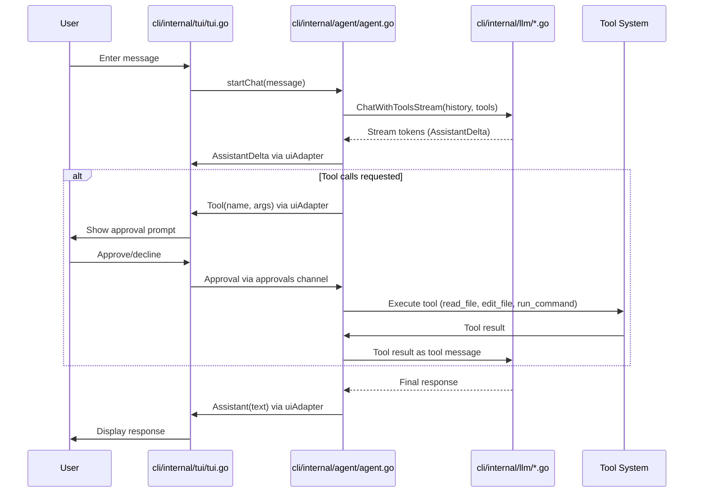

# Component Interactions and Data Flow

This chapter outlines the two primary data flows in kaioken: interactive chat sessions and knowledge generation/update cycles. It explains how components coordinate to enable the dual functionality of the AI coding assistant and knowledge engine.

## Table of Contents
- [Interactive Chat Session Flow](#interactive-chat-session-flow)
- [Knowledge Generation and Update Cycle](#knowledge-generation-and-update-cycle)
- [Referenced Files](#referenced-files)

## Interactive Chat Session Flow

The interactive chat session enables real-time collaboration between the user and the LLM, with tool execution gated by user approval. This flow involves the TUI, agent, LLM client, and tool execution system.

### Sequence Diagram


### Step-by-Step Execution

1. **Message Input Handling**  
   When the user enters a message in the TUI, `startChat` is invoked. The message is appended to the conversation history as a user message.

2. **Agent Initialization**  
   An `agent.Agent` is created with:
   - LLM client (`m.client`)
   - Repository root (`m.repo`)
   - UI adapter (`uiAdapter`) for TUI communication
   - Auto-approve setting (`m.autoApprove`)
   - Tool execution permissions (`AllowRun: true`)
   - Step limit (`MaxSteps: 25`)

3. **LLM Interaction Loop**  
   The agent enters a tool-calling loop:
   - Calls `llm.Client.ChatWithToolsStream` with conversation history and available tools
   - Streams response tokens to TUI via `uiAdapter.AssistantDelta`
   - If the LLM requests tools:
     - Notifies TUI via `uiAdapter.Tool`
     - Waits for user approval through `uiAdapter.Approve`
     - On approval, executes the tool and returns result to LLM
     - On decline, returns "user declined" error
   - Continues until LLM provides final answer or step limit exceeded

4. **Approval Workflow**  
   The TUI displays approval requests via `showApproval`:
   - Shows action, target, and diff preview
   - Presents y/n options for user confirmation
   - Sends response back to agent through approvals channel

5. **Response Display**  
   Final LLM responses are rendered as markdown and appended to the TUI view via `uiAdapter.Assistant`.

### Key Dependencies
- TUI depends on `internal/agent` for agent logic
- Agent depends on `internal/llm` for LLM communication
- Both use `uiAdapter` for bidirectional communication:
  - Agent → TUI: `AssistantDelta`, `Assistant`, `Tool`, `ToolResult`, `Info`
  - TUI → Agent: `approvals` channel, `events` channel

## Knowledge Generation and Update Cycle

The knowledge engine processes repositories to generate structured documentation through scanning, planning, generation, and wiki-building phases. It supports both full regeneration and incremental updates.

### Knowledge Generation Flow
```mermaid
flowchart TD
    A[/wiki command] --> B[scan.Repo]
    B --> C[plan.Generate]
    C --> D[User edits modules.yaml]
    D --> E[generate.Run]
    E --> F[wiki.Run]
    F --> G[state.Save]
    G --> H[Wiki Documentation]
```

### Update Flow
```mermaid
flowchart LR
    A[/update command] --> B[gitx.Changes]
    B --> C[wiki.Update]
    C --> D[Regenerate affected sections]
    D --> E[state.Save]
    E --> F[Refresh affected skills]
    F --> G[Updated Wiki]
```

### Detailed Wiki Generation Process (`wiki.Run`)

1. **Code Indexing**  
   Builds structural index of repository:
   ```go
   r.idx = codemap.Build(res)
   pg.info(fmt.Sprintf("indexed %d declarations across %d files",
       r.idx.SymbolCount(), len(r.idx.Files)))
   ```

2. **Global Planning (Pass 1)**  
   Creates wiki outline using LLM:
   - Reuses existing `wiki_plan.yaml` if present and not forced
   - Otherwise, prompts LLM with repository structure to generate sections
   - Each section includes ID, title, goal, and relevant files

3. **Section Processing (Passes 2-3)**  
   For each section in parallel:
   - **Sub-Planning (Pass 2)**: Plans subsection structure
   - **Document Generation (Pass 3)**:
     - Generates main section document
     - Generates subsection documents if multiplier ≥ 2

4. **Document Generation Details**  
   Each document creation involves:
   - Building prompt with section goal, outline context, and file bundle
   - Calling LLM with depth directive based on multiplier
   - Optional critique pass (multiplier ≥ 4)
   - Grounding verification and correction (multiplier ≥ 10)
   - Adding provenance footer before saving

### Incremental Update Mechanism

The update process (`wiki.Update` called from TUI):
1. Uses `gitx.Changes` to find modifications since last build (from state)
2. Identifies invalidated documentation sections
3. Regenerates only affected sections using similar pipeline as full wiki
4. Updates build state with new baseline
5. Refreshes affected skills using the skills system

### State Management
- `state.Save` records file hashes after wiki build (shows call to `wiki.Run` which eventually calls `SaveStamp`)
- Enables `update` command to detect changes by comparing current file state with saved baseline

### Key Dependencies
- Wiki generation depends on:
  - `internal/scan` for repository inventory
  - `internal/codemap` for code indexing and file bundling
  - `internal/llm` for LLM-powered planning and generation
  - `internal/config` for settings (concurrency, token limits)
  - `internal/state` for incremental update tracking
  - `internal/skills` for refreshing affected skills during updates
- TUI coordinates the process and handles user interaction/approvals

## Referenced Files
- `cli/internal/tui/tui.go`
- `cli/internal/wiki/wiki.go`
- `cli/internal/agent/agent.go`

<!-- kaioken:files internal/tui/tui.go,internal/agent/agent.go,internal/wiki/wiki.go -->
