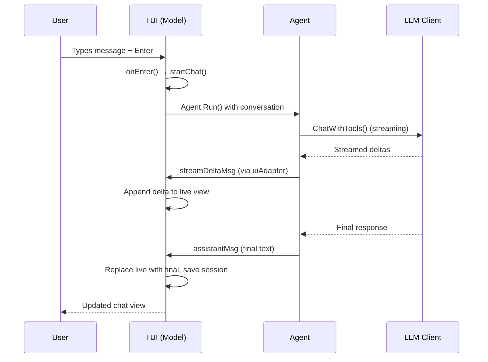
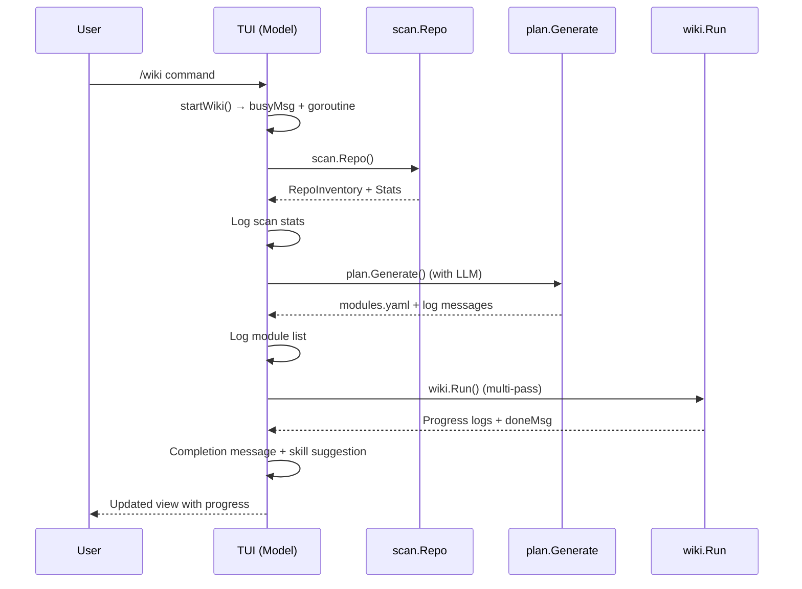

# Terminal User Interface (TUI)

The TUI is kaioken's primary interactive interface, built with the Bubble Tea library. It handles user input, displays chat and system output, manages sessions, provides a command palette for slash commands, and orchestrates interactions with the agent, knowledge engine, and other components. The TUI runs as a Bubble Tea program where user actions trigger messages that update the internal state and re-render the view.

## Table of Contents
- [Introduction](#introduction)
- [Architecture and Data Flow](#architecture-and-data-flow)
- [Model Structure](#model-structure)
- [Message Types](#message-types)
- [User Interaction Flow](#user-interaction-flow)
- [Command Palette and Slash Commands](#command-palette-and-slash-commands)
- [Session Management](#session-management)
- [Approval Workflow](#approval-workflow)
- [Knowledge Engine Integration](#knowledge-engine-integration)
- [Configuration and Settings](#configuration-and-settings)
- [Rendering and Layout](#rendering-and-layout)
- [Referenced Files](#referenced-files)

## Introduction

The TUI (`cli/internal/tui/tui.go`) is the user-facing layer of kaioken. It:
- Displays chat conversations with streaming LLM responses
- Renders markdown, diffs, and status information
- Processes user input via a multi-line composer
- Provides a command palette (`/`) for accessing all functionality
- Manages chat sessions (save/resume/list)
- Handles tool approvals for file edits and command execution
- Orchestrates knowledge engine operations (scan, plan, wiki, generate)
- Displays progress during long-running operations
- Shows token usage, model/provider info, and system status

The TUI depends on nearly all internal packages (agent, llm, config, scan, plan, wiki, etc.) but has no internal dependencies itself—it is the top-level UI layer.

## Architecture and Data Flow

The TUI follows the standard Bubble Tea architecture: a `Model` struct holds state, and the program loops through `Init`, `Update`, and `View` methods. User input and external events (like LLM responses) are processed as `tea.Msg` values in `Update`, which may trigger state changes and side effects (like starting agent interactions or knowledge engine tasks).

### Core Loop
1. **Init**: Sets up initial commands (cursor blink, event listener)
2. **Update**: Processes messages (keyboard input, async results, system events)
3. **View**: Renders the current state to the terminal

### Data Flow for Chat Interaction


### Data Flow for Knowledge Engine (e.g., `/wiki`)


## Model Structure

The `Model` struct holds all TUI state. Key fields include:

| Field | Type | Purpose |
|-------|------|---------|
| `repo` | string | Absolute path to current repository |
| `cfg` | *config.Config | Per-repo configuration |
| `global` | *config.Global | Global configuration (API keys, defaults) |
| `apiKeys` | map[string]string | Session-scoped API keys (per provider) |
| `client` | *llm.Client | Active LLM client |
| `conversation` | []llm.Message | Chat history (system + user/assistant turns) |
| `autoApprove` | bool | Whether to skip tool approval prompts |
| `undoStack` | []agent.UndoEntry | History of file edits for undo |
| `sess` | *session.Session | Current chat session (for persistence) |
| `vp` | viewport.Model | Renders scrollback chat |
| `input` | textarea.Model | Multi-line input composer |
| `keyInput` | textinput.Model | Hidden field for API key entry |
| `spin` | spinner.Model | Spinner for busy states |
| `list` | list.Model | Picker for models/sessions |
| `events` | chan tea.Msg | Channel for async messages from goroutines |
| `approvals` | chan bool | Channel for approval responses |
| `lines` | []string | Raw lines of chat scrollback |
| `header` | []string | Sticky top block — wordmark plus live status panel |
| `committed` | string | Cached wrapped render of `lines` |
| `live` | string | Currently streaming assistant response |
| `busy` bool | Whether a long task is running |
| `busyText` string | Description of current busy task |
| `busyStart` time.Time | Start time for elapsed counter |
| `mode` | mode | Current UI mode (chat or picker) |
| `pal` | palette | Internal slash-command completion menu |
| `pendingKey` bool | Whether awaiting API key input |
| `pendingApproval` bool | Whether awaiting tool approval |
| `approval` | agent.ApprovalRequest | Current approval request |
| `cancel` | context.CancelFunc | For cancelling active tasks |
| `serveCancel` | context.CancelFunc | For wiki server |
| `serveURL` string | URL if wiki is being served |
| `configMissing` bool | Whether repo config was missing |
| `suggestedSkills` bool | Whether skill nudge was shown |
| `width`, `height` int | Terminal dimensions |
| `ready` bool | Whether initial layout is done |

### Modes
The TUI operates in two mutually exclusive modes:
- `modeChat` (0): Normal chat interface, input goes to composer
- `modePicker` (1): Model/session selector is active, input filters the list

```go
type mode int

const (
	modeChat mode = iota
	modePicker
)
```

## Message Types

Async communication uses typed messages sent via the `events` channel

<!-- kaioken:files internal/tui/tui.go -->
