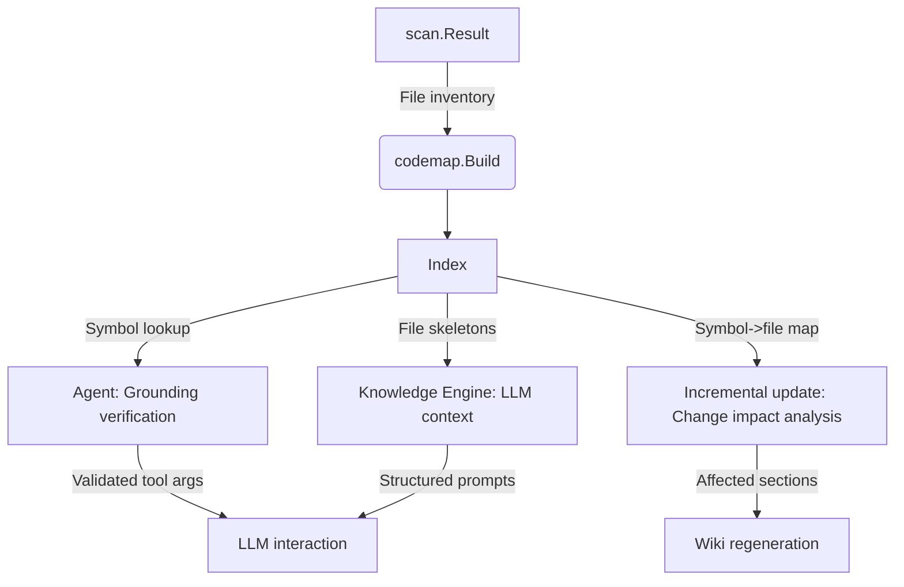
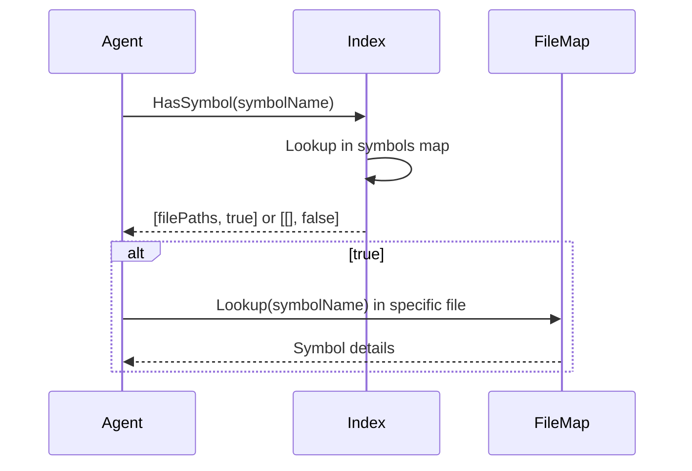

# Code Mapping Overview

## Table of Contents
- [Introduction](#introduction)
- [Core Data Structures](#core-data-structures)
  - [Symbol](#symbol)
  - [FileMap](#filemap)
  - [Index](#index)
- [How Code Mapping is Used in Kaioken](#how-code-mapping-is-used-in-kaioken)
  - [In the Agent](#in-the-agent)
  - [In the Knowledge Engine (Wiki Generation)](#in-the-knowledge-engine-wiki-generation)
- [Data Flow and Architecture](#data-flow-and-architecture)
- [Referenced Files](#referenced-files)

## Introduction

Kaioken's code mapping system parses source code to build lightweight structural representations called *skeletons*. These skeletons capture declarations (functions, types, variables, etc.) with line anchors, enabling the knowledge engine and agent to work with code context efficiently without exceeding token limits. The system supports multiple languages through extension-based parser selection and provides two key abstractions: `FileMap` for per-file structure and `Index` for repository-wide symbol lookup.

## Core Data Structures

### Symbol

The `Symbol` struct represents a single declaration found in a file. It captures the declaration's identity, location, and accessibility.

`cli/internal/codemap/codemap.go:36-45`
```go
type Symbol struct {
	Name      string
	Kind      Kind
	Signature string // the declaration line, trimmed
	Line      int    // 1-indexed line of the declaration
	EndLine   int    // best-effort last line of the declaration body
	Exported  bool
	Receiver  string // for methods: the type it hangs off
	Doc       string // leading comment line, when present
}
```

**Key behaviors:**
- `Span()` returns the symbol's line range (1-indexed), handling cases where `EndLine < Line` by defaulting to a single line.
- `Exported` is determined by language-specific rules: Go uses uppercase first letter; most other languages treat leading underscore as private.
- `Receiver` is populated only for method symbols (KindMethod).
- `Doc` captures the first leading comment line when present.

**Symbol Kinds**  
The `Kind` type categorizes declarations. Constants are defined in `codemap.go`:

| Constant      | Value  | Description                     |
|---------------|--------|---------------------------------|
| KindFunc      | "func" | Function declaration            |
| KindMethod    | "method"| Method attached to a type       |
| KindType      | "type" | Type definition (struct, alias) |
| KindClass     | "class"| Class (OOP languages)           |
| KindInterface | "interface"| Interface definition       |
| KindConst     | "const"| Constant declaration            |
| KindVar       | "var"  | Variable declaration            |

### FileMap

`FileMap` represents the structural skeleton of a single source file. It aggregates symbols, imports, and language metadata.

`cli/internal/codemap/codemap.go:56-64`
```go
type FileMap struct {
	Path     string // repo-relative, slash-separated
	Lang     string // "go", "python", "javascript", …
	Package  string // package/module name where the language has one
	Imports  []string
	Symbols  []Symbol
	Lines    int
	Analyzed bool // false when the language is unsupported (data/config files)
}
```

**Key methods:**
- `Exported()` returns only symbols marked as public surface (language-dependent).
- `Lookup(name string)` performs linear search for a symbol by name, returning `(Symbol, bool)`.
- `Skeleton()` renders a compact string representation showing:
  - File path and language/package info
  - Import list (truncated to 20 entries with ellipsis if exceeded)
  - Each symbol with line anchor (`Lstart-end`) and signature
  - Fallback message if no declarations found

**Non-obvious behaviors:**
- `Analyzed` is `false` for unsupported languages (per `Lang()`), but the file is still tracked for path verification.
- `Lines` counts newline characters plus one (1-indexed line count).
- Symbols are sorted by line number after parsing via `sort.SliceStable`.

### Index

`Index` represents the repository-wide code map, enabling cross-file symbol verification and structural over file symbol lookup and repository-level summarization.

`cli/internal/codemap/index.go:20-26`
```go
type Index struct {
	Root  string
	Files map[string]*FileMap // keyed by repo-relative slash path

	// symbols maps a symbol name to every file declaring it, for verification.
	symbols map[string][]string
}
```

**Key methods:**
- `Build(res *scan.Result)` constructs the index in parallel (8 workers) from scan results:
  - Skips files >2MB (`maxParseBytes`) or unsupported languages but still records them in `Files` for path tracking.
  - Populates `symbols` reverse index mapping symbol names to declaring file paths.
  - Sorts file paths per symbol for deterministic lookup.
- `HasFile(path string)` checks if a repo-relative path exists in the index (ignores leading/trailing slashes).
- `HasSymbol(name string)` returns all files declaring a symbol and a boolean indicating existence.
- `SymbolCount()` returns total declarations across all analyzed files.
- `Skeleton(paths []string)` concatenates `FileMap.Skeleton()` for specified paths in order.
- `RepoSkeleton(maxTokens int)` generates a token-budget-conscious overview:
  - Prioritizes files by public surface size (`len(Exported())*3 + len(Symbols)`).
  - Shows only exported symbols (or all symbols if none exported), truncated to 25 per file.
  - Omits files exceeding the token budget, reporting count of skipped files.

**Constants:**
- `maxParseBytes = 2 << 20` (2MiB): skips large/minified files during parsing.
- `charsPerToken = 4`: rough estimate for token budgeting in `RepoSkeleton`.

## How Code Mapping is Used in Kaioken

### In the Agent

The agent uses code mapping for two critical functions during LLM-assisted coding:
1. **Grounding verification**: When the LLM references a symbol (e.g., in a code edit suggestion), the agent calls `index.HasSymbol(name)` to confirm the symbol exists in the codebase and retrieve its defining file(s).
2. **Line anchors**: For code excerpts provided by the LLM, the agent uses `Symbol.Span()` to obtain precise line ranges, enabling accurate diff generation and context highlighting.

This occurs in `internal/agent/agent.go` during tool execution (e.g., `edit_file`), where the agent validates LLM claims against the code map before applying changes.

### In the Knowledge Engine (Wiki Generation)

During wiki generation (`internal/wiki/wiki.go`), the knowledge engine leverages code mapping to:
1. Provide context to the LLM when generating knowledge cards: each module's files are converted to skeletons via `index.Skeleton(paths)` and included in prompts.
2. Enable symbol verification: when the LLM generates code snippets or references symbols, the engine checks existence via `index.HasSymbol()`.
3. Support incremental updates: the index helps identify which documentation sections are affected by file changes (via symbol-to-file mapping in `index.symbols`).

Specifically, in `internal/wiki/generate.go`, the `generate.Run` function uses the code map to fetch file skeletons for LLM context, ensuring the model works with accurate structural representations.

## Data Flow and Architecture

The code mapping system integrates with Kaioken's pipeline as follows:



**Parallel index building** (`cli/internal/codemap/index.go:29-71`):
1. Scan results are processed concurrently (8 goroutines via `errgroup`).
2. Each file is read and parsed by `codemap.Parse()` if under size limit and language supported.
3. Unsupported/large files are still recorded in `Files` with `Analyzed=false`.
4. After parsing, a reverse index (`symbols`) is built from all file symbols.

**Symbol verification flow**:


**Skeleton usage in prompts**:
```mermaid
sequenceDiagram
    KnowledgeEngine->>Index: Skeleton(moduleFiles)
    Index->>paths
    KnowledgeEngine->>LLM: Prompt with code context
```

## Referenced Files

- `cli/internal/codemap/codemap.go`
- `cli/internal/codemap/index.go`

<!-- kaioken:files internal/codemap/codemap.go,internal/codemap/index.go -->
